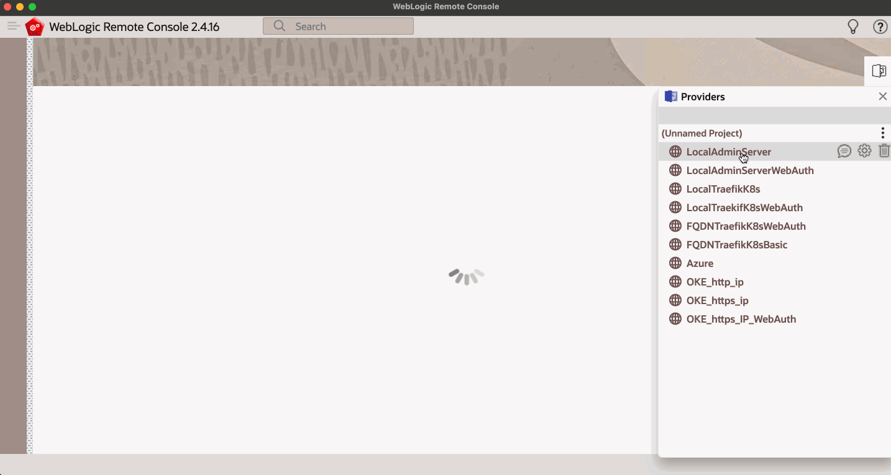
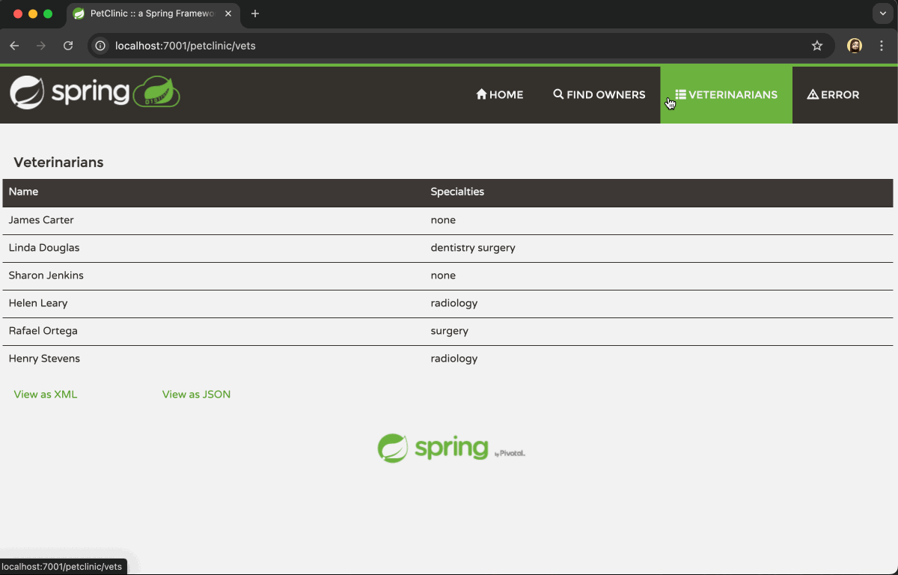

# Build and Deploy the Application

## Introduction

In this lab, you will build and deploy the migrated Spring Framework Pet Clinic application (now on Spring Framework 6.2.x) to WebLogic Server 15.1.1.

Estimated Workshop Time: ***5 minutes***

### Objectives

*In this lab, you will:*

* Build the migrated Spring Framework Pet Clinic sample application
* Deploy to WebLogic Server 15.1.1
* Test the application

### Prerequisites

*This lab assumes you have:*

* Basic knowledge of Java and Maven
* You have Maven 3.6.x or later, and Java 21 or later installed
* You have a terminal (local or OCI Cloud Shell) with access to the internet
* You have a ***WebLogic 15.1.1 domain running*** to test the migrated application

## Task 1: Build the Application

Run the following command to build the application:

```shell
<copy>
mvn clean package -DskipTests
</copy>
```

> ***NOTE*** </br>
> The `mvn clean package` command will build the application and create a WAR file in the `target` directory. The WAR file will be named `petclinic.war`.
> </br></br>
> The `-DskipTests` option is used to skip the tests during the build process. This lab does not cover the migration of the tests.


## Task 2: Deploy the Application

There are several ways to deploy the application to WebLogic Server 15.1.1, such as using [WebLogic Deploy Tooling](https://oracle.github.io/weblogic-deploy-tooling/), [WebLogic Remote Console](https://oracle.github.io/weblogic-remote-console/), and WLST (WebLogic Scripting Tool). In this lab, we will use the WebLogic Remote Console to deploy the application.

### Download the WebLogic Remote Console, if you have not already

1. Go to [github.com/oracle/weblogic-remote-console/releases](https://github.com/oracle/weblogic-remote-console/releases).

1. Download the latest release of the WebLogic Remote Console. The file will be named `WebLogic-Remote-Console-<version>-<platform>.<dmg|zip>`. Select the correct file for your platform (Windows, arm64-Mac, x86-Mac, Linux).

1. Install the WebLogic Remote Console.

### Open the WebLogic Remote Console and configure the connection to WebLogic

> ***NOTE*** </br>
> This step is just to configure the connection to your WebLogic Server. If you already have the connection configured, you can skip this step.

1. Open the WebLogic Remote Console.
1. Open the **Providers** drawer to add a new connection. For more information, see [Connect to a Provider](https://docs.oracle.com/en/middleware/fusion-middleware/weblogic-remote-console/administer/set-console.html#GUID-98F273C5-CC1E-4272-B560-604CA23A739A).

### Deploy the application

1. In the **Edit Tree**, go to **Deployments**, then **App Deployments**.
1. Select **New** to add a new application deployment.
1. Enter a name for the application in the **Name** field. For this lab, we will use `petclinic`.
1. Select a target for the application under **Targets**. For this lab, we will use `AdminServer`.
1. In the **Source** field, select the **Chose file** icon and select the `petclinic.war` file from the `target` directory of the `spring-framework-petclinic` application.
1. In the **On Deployment** field, select `Start Application`.
1. Click **Create**.
1. In the top banner, select the **Shopping Cart** and then **Commit Changes**.

At this point, the application should be deployed and started on WebLogic Server 15.1.1.



## Task 3: Test the Application

1. Open a web browser and go to the following URL: `https://<your-weblogic-server-host-and-port>/petclinic/`

> ***NOTE*** </br>
> The host and port will depend on your WebLogic Server configuration. You may have a load balancer or a reverse proxy in front of your WebLogic Server, if deployed on Kubernetes or in a Cloud Provider.



## Learn More

* [How to install Maven](https://maven.apache.org/install.html)
* [How to install Java 21](https://www.oracle.com/java/technologies/downloads/#java21)
* [WebLogic Remote Console](https://oracle.github.io/weblogic-remote-console/)
* [WebLogic Deploy Tooling](https://oracle.github.io/weblogic-deploy-tooling/)
* [Deploy WebLogic in a Kubernetes Cluster](https://docs.oracle.com/en/solutions/deploy-wls-on-oke/index.html#GUID-79EC097D-DC13-4B92-92A7-CB09D594EF78)
* [WebLogic on Oracle Cloud Infrastructure](https://docs.oracle.com/en/cloud/paas/weblogic-cloud/user/oracle-weblogic-server-oracle-cloud-infrastructure.html)
* [Running WebLogic on the Azure Kubernetes Service](https://learn.microsoft.com/en-us/azure/virtual-machines/workloads/oracle/weblogic-aks)

## Acknowledgements

* **Author** - Adao Oliveira Junior, Solutions Architect, Oracle ECNJ Architects
* **Contributors** - Adao Oliveira Junior, ECNJ Architects
* **Last Updated By/Date** - Adao Oliveira Junior, April 2025
