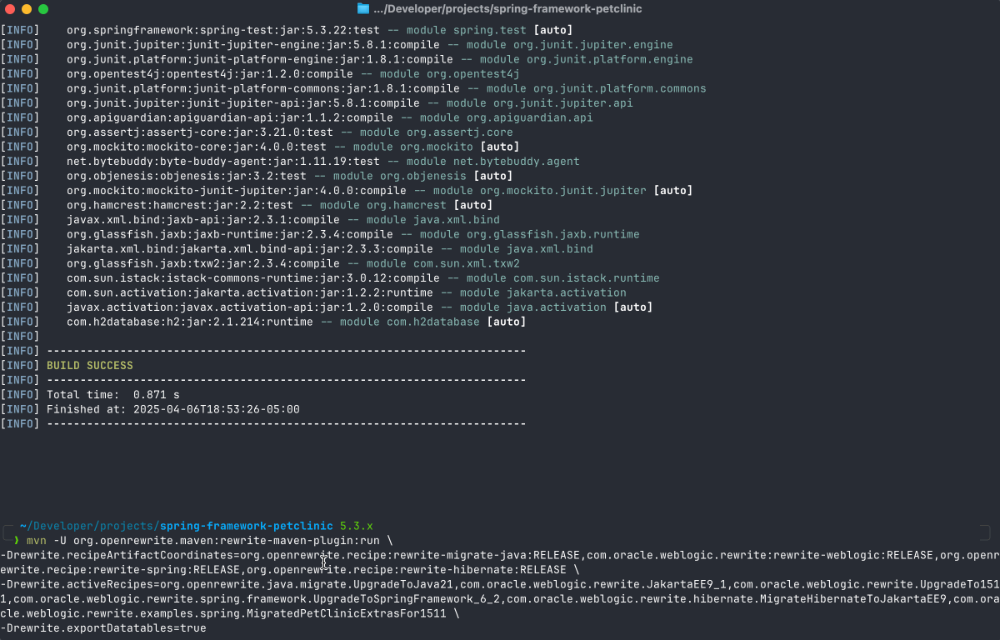
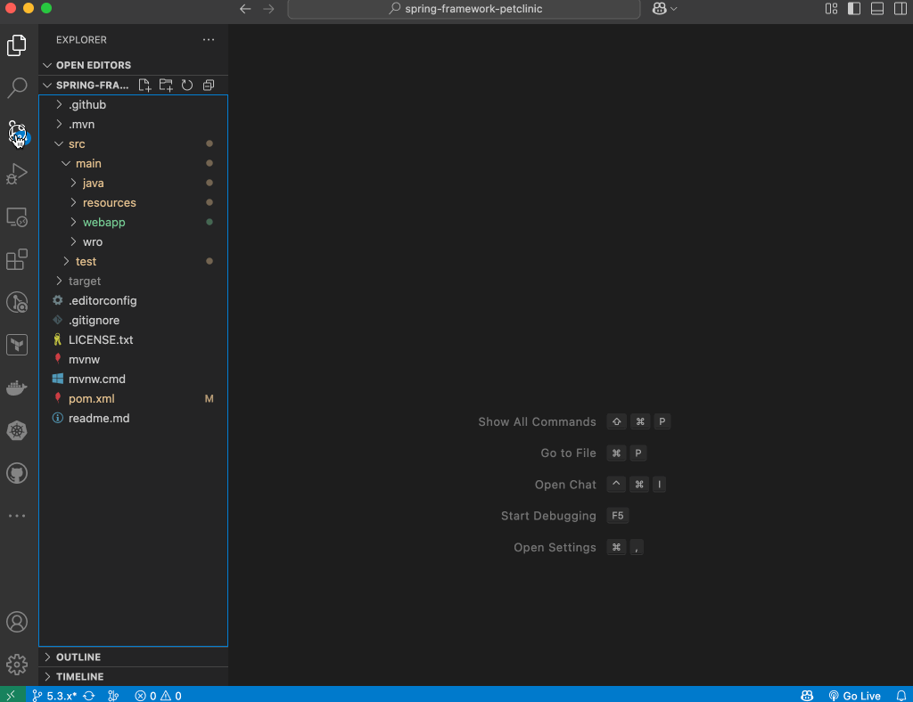

# Migrate the App to run on WebLogic Server 15.1.1

## Introduction

This lab will step through migrating a Java 1.8, Spring Framework 5.3.x app to ***Java 21***, ***Jakarta EE 9.1***, ***Spring Framework 6.2.x***, and ***WebLogic Server 15.1.1***. The application used in this lab is the Spring Framework 5.3.x Pet Clinic sample application that you cloned in the previous lab.

Estimated Lab Time: ***5 minutes***

### About the migration tool OpenRewrite

OpenRewrite is a powerful tool that automates the process of migrating Java applications to newer versions of the Java language and frameworks. It provides a set of recipes that can be applied to your codebase to perform common migration tasks, such as updating dependencies, refactoring code, and changing package names.

OpenRewrite is particularly useful for migrating applications from older versions of Java to newer ones, as it can help you identify and fix compatibility issues, update deprecated APIs, and ensure that your code adheres to best practices.
It can also be used to migrate applications from one framework version to another, such as from Spring Framework 5.x to Spring Framework 6.x.

Oracle provides OpenRewrite recipes to help you upgrade your applications to new WebLogic and Java versions, and to Jakarta EE. This tutorial demonstrates how to use the recipes to upgrade a sample application to run on WebLogic Server 15.1.1 with JDK 21, Jakarta EE 9.1, and Spring Framework 6.2.x.

Oracle also provides recipes for the most commonly used libraries, like Hibernate, ehcache, and such, to help you migrate your application to the matching versions of these libraries.

### Objectives

*In this lab, you will:*

* Migrate the Spring Framework 5.3.x Pet Clinic sample application

### Prerequisites

*This lab assumes you have:*

* Basic knowledge of Java, Maven, and Git
* Java 21 or later (full JDK, not a JRE) installed.
* [Maven 3.6+](https://maven.apache.org/install.html) installed.

## Task 1: Run the Maven command to run OpenRewrite

For this example, we will upgrade the Spring Framework PetClinic application to run on WebLogic Server 15.1.1 with JDK 21, including Jakarta EE 9.1, Spring Framework 6.2.x, and Hibernate. It'll also automatically convert the cache from the deprecated and removed `ehcache 2.0` to Spring Native Cache.

Run the following command to run OpenRewrite on the **`spring-framework-petclinic`** application:

```shell
<copy>
mvn -U org.openrewrite.maven:rewrite-maven-plugin:run \
-Drewrite.recipeArtifactCoordinates=org.openrewrite.recipe:rewrite-migrate-java:RELEASE,com.oracle.weblogic.rewrite:rewrite-weblogic:RELEASE,org.openrewrite.recipe:rewrite-spring:RELEASE,org.openrewrite.recipe:rewrite-hibernate:RELEASE \
-Drewrite.activeRecipes=org.openrewrite.java.migrate.UpgradeToJava21,com.oracle.weblogic.rewrite.JakartaEE9_1,com.oracle.weblogic.rewrite.UpgradeTo1511,com.oracle.weblogic.rewrite.spring.framework.UpgradeToSpringFramework_6_2,com.oracle.weblogic.rewrite.hibernate.MigrateHibernateToJakartaEE9,com.oracle.weblogic.rewrite.examples.spring.MigratedPetClinicExtrasFor1511 \
-Drewrite.exportDatatables=true
</copy>
```

> ***NOTE*** </br>
> This command updates the application to use Java 21. If you want to upgrade to Java 17 instead, replace `UpgradeToJava21` with `UpgradeToJava17`.



This command applies the following recipes:

* `com.oracle.weblogic.rewrite.UpgradeTo1511`
* `org.openrewrite.java.migrate.UpgradeToJava21`
* `com.oracle.weblogic.rewrite.JakartaEE9_1`
* `com.oracle.weblogic.rewrite.spring.framework.UpgradeToSpringFramework_6_2`
* `com.oracle.weblogic.rewrite.hibernate.MigrateHibernateToJakartaEE9`
* `com.oracle.weblogic.rewrite.examples.spring.MigratedPetClinicExtrasFor1511`

OpenRewrite updates the `spring-framework-petclinic` code in the following ways:

* `pom.xml`
  * Updates versions, dependencies, and namespaces.
  * Sets proper Hibernate API versions to work with Java 21 and Jakarta EE 9.1.
* Source files
  * Updates Java dependencies and related statements.
  * Updates WebLogic API dependencies and related statements.
  * For removed APIs with no replacement, OpenRewrite inserts a comment in the code stating that the API usage needs to be resolved or removed.
  * Updates Jakarta API usage to Jakarta EE 9.1 version.
  * Updates Spring Framework APIs to version 6.2.
  * Updates the DefaultCacheManager to use the SimpleCacheManager.
  * Updates the Default Handler to work with Application Servers.

> ***NOTE*** </br>
> The recipe `com.oracle.weblogic.rewrite.examples.spring.MigratedPetClinicExtrasFor1511` adds some extra changes to the Spring Framework PetClinic example to make it work with WebLogic Server 15.1.1, which includes the removal of the deprecated/removed `ehcache 2.0` configuration and the addition of the `SimpleCacheManager` configuration.
> </br></br>
> Spring Framework 6.x deprecated and removed the `ehcache 2.0` together with the `org.springframework.cache.ehcache.EhCacheCacheManager` class. When upgrading to Spring Framework 6.x, you need to chose your cache provider and update the configuration accordingly. For this tutorial, the Simple Cache Manager was used for simplicity. If you want to use another cache provider, do not run the `com.oracle.weblogic.rewrite.examples.spring.MigratedPetClinicExtrasFor1511` and make the changes for the chosen cache provider.
> </br></br>
> Here the list of Spring Framework 6.x supported cache providers: [Supported Cache Providers](https://docs.spring.io/spring-boot/docs/3.0.8/reference/html/io.html#io.caching.provider).

## Task 2: Review the changes

You can review the changes made by OpenRewrite in the terminal output and check the differences using `git diff`.


Or, you can use your favorite IDE to review the changes.

In this example, we will use Visual Studio Code (VS Code) to review the changes. Open the `spring-framework-petclinic` project in VS Code and check the changes made by OpenRewrite.




## Learn More

* [Introduction to OpenRewrite](https://docs.openrewrite.org)
* [Running Rewrite on a Maven project without modifying the build](https://docs.openrewrite.org/running-recipes/running-rewrite-on-a-maven-project-without-modifying-the-build)
* [`rewrite-weblogic` github repository](https://github.com/oracle/rewrite-recipes/tree/main/rewrite-weblogic)
* [Maven Central `rewrite-weblogic` recipes](https://central.sonatype.com/artifact/com.oracle.weblogic.rewrite/rewrite-weblogic)

## Acknowledgements

* **Author** - Adao Oliveira Junior, Solutions Architect, Oracle ECNJ Architects
* **Contributors** - Adao Oliveira Junior, ECNJ Architects
* **Last Updated By/Date** - Adao Oliveira Junior, April 2025
