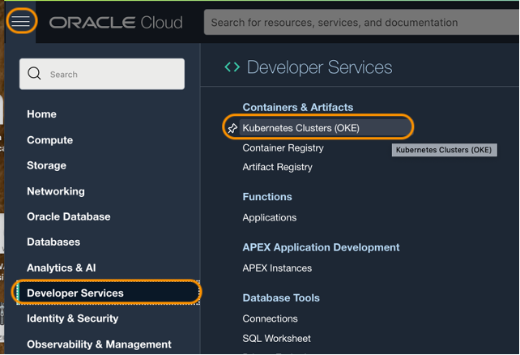
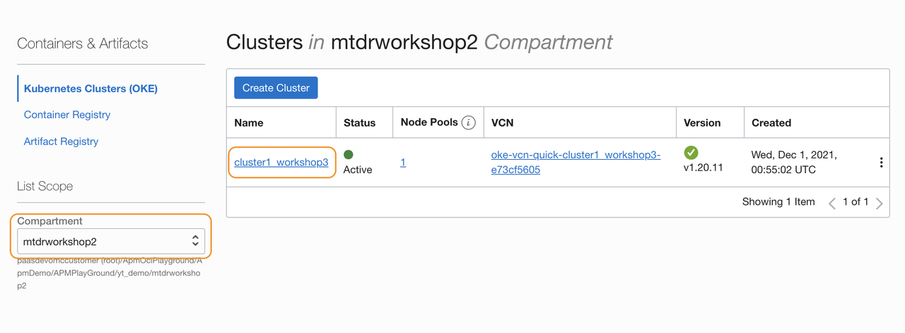
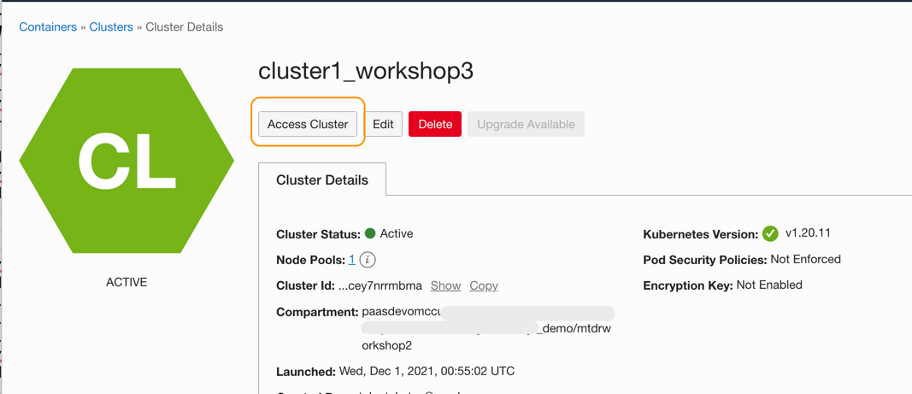
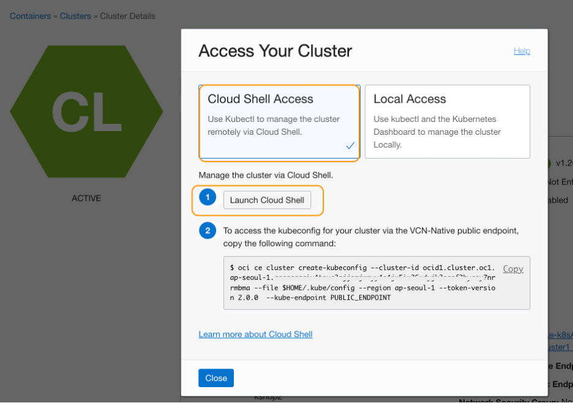
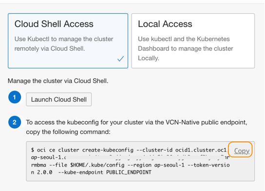
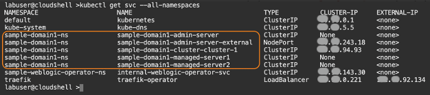
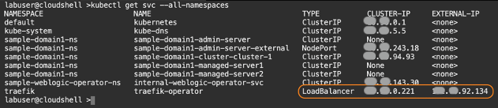
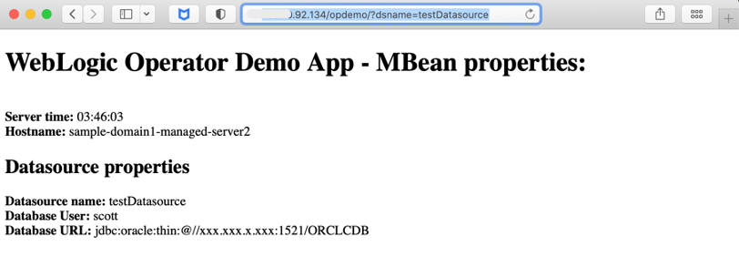

# Verify WebLogic Application

## Introduction

This workshop uses the **WebLogic Operator** Demo app-  a simple JSP-based WebLogic application you created in the prerequisite **[Migrating WebLogic Server to Kubernetes on OCI](https://apexapps.oracle.com/pls/apex/dbpm/r/livelabs/workshop-attendee-2?p210_workshop_id=567&p210_type=2&session=102696148940850)** workshop. Verify the WebLogic Operator application is running and ready to configure the APM Java Agent.

Estimated time: 5 minutes

### Objectives

* Ensure the WebLogic Operator Demo application is running  

### Prerequisites

* Completion of the **[Migrating WebLogic Server to Kubernetes on OCI](https://apexapps.oracle.com/pls/apex/dbpm/r/livelabs/workshop-attendee-2?p210_workshop_id=567&p210_type=2&session=102696148940850)** workshop, Tasks 1, 2, 3 and 4.

## Task 1: Verify the application in a browser

1. Click the navigation icon at the top left corner (three bars) in the Oracle Cloud console, drop down the menu, navigate and choose **Developer Services** > **Kubernetes Clusters (OKE)**.

   

2. Locate the compartment you created the Kubernetes cluster when you performed the prerequisite **[Migrating WebLogic Server to Kubernetes on OCI](https://apexapps.oracle.com/pls/apex/dbpm/r/livelabs/workshop-attendee-2?p210_workshop_id=567&p210_type=2&session=102696148940850)** workshop. Then click the name of the cluster.

   

3.	On the Cluster Details page, click the **Access Cluster** button.

   

4.	Select **Cloud Shell Access**, then click **Launch Cloud Shell**.

   

5.	Look at the bottom of the page, and you will see a Cloud Shell window and command prompt ready for input.

   

6.	In the **Access Your Cluster** page that is still opened at the upper side of console, locate the textbox with the OCI command, and click **Copy**.

   

7.	Paste the command into the Cloud Shell and execute. It configures the Cloud Shell session to work with the cluster.

   

   > ***NOTE***:  Save the command to a text file on your laptop, and execute it every time when you start a new Cloud Shell session, while working the labs in this workshop.

8.	In the Cloud Shell, run the following command.

    ``` bash
    <copy>
    kubectl get svc --all-namespaces
    </copy>
    ```

   The output will be similar to the image below. The namespace of the WebLogic Server services used in the WebLogic workshop is ***sample-domain1-ns*** by default.

   

9.	Within the same command output, locate the LoadBalancer service. Note down the External-IP.

   

10.	On your computer, open a new browser tab and access the application with the following URL pattern:

     ``` bash
     <copy>
     http://<External IP of the Load Balancer>/opdemo/?dsname=testDatasource
     </copy>
     ```
     Make sure the WebLogic Operator Demo application launches as in the image below. This is the target web application you will use to configure the APM Java Agent in this workshop.

     

     If you have not set up the application yet, or you cannot start the application, please visit the **[Migrating WebLogic Server to Kubernetes on OCI](https://apexapps.oracle.com/pls/apex/dbpm/r/livelabs/workshop-attendee-2?p210_workshop_id=567&p210_type=2&session=102696148940850)** workshop, and complete the tutorials from the Task 1 to Task 4.

## Acknowledgements

* **Author** - Yutaka Takatsu, Product Manager, Enterprise and Cloud Manageability
- **Contributors** - Steven Lemme, Senior Principal Product Manager,<br>
David Le Roy, Director, Product Management,<br>
Mahesh Sharma, Consulting Member of Technical Staff,<br>
Avi Huber, Senior Director, Product Management
* **Last Updated By/Date** - Yutaka Takatsu, January 2022
