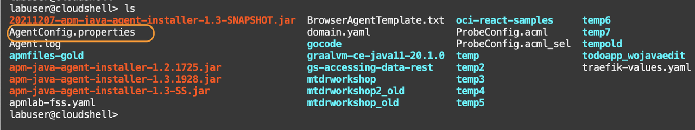
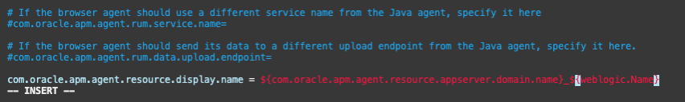
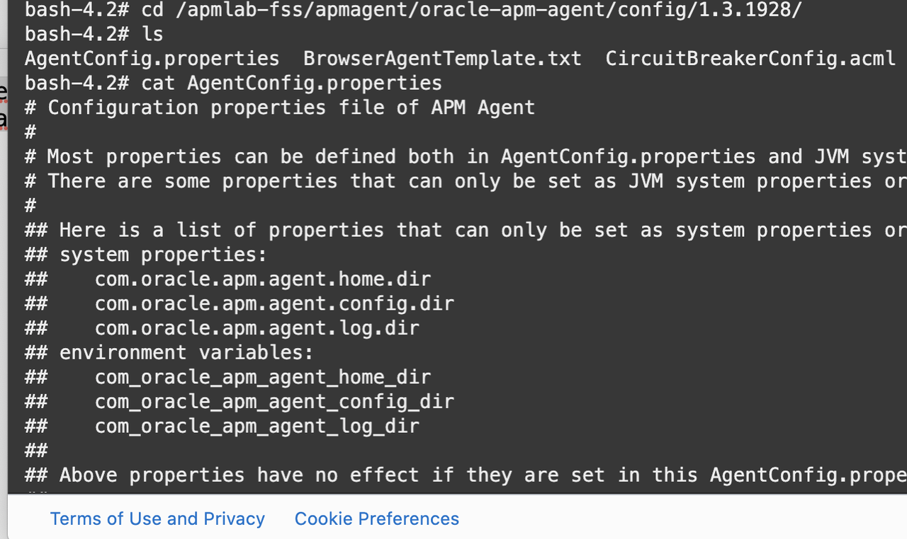
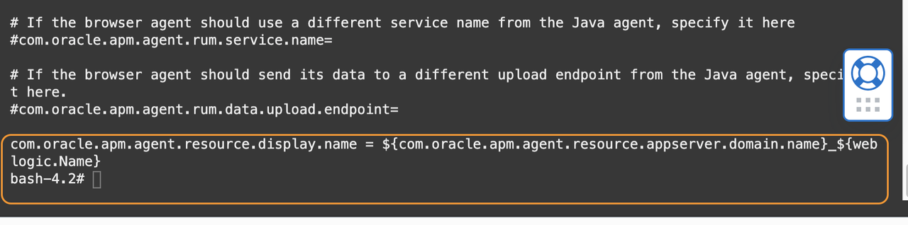

# Change the display name format of the spans

## Introduction

In this lab you will change the display format of the span names that show up in the APM Trace Explorer. By default, the display name format is **Domain Name-Host Name-Port-Managed Server Name**. You will change the format to is **Domain Name-Managed Server Name** to leave out the host name and the port.

You will modify the ***AgentConfig.properties*** file, located in the APM Agent directory, which resides in the file system associated with the container.  However, because there is no editing tool inside the container, you will copy the file from the container to the Cloud Shell, edit the file, then copy back to the container.

Estimated time: 10 minutes

### Objectives

* Obtain the configuration file from the container
*	Open the file in the Cloud shell, change the display format
*	Transfer the file back to the container

### Prerequisites

* Completion of the Tasks 1 to 4 in this workshop.

## Task 1: Download the configuration file from the container to the Cloud Shell

1.	Execute the following command to copy ***AgentConfig.properties*** from the container. Ensure to replace the **apm-agent-version** with that of the APM Java Agent you have, before running the command.

    ``` bash
    <copy>
    kubectl cp sample-domain1-ns/sample-domain1-admin-server:/apmlab-fss/apmagent/oracle-apm-agent/config/<apm-agent-version>/AgentConfig.properties ~/AgentConfig.properties
    </copy>
    ```

2.	Run "ls" command in the home directory, to verify that the file is transferred to the Cloud Shell.

    ``` bash
    <copy>
    cd;ls
    </copy>
    ```

   

## Task 2:  Edit the configuration file

1.	Open AgentConfig.properties with an editor.

    ```bash
    <copy>
    vi ~/AgentConfig.properties
    </copy>
    ```

2.	Add the following line at the bottom of the file:

    ```bash
    <copy>
    com.oracle.apm.agent.resource.display.name = ${com.oracle.apm.agent.resource.appserver.domain.name}_${weblogic.Name}
    </copy>
    ```

   

3.	Save and close the file.

## Task 3:  Upload APM configuration files to the container

1.	From the home directory, run the following command to copy the Agent configuration file back to the container. Replace the **&lt;apm-agent-version&gt;** with the version of the APM Agent you are using.

    ``` bash
    <copy>
    kubectl cp  ~/AgentConfig.properties sample-domain1-ns/sample-domain1-admin-server:/apmlab-fss/apmagent/oracle-apm-agent/config/<apm-agent-version>/AgentConfig.properties
    </copy>
    ```

2.	Access the container by running the command below:

    ```bash
    <copy>
    kubectl exec -it sample-domain1-managed-server1 -n sample-domain1-ns -- /bin/bash
    </copy>
    ```

3.	Access the directory where the AgentConfig file resides.

    ```bash
    <copy>
    cd /apmlab-fss/apmagent/oracle-apm-agent/config/<apm-agent-version>;ls
    </copy>
    ```

4.	Open the file with cat command and verify the successful file transfer. No restart on the Agent or the application is necessary, because the changes made on the configuration files in the directory will be picked up dynamically by the APM Agent.

    ```bash
    <copy>
    cat AgentConfig.properties
    </copy>
    ```

   

   

5. type exit and return to the Cloud Shell.

## Acknowledgements

* **Author** - Yutaka Takatsu, Product Manager, Enterprise and Cloud Manageability
- **Contributors** - Steven Lemme, Senior Principal Product Manager,<br>
David Le Roy, Director, Product Management,<br>
Mahesh Sharma, Consulting Member of Technical Staff,<br>
Avi Huber, Senior Director, Product Management
* **Last Updated By/Date** - Yutaka Takatsu, January 2022
