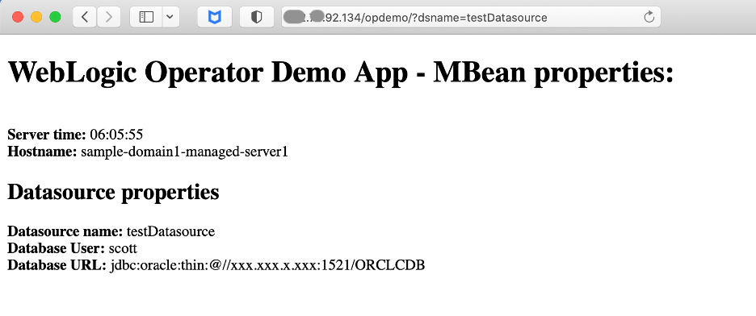
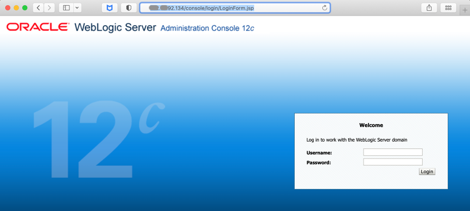
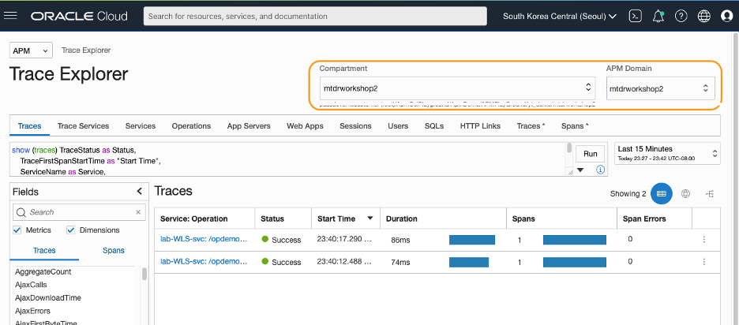
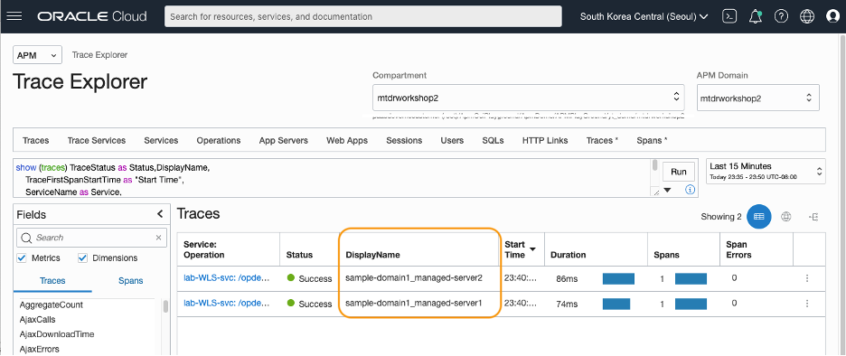
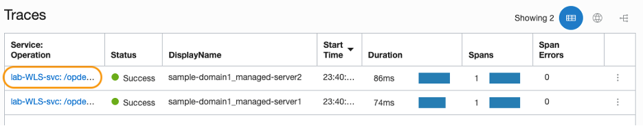
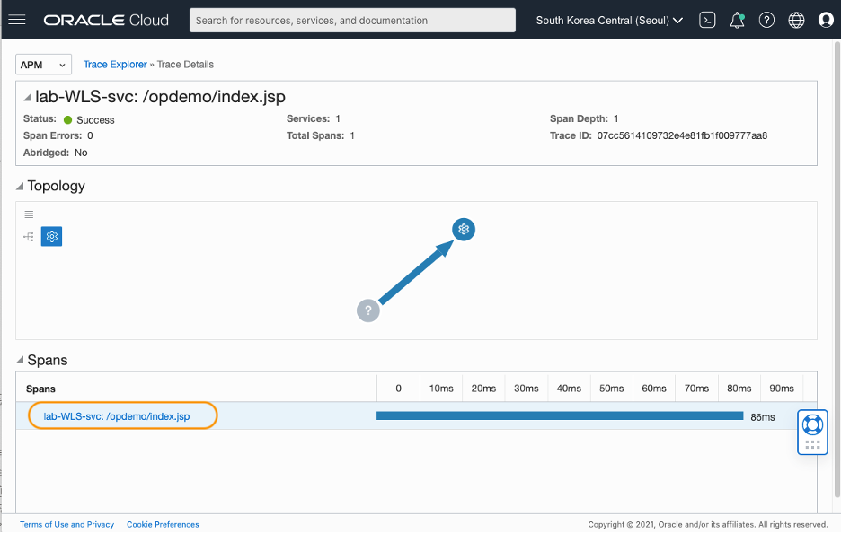
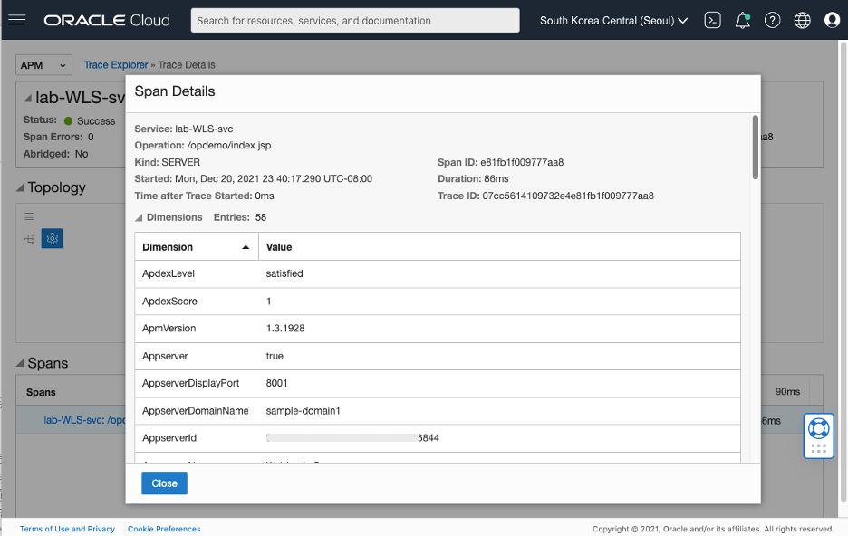
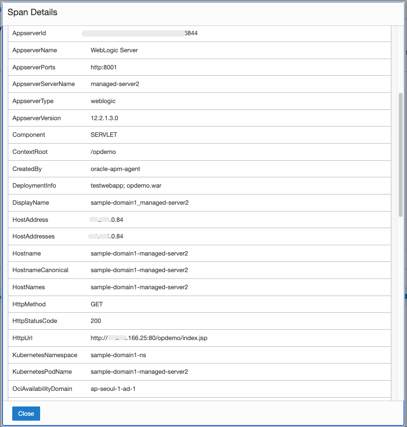

# View traces and spans in APM Trace Explorer

## Introduction

In this lab, you will learn how to use the APM Trace Explorer to trace the workload generated with the WebLogic Operator Demo application.

Estimated time: 15 minutes

### Objectives

* Open APM Trace Explorer from the Oracle Cloud console
*	Verify traces and spans generated by the APM Java Agent configured in the Lab 4.
*	Examine values in the span dimensions for the frontend browser and the backend WebLogic server

### Prerequisites

* Completion of the Task 1 to 5 in this workshop.

## Task 1: Generate workload by navigating to the WebLogic Demo app

1.	From the Oracle Cloud shell, enter the following command.

    ``` bash
    <copy>
    kubectl get svc --all-namespaces
    </copy>
    ```

    From the output, find the LoadBalancer service. Note down the External-IP.

   

   2.	On your laptop, start a browser and access the application with the URL pattern:

    ``` bash
    <copy>
    http://<External IP of the Load Balancer>/opdemo/?dsname=testDatasource
    </copy>
    ```

    WebLogic Operator Demo application launches as in the image below.

    

    The WebLogic Operator Demo App is a single-page JSP based web application. The page load generates a span that you can view with the APM Trace Explorer.

    Optionally, you can also use the same IP to navigate to the WebLogic Admin Console and generate multi-page workload.

    ``` bash
    <copy>
    http://<External IP of the Load Balancer>/console
    </copy>
    ```

    Login with weblogic/welcome1

    

## Task 2: Open APM Trace Explorer in the Oracle Cloud console

1.	From the OCI menu, select **Observability & Management** > **Trace Explorer**

   

2.	On the Trace Explorer page, select the **Compartment** and the **APM Domain**. Review the traces captured.

   

3.	In the query box, add ***DisplayName,*** at the end of the first line, as in the screenshot example. Then click Run at the right side of the field.

    ``` bash
    <copy>
    DisplayName,
    </copy>
    ```

   

4.	A new column, **DispalyName** is added to the table. Note that the format is DomainName + Server as configured in the Lab 5.

   

## Task 3: Verify traces in the Traces page

1.	In the Traces pane, you will see a Trace with the service name **lab-WLS-svc**

2.	Click the link to the trace from the table.

   

## Task 4: Verify spans and dimensions in the Trace Details page

1.	In the **Trace Details** page, click the span in the **Spans** view.

   

2.	Verify the backend dimensions and values, including the WebLogic, Kubernetes and Oracle Cloud information.

   

   

  >***NOTE***: You can also enable the APM browser Agent to collect client-side dimensions, including  user’s location, browser type, OS type, and Page load time information. For more information on the APM Browser Agent, refer to the Oracle Cloud Infrastructure Documentation > **[Deploy the APM Browser Agent With Your Application](https://docs.oracle.com/en-us/iaas/application-performance-monitoring/doc/deploy-browser-agent-your-application.html)**.

This is the end of the workshop. You have learned that you can use a file system to add the APM Java Agent to a WebLogic container-packaged web application, without recreating a Docker image. You have also learned how to configure APM Agent in the Kubernetes cluster, and how to Use APM Trace Explorer to view traces and spans. For more information on APM, refer to the OCI documentation, **[Application Performance Monitoring](https://docs.oracle.com/en-us/iaas/application-performance-monitoring/index.html)**.

## Acknowledgements

* **Author** - Yutaka Takatsu, Product Manager, Enterprise and Cloud Manageability
- **Contributors** - Steven Lemme, Senior Principal Product Manager,<br>
David Le Roy, Director, Product Management,<br>
Mahesh Sharma, Consulting Member of Technical Staff,<br>
Avi Huber, Senior Director, Product Management
* **Last Updated By/Date** - Yutaka Takatsu, January 2022
