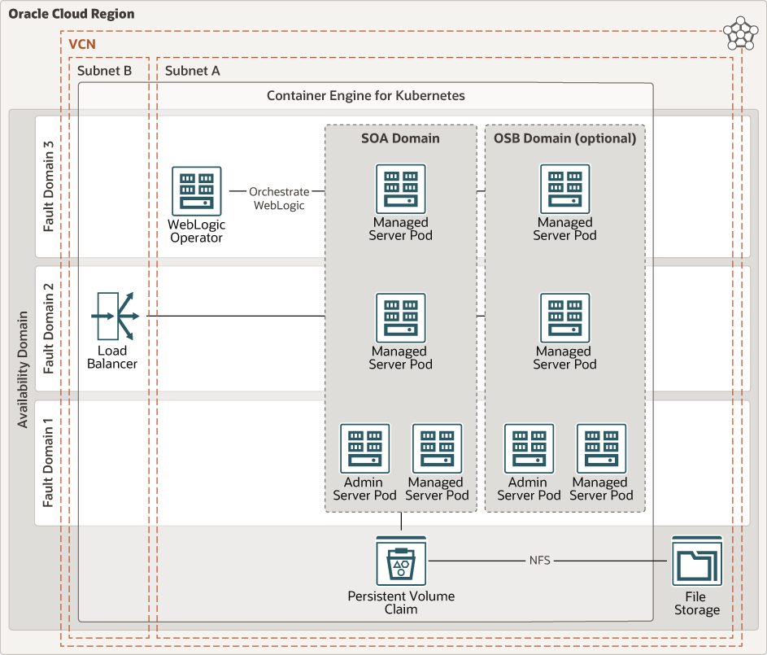

# Introduction

## About this Workshop

This lab will walk you through the process of deploying Oracle SOA Suite on Kubernetes. The lab uses Oracle Kubernetes Engine (OKE) to first deploy the required infrastructure on Oracle Cloud Infrastructure (OCI), and then provision Oracle SOA Suite on the Kubernetes cluster in an automated fashion.

Attached below is a sample architecture of the solution:


Estimated Lab Time: 60 minutes.

### Objectives

*Deploy Oracle SOA Suite on Kubernetes.*

In this lab, you will:
- Install the prerequisites to deploy Oracle SOA Suite on Oracle Cloud Infrastructure.
- Provision the infrastructure with Terraform.
- Deploy Oracle SOA Suite with Helm.
- Learn to scale the SOA Suite domain.
- Learn how to deploy on any Kubernetes cluster, provided the infrastructure required has been provisioned.
- Tear down the workshop.

### Prerequisites

*In order to run this workshop you need:*

* A Mac OS X, Windows or Linux machine.
* An SSH key-pair.
* An OCI account with a compartment set up.

Make sure you have available resources and quota for:

- 1 file storage systems.
- 1 mount target.
- 1 Oracle database on VM.
- 1 Kubernetes cluster and node pool with 3 nodes.

If you are not an administrator on your tenancy, you must insure that the following policies have been set for you:

```
<copy>
Allow group MyGroup to manage clusters in tenancy

Allow group MyGroup to manage dynamic-groups in tenancy
Allow group MyGroup to manage policies in tenancy
Allow group MyGroup to manage volume-family in tenancy
Allow group MyGroup to manage instance-family in tenancy

Allow group MyGroup to inspect tenancies in tenancy
Allow group MyGroup to use secret-family in tenancy
Allow group MyGroup to use tag-namespaces in tenancy

Allow group MyGroup to manage all-resources in compartment MyCompartment
</copy>
```

You may now [proceed to the next lab](#next).

## Acknowledgements

 - **Author** - Emmanuel Leroy, Senior Technical Product Manager
 - **Last Updated By/Date** - Emmanuel Leroy, March 2023
