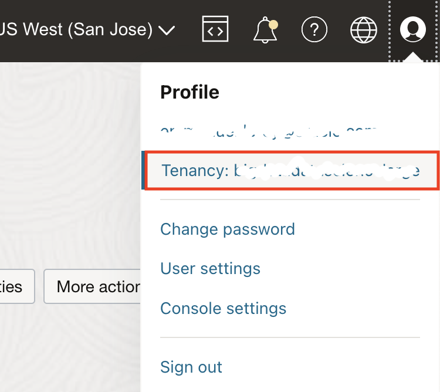
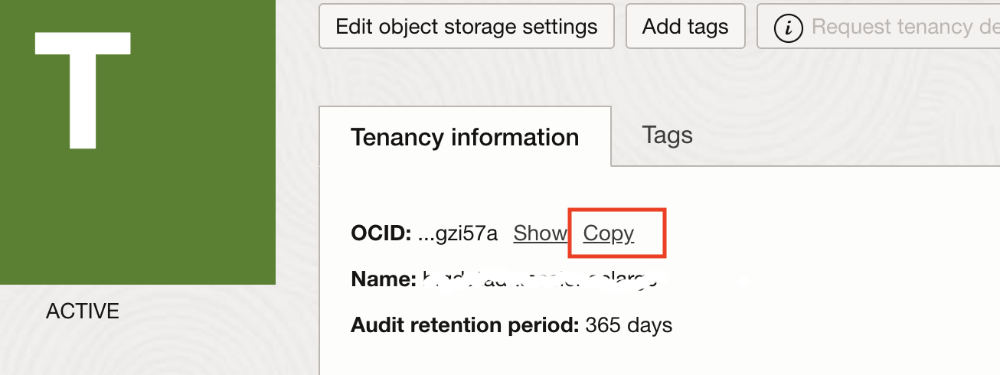

# Install Prerequisites

## Introduction

In this lab we will install the software required to run the stack to deploy Oracle SOA Suite on OKE.

Because the Kubernetes artefacts required are deployed as Helm charts in Kubernetes. We need kubectl, as well as Helm installed to run the stack. Furthermore the OCI Command Line Interface (CLI) is used for some tasks and is required for kubectl.

Estimated Lab Time: 10 minutes.

### Objectives

In this lab you will:

- Install the OCI Command Line Interface (CLI).
- Install kubectl >= 1.22 if not already present.
- IOnstall Helm >=3.9.0+

## Task 1: Install the OCI CLI

1. To install the OCI CLI on Linux or Mac OS X, run the command:

    ```bash
    <copy>
    bash -c "$(curl -L https://raw.githubusercontent.com/oracle/oci-cli/master/scripts/install/install.sh)"
    </copy>
    ```

    Press **Enter** to use the defaults for all options.

2. Restart your shell.

    ```bash
    <copy>
    exec -l $SHELL
    </copy>
    ```

3. Gather required information

    `tenancy OCID`:

    - In the Oracle Cloud Console, **click** your **User** icon (top right corner), then **Tenancy**.

        

    - **Copy** the OCID of the tenancy and paste it in your environment file.

        

    `User OCID`:

    - In the Oracle Cloud Console, go to **User -> User Settings**.
    - **Copy** the OCID of your user.

4. Configure the OCI CLI.

    ```bash
    <copy>
    oci setup config
    </copy>
    ```

    You will be prompted for:
    - Location of the config. Press **Enter**.
    - `user_ocid`: enter your user OCID.
    - `tenancy_ocid`: enter your tenancy OCID.
    - `region`: enter your region from the list provided.
    - Generate a RSA key pair: press **Enter** for Yes (default).
    - Directory for keys: press **Enter** for the default.
    - name for the key: press **Enter** for the default.
    - Passphrase: press **Enter** for no passphrase.

    You should see an output like:

    ```bash
    Private key written to: /home/oracle/.oci/oci_api_key.pem
    Fingerprint: 21:d4:f1:a0:55:a5:c2:ce:...
    Config written to ~/.oci/config
    ```

5. Upload the public key to your OCI account

    In order to use the CLI, you need to upload the public key generated to your user account.

    Get the key content with:

    ```bash
    <copy>
    cat ~/.oci/oci_api_key_public.pem
    </copy>
    ```

    Or open the file with your prefered editor and copy the full printed output to clipboard.

6. In the OCI web console:

    - Under **User -> User Settings**.
    - Click **API Keys**.
    - Click **Add Public Key**.
    - Click **Paste Public Key**.
    - Paste the key copied above.
    - Click **Add**.

    You can verify that the Fingerprint generated matches the fingerprint output of the config.

7. Test your CLI:

    ```bash
    <copy>
    oci os ns get
    </copy>
    ```

    This command should output the namespace of your tenancy (usually the name of the tenancy or a randomized string).

    ```json
    {
        "data": "your-tenancy-namespace"
    }
    ```

## Task 2: Install `kubectl`

1. *If you are using Docker Desktop on Mac OS X or Windows, `kubectl` should already be installed, and you can skip the install step.*

2. To install `kubectl` run:

    ```bash
    <copy>
    PLATFORM=$(uname)
    curl -LO "https://dl.k8s.io/release/$(curl -L -s https://dl.k8s.io/release/stable.txt)/bin/${PLATFORM,,}/amd64/kubectl"
    chmod +x ./kubectl
    sudo mv ./kubectl /usr/local/bin/kubectl
    </copy>
    ```

    On Windows use:

    ```bash
    <copy>
    curl -LO https://storage.googleapis.com/kubernetes-release/release/v1.20.0/bin/windows/amd64/kubectl.exe
    </copy>
    ```

    Add the binary to your PATH

    For more detailed instructions, go to:
    [https://kubernetes.io/docs/tasks/tools/install-kubectl/](https://kubernetes.io/docs/tasks/tools/install-kubectl/)

3. Make sure you have a recent version >= 1.18 with:

    ```bash
    <copy>
    kubectl version --client
    </copy>
    ```

## Task 3: Install Helm

1. To install helm on Mac OS X and Linux, use:

    ```bash
    <copy>
    curl https://raw.githubusercontent.com/helm/helm/master/scripts/get-helm-3 | bash
    </copy>
    ```

    For more detailed instructions for your specific OS, go to:
    [https://helm.sh/docs/intro/install/](https://helm.sh/docs/intro/install/).

## Task 4: Install Terraform

If you are on a Linux based machine or Mac OS X, we recommend using tfswitch [https://tfswitch.warrensbox.com/Install/](https://tfswitch.warrensbox.com/Install/) to install Terraform, as it allows easy switching between Terraform versions.

Otherwise, if you need guidance to setup Terraform, please visit [https://learn.hashicorp.com/tutorials/terraform/install-cli](https://learn.hashicorp.com/tutorials/terraform/install-cli) and select the path corresponding to your environment.

1. If you installed tfswitch, select a version with:

    ```bash
    <copy>
    tfswitch
    </copy>
    ```

    This workshop was tested with Terraform v0.14.11

You may now [proceed to the next lab](#next).

## Acknowledgements

 - **Author** - Emmanuel Leroy, Senior Technical Product Manager
 - **Last Updated By/Date** - Emmanuel Leroy, May 2021
