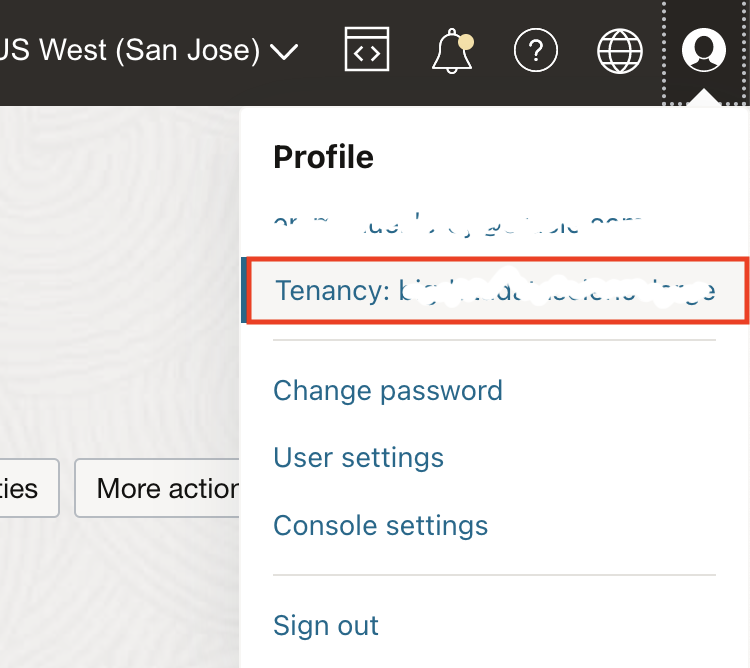
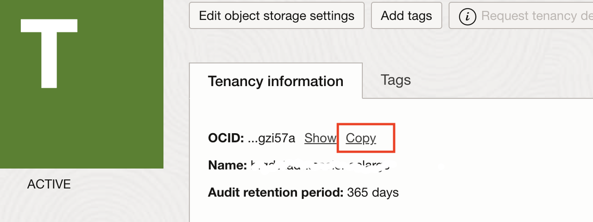
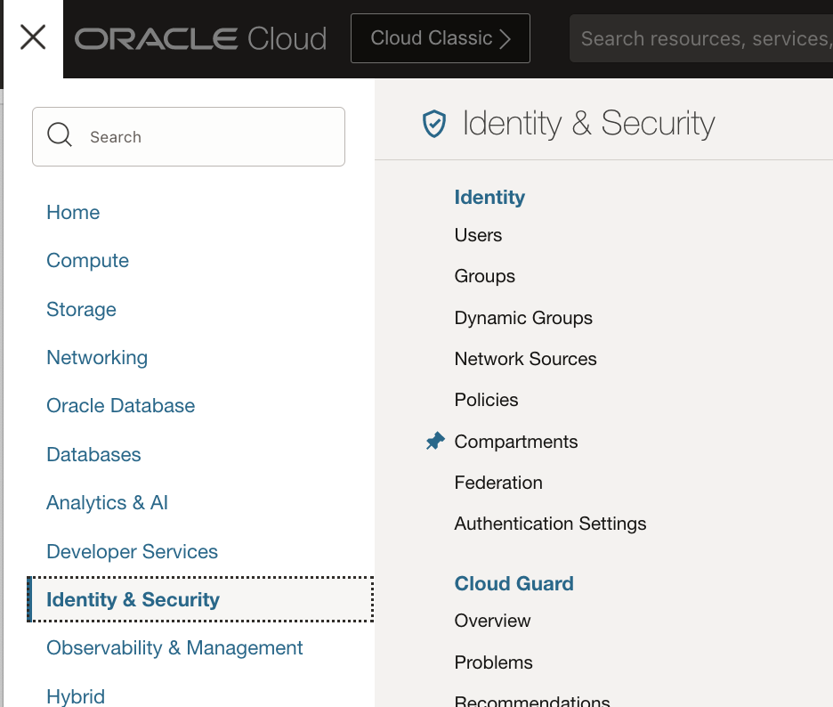
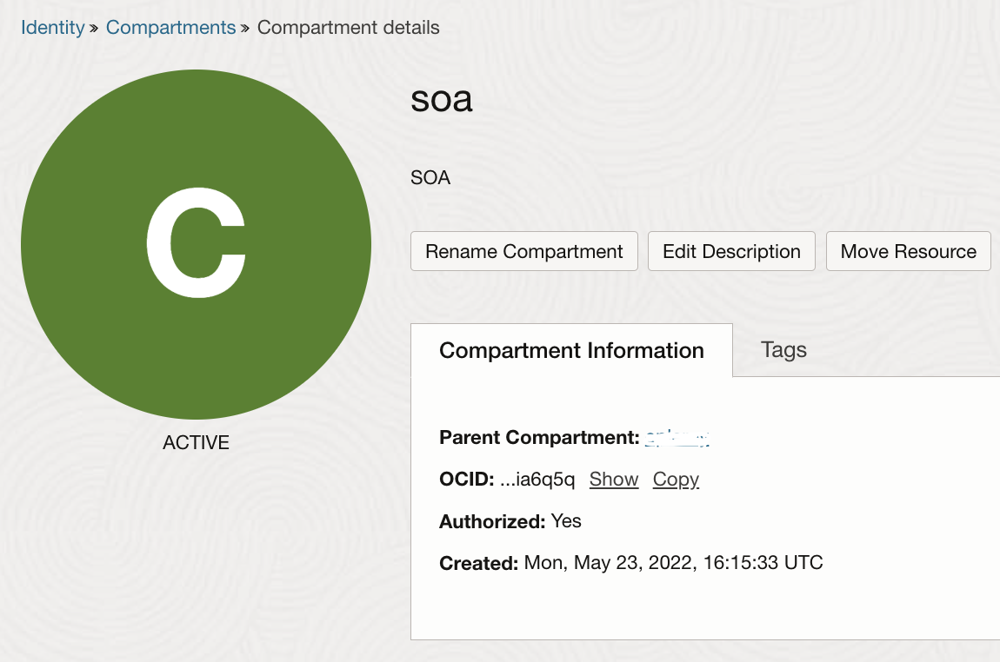

# Deploy Oracle SOA Suite on Oracle Kubernetes Engine (OKE)

## Introduction

In this lab, we will deploy the infrastructure with Terraform and deploy Oracle SOA Suite using Helm.

Estimated Lab Time: 45 minutes.

### Objectives

In this lab, you will provision:

* A Kubernetes cluster on Oracle Kubernetes Engine, with a database for the SOA Suite schemas and a file storage mountpath to store the SOA Suite domain files.
* Oracle SOA Suite in Kubernetes.

### Prerequisites

For this lab, you need:

* Git installed.
* OCI Command Line Interface (CLI) installed.
* Terraform installed.
* Helm 3.x installed.

## Task 1: Acknowledge Terms of Use for the Docker Images

The chart uses the Oracle SOA Suite Docker image from the Oracle Container Registry. This is a mandatory requirement.

1. Accept Oracle SOA Suite Docker image Terms and Conditions.

    You must accept the terms of use for this image before using the chart, or it will fail to pull the image from registry.

    - At [https://container-registry.oracle.com/](https://container-registry.oracle.com/), search for 'SOA'.
    - Click **soasuite**.
    - Click to accept the License terms and condition on the right.
    - Fill in your information (if you haven't already).
    - Accept the License.

2. Optionally accept Oracle Database Docker image Terms and Conditions.

    The Terraform script deploys an Oracle database from the Oracle Cloud Database Cloud Service, so this step is only required if you wish to deploy the database as a container in the Kubernetes cluster.

    If you intend on deploying the database within the kubernetes cluster (optional; not for production), you must agree to the terms of the Oracle database Docker image:

    - Search for Database.
    - Click **Enterprise**.
    - Click to accept the License terms and condition on the right.
    - Fill in your information (if you haven't already).
    - Accept the License.

## Task 2: Get the Terraform Code

You'll find the code on Github.com at [https://github.com/oracle-quickstart/oke-soa](https://github.com/oracle-quickstart/oke-soa)

2. You can click **Code** and download as a zip file or using git command line, in a local folder of your choice, clone the repository with

    ```bash
    <copy>
    git clone https://github.com/oracle-quickstart/oke-soa
    </copy>
    ```

4. Get into the code folder

    ```bash
    <copy>
    cd oke-soa
    </copy>
    ```


## Task 3: Gather Required Information

1. Get your `tenancy OCID`:

    - In the Oracle Cloud Console, **click** your **User** icon (top right corner), then **Tenancy**.

        

    - **Copy** the OCID of the tenancy and paste it in your environment file.

        

2. Get your `compartment OCID`:

    - In the Oracle Cloud Console, go to **Identity -> Compartments**.

        

    - Navigate to the compartment where you want to deploy the infrastructure.

    - **Copy** the OCID of the compartment.

        

## Task 4: Create a `terraform.tfvars` Config File

To run the deployment, you need to define a few settings in a file named `terraform.tfvars`.

1. Create a file called `terraform.tfvars` from the template using:

    ```bash
    <copy>
    cp terraform.tfvars.template terraform.tfvars
    </copy>
    ```

2. Edit the `terraform.tfvars` file with the editor of your choice and provide the following values:

    See the next step to find out where to find the required information.

    Make sure you enter valid values for the credentials required.

    ```bash
    <copy>
    ## Copyright © 2021, Oracle and/or its affiliates. 
    ## All rights reserved. The Universal Permissive License (UPL), Version 1.0 as shown at http://oss.oracle.com/licenses/upl

    tenancy_ocid     = "ocid1.tenancy.oc1..."
    compartment_ocid = "ocid1.compartment.oc1..."
    region           = "us-ashburn-1"

    deployment_name = "SOA-k8s"
    soa_domain_name = "mysoa"

    # Domain Type must be one of soa, osb, soaosb
    soa_domain_type = "soaosb"

    ## Things to provision

    # VCN, OKE cluster, node_pool(s)
    # if false, the template assumes the cluster is provisioned and that kubectl has access to the cluster.
    provision_cluster = true

    # File Storage and mount point export 
    provision_filesystem = true
    provision_export = true

    # Database (DBaaS on OCI)
    # If false, a database jdbc_connection URL needs to be provided, and the database needs to be reachable from this VCN
    provision_database = true
    # WebLogic Operator
    provision_weblogic_operator = true
    # Ingress controller
    provision_traefik = true
    provision_secrets = true
    provision_soa = true

    ## File storage details
    # If the VCN is not provided by this template, the following variables must be provided
    fss_subnet_id = null
    # If the cluster and VCN are not provided by this template,
    fss_source_cidr = "0.0.0.0/0"
    # File Storage mount target Availability Domain index
    ad_number = 2

    ## Credentials
    # Input your Container registry login credentials
    container_registry_email    = ""
    container_registry_password = ""

    # Create SOA Suite domain Admin Console credentials
    soa_domain_admin_username = ""
    # Password must contain 1 Upper, 1 number and be at least 8 characters long
    soa_domain_admin_password = ""

    # Create Database credentials
    # Password must be 9 to 30 characters and contain at least 2 uppercase, 2 lowercase, 2 special, and 2 numeric characters. 
    # The special characters must be _, #, or -.
    db_sys_password = ""

    # Create RCU Schema credentials
    rcu_prefix = "SOA"
    rcu_username = "rcu"
    # Password must be 9 to 30 characters and contain at least 2 uppercase, 2 lowercase, 2 special, and 2 numeric characters. 
    # The special characters must be _, #, or -.
    rcu_password = ""

    # If connecting to an external DB, specify the jdbc_connection_url
    # !!! You will need to adjust the security list on your database VCN/subnet to authorize access from the OKE cluster nodes,
    # which may require VCN peering (not provided here)
    jdbc_connection_url = null

    # Database information
    database_name        = "SOA"
    database_unique_name = "SOA"

    # Kubernetes namespaces
    soa_kubernetes_namespace     = "soans"
    weblogic_operator_namespace  = "opns"
    ingress_controller_namespace = "traefik"

    # VCN config
    vcn_cidr = "10.0.0.0/16"

    # SSH key to access database and Kubernetes nodes
    ssh_authorized_key = ""

    # Cluster config
    oke_cluster = {
    name                                                    = "OKE_Cluster"
    k8s_version                                             = "v1.18.10"
    pods_cidr                                               = "10.1.0.0/16"
    services_cidr                                           = "10.2.0.0/16"
    cluster_options_add_ons_is_kubernetes_dashboard_enabled = true
    cluster_options_add_ons_is_tiller_enabled               = true
    }

    # defaults to 1 pool, feel free to add more if needed.
    node_pools = [
    {
        pool_name  = "pool1"
        node_shape = "VM.Standard2.4"
        node_count = 3
        node_labels = {
        "pool_name" = "pool1"
        }
    }
    ]

    # Optional parameter, requires a vault and key to be created in the account.
    secrets_encryption_key_ocid = null
    </copy>
    ```

3. The default Availability Domain for the File System is set to AD-2 because it is often less used than AD-1.
    If you are in a single AD region, this may fail.

    Change the Availability domain index by changing the default variable:

    ```hcl
    ad_number = 2
    ```

    to:

    ```hcl
    ad_number = 1
    ```

4. Valid credentials must be provided to access the Oracle Container Registry (your account email and password) to pull the images.

5. Provide a username and password compliant with the password requirements for the WebLogic domain:

    The password must include 1 uppercase, 1 number and be at least 8 characters long.

    ```hcl
    soa_domain_admin_username = ""
    soa_domain_admin_password = ""
    ```

6. Provide credentials for the SYS user of the database, and the RCU Schema password.

    Both must container 16 to 30 characters including 1 uppercase, 1 number and 2 special character `-_#!%`.

    ```hcl
    db_sys_password = ""
    rcu_password = ""
    ```

7. The `rcu_prefix` must be unique per domain (when deploying multiple domains).

8. The domain name must be unique (when deploying multiple domains).

9. Set the `ssh_authorized_key` with your ssh public key.

    You can get the output of a previously created SSH key with:

    ```bash
    cat ~/.ssh/id_rsa.pub
    ```

10. Save the `terraform.tfvars` file.

## Task 5: Run the Deployment

1. Initialize the project

    ```bash
    <copy>
    terraform init
    </copy>
    ```

2. Check the plan (optional)

    To determine what will happen, you can run the `plan` operation

    ```bash
    <copy>
    terraform plan
    </copy>
    ```

3. Apply the plan

   ```bash
    <copy>
    terraform apply
    </copy>
    ```

    You will be prompted to enter `yes` to apply the plan.

    ```bash
    Do you want to perform these actions?
    Terraform will perform the actions described above.
    Only 'yes' will be accepted to approve.

    Enter a value: yes
    ```

    It will take several minutes to provision the resources.

    This provisions the Oracle Kubernetes Engine cluster, with:
        - A node pool of 3 nodes.
        - A database to store Oracle SOA Suite schemas.
        - A file storage file system and mount target to store the Oracle SOA Suite domain files.

    It installs the Kubernetes pre-requisites to installing Oracle SOA Suite. It installs:
        - The Oracle WebLogic Kubernetes Operator.
        - The Traefik ingress controller.

    It creates secrets for the various components of the SOA domain

    It deploys Oracle SOA on Kubernetes.

## Task 6: Access the Deployment

1. Get the public IP of the load balancer created by the ingress controller

    ```bash
    <copy>
    kubectl get services -n traefik
    </copy>
    ```

    This should output something like:

    ```bash
    NAME      TYPE           CLUSTER-IP     EXTERNAL-IP      PORT(S)                                          AGE
    traefik   LoadBalancer   10.2.170.178   123.456.789.123  9000:31242/TCP,30305:30305/TCP,30443:30443/TCP   3m
    ```

    If it is still pending, wait a few more minutes before checking again.

    Get the EXTERNAL-IP value for the load balancer

2. Make sure the SOA domain servers are running:

    If you have not changed the name of the soa namespace, you can check running pods with:

    ```bash
    <copy>
    kubectl get pods -n soans
    </copy>
    ```

    You should see:

    ```bash
    NAME                READY   STATUS    RESTARTS   AGE    IP          NODE          NOMINATED NODE   READINESS GATES
    mysoa-adminserver   1/1     Running   0          179m   10.1.1.9    10.0.10.211   <none>           <none>
    mysoa-osb-server1   1/1     Running   0          172m   10.1.1.10   10.0.10.211   <none>           <none>
    mysoa-osb-server2   1/1     Running   0          172m   10.1.1.12   10.0.10.211   <none>           <none>
    mysoa-soa-server1   1/1     Running   0          172m   10.1.1.11   10.0.10.211   <none>           <none>
    mysoa-soa-server2   1/1     Running   0          172m   10.1.0.6    10.0.10.16    <none>           <none>
    ```

    Make sure the STATUS is `RUNNING` and that READY is `1/1` for pods above before checking the URL.

3. With the public IP gathered earlier, browse to http://*PUBLIC_IP*:30305/console to get to the WebLogic console.

    If you see the `Bad Gateway` message, the admin server is not running yet.

4. You can log into the console with the `soa_domain_username` and `soa_domain_password` you specified in the `terraform,.tfvars` file.

5. Check the `/ess` endpoint by browsing to http://*PUBLIC_IP*:30305/ess .

    The username and password is the same as for the console.

6. Check the `/em` endpoint by browsing to http://*PUBLIC_IP*:30305/em .

7. Check the `/soa/composer` endpoint by browsing to http://*PUBLIC_IP*:30305/soa/composer .

You may now [proceed to the next lab](#next).

## Acknowledgements
 - **Author** - Emmanuel Leroy, Senior Technical Product Manager
 - **Last Updated By/Date** - Emmanuel Leroy, May 2021
