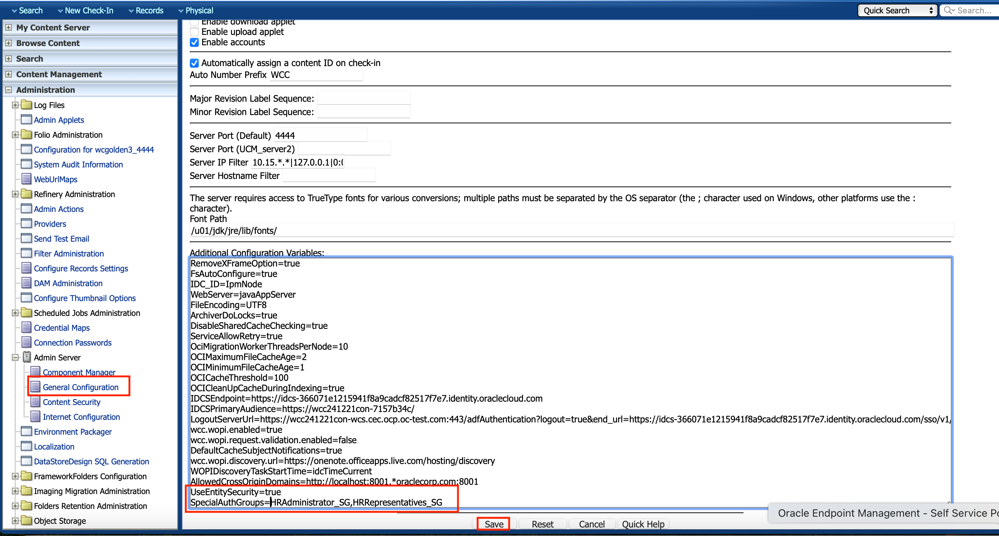

# Initialize WebCenter Content Marketplace Instance

## Introduction

This lab will show you how to setup WebCenter Content Marketplace Instance for ACL and Accounts.

**Estimated Lab Time**: *30 minutes*

### Objectives

- Enable ACL
- Set variables for ACL
- Enable Accounts
- Set Accounts Delimiter

### Prerequisites

This lab assumes you have :

- Access to WCC Marketplace Environment

## Task 1: Validate That WebCenter Content CS URL

1. Open the *web browser* window with **WebCenter Content** homepage url. Click on the **Login** and Login using the below credentials

- URL
      ```
      <copy>https://localhost:16200/cs/</copy>
      ```

    > Note : Replace `"https://localhost"` with your **hosturl** ( eg: `"http://wcc-livelab.livelabs.oraclevcn.com"` or `"https://192.0.0.0"`)

- Username
      ```
      <copy>weblogic</copy>
      ```

- Password
      ```
      <copy>Welcome1</copy>
      ```
      > *Note: In the scenario, where WebCenter Content is configured with IDCS or any other username (other than **weblogic**), use user credentials accordingly*

 
2. Confirm successful login.
 

 If successful, the page above is displayed and as a result, your WebCenter Content instance is accessible.
3. If you are still unable to log in or the login page is not functioning after reloading ,  proceed as indicated in the **Appendix 1: Restart UCM Server Instance** to restart the services and try login again
4. After you log in to the WebCenter Content Instance successfully, you can proceed with the next Task.

## Task 2: Enable RoleEntityACL Component & Add Additional Instance Configurations

To enable RoleEntityACL Component & add additional instance configurations, follow the below steps;

1. Login to WebCenter Content server as user with Administrator Privilege. Under **Administration** tab, navigate to **Admin Server** > **Component Manager**. In the **Component Manager** page , click on **advanced component manager** Link.
  
2. Select **RoleEntityACL** Component from **Disabled Components:** List and click **Enable** button.
  

3. Under **Administration** tab, navigate to **Admin Server** > **General Configuration**. In the **Additional Configuration Variables** section list of variables, add the below line and click **Save** button.

       ```
        <copy>UseEntitySecurity=true
        SpecialAuthGroups=HRAdministrator_SG,HRRepresentatives_SG</copy>
       ```

   > *- **SpecialAuthGroups** mentioned above are the security groups which we will be creating in next Lab. ACL and accounts will only work for the security groups mentioned here.*

  
4. Restart the Content Server instance , using the steps mentioned in **Appendix 1: Restart UCM Server Instance**

## Task 3: Enable Accounts

To enable accounts, follow the below steps;

1. Login to WebCenter Content server as user with Administrator Privilege. Under **Administration** tab, navigate to **Admin Server** > **General Configuration**. Select **Enable accounts** checkbox and click **Save** button
 

2. Restart the Content Server instance , using the steps mentioned in **Appendix 1: Restart UCM Server Instance**

## Task 4: Configure Accounts

To Configure accounts and mapping wcc accounts to group in weblogic/idcs, follow the below steps;

1. Login to WebCenter Content server as user with Administrator Privilege. Under **Administration** tab, navigate to **Providers**. Click **Info** link against **JpsUserProvider**

2. Click on **Edit** in **JPS User Provider Information** page

3. Enter the **Account Permissions Delimiter**, **Account Name Prefix**. Click **Update**.

- **Account Permissions Delimiter**: Enter (*underscore*)
      ```
     <copy>_</copy>
      ```

- **Account Name Prefix**: Enter

      ```
      <copy>@</copy>
      ```


4. Restart the Content Server instance , using the steps mentioned in **Appendix 1: Restart UCM Server Instance**

You may now **proceed to the next lab**.

## Appendix 1: Restart UCM Server Instance

1. Login to the WebCenter Content Weblogic console as administrator user (eg : weblogic)

2. Navigate to **Environment** > **Servers** > **Control** tab and select the checkbox for **UCM Server**(s)

3. click on **Shutdown** > **Force Shutdown**

4. After the Server changes to **SHUTDOWN** state, select the checkbox for **UCM Server**(s), click on **Start** button

## Acknowledgements

- **Authors-** Sujata Nayak, Consulting Member Technical Staff, Oracle WebCenter Content
- **Contributors-** Sujata Nayak, Senthilkumar Chinnappa, Mandar Tengse , Parikshit Khisty
- **Last Updated By/Date-** Sujata Nayak, December 2024
