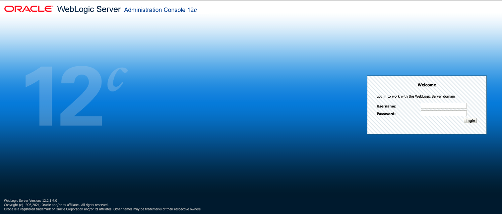
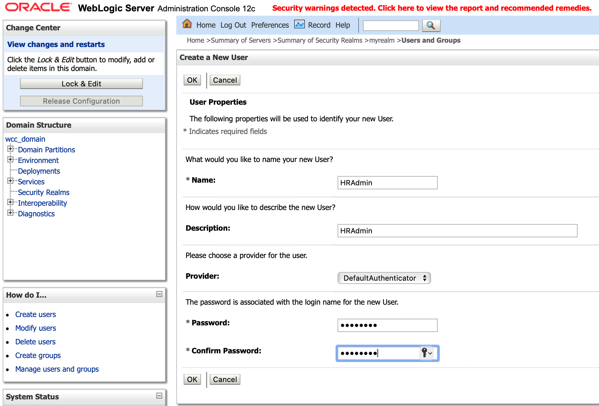
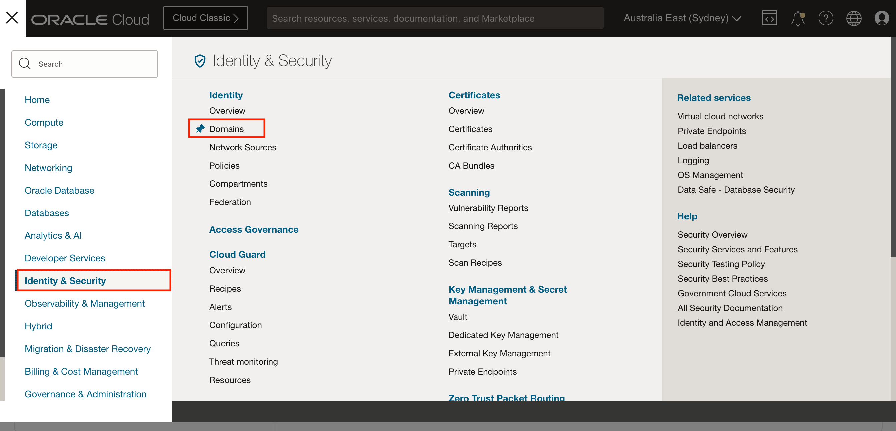
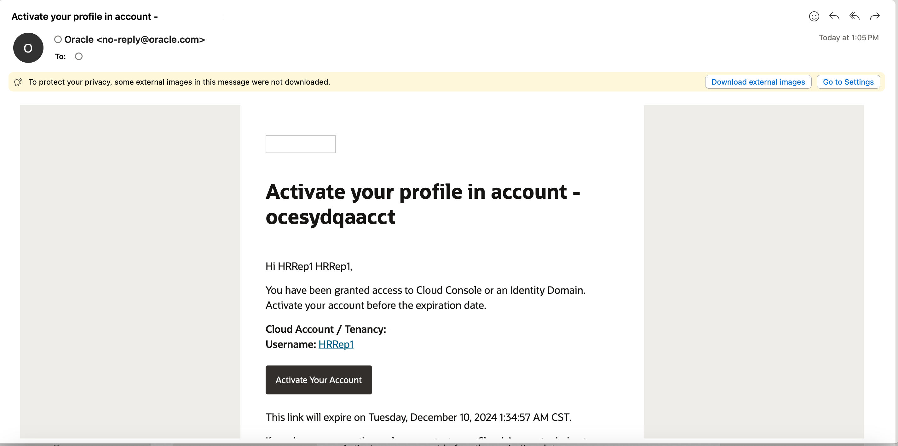
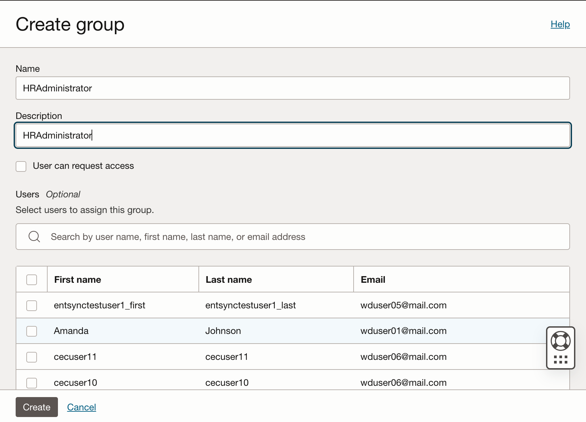
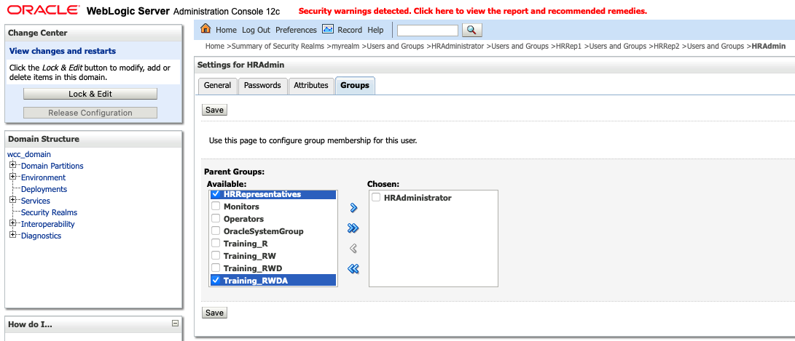
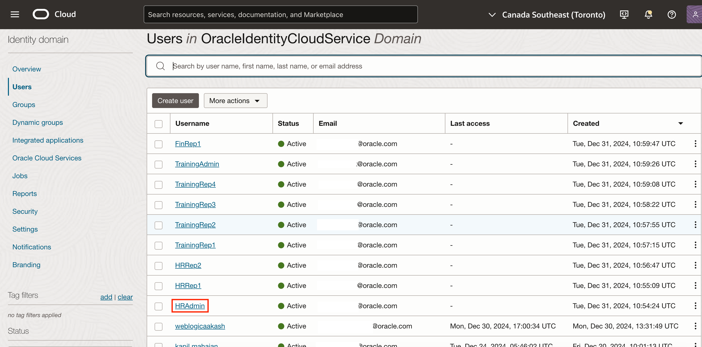
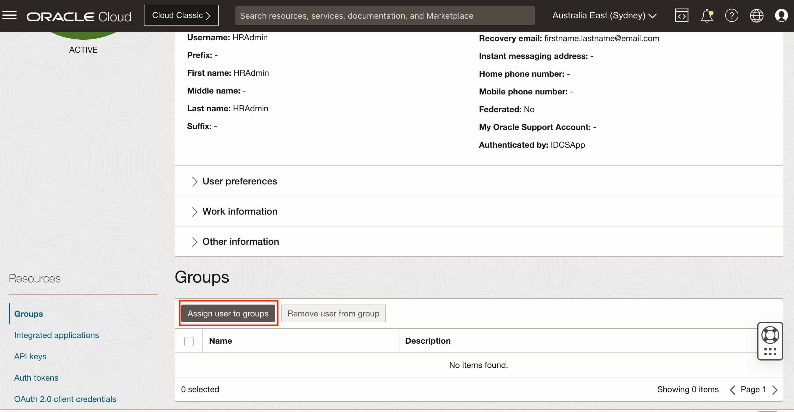
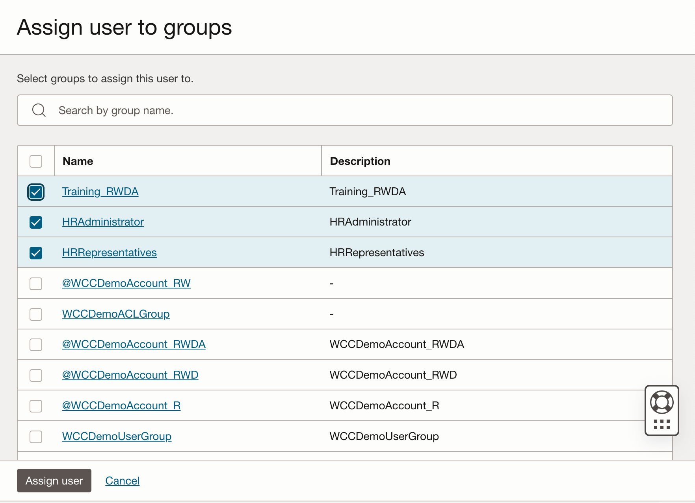

# Create Users and Groups

## Introduction

This lab will guide you through the process of creating Users and Groups for WebCenter Content Server. If your WebCenter Content is configured with IDCS, follow the steps outlined under the **Oracle Cloud Infrastructure Console** tab. Otherwise, proceed with the steps under the **WebLogic Server** tab.

**Estimated Lab Time**: *20 minutes*

### Objectives

- Create Users and Groups in WebCenter Content Marketplace Instance

### Prerequisites

 This lab assumes you have:

- Access to WCC Marketplace Environment

This lab assumes you have completed:

- Lab: Initialize WCC Environment

## Task 1: Create Users

To create Users (HRAdmin, HRRep1, HRRep2, TrainingRep1, TrainingRep2, TrainingRep3, TrainingRep4, TrainingAdmin and FinRep1) in WCC follow these steps:

<if type="Weblogic">

1. Login to the WebCenter Content Weblogic console as administrator user (eg : weblogic)

2. Select **Security Realms** and click on **myrealm**


3. Navigate to **Users and Groups** > **Users** tab and Click on **New** button


4. Enter the **Name, Description, Provider and Password**. Click **OK**.

- **Name**: Enter
       ```
    <copy>HRAdmin</copy>
       ```

- **Description**: Enter
       ```
    <copy>HRAdmin</copy>
       ```

- **Provider**: Enter
       ```
    <copy>DefaultAuthenticator</copy>
       ```

- **Password**: Enter
       ```
    <copy>Welcome1</copy>
       ```

- **Confirm Password**: Enter
       ```
         <copy>Welcome1</copy>
       ```


5. Similarly create User **HRRep1**, **HRRep2**, **TrainingRep1**, **TrainingRep2**, **TrainingRep3**, **TrainingRep4**, **TrainingAdmin** and **FinRep1**

</if>

<if type="IDCS">

1. Sign in to the Oracle Cloud Infrastructure Console [ **Using the steps mentioned in Appendix 1** ]
2. Open the navigation menu and click **Identity & Security**. Under **Identity**, click **Domains**. A list of the existing Domains in your tenancy is displayed.

3. Select the **Compartment** and then the **domain** which is integrated with your wcc instance

4. Click the **Users** and then **Create User**

5. Enter the **First name**, **Last name**, **Username** and **Email**. Click **Create**.

- **First name**: Enter
      ```
    <copy>HRAdmin</copy>
      ```

- **Last name**: Enter
      ```
    <copy>HRAdmin</copy>
      ```

- **Username**: Select
      ```
    <copy>HRAdmin</copy>
      ```

- Uncheck **Use the email address as the username**
- **Email**: Enter the email which you have access and click **Create**.

      ```
       <copy>firstname.lastname@email.com</copy>
      ```


6. You will receive an email to activate your profile account. Click on **Activate Your Account** in the email

7. Enter the Password in **Reset Your Password** screen and click **Reset Password**

- **New Password**: Enter
      ```
      <copy>Welcome1</copy>
      ```

- **Confirm New Password**: Enter
      ```
      <copy>Welcome1</copy>
      ```


8. Similarly create User **HRRep1**, **HRRep2**, **TrainingRep1**, **TrainingRep2**, **TrainingRep3**, **TrainingRep4**, **TrainingAdmin** and **FinRep1**

</if>

## Task 2: Create Groups

To create Groups (HRAdministrator, HRRepresentatives, @Training\_R, @Training\_RW, @Training\_RWD and @Training\_RWDA) in WCC follow these steps:

<if type="Weblogic">

1. Login to the WebCenter Content Weblogic console as administrator user (eg : weblogic)

2. Select on **Security Realms** and click on **myrealm**


3. Navigate to **Users and Groups** > **Groups** tab and Click on **New** button


4. Enter the **Name**, **Description**, **Provider**. Click **OK**.

- **Username**: Enter
      ```
    <copy>HRAdministrator</copy>
      ```

- **Description**: Enter
      ```
    <copy>HRAdministrator</copy>
      ```

- **Provider**: Select
      ```
      <copy>DefaultAuthenticator</copy>
      ```


5. Similarly create groups **HRRepresentatives**, **@Training\_R**, **@Training\_RW**, **@Training\_RWD** and **@Training\_RWDA**.

</if>

<if type="IDCS">

1. Sign in to the Oracle Cloud Infrastructure Console [ **Using the steps mentioned in Appendix 1** ]
2. Open the navigation menu and click **Identity & Security**. Under **Identity**, click **Domains**. A list of the existing Domains in your tenancy is displayed.

3. Select the **Compartment** and then the **domain** which is integrated with your wcc instance

4. Click the **Groups** and then **Create Group**

5. Enter the **Name** and **Description**. Click **Create**.

- **Name**: Enter
      ```
    <copy>HRAdministrator</copy>
      ```

- **Description**: Enter
      ```
    <copy>HRAdministrator</copy>
      ```


6. Similarly create groups **HRRepresentatives**, **@Training\_R**, **@Training\_RW**, **@Training\_RWD** and **@Training\_RWDA**.

</if>

## Task 3: Assign group membership to the User

To Assign Group membership to users in WCC follow these steps:

<if type="Weblogic">

1. Login to the WebCenter Content Weblogic console as administrator user (eg : weblogic)

2. Select on **Security Realms** and click on **myrealm**

3. Navigate to **Users and Groups** > **Users** tab and Click on User **HRAdmin**

4. Navigate to **Groups** tab. Select **HRAdministrator**, **HRRepresentatives** and **@Training\_RWDA** group from **Available:** list and click on **Move selected items from Available to Chosen list** icon.

5. Click on Save.
6. Similarly assign groups to other users

</if>

<if type="IDCS">

1. Sign in to the Oracle Cloud Infrastructure Console [ **Using the steps mentioned in Appendix 1** ]
2. Open the navigation menu and click **Identity & Security**. Under **Identity**, click **Domains**. A list of the existing Domains in your tenancy is displayed.

3. Select the **Compartment** and then the **domain** which is integrated with your wcc instance

4. Click the **Users** and then user **HRAdmin**

5. Click the **Assign user to Groups**

6. Select **HRAdministrator**, **HRRepresentatives** and **@Training\_RWDA**  and click **Assign user**

7. Since there are multiple groups in IDCS, the guest group may not appear on the same page. To assign the guest group to the user, follow step 5, then search for "guest", select the guest group, and assign it to the user.


8. Similarly assign groups to other users
</if>

 | User          | Groups                                   |
 | ------------- | :--------------------------------------- |
 | HRRep1        | guest,HRRepresentatives                  |
 | HRRep2        | guest,HRRepresentatives                  |
 | TrainingRep1  | guest,HRRepresentatives,@Training\_R     |
 | TrainingRep2  | guest,HRRepresentatives,@Training\_RW    |
 | TrainingRep3  | guest,HRRepresentatives,@Training\_RWD   |
 | TrainingRep4  | guest,HRRepresentatives                  |
 | TrainingAdmin | guest,HRRepresentatives,@Training\_RWDA  |
 | FinRep1       | guest                                    |
 {: title="User-Group mapping"}

## Task 4: Sync Users and Roles with WCC

This section applies only if the instance is integrated with the Oracle Cloud Infrastructure Console. Users will not appear in WCC unless they have logged into WCC at least once. To address this, we need to synchronize users and roles with WCC.
<if type="Weblogic">

</if>

<if type="IDCS">

1. Login to WebCenter Content server as user with Administrator Privilege.
 
2. In the same browser tab or new tab run following API from browser URL:

- **IDCS User Sync: Open below URL in your browser tab and wait for message "Users sync has been run"
      ```
    <copy>https://localhost:16200/cs/idcplg?IdcService=SYNC_USERS</copy>
      ```

- **IDCS Group Sync: Open below URL in your browser tab and wait for message "Roles sync has been run"
      ```
    <copy>https://localhost:16200/cs/idcplg?IdcService=SYNC_ROLES</copy>
      ```

 > Note : Replace `"https://localhost"` with your **hosturl** ( eg: `"http://wcc-livelab.livelabs.oraclevcn.com"` or `"https://192.0.0.0"`)

</if>

You may now **proceed to the next lab**.

## Appendix 1: Sign in to Oracle Cloud Infrastructure Console

Complete the following steps to sign in to the Oracle Cloud Infrastructure console.

  1. Go to <http://cloud.oracle.com>.

  2. Enter your cloud account name and click Next.

  3. Sign in to the Oracle Cloud Infrastructure console:

      - If your cloud account uses identity domains, sign in to the Oracle Cloud Infrastructure console as a user configured in Oracle Cloud Infrastructure Identity and Access Management (IAM).
        - Select the default domain.

      - If your cloud account does not use identity domains, sign in to the Oracle Cloud Infrastructure console as a user federated through Oracle Identity Cloud Service.
        - Under Single Sign-On (SSO) options, note the identity provider selected in the Identity Provider field and click Continue.

  4. Enter the user name and password provided in the welcome email, and click Sign In. The Oracle Cloud Infrastructure console is shown.

## Acknowledgements

- **Authors-** Sujata Nayak, Consulting Member Technical Staff, Oracle WebCenter Content
- **Contributors-** Sujata Nayak, Senthilkumar Chinnappa, Mandar Tengse , Parikshit Khisty
- **Last Updated By/Date-** Sujata Nayak, December 2024
