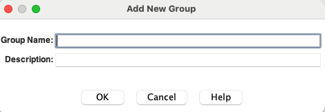

# Create Security Groups, Roles, Aliases and Accounts

## Introduction

This lab will show you how to install Oracle WebCenter Content Administration Desktop Client and create Security Groups, Roles, Aliases and Accounts in WCC

**Estimated Lab Time**: *45 minutes*

### Objectives

- Download and install Oracle WebCenter Content Administration Desktop Client
- Create Security Group
- Create Role
- Map Roles to Security Group
- Create Alias
- Create Account

### Prerequisites

This lab assumes you have:

- Access to WCC Marketplace Environment

This lab assumes you have completed:

- Lab: Initialize WCC Environment
- Lab: Create Users and Groups

## Task 1: Download and install Oracle WebCenter Content Administration Desktop Client

 To Install WebCenter Content Administration Desktop Client, follow the below steps;

1. Login to WebCenter Content server as user with Administrator Privilege, Under **Administration** tab, navigate to **Admin Applets**. Click on **Download Client** button. This downloads wccadmin-installer.msi file on windows and wccadmin-installer.dmg file on mac


2. Install the wcc admin client:

<if type="MAC">

- Double click on downloaded wccadmin-installer.dmg
- Move the **Oracle WebCenter Content Administration** to **Applications**
 

</if>

<if type="Windows">

- Double click on downloaded wccadmin-installer.msi
 

 > Wait for the installation to complete
</if>

## Task 2: Configure Oracle WebCenter Content Administration Desktop Client

To Configure WebCenter Content Administration Desktop Client, follow the below steps;

1. Launch WebCenter Content Administration Desktop Client.

<if type="Windows">

- In Windows Start menu search **Oracle WebCenter Content Administration**
- Click on **Oracle WebCenter Content Administration** app
 
</if>

<if type="MAC">

- In Mac **Spotlight search** search **Oracle WebCenter Content Administration**
- Click on **Oracle WebCenter Content Administration** app
 
</if>

2. Enter the **User Name, Password, Server**. Click **OK**.
   - **User Name**: Enter
         ```
         <copy>weblogic</copy>
         ```
   - **Password**: Enter
         ```
        <copy>Welcome1</copy>
         ```
   - **Server**: Enter
         ```
         <copy>https://localhost:16200/cs/</copy>
         ```
    > Note : Replace `"https://localhost"` with your **hosturl** ( eg: `"http://wcc-document-livelab.livelabs.oraclevcn.com"` or `"https://192.0.0.0"`)


3. If **Warning** dialog is opened due to insecure certificate, press **Yes** to continue.

4. Wait for WebCenter Content Administration Dialog to open


## Task 3: Create Security Group

To create Security Groups (HRAdministrator\_SG, HRRepresentatives\_SG) in WCC follow these steps:

1. Login to WebCenter Content Administration Desktop Client as user with Administrator Privilege.
2. Click on **User Admin** Link

3. Select **Security** > **Permissions by Group...** menu

4. Click on **Add Group...** button

5. Enter the **Group Name** and **Description**. Click **OK**.
   - **Group Name**: Enter
         ```
        <copy>HRAdministrator_SG</copy>
         ```
   - **Description**: Enter
         ```
        <copy>HRAdministrator_SG</copy>
         ```

6. Similarly create Security Group HRRepresentatives\_SG.

## Task 4: Create Role

To create Roles (HRAdministrator and HRRepresentatives - These role names are same as groups in IDCS/Weblogic realm) in WCC follow these steps:

1. Login to WebCenter Content Administration Desktop Client as user with Administrator Privilege.
2. Click on **User Admin** Link

3. Select **Security** > **Permissions by Role...** menu

4. Click on **Add New Role...** button

5. Enter the **Role Name** and **Role Display Name**. Click **OK**.
    - **Role Name**: Enter
          ```
          <copy>HRAdministrator</copy>
          ```
    - **Role Display Name**: Enter
          ```
          <copy>HRAdministrator</copy>
          ```

6. Similarly create Role HRRepresentatives.

## Task 5: Map Roles to Security Group

To Map Roles to Security Groups in WCC follow these steps:

1. Login to WebCenter Content Administration Desktop Client as user with Administrator Privilege.
2. Click on **User Admin** Link

3. Select **Security** > **Permissions by Group...** menu

4. Select on **HRAdministrator_SG** group from "Groups" List. Select **HRAdministrator** Role from "Roles" List and click **Edit Permissions...** button

5. Click on **Admin** in **Edit Permission** Screen and click **OK**

6. Similarly assign Permissions to other Security Group and Role Combination

| Security Group | Role | Maximum Permission |
| ----------- | ----------- |
| HRAdministrator\_SG | HRRepresentatives | Read |
| HRRepresentatives\_SG | HRAdministrator | Admin |
| HRRepresentatives\_SG | HRRepresentatives | Delete |
{: title="Security Group-Role mapping"}

## Task 6: Create Alias

To create Alias in WCC follow these steps:

1. Login to WebCenter Content Administration Desktop Client as user with Administrator Privilege.
2. Click on **User Admin** Link

3. Select **Aliases** tab and click **Add**

4. Enter the **Alias Name, Alias Display Name and Description**. Click **Add..**
    - **Alias Name**: Enter
           ```
          <copy>TrainingReps</copy>
           ```
    - **Alias Display Name**: Enter
           ```
          <copy>TrainingReps</copy>
           ```
    - **Description**: Enter
           ```
           <copy>Training Representatives</copy>
           ```

5. In **Select Users** dialog, click **Define Filter...**

6. In **Define Filter** dialog select Only **User Name** field and Enter **Training%** in User Name Field. Click **OK**

7. Select TrainingRep1 to TrainingRep4 and Click **OK**

8. Click **OK** in **Add New Alias** dialog.

## Task 7: Create Account

To create Account in WCC follow these steps:

1. Login to WebCenter Content Administration Desktop Client as user with Administrator Privilege.
2. Click on **User Admin** Link

3. Select **Security** > **Predefined Accounts...** menu

4. Click on **Add...** button

5. Enter the **Predefined Account**. Click **OK**.
     - **Predefined Account**: Enter
           ```
           <copy>Training</copy>
           ```


You may now **proceed to the next lab**.

## Acknowledgements

- **Authors-** Sujata Nayak, Consulting Member Technical Staff, Oracle WebCenter Content
- **Contributors-** Sujata Nayak, Senthilkumar Chinnappa, Mandar Tengse , Parikshit Khisty
- **Last Updated By/Date-** Sujata Nayak, December 2024
