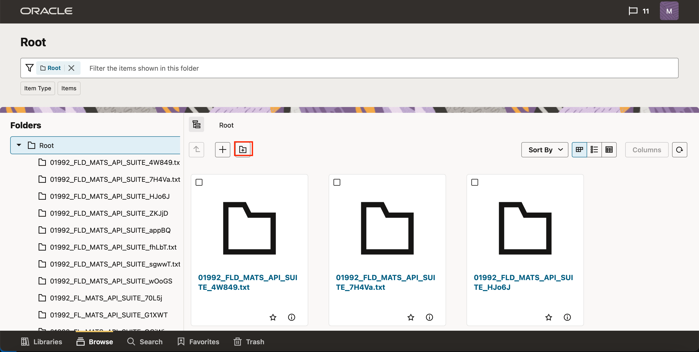
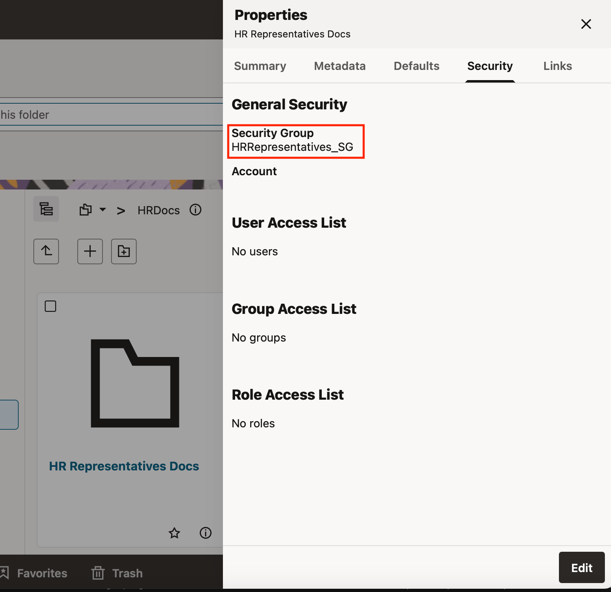
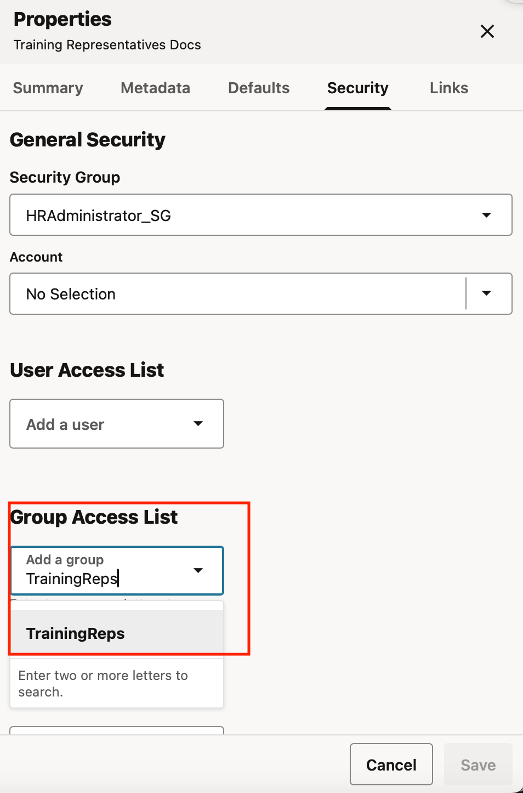

# Create Folders and Files and set Different Security Permissions

## Introduction

This lab will show you how to create folder and upload documents in RedwoodUI. This will also show you to set different security access for folders and document.

**Estimated Lab Time**: *30 minutes*

### Objectives

- Create Folders and Upload Documents.
- Set Security groups, Accounts and ACLS for folders and documents.

### Prerequisites

This lab assumes you have:

- Access to WCC Marketplace Environment

This lab assumes you have completed:

- Lab: Initialize WCC Environment
- Lab: Create Users and Groups
- Lab: Create Security Groups, Roles, Aliases and Accounts

## Task 1: Login to WCC RedwoodUI and traverse to folders root folder

To Login to WCC RedwoodUI follow these steps:

1. Open the *web browser* window with **WebCenter Content** redwood url, click on the **Login** and Login using the below credentials
     - URL
           ```
           <copy>https://localhost:16200/cs/idcplg?IdcService=REDWOODUI</copy>
           ```
        > Note : Replace `"https://localhost"` with your **hosturl** ( eg: `"http://wcc-rfpmgmt-livelab.livelabs.oraclevcn.com"` or `"https://192.0.0.0"`)
     - Username
           ```
          <copy>weblogic</copy>
           ```
     - Password
           ```
           <copy>Welcome1</copy>
           ```
     > *Note: In the scenario, where WebCenter Content is configured with IDCS or any other username (other than **weblogic**), use user credentials accordingly*
    

2. On successful login, click on **Browse** from bottom navigation bar

3. From folder breadcrumbs select **Folder parent items menu** > **Root**. Wait for folder and files from root folders to be listed in WCC Listing view.


## Task 2: Create Folder

To create folder re RedwoodUI follow these steps:

1. In WCC RedwoodUI navigate to root folder and click on **Create Folder** Icon

2. In **Create Folder** dialog Enter **Name**, **Description** and click **Create Folder**
    - Name
          ```
          <copy>HRDocs</copy>
          ```
    - Description
          ```
          <copy>HR Documents Root Folder</copy>
          ```
    
3. Similarly create following folders:

| Folder Name | Parent Folder|
| :------------- | :-------------- |
| HR Representatives Docs | HRDocs |
| HR Representatives1 Docs | HRDocs |
| Training Docs | HRDocs |
| Training Representatives Docs | HRDocs |
| Training Representative1 Docs | HRDocs |
{: title="Folder Structure"}

## Task 3: Assign Security Group to Folder

To assign security group to a folder follow these steps:

1. In WCC RedwoodUI navigate to **root** > **HRDocs** folder and click on **properties** Icon against the folder name in breadcrumb

2. In **properties** side panel open **Security** tab and click **Edit**

3. In **General Security** section, change the **Security Group** to **HRAdministrator\_SG** and click **Save**


## Task 4: Set Default Security Group to Folder

The properties set in the Default tab for a folder are applied when creating subfolders and documents within that folder. To assign a default security group to a folder, follow these steps:

1. In WCC RedwoodUI navigate to **root** > **HRDocs** folder and click on **properties** Icon against the folder name in breadcrumb

2. In **properties** side panel open **Defaults** tab and click **Edit**

3. Change the **Security Group** to **HRAdministrator\_SG** and click **Save**


## Task 5: Propagate properties to the folder contents and its subfolders

To propagate properties to folder contents and its subfolders follow these steps:

1. In WCC RedwoodUI navigate to **root**. Select the folder **HRDocs** in detail view by clicking the checkbox against **HRDocs** folder. Click on **Propagate** Menu. If the **Propagate** menu is not visible click on **More** menu to view additional Menu options.

2. In **Propagate** dialog Perform following steps and click **Propagate**

- Select **Force propagation** switch
- Select checkbox against **Security Group**
- For **Security Group** select **HRRepresentatives\_SG**


3. Open Properties for the child folders of **HRDocs** folder and verify the security group is set to **HRRepresentatives\_SG**


## Task 6: Set Account to folder

To assign Account to a folder follow these steps:

1. In WCC RedwoodUI navigate to **root** > **HRDocs** > **Training Docs** folder and click on properties Icon against the folder name in breadcrumb
2. In **properties** side panel open **Security** tab and click **Edit**
3. Change the **Accounts** to **Training** and click **Save**


## Task 7: Set User Access List to folder

To assign User Access List to a folder follow these steps:

1. In WCC RedwoodUI navigate to **root** > **HRDocs** > **Training Representative1 Docs** folder and click on properties Icon against the folder name in breadcrumb
2. In **properties** side panel open **Security** tab and click **Edit**
3. Enter **TrainingRep1** in **User Access List** and select **TrainingRep1** from the list

4. Select **R**, **W** and **D** in access permission and click **Save**


## Task 8: Set Group Access List to folder

To assign Group Access List to a folder follow these steps:

1. In WCC RedwoodUI navigate to **root** > **HRDocs** > **Training Representatives Docs** folder and click on properties Icon against the folder name in breadcrumb
2. In **properties** side panel open **Security** tab and click **Edit**
3. Enter **TrainingReps**(Alias created in Lab 3 > Task 6) in **Group Access List** and select **TrainingReps** from the list

4. Select **R** and **W** in access permission and  click **Save**


## Task 9: Set Role Access List to folder

1. In WCC RedwoodUI navigate to **root** > **HRDocs** > **HR Representatives1 Docs** folder and click on properties Icon against the folder name in breadcrumb
2. In **properties** side panel open **Security** tab and click **Edit**
3. Enter **HRRepresentatives** in **Role Access List** and select **HRRepresentatives** from the list

4. Select **R** in access permission and  click **Save**


## Task 10: Upload document and Set Access Control List

1. In WCC RedwoodUI navigate to **root** > **HRDocs** folder and click on Upload Icon

2. Either Drag and drop the document in **Document Upload** area or click **Document Upload** area and select the document to upload

3. Open Security Tab and perform following steps:

- **User Access List**: Enter

       ```
       <copy>TrainingRep1</copy>
       ```

      - select **TrainingRep1** from the list
      - select **R**, **W**, **D**, **A** permissions
- **Group Access List**: Enter

       ```
       <copy>TrainingReps</copy>
       ```

      - select **TrainingReps** from the list
      - select **R**, **W** permissions
- **Role Access List**: Enter

       ```
       <copy>HRRepresentatives</copy>
       ```
      - select **HRRepresentatives** from the list
      - select **R** permissions


4. Click Upload

## Task 11: Create Folders and upload Documents to verify access permissions

In WCC RedwoodUI navigate to **root** > **HRDocs** folder and create following Child Folders in the Folders, which will be used in next Lab to validate access permissions set on folders

| Parent Folder Name | Child Folder    |
| :----------------- | :-------------- |
| HRDocs | HRAdmin Child Folder - Delete1 |
| HRDocs | HRAdmin Child Folder - Delete2 |
| HR Representatives Docs | HRRep Child Folder - Delete1 |
| HR Representatives Docs | HRRep Child Folder - Delete2 |
| Training Docs | TrainDoc Child Folder - Delete1 |
| Training Docs | TrainDoc Child Folder - Delete2 |
| Training Representatives Docs | TrainReps Child Folder - Delete1 |
| Training Representatives Docs | TrainReps Child Folder - Delete2 |
| Training Representative1 Docs | TrainRep1 Child Folder - Delete1  |
| Training Representative1 Docs | TrainRep1 Child Folder - Delete2 |
| HR Representatives1 Docs | HR Representatives1 Child Folder - Delete1 |
{: title="Folder Structure"}

You may now **proceed to the next lab**.

### Learn More

- [Using Oracle WebCenter Content on Marketplace in Oracle Cloud Infrastructure](https://docs.oracle.com/en/cloud/paas/webcenter-content/webcenter-content-marketplace/index.html#provision-webcenter-content-stack)
- [Introduction To WebCenter Content](https://docs.oracle.com/en/middleware/webcenter/content/12.2.1.4/index.html)

## Acknowledgements

- **Authors-** Sujata Nayak, Consulting Member Technical Staff, Oracle WebCenter Content
- **Contributors-** Sujata Nayak, Senthilkumar Chinnappa, Mandar Tengse , Parikshit Khisty
- **Last Updated By/Date-** Sujata Nayak, December 2024
