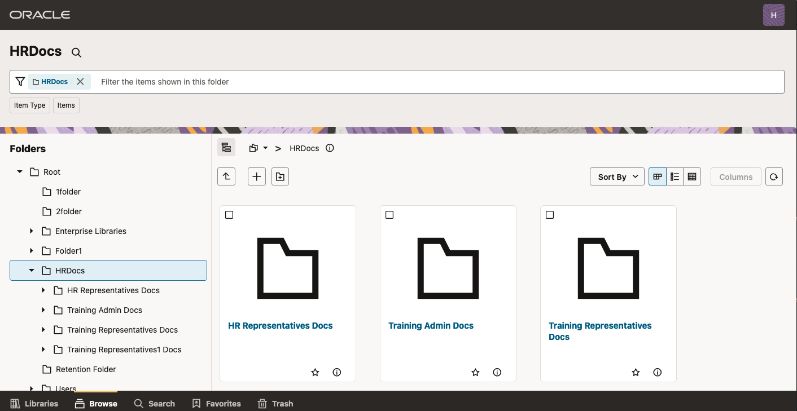
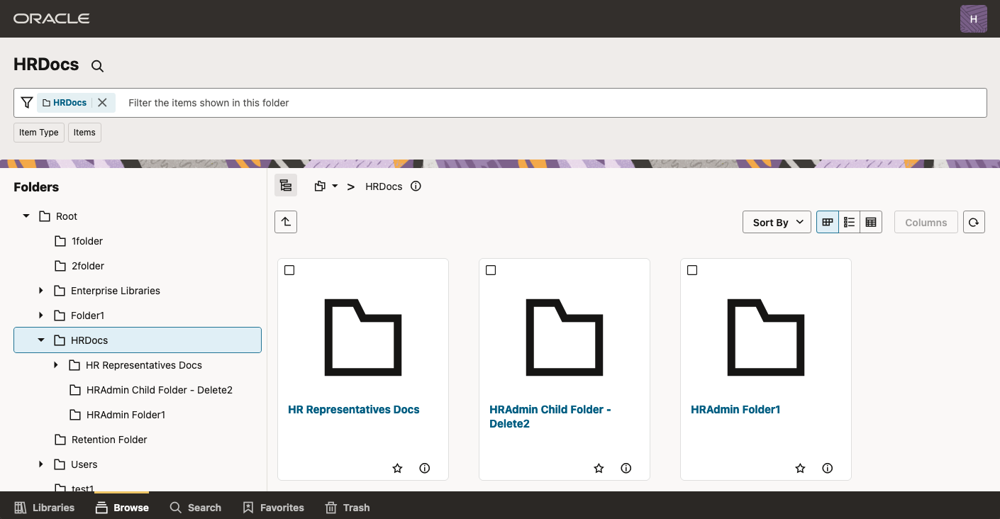
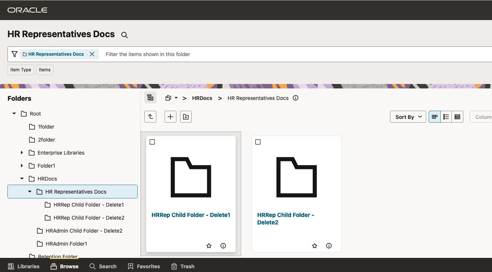
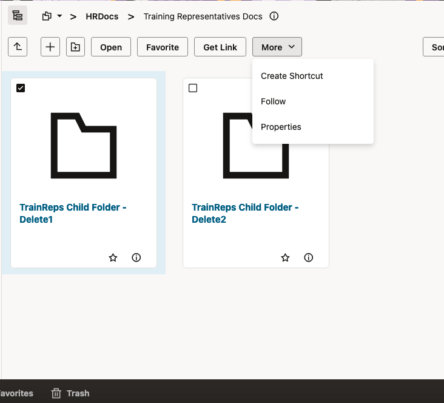
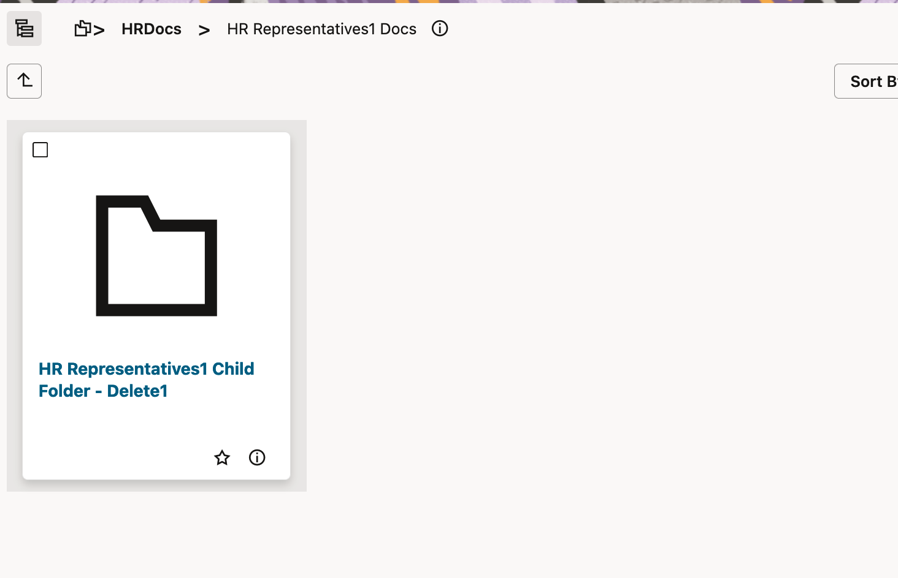

# Verify Security Privilege on the Folders and Files

## Introduction

This lab will show you how to validate different Security Privileges set on folders and documents.

**Estimated Lab Time**: *30 minutes*

### Objectives

- Validate Security group, Accounts and ACLs set on Folders and Documents.

### Prerequisites

This lab assumes you have:

- Access to WCC Marketplace Environment

This lab assumes you have completed:

- Lab: Initialize WCC Environment
- Lab: Create Users and Groups
- Lab: Create Security Groups, Roles, Aliases and Accounts
- Lab: Create Folders and Files and set Different Security Permissions

## Task 1: Verify folder access set by Security Group with RWDA permission

1. Login to WCC RedwoodUI as HRAdmin/Welcome1 and navigate to **root** > **HRDocs** folder
2. Verify you can see icon to create folder and upload document

3. Verify you can create a new folder and upload a new document
4. Click on checkbox to select the folder **HRAdmin Child Folder - Delete1** folder
5. Click **Delete** menu and delete the folder

## Task 2: Verify folder access set by Security Group with only R and RWD permission

1. Login to WCC RedwoodUI as HRRep1/Welcome1 and navigate to **root** > **HRDocs** folder
2. Verify you don't see icons to create folder and upload document

3. Click on checkbox to select the folder **HRAdmin Child Folder - Delete2** folder
4. Verify you don't see **Delete** menu

5. Navigate to **HR Representatives Docs** folder
6. Verify you can see icon to create folder and upload document

7. Verify you can create a new folder and upload a new document
8. Click on checkbox to select the folder **HRRep Child Folder - Delete1** folder

9. Click **Delete** menu and delete the folder

## Task 3: Verify folder access for the users not in security group

1. Login to WCC RedwoodUI as FinRep1/Welcome1 and navigate to **root** folder
2. Verify you don't see **HRDocs** folder

## Task 4: Verify folder access set by Account (User added to @Training\_R group in weblogic/IDCS)

1. Login to WCC RedwoodUI as TrainingRep1/Welcome1 and navigate to **root** > **HRDocs** > **Training Docs** folder
2. Verify you don't see icons to create folder and upload document

3. Click on checkbox to select the folder **TrainDoc Child Folder - Delete1** folder
4. Verify you don't see **Delete** menu

## Task 5: Verify folder access set by Account (User added to @Training\_RW group in weblogic/IDCS)

1. Login to WCC RedwoodUI as TrainingRep2/Welcome1 and navigate to **root** > **HRDocs** > **Training Docs** folder
2. Verify you can see icon to create folder and upload document

3. Verify you can create a new folder and upload a new document
4. Click on checkbox to select the folder **TrainDoc Child Folder - Delete1** folder
5. Verify you don't see **Delete** menu

## Task 6: Verify folder access set by Account (User added to @Training\_RWD group in weblogic/IDCS)

1. Login to WCC RedwoodUI as TrainingRep3/Welcome1 and navigate to **root** > **HRDocs** > **Training Docs** folder
2. Verify you can see icon to create folder and upload document

3. Verify you can create a new folder and upload a new document
4. Click on checkbox to select the folder **TrainDoc Child Folder - Delete1** folder
5. Click **Delete** menu and delete the folder

## Task 7: Verify folder access set by Account (User added to @Training\_RWDA group in weblogic/IDCS)

1. Login to WCC RedwoodUI as TrainingAdmin/Welcome1 and navigate to **root** > **HRDocs** > **Training Docs** folder
2. Verify you can see icon to create folder and upload document

3. Verify you can create a new folder and upload a new document
4. Click on checkbox to select the folder **TrainDoc Child Folder - Delete2** folder
5. Click **Delete** menu and delete the folder

## Task 8: Verify folder access set by Account (User not added to any of Training\_ groups in weblogic/IDCS)

1. Login to WCC RedwoodUI as TrainingRep4/Welcome1 and navigate to **root** > **HRDocs** folder
2. Verify you cant see **Training Docs** folder

## Task 9: Verify folder access set by User Access List

1. Login to WCC RedwoodUI as TrainingRep1/Welcome1 and navigate to **root** > **HRDocs** > **Training Representative1 Docs** folder
2. Verify you can see icon to create folder and upload document

3. Verify you can create a new folder and upload a new document
4. Click on checkbox to select the folder **TrainRep1 Child Folder - Delete1** folder
5. Click **Delete** menu and delete the folder

## Task 10: Verify folder access set by Group Access List

1. Login to WCC RedwoodUI as TrainingRep1/Welcome1 and navigate to **root** > **HRDocs** > **Training Representatives Docs** folder
2. Verify you can see icon to create folder and upload document

3. Verify you can create a new folder and upload a new document
4. Click on checkbox to select the folder **TrainReps Child Folder - Delete1** folder
5. Verify you don't see **Delete** menu

## Task 11: Verify folder access set by Role Access List

1. Login to WCC RedwoodUI as TrainingAdmin/Welcome1 and navigate to **root** > **HRDocs** > **HR Representatives1 Docs** folder
2. Verify you can't see icon to create folder and upload document

3. Click on checkbox to select the folder **HR Representatives1 Child Folder - Delete1** folder
4. Verify you don't see **Delete** menu

## Task 12: Verify Document access set by different ACLs

1. Login to WCC RedwoodUI as HRRep1/Welcome1 and navigate to **root** > **HRDocs** folder
2. Select checkbox against the file uploaded in **Lab 4: Create Folders and Files and set Different Security Permissions** > **Task 10: Upload document and Set Access List**
3. Verify you don't see **Move**, **Copy**, **Check In**, **Check out**, **Rename** and **Delete** menu

4. Login to WCC RedwoodUI as TrainingRep3/Welcome1 and navigate to **root** > **HRDocs** folder
5. Select checkbox against the file uploaded in **Lab 4: Create Folders and Files and set Different Security Permissions** > **Task 10: Upload document and Set Access List**
6. Verify you can see **Move**, **Copy**, **Check In**, **Check out** and **Rename** menu
7. Verify you don't see **Delete** menu

8. Login to WCC RedwoodUI as TrainingRep1/Welcome1 and navigate to **root** > **HRDocs** folder
9. Select checkbox against the file uploaded in **Lab 4: Create Folders and Files and set Different Security Permissions** > **Task 10: Upload document and Set Access List**
10. Click **Delete** menu and delete the file

This Completes this Live Lab.

### Learn More

- [Using Oracle WebCenter Content on Marketplace in Oracle Cloud Infrastructure](https://docs.oracle.com/en/cloud/paas/webcenter-content/webcenter-content-marketplace/index.html#provision-webcenter-content-stack)
- [Introduction To WebCenter Content](https://docs.oracle.com/en/middleware/webcenter/content/12.2.1.4/index.html)

## Acknowledgements

- **Authors-** Sujata Nayak, Consulting Member Technical Staff, Oracle WebCenter Content
- **Contributors-** Sujata Nayak, Senthilkumar Chinnappa, Mandar Tengse , Parikshit Khisty
- **Last Updated By/Date-** Sujata Nayak, December 2024
