# Configuring WebCenter Content Custom MetaData and Profile and Rules

## Introduction

This lab will guide you through the process of creating Custom Metadata,Profile,Profile Rule , Workflow(Criteria ) and User , Groups and role assignment for WebCenter Content Server.

- In this lab, we’ll use an insurance claims processing scenario to understand the concept better.
  - **Insurance Agent uploads a new policy document:**
    - Enters Customer ID, Policy Type, Coverage Limit, Term Length as metadata.
    - Assigns Policy Access security group so only authorized users can view/edit the document.

  - **Claims Officer processes a claim:**
    - Uses Claim No, Customer ID, Policy ID, Claim Type to search for relevant documents.
    - Assigns Approval Workflow for validation by the Risk Analyst.

  - **HR Manager updates employee records:**
    - Stores Employee ID, Job Title, Access Level with restricted access to the HR department.
    - Ensures only HR Access security group can edit records.

**Estimated Lab Time**: *40 minutes*

### Objectives

- Download and install Oracle WebCenter Content Administration Desktop Client.
- Create Custom Metadata.
- Create Profile.
- Create Profile Rule.
- Create Workflow(Criteria).
- User , Groups and Role Assignment.

### Prerequisites

This lab assumes you have:

- Access to WCC Marketplace Environment

Create the following before starting this lab

- Refer the lab 2 and create these user
  - Users
    - InsuranceAgent
    - PolicyAdmin
    - ClaimOfficer
- Refer the lab 3 and create these Security Groups and Roles.
  - Security Group.
    - CustomerAccess.
    - PolicyAccess.
    - HRAccess
  - Roles
    - PolicyAdmin.
    - InsuranceAgent.
    - HRManager
  - Refer the Lab 3 Task 5 to mapping Security Groups and Roles.
    - Map Security Group **CustomerAccess** - **PolicyAdmin**
      - Assign **Admin** permission to PolicyAdmin
      - Assign **Read,Write and Delete** permission to CustomerAccess
    - Map Security Group **PolicyAccess** - **PolicyAdmin**
      - Assign **Read,Write and Delete** permission to PolicyAdmin
    - Map Security Group **HRAccess** - **HRManager**
      - Assign **Read,Write and Delete** permission to HRManager

  - Refer the Lab 2 Task 3 to map group membership to the User in **IDCS/Weblogic** with the same name as **Roles**.
    - Map Role **PolicyAdmin** - **PolicyAdmin** and **InsuranceAgent** of IDCS user
    - Map Role **InsuranceAgent** - **ClaimOfficer**  of IDCS user
    - Map Role **HRManager** - **PolicyAdmin** of IDCS user

This lab assumes you have completed:

- Lab: Initialize WCC Environment
- Lab: Create Users and Groups
- Lab: Create Security Groups, Roles, Aliases and Accounts

## Task 1 : Create Custom Metadata

- To create Custom Metadata (Employee ID, Full Name,Policy Name etc) in WCC follow these steps:

1. Login to WebCenter Content Administration Desktop Client as user with Administrator Privilege.
2. Click on **Configuration Manager** Link
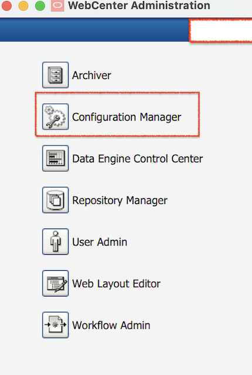
3. Click  **Information Fields - Add** button Configuration Manager  .
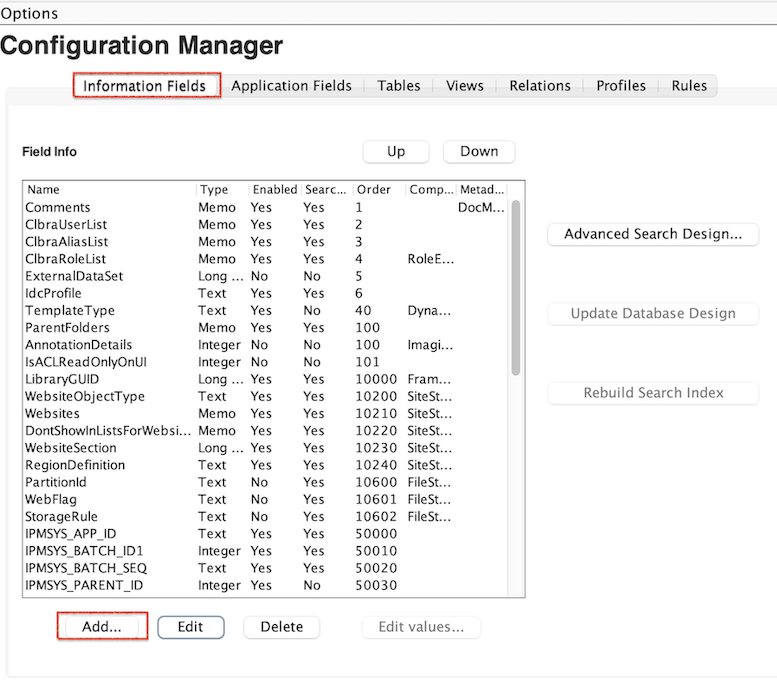
4. - **Field Name**: Enter field name as CustomerID then click Ok.
         ```
         <copy>CustomerID</copy>
         ```

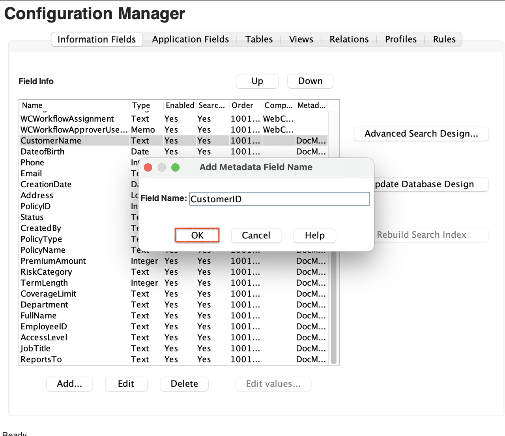
5. In Add **CustomerId** MetaData Field fill following details.

    - **Field Caption :** Name of the Field.
         ```
         <copy>CustomerID</copy>
         ```
    - Select Text as **Field Type** - Type of the Field.
        ```
         <copy>Text</copy>
         ```
    - MetaData Set - By default select **MetaData Set** as DocMetadata.
        ```
         <copy>DocMetadata</copy>
        ```

    - Give **default value** if required.
    - Click check box **Enable on User Interface**.
    - Click check box **Enable for Search Index** if required.
    - Finally click **ok** to Create CustomerId metadata.
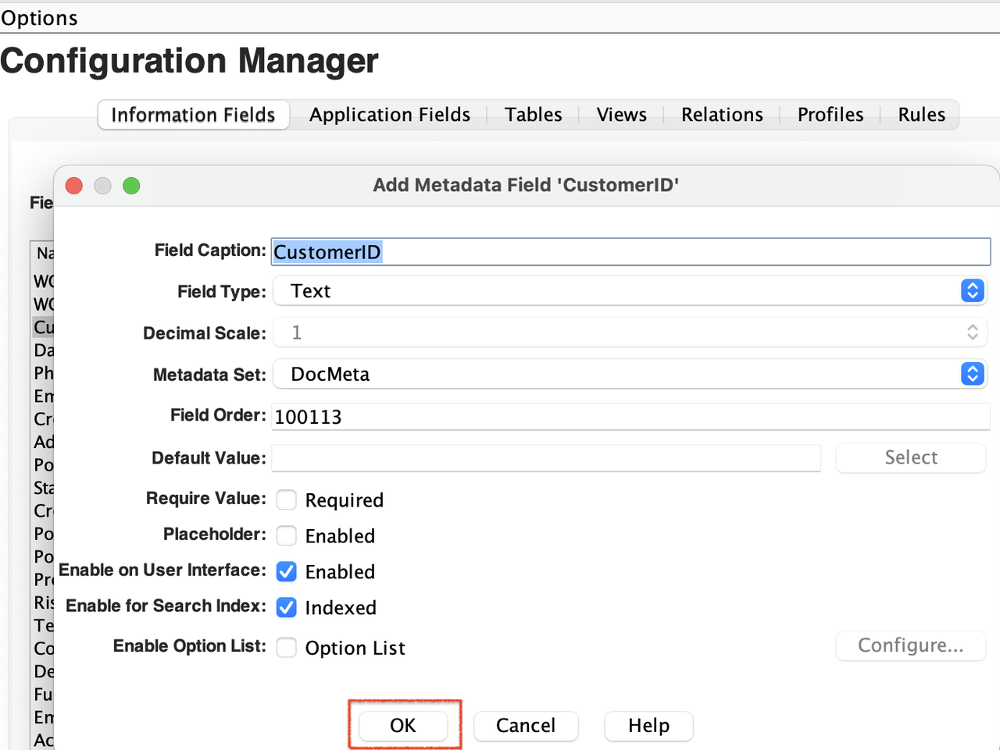

1. **Similarly to Add PolicyType MetaData Field as Dropdown (Option List), follow these steps:**

   - Repeat the previous  step 3 and 4 to add **Custom Metadata** using these info.
   - **Field Caption:** Name of the Field.
         ```
         <copy>PolicyType</copy>
         ```
   - Select Text as **Field Type** – Type of the Field.
          ```
          <copy>Text</copy>
          ```
   - **MetaData Set** – By default, select MetaData Set as DocMeta.
             ```
          <copy>DocMetadata</copy>
          ```
   - **Give default value** if required.
   - Click **Enable on User Interface** checkbox.
   - Click **Enable for Search Index** checkbox if required.
   - **To create LOV Values:**
     1. Click **Enable Option List** checkbox.
     2. After enabling the Option List checkbox, click **Configure** button.
    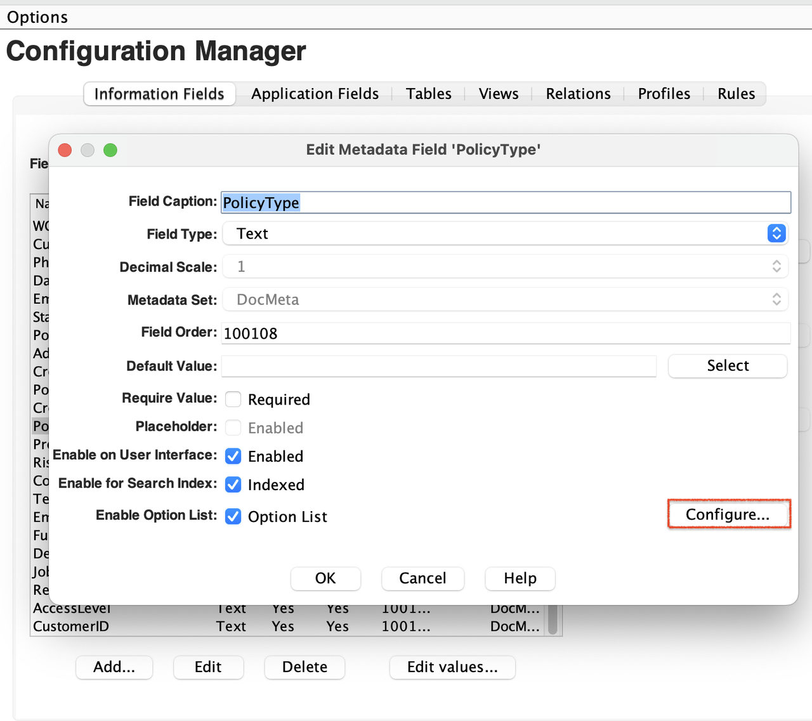
   - **Configure Option List:**
     - Once Option list edit config dialog opens please follow these steps.
     - Select **Select List Validated** in Option List Type LOV list
     - Click **Use option list** check box and type the name of the LOV.
     - Click **Edit** Button
        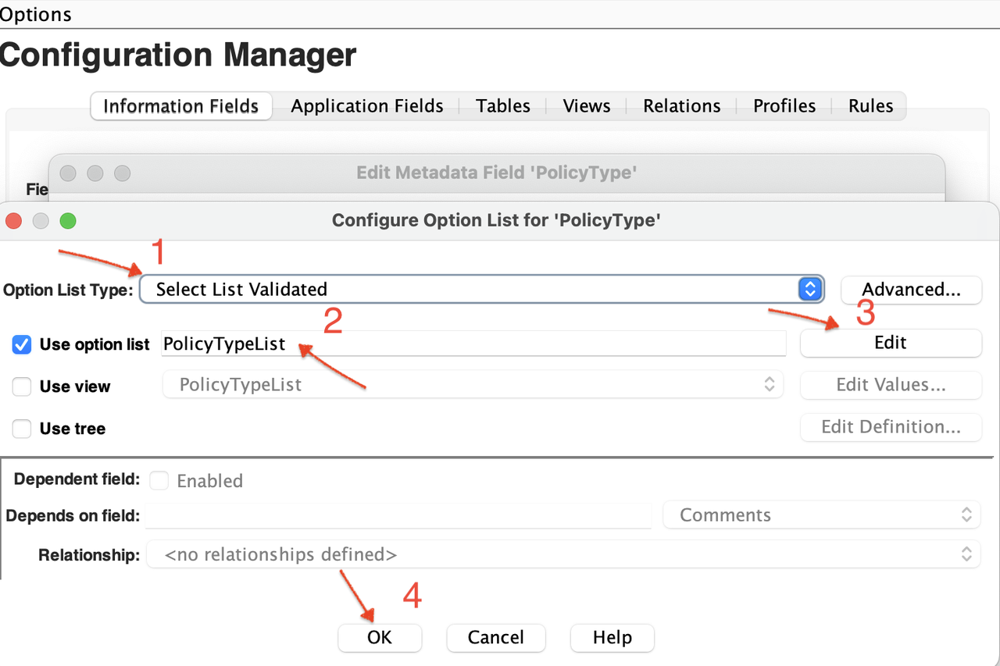
     - Enter the required options, such as 'Life Insurance,' in option drop-down
            ```
          <copy>Life Insurance</copy>
           ```
            ```
          <copy>Health Insurance</copy>
           ```
            ```
          <copy>Home Insurance</copy>
           ```
           ```
          <copy>Business Insurance</copy>
           ```
      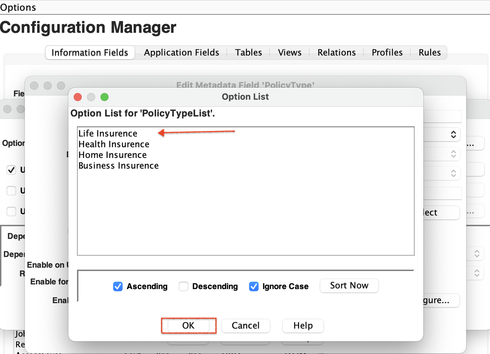
     - Repeat previous step for each additional value
     - Once all values are entered, press **Enter** again to finish.
     - Click **OK** to Create **Policy** Type LOV .

1. **Similarly to Add  Creation Date Date field follow these steps:**

- Repeat the previous  step 3 and 4 to add **Custom Metadata** using these info.
- Enter Fields Name as **CreationDate** Then Click **Ok**.
         ```
         <copy>CreationDate</copy>
         ```
- **Field Caption** - Name of the Field
         ```
         <copy>CreationDate</copy>
         ```
- Select **Date** as Field Type - Type of the Field
         ```
         <copy>Date</copy>
         ```
- **Metadata Set** - By default select MetaData Set as DocMeta
         ```
         <copy>DocMetadata</copy>
         ```
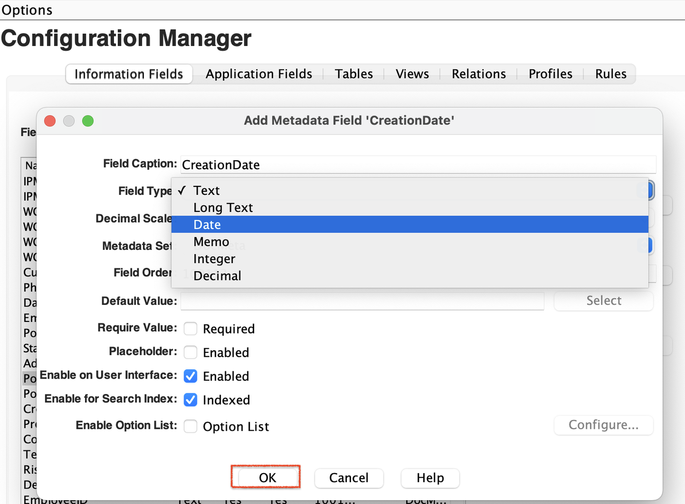
- Give **default** value if required.
- Click check box **Enable on User Interface**.
- Click check box **Enable for Search Index** if required.
- Finally click **ok** to Create CreationDate metadata

1. **Similarly  create following Metadata.**

- **Customer Profile MetaData**
Metadata Field | Definition | Field Type
--- | --- | ---
CustomerID | Unique identifier for each customer. | Text
CustomerName | Full name of the policyholder. | Text
DateofBirth | Customer’s birth date for policy verification. | Date
Phone | Customer’s registered contact number. | Integer
Address | Residential or official address of the customer. | Text
PolicyID | Unique identifier for an insurance policy. | Integer
Status| Current status of the customer’s policy (Active, Inactive, Lapsed). | Text
CreationDate | Creation date | Date
CreatedBy | User who created the Customer  | Text

- **Insurance Type Metadata**
Metadata Field | Definition | Field Type
--- | --- | ---
PolicyName | Name of the insurance policy (e.g., Life Insurance, Auto Insurance). | Text
PolicyType | Enum values: Life, Auto, Home, Health, Business. | Text (Enable Option List)
PremiumAmount | The cost of the insurance policy. | Integer
CoverageLimit | Maximum coverage provided by the policy. | Integer
TermLength | Duration of the policy (e.g., 10 years, 20 years). | Integer
RiskCategory | Classification of risk based on customer profile(Low Risk , Moderate Risk,High Risk,Property Risk etc).| Text (Enable Option List)

- **HR Department Metadata**
Metadata Field | Definition | Field Type
--- | --- | ---
EmployeeID | Unique identifier assigned to an employee. | Text
FullName | Employee’s full name. | Text
Department | The department the employee belongs to (e.g., Claims, Underwriting, IT).| Text (Enable Option List)
JobTitle | Designation of the employee within the company. | Text
Email | Official email address of the employee. | Text
PhoneNumber | Employee’s contact number. | Integer
AccessLevel | Defines the level of access (Read-Only, Edit, Admin). | Text (Enable Option List)
ReportsTo |Name or ID of the reporting manager. | Text

- Once you are done with creating all the metadata Click **Update Database Design** option wait for the operation to complete.
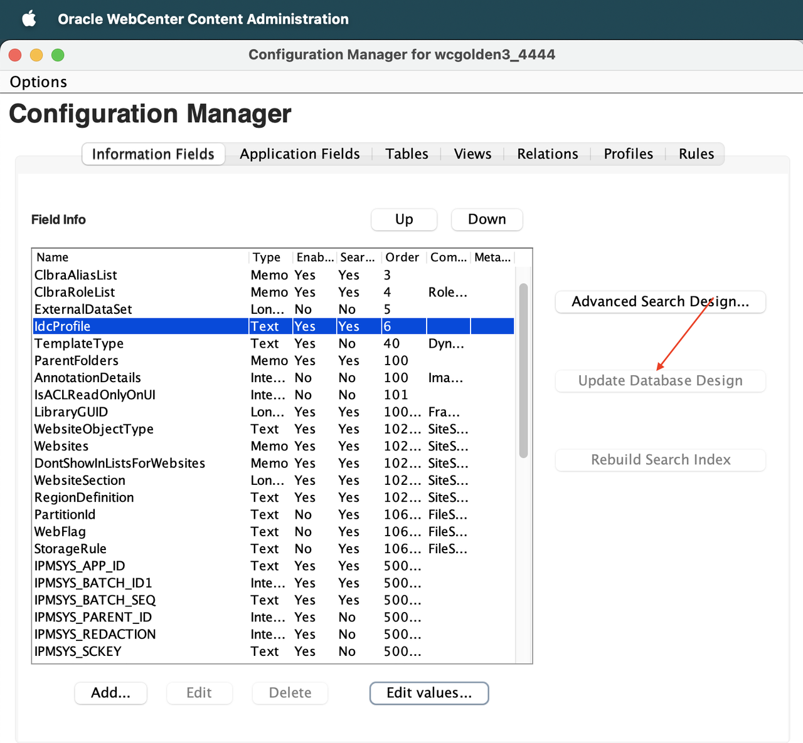
- This Completes Creating Custom Metadata Fields.

## Task 2 : Create Profile Rules

A profile consists of one or more rules and a trigger value. The rules determine how metadata fields are displayed on the Check In, Update, Content Information, and Search pages and if a rule is used (depending on how it is evaluated). Each rule consists of the following:

- A set of metadata fields.
- An optional activation condition.
- An option that indicates if it is a global rule and has a specified priority.
- An option that indicates if the metadata fields in the rule are grouped and if an optional header is used.

1. To create **Profile Rules** (CustomerProfileMetaData,InsuranceTypeMetaData,HRDepartmentMetadata) in WCC follow these steps

- Login to WebCenter Content Administration Desktop Client as user with Administrator Privilege.
- Click on **Configuration Manager** Link
  
- Click  **Configuration Manger** > **Rules**  button in Configuration Manager.
  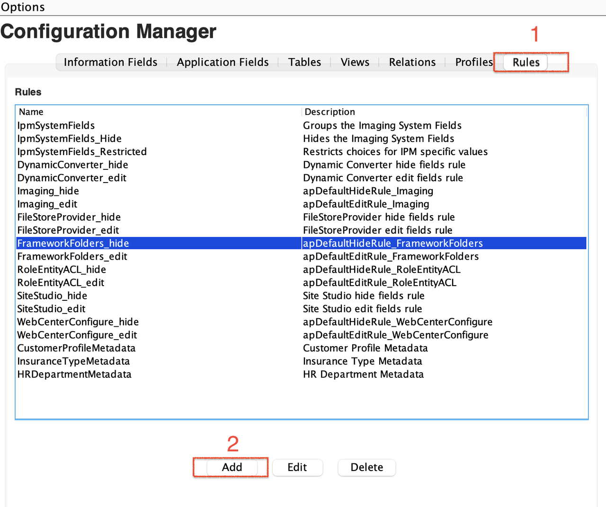
- **Enter the Name for the Rule.**
         ```
         <copy>CustomerProfileMetadata</copy>
         ```
- **Enter the Description for the Rule.**
         ```
         <copy>Customer Profile Metadata Rules</copy>
         ```
 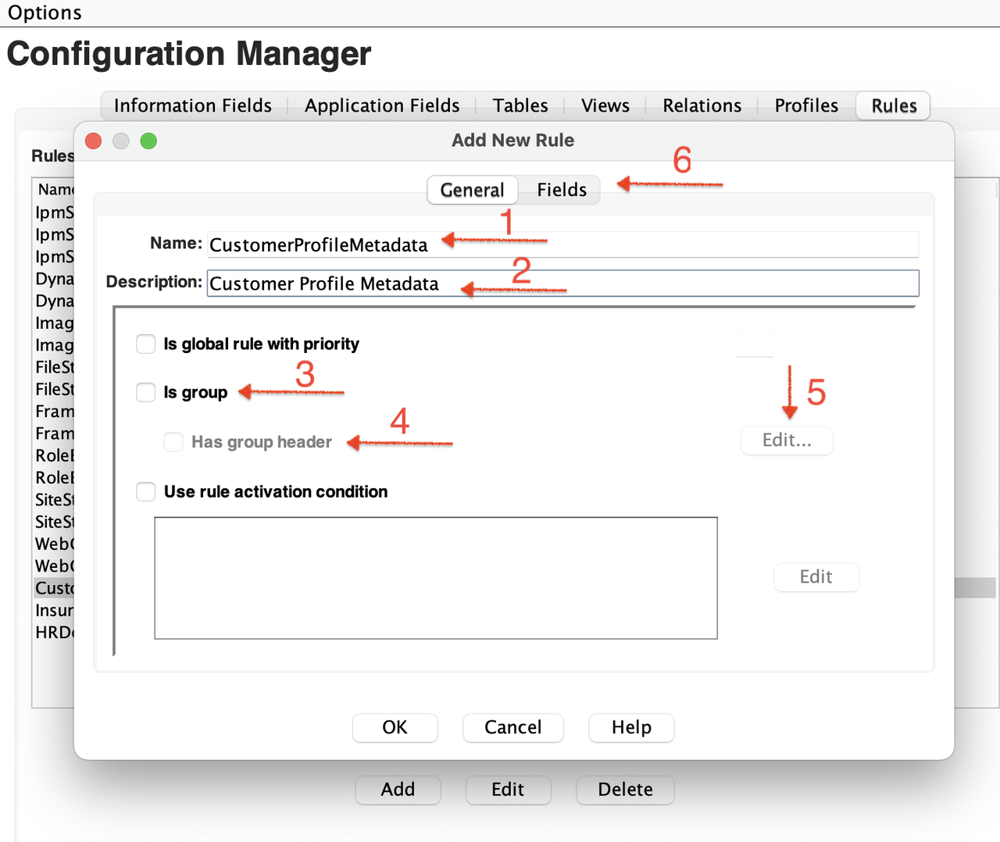

- Select **Is group** check box this will make this group metadata header to appear in the form while creating document using this Profile Rule
- Select **Has group header check box**
- Click **Edit** button to give name of header.
- Enter the **header name** in text box then click ok.
         ```
         <copy>Customer Profile Metadata Fields</copy>
         ```
 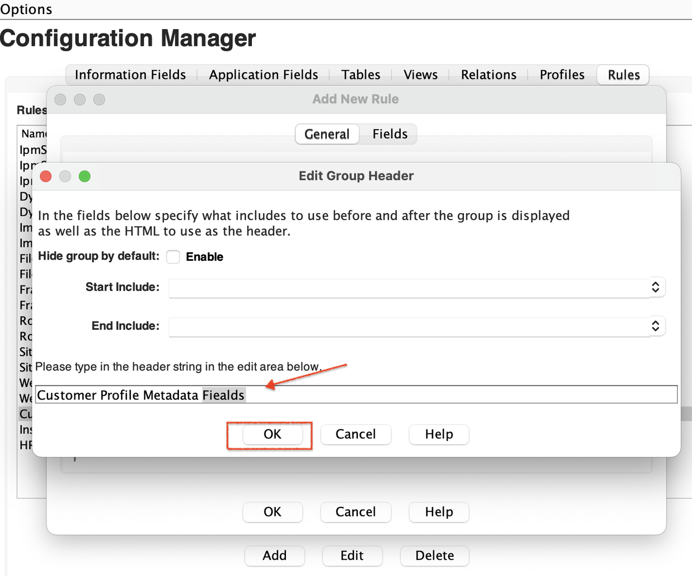

- An **activation condition** allows a change in the profile behavior based on different inputs. For example, a rule is not active for the search page or for a contributor, or certain fields are hidden or overridden on check in. Also, because profiles are activated during any check-in process, distinctions are made between a browser check in and a batch-load check in.
  - An activation condition for a rule on:
    - A system event: These include on-request events, on-submit events, and on-import events.
    - A user action: These include check in new, check in selected, content information, content update, and search.
    - A workflow state: These are contingent on if the content item is in a workflow.
    - A document type: These can use components based on document metadata fields.
    - A user type: These can use components based on user metadata fields.

- Click **Fields** add MetaData
  - Once the Edit Rule config screen open click **Add** button.
  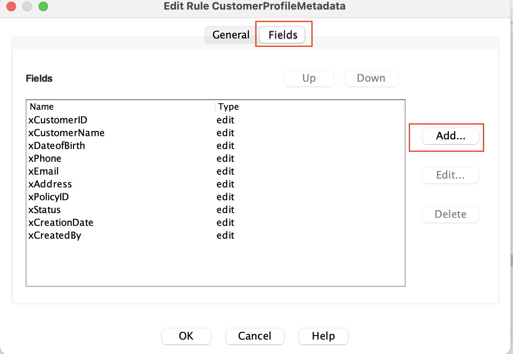
- Click **Display Information fields** check box to show custom metadata select.
- Select **Field Name** as **CustomerId** to add part of Rule.
- Select **top** as Field position (required): Adjusts the general placement order of the metadata field. Values are top, middle, and bottom.
- Once you select the both the values click **ok**.
  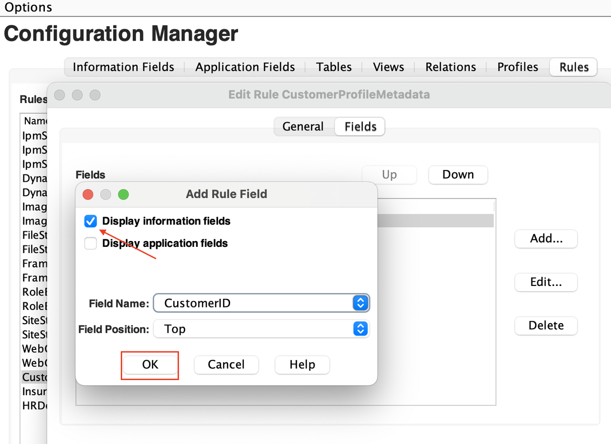
- Once you click **ok** there will other dialog will open here you can customize metadata details
- Select **Edit** as Field type (required): Determines how the metadata field is displayed on the Check In and Search pages.Values can be Edit, Info Only, Hidden, Excluded, or Required. If required, a message is also required.
- Click **Use custom label** check box the enter the field label this allow to customize the metadata label values .
         ```
         <copy>Customer ID</copy>
         ```
- **select Exclude field** from the group count checkbox this will exclude field count in the API Response
- **Default value (optional):** Displays a default value for the metadata field.
- **Derived value (optional):** Enables the metadata field to be set to a specified value on update or check in.
- **Has Restricted list (optional):** Allows the list metadata field to be restricted to either a specific list of values or to a filtered list of values.
- Once you enter the all the information click **ok** to add metadata to Profile Rule.
  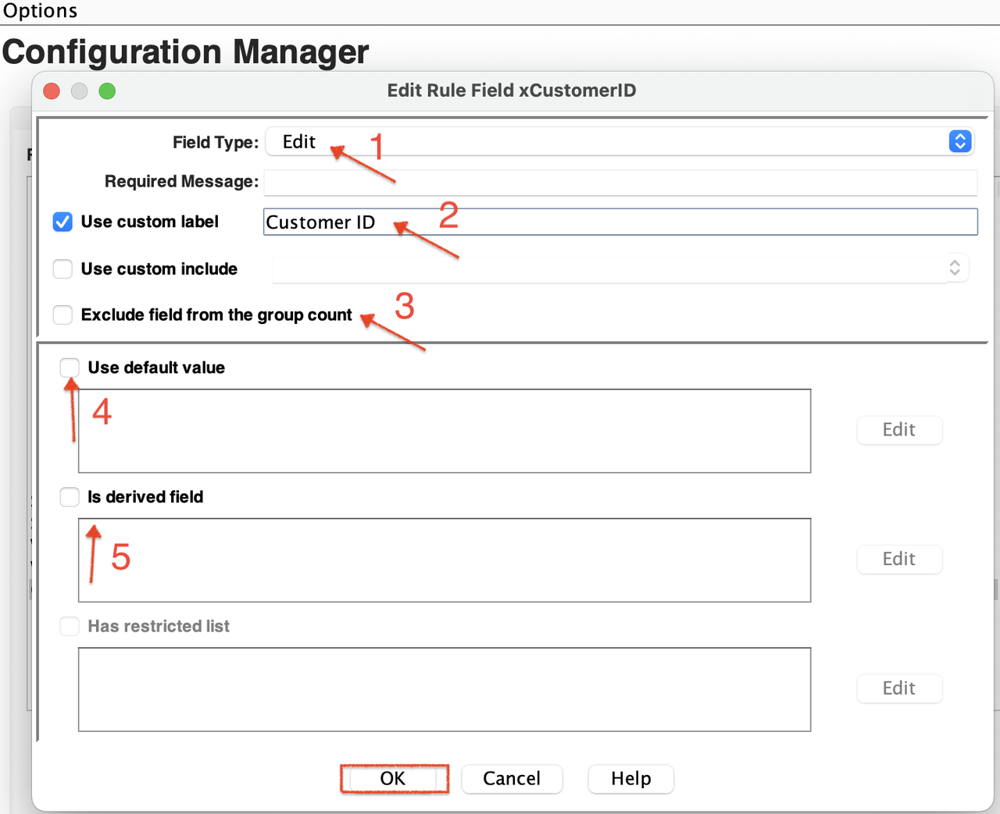
- Similarly, add all other metadata according to the Customer Profile Metadata by referring to the table below.

- **Customer Profile Metadata**
 Field Name | Field Position | Field Type | Use Custom Label
--- | --- | ---
CustomerName | Top | Edit | Customer Name
DateofBirth | Top | Edit | Date of Birth
Phone | Top | Edit | Phone
Email | Top | Edit | Email
Address | Top | Edit | Address
PolicyID | Top | Edit | Policy ID
Status | Top | Edit | Status
CreationDate | Top | Edit | Creation Date
CreatedBy | Top | Edit | Created By

- To Create similar Rule for Insurance Type MetaData and HR Department Metadata and Add the associated metadata to the rule.repeat above steps using the below table info

- **Insurance Type Metadata**
 Field Name | Field Position | Field Type | Use Custom Label
--- | --- | ---
CustomerID | Top | Edit | Customer ID
PolicyName | Top | Edit | Policy Name
PolicyType| Top | Edit | Policy Type
PremiumAmount | Top | Edit | Premium Amount
CoverageLimit | Top | Edit | Coverage Limit
TermLength | Top | Edit | Term Length
RiskCategory | Top | Edit | Risk Category
CreationDate | Top | Edit | Creation Date
CreatedBy | Top | Edit | Created By

- **HR Department Metadata**
 Field Name | Field Position | Field Type | Use Custom Label
--- | --- | ---
EmployeeID | Top | Edit | Employee ID
FullName | Top | Edit | Full Name
Department | Top | Edit | Department
JobTitle | Top | Edit | Job Title
Email | Top | Edit | Email
PhoneNumber | Top | Edit | Phone Number
Reports To | Top | Edit | Reports To
AccessLevel | Top | Edit | Access Level
CreationDate | Top | Edit | Creation Date
CreatedBy | Top | Edit | Created By

- This Completes Create Profile Rules task .

## Task 3 : Create Profile

Administrators can use content profiles to selectively include or reorder metadata fields to produce targeted Check In, Update, Content Information, and Search pages. Content profiles do not create or modify any Oracle WebCenter Content Server tables.They are simply used as a type of filter for what information is displayed.

After you create a content profile, it is always active. You can disable the link on the user interface, but the profile rules remain functional unless the profile is deleted.
A profile is composed of rules and a trigger value, which are set up on the Profiles and Rules tabs of the Configuration Manager page.
Administrators can create multiple content profiles and all are available to the end user. For each profile, the end user has a distinct check-in page and search page available. Although all profiles are visible to all users, each user can configure their user interface to hide or display links to specified profiles.

Content profiles are composed of the following:

- Rules: A rule consists of a set of metadata fields that determine if fields are editable, required, hidden, excluded, or read-only based on their criteria when specific conditions are met. You can change a rule's behavior based on an input, or activation condition. You can evaluate a rule for every profile (global), or you can evaluate the rule for specific profiles. For ease of use, you can use rules to group metadata fields under an optional header.
    For example, a profile's rules can determine the user type and, depending on the document type being checked in, ensure that only specific metadata fields are displayed. Rules must be established before a profile is created.
- Triggers: A trigger field is a metadata field that is defined on the Configuration Manager: Profiles tab. If a document matches a trigger value for a profile, then that profile is evaluated for the document. There can be an unlimited number of profiles, but only one trigger value per profile.

Although you create rules before you create triggers and profiles, it is necessary to know what your trigger is before creating rules.

- before creating profile please add these values.

- Login to WebCenter Content Administration Desktop Client as user with Administrator Privilege.
- Click on **Configuration Manager** Link
  
- Select **IdcProfile** Metadata and click **Edit Values**
  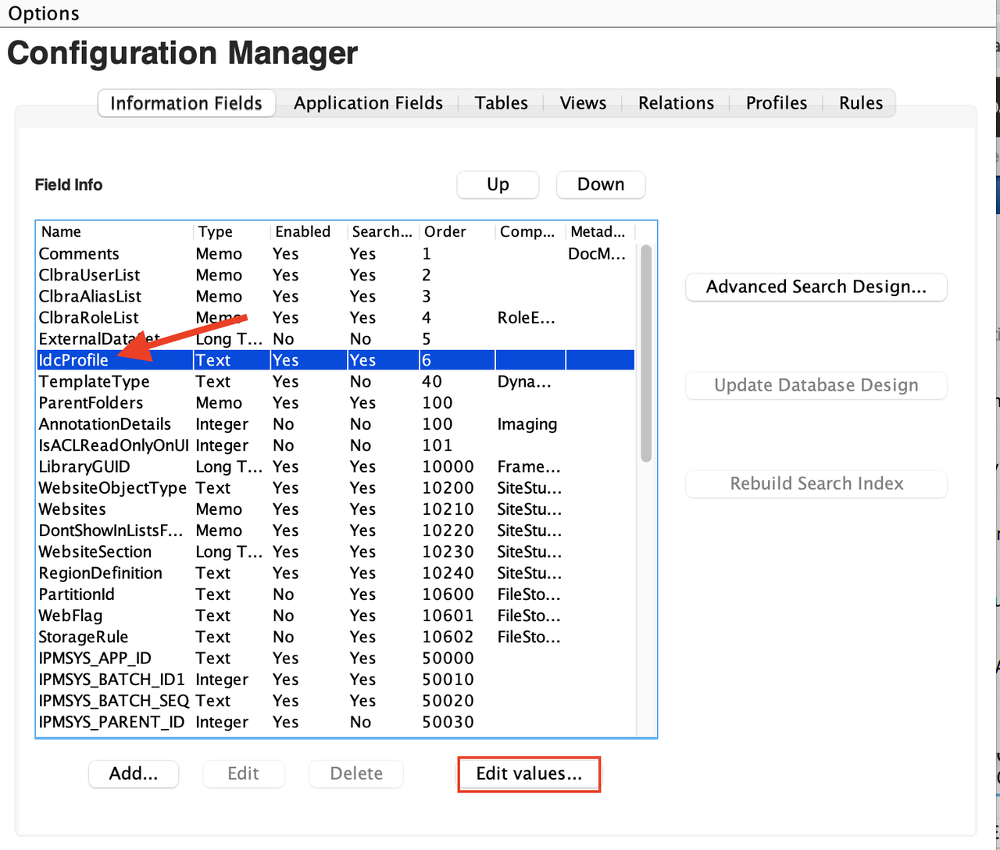
- Click **Add** to add the values
  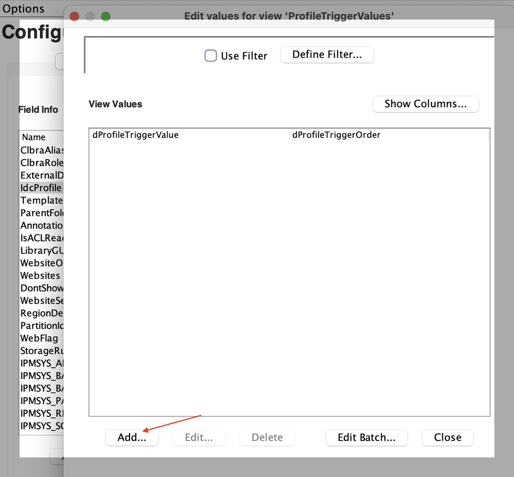
- Enter **DProfileTriggerValue** as
         ```
         <copy>Customer </copy>
         ```
- Enter **DProfileTriggerOrder** values as
         ```
         <copy>1 </copy>
         ```
- click **ok**
  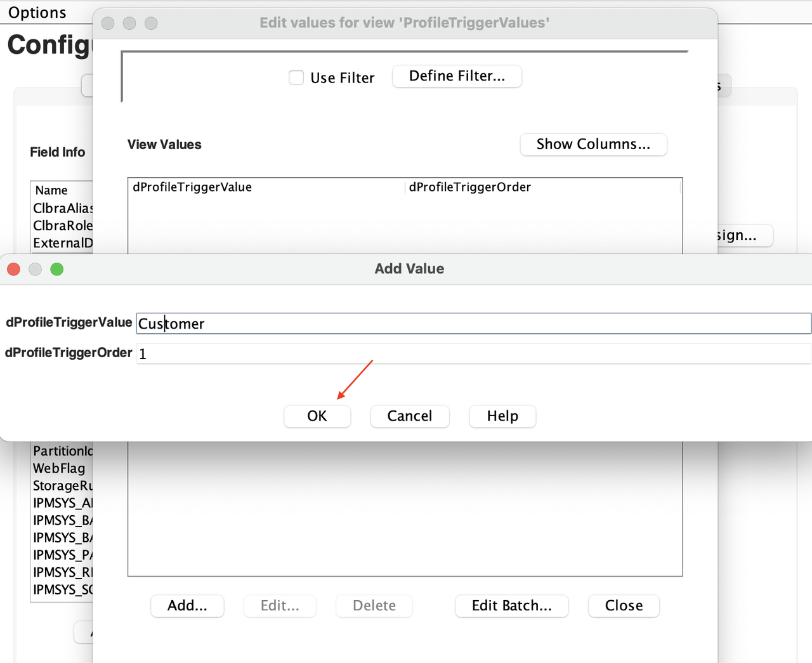
- Similarly Add values for **Insurance Type** and  **HR Department**
- Click **Close** once you are done.

To create a new profile:

- Login to WebCenter Content Administration Desktop Client as user with Administrator Privilege.
- Click on **Configuration Manager** Link
  
- Click  **Configuration Manger** > **Profile** button in Configuration Manager.
- Click **Add** button.
  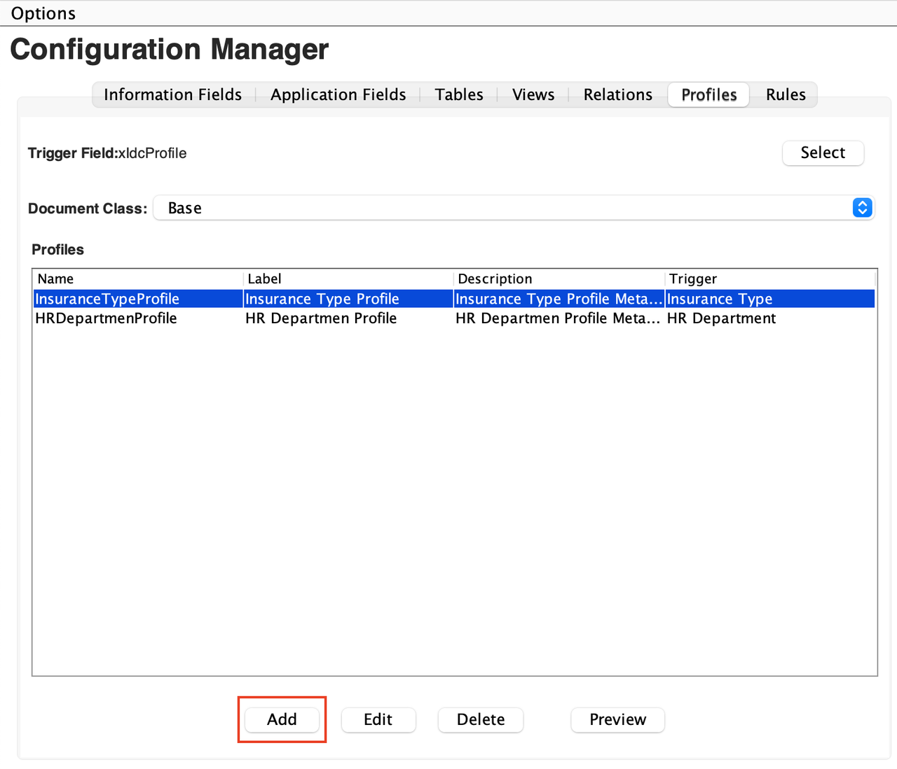

- Enter the **name** of the new profile and click **OK**.
         ```
         <copy>CustomerProfileMetadata </copy>
         ```
    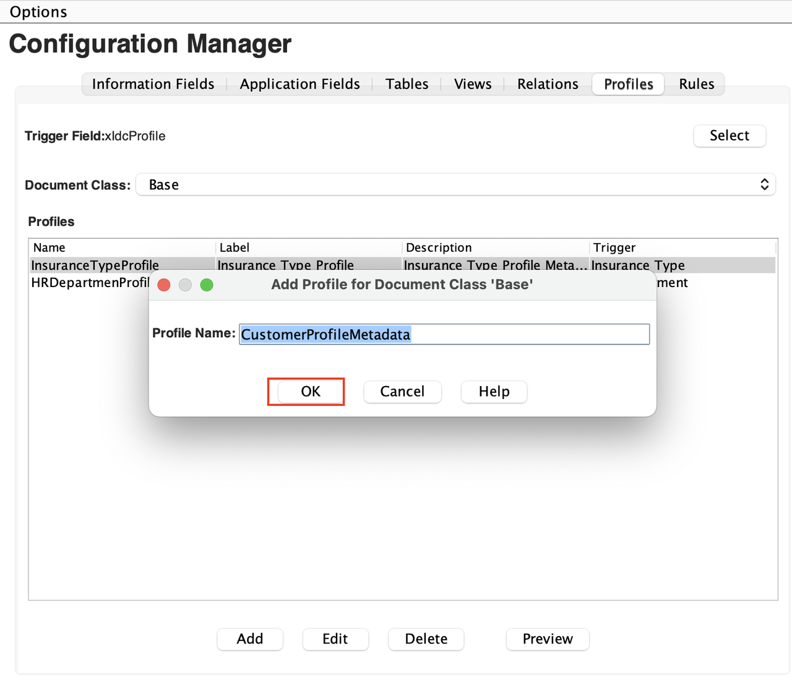
  - On the **Add/Edit** Profile page, enter the following information:
    - **Display label:** Specify how the profile is listed in menus.
            ```
                <copy>Customer Profile </copy>
             ```
    - **Description:** brief description of the profile.
                ```
                <copy>Profile for Customer Profile Metadata  </copy>
             ```
     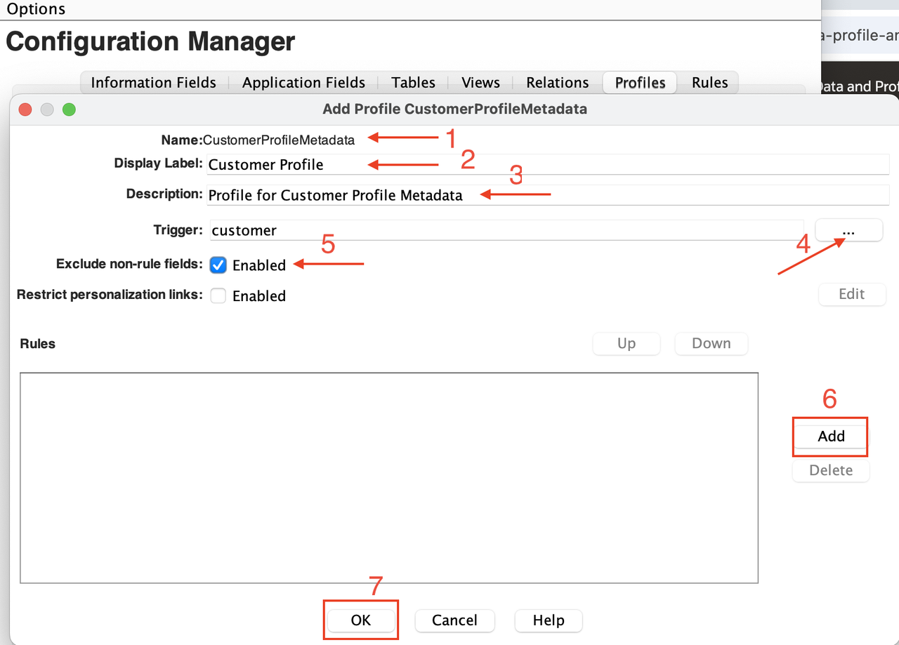
    - Click **Trigger** drop downs field and select **Customer** value in option list, click **ok**.
    
    - **Exclude non-rule fields:** Select check box to exclude all metadata fields that do not belong to the rules included in the profile.
    - **Restrict personalization:** This Option used in  check in or search links to a particular user or group of users. Idoc Script code based on user information is entered into the Profile Links page and must evaluate to true before a link is displayed. If deselected (default), all links are displayed for all users by default unless evaluated by another profile.
    - Click **Add** to include rules in the new profile.
    - On the Add Rule in Profile page, select **CustomerProfileMetadata** rules from the list.
    - select **Top** value lov value from Rule Priority field.
    - Click **OK**.
      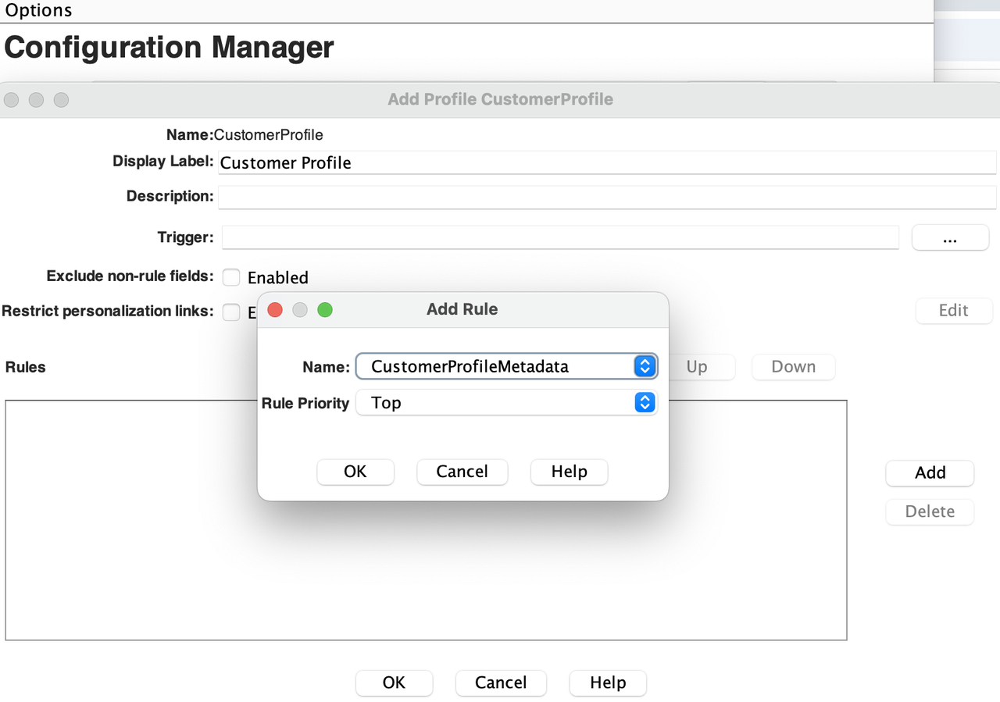
    > *Note:*
    - *You cannot add rules to the profile until you create and define them using the Configuration Manager: Rules tab.*
    - *To adjust the placement order of the rules in the list by pressing the Up or Down button.*
    - *The position of each rule in the list is relevant to its priority in the evaluation process. The general position (top, middle, or bottom) in the list is established when the rule is initially added to the profile.*
    - *The buttons further refine the placement by moving the rule to a more precise position.*

- Finally click **ok** to create new profile.
- The new profile is included in the Profiles list on the Profiles tab.

- Similarly create **Insurance Type Metadata** profile and **HR Department Metadata** profile.
  - for Insurance Type Metadata profile
    - select trigger value as **Insurance type**
    - Select rule as **InsuranceTypeMetadata**
  - for HR Department Metadata profile
    - select trigger value as **HR Department**
    - Select rule as **HRDepartmentMetadata**

- This Completes Create Profile task .

## Task 4 : Create Workflows

- A workflow specifies how to route content for review and approval before it is released to the system.
- The workflow notifies users by e-mail when they have a file to review. For information about workflow types and uses
- Designing an effective workflow is an iterative process. After initial planning, workflows are refined as the process is implemented.
- Good planning in the beginning can reduce the amount of rework.
- This Completes this Live Lab.

There are three types of workflows:

- A basic workflow defines the review process for specific content items, and must be initiated manually.
- A criteria workflow is used for content that enters a workflow automatically based on metadata that matches predefined criteria.
- A sub-workflow is initiated from a step in another workflow and is created in the same manner as criteria workflows. Sub-workflows are useful for splitting large, complex workflows into manageable pieces.

Steps define the process and the functionality of the workflow. Each workflow can include multiple review and notification steps with multiple reviewers to approve or reject the content at each step. For each step in a workflow, a set of users and a step type are defined.

The users defined for a step can perform only the tasks allowed for that step type.

Step Type | Description
--- | ---
Contribution | The initial step of a Basic workflow. Administrators define the contributors when the workflow is created.
Auto-Contribution | The initial step of a Criteria workflow. There are no predefined users involved in this step. The contributor who checks in a content item that enters the workflow process automatically becomes part of the workflow.
Review| Users can approve or reject the content; editing is not allowed. You can also specify that the user must approve and sign the content with an electronic signature.
Review/New Revision | Users can edit the content if necessary then approve or reject it, creating a new revision.
Review/Edit Revision | Users can edit the content if necessary then approve or reject it, maintaining the revision.

After a workflow is enabled, it goes through several specific stages:

- When a content item is approved by the minimum number of reviewers for a particular step, it goes to the next step in the workflow. If the step is defined with 0 approvals required, the reviewers are notified, but the content goes to the next step automatically.
- If any reviewer rejects the content, it goes back to the most recent Review/Edit Revision or Review/New Revision step. If there is no such step, the content goes back to the original author.
- Depending on how the edit criteria is defined, the most recent Review/Edit Revision or Review/New Revision step can result in a new revision or an updated revision.
- A revision can be released:

To create Workflow in WCC follow these steps

- Login to WebCenter Content Administration Desktop Client as user with Administrator Privilege.
- Click on **Workflow Admin**
 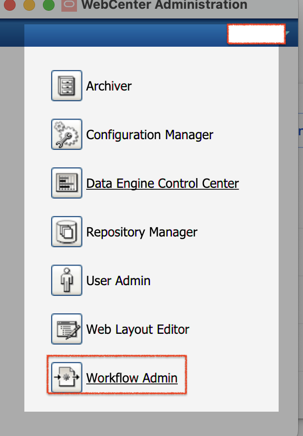
- Click the **Criteria** tab.
- Click **Add** Button.
 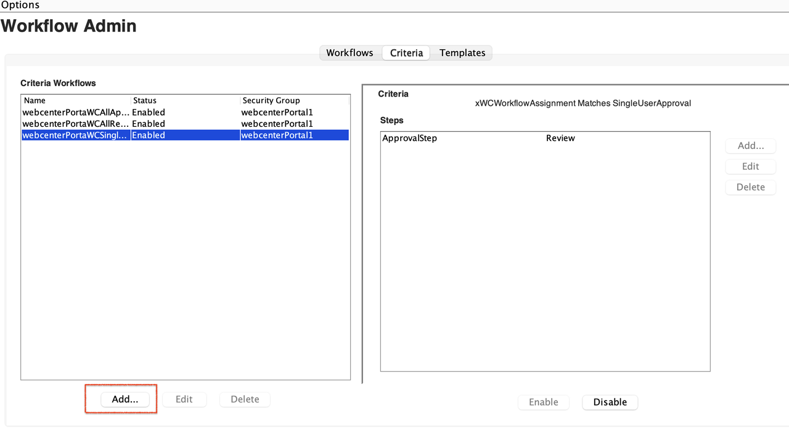
- On the **New/Edit Criteria Workflow page**, enter a **name** in the Workflow Name field. Maximum length is 30 characters. Special characters (; @&, and so on) are not allowed. You cannot change the workflow name after the workflow is created.
            ```
                <copy> CustomerPolicyManagement </copy>
             ```
- Enter a detailed description for the workflow in the **Description** field.
            ```
                <copy> Manages insurance policy documents uploaded by agents </copy>
             ```
- Select the **Security Group** from the list.
           ```
                <copy> CustomerAccess  </copy>
             ```
- Select **Edit Revision** option from **Original Author Edit Rule** - original author can edit the revision or create a new revision if the item is rejected.
 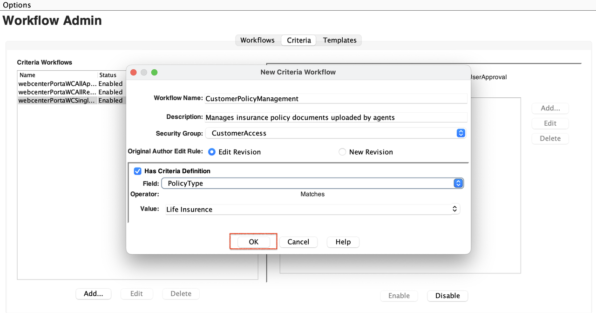

- To create a Criteria workflow, select the **Has Criteria Definition** check box.
- For a Criteria workflow, to define the criteria by choosing the appropriate **Field, Operator, and Value. Field values** include PolicyType, Author, Type, Account and any custom metadata of type Text or Long Text.
- for our example select **policyType** in field drop down.
- Enter the **operate** **value**
           ```
                <copy> Life Insurance </copy>
             ```
- Click **OK**.

- Create steps or to add another step, click **Add** in the right pane of the Workflow Admin page.
 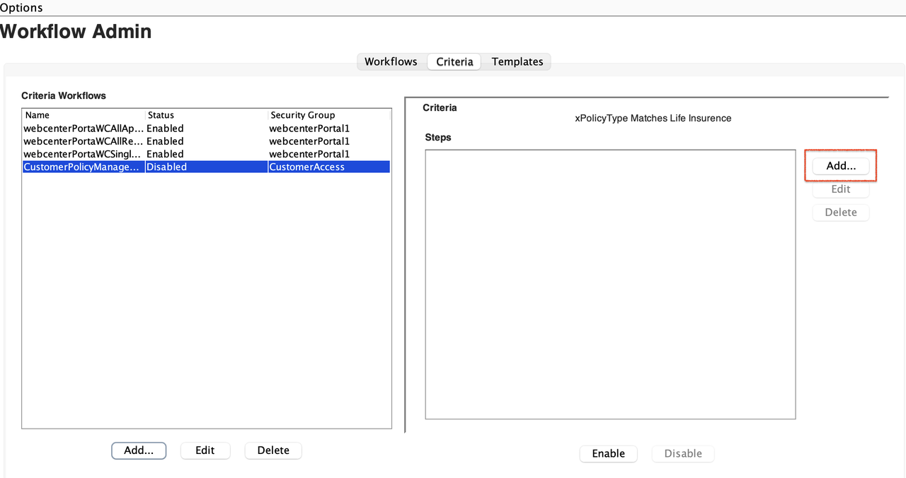
- On the **Add New/Edit Step page**, enter an appropriate **Name** for the step. You cannot change the name after the step is created. The name is usually descriptive of the step (for example, EditorialReview or TechnicalReview).
         ```
                <copy> VerifyClaimDetails </copy>
             ```
- Enter a **Description** for the step.
         ```
                <copy> Verify the Claim Details Submitted by the user </copy>
             ```
  - Specify the **authority** level of the users for the step:
    - Users can review the **current revision**: Users can approve or reject the revision but cannot edit the revision.
    - Users can **review and edit (replace) the current revision**: Users can edit the revision, approve it, or reject it. An edit does not update the revision.
    - Users can **review the current revision or create a new revision**: Users can edit the revision, approve it, or reject it. An edit updates the revision. This option preserves the original content and provides an audit trail of changes.
  - For our example select the **Users can review and edit (replace) the current revision**
  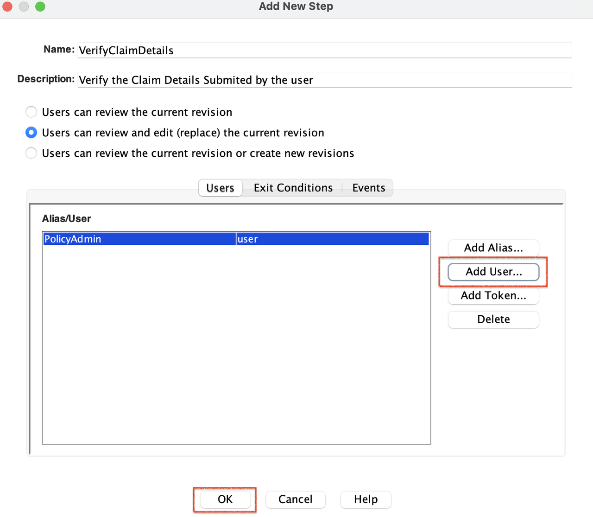
  - Select the type of **users** to be added to the step. Multiple types can be defined:
    - To add individual user, click **Add User**.
    - To narrow the list of users, search for the user and select **PolicyAdmin**  User.
    - click **OK**.
  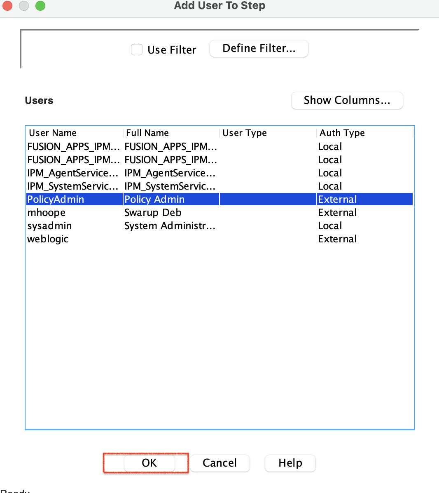
  - Another option to add users is available—this step is not mandatory and is for knowledge purposes only.
    - To add a group of users defined by an alias, click **Add Alias**. On the Add Alias to Step page, choose the alias from the displayed list.

- Click **OK**.
- To create one more  **step** by repeating above **add user** steps using these details
  - enter **Name** for the step
         ```
                <copy> InsuranceClaimsProcessing </copy>
             ```
  - Enter a **Description** for the step.
           ```
                <copy> Claim Officer verify  claim submitted for customer's policy </copy>
             ```
  - select authority as **Users can review and edit (replace) the current revision**
   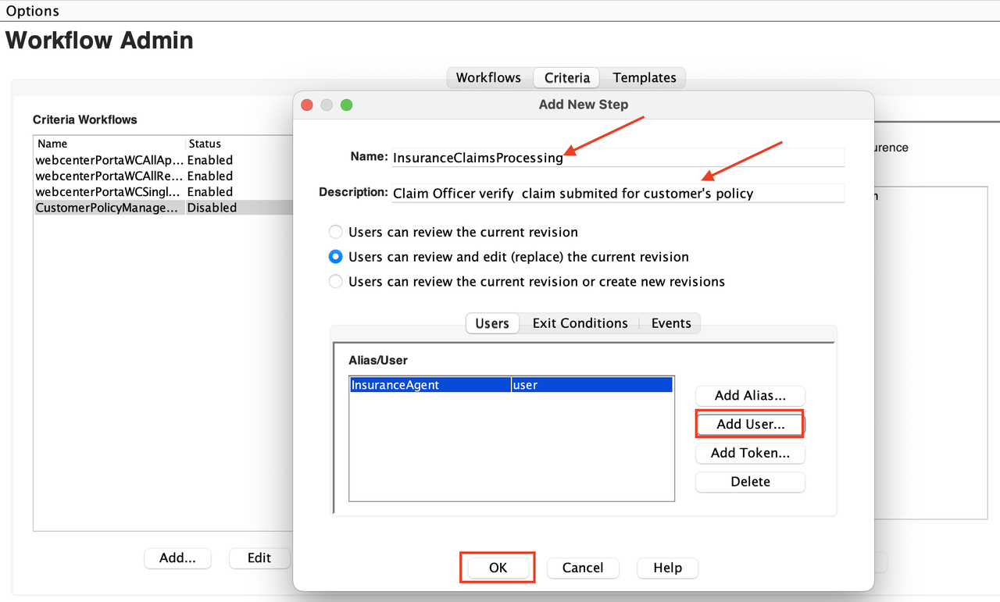
  - select  **InsuranceAgent** as user in add user step
    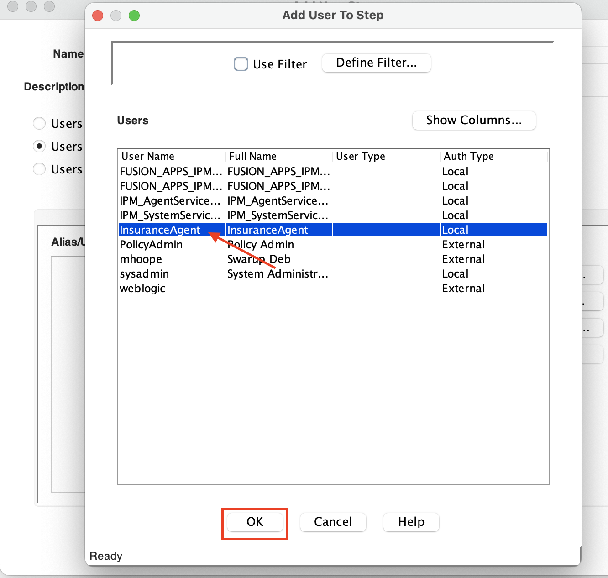
  - Click **ok**
<!-- - Click the **Exit Conditions tab**.
  - Specify how many reviewers must approve the revision before it passes to the next step.
    - To require approval by all reviewers, select **All reviewers**.
    - To specify a minimum number of reviewers who must approve the revision, select At least this many reviewers and enter the number.
     
  - Typically, exit conditions are useful when metadata could be changed by an external process during the workflow step. Use the following instructions if the step requires additional exit conditions to pass to the next step:
    - Select the **Use Additional Exit Condition check box**.
    - Click **Edit**.
    - On the Edit **Additional Exit Condition page**, select a workflow condition or a metadata field from the Field list.
    - Select an operator from the **Operator list**. Operator is a dependent choice list that shows operators associated with the Field.
    - Select a value from the **Value list**. Value is a dependent list based on the option chosen as the Field.
    - Click **Add** to add the conditional statement to the Condition Clause. The clause appears in the Condition Clause box. You can append multiple clauses with AND statements.
    - Repeat for as many conditions as required. To modify an expression, select it in the Condition Clause box, change the Field, Operator, or Value, and click Update.
    - To modify the condition expression, select the **Custom Condition Expression** check box and edit the script (for example, use OR not AND for a condition). The additional exit conditions must be Idoc Script statements that evaluate to true or false. Do not enclose the code in Idoc Script tags <$ $>.
    - Caution:
      - If **Custom Condition Expression** is deselected, the expression reverts to its original definition and all modifications are lost.
    - Click **OK**.

- If the workflow requires conditional steps or special processing, click the **Events** tab and add the appropriate scripts. For more information, see **Creating a Jump**.
     
- Click **OK.** -->

To **Add**, **edit**, and delete steps as necessary to complete the workflow.

- To **add** another step to the workflow, repeat previous steps.
- To **edit** an existing step, select the step and click Edit.
- To **delete** an existing step, select the step and click Delete.

Ensure that the **correct workflow** is selected in the left pane, and click Enable.
 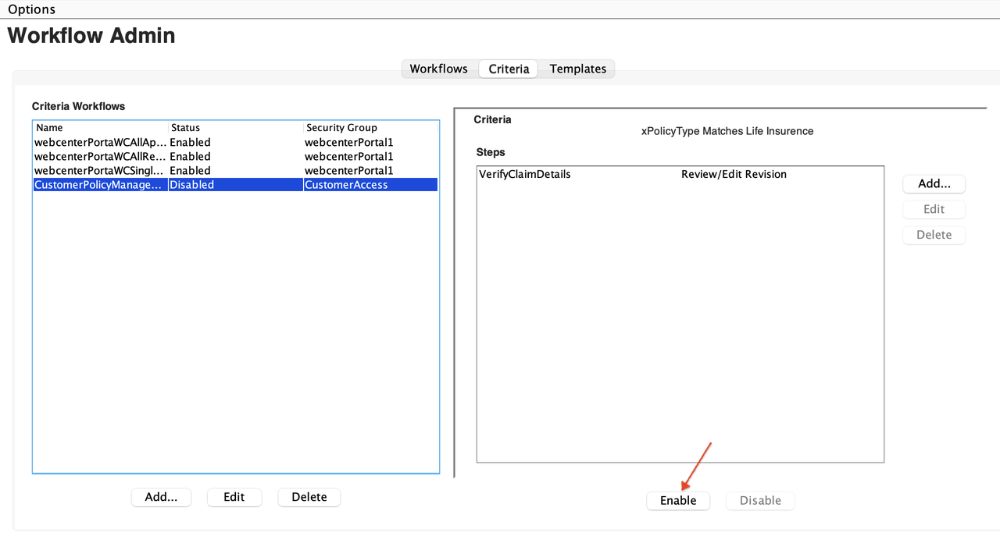

- On the confirmation page, click **Yes** to activate the selected workflow.

## Task 5 : Verify Custom Metadata Profile Rule and Profile and Workflow created so for

Verifying What We Have Created So Far, Follow the steps below to verify the configurations and workflows set up in Oracle WebCenter:

- Login to **WebCenter**  Redwood UI
  - Check the Created Profiles
    - Click **Upload** button in the top-left corner
   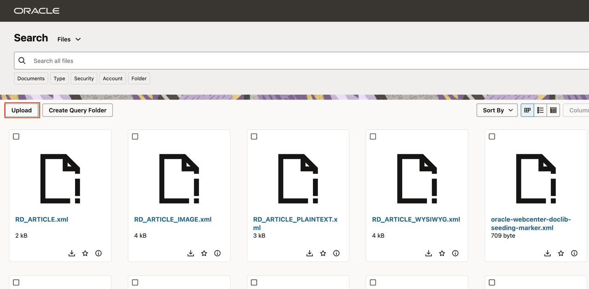
    - You should see the profiles created so far listed here.
    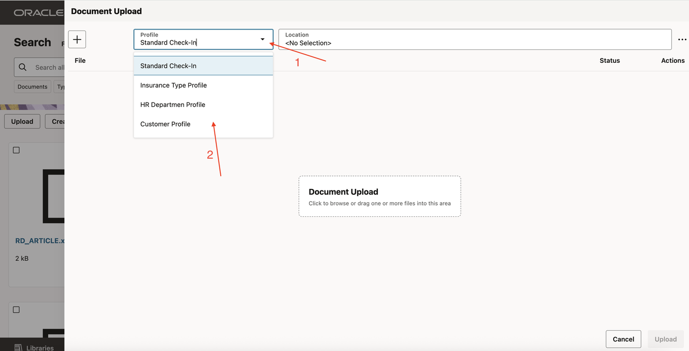
  - Check Custom Metadata created so for
    - Click **Upload** button in the top-left corner
    - Select **Customer Profile**  on the left-hand side of the profile drop-down menu.
    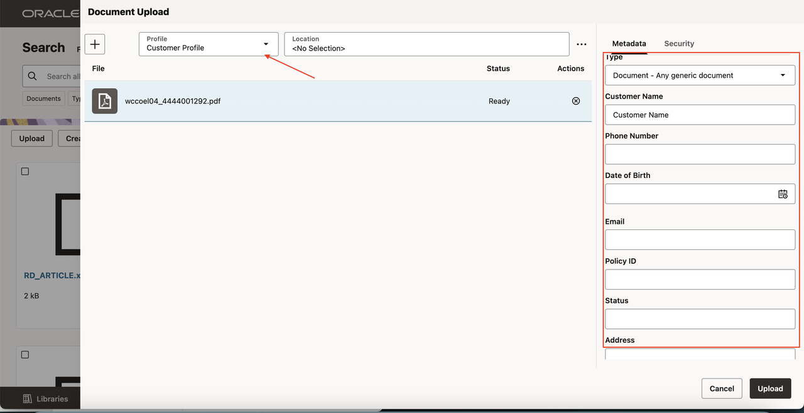
    - Ensure the custom metadata fields created based on the profile rules are displayed.
    - Similarly, change the profile dropdown values and verify that the corresponding profile metadata is displayed based on the profile rules.
  - Verify the Workflow
    - Click **Upload** button in the top-left corner
    - Select **Customer Profile**  on the left-hand side of the profile drop-down menu.
    - Add (+) button at the top or clicking the “Document Upload” prompt in the center of the drawer. Alternatively, you can drag files from your desktop in to the drop area.
    - Fill in the required information on right side metadata fields
    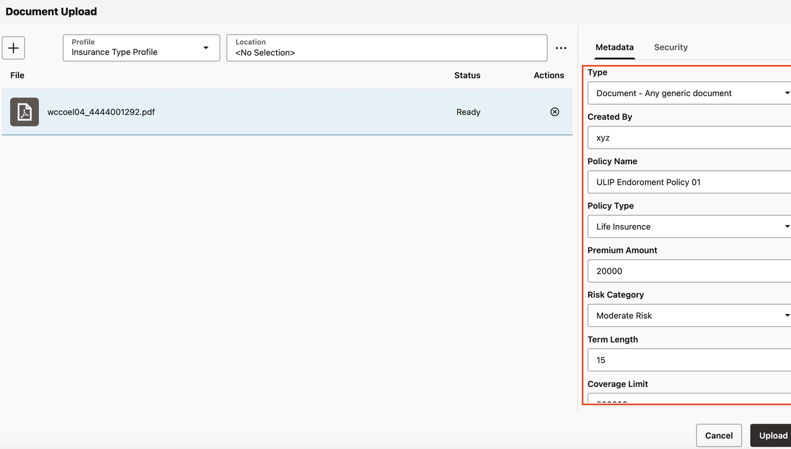
      - Ensure the following selections:
        - Select Policy Type: **Life Insurance**
         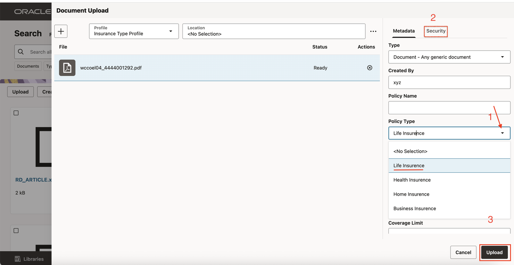
        - Click on **Security** Tab
         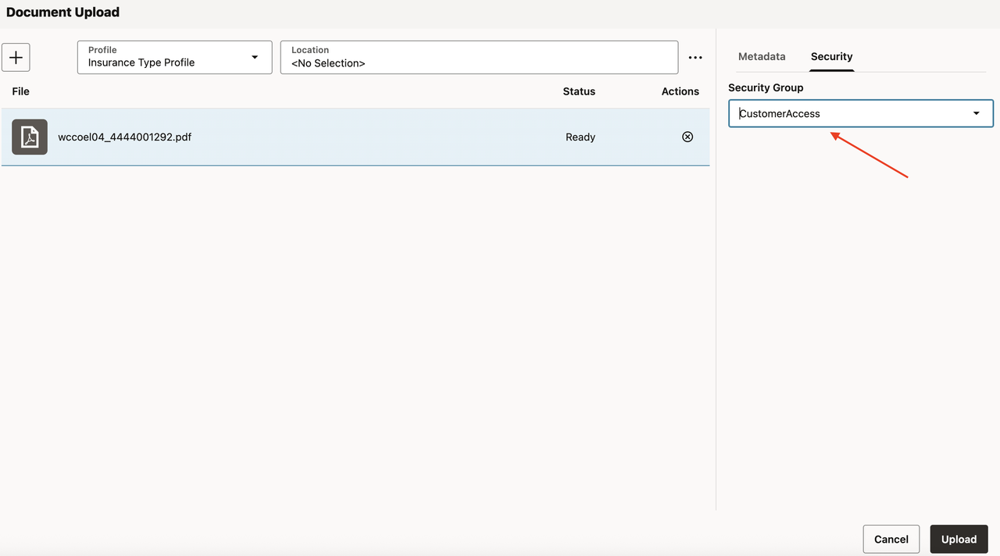
        - select Security Group: **CustomerAccess**
    - Click **Upload** button, the document should complete the check-in process.
    - The document should now be routed into the workflow.
    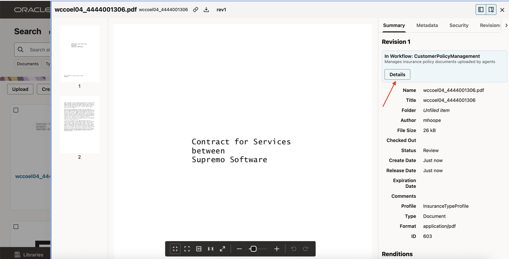

Verify document assigned to workflow configured user

- Login as the Workflow Approver(**Policy Admin** User)
- Click on **brand logo** on left corner of screen
- Click on **Content In Workflow**
  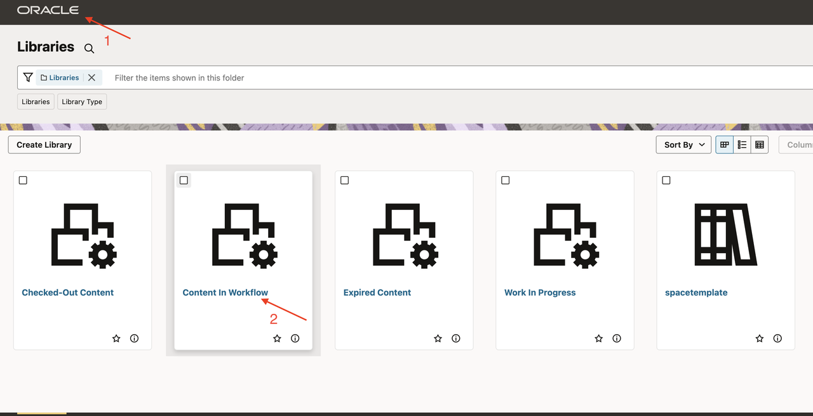
- You should see the checked-in document assigned to the PolicyAdmin role through the workflow.

To verify that a document assigned to a workflow-configured user is not accessible to other users, follow these steps.

- Login as the **ClaimAdmin** (User who does not have access to workflow)
- Click on **brand logo** on left corner of screen
- Click on **Content In Workflow**

- Verify you don't see the checked-in document assigned to the PolicyAdmin role through the workflow.

This Completes Create Workflows task .

## Task 6 : Restricting Profile Values in Search and Check in

When a profile is enabled on the Edit Content Profile Links page, the profile is available from the Search and New Check In menus on the toolbar.

- If no profiles are enabled for display, the Search and New Check In menus become direct links to the Advanced Search page and standard Content Check In Form, respectively.
- After a profile has been created, it appears in the Search and New Check In menus on the toolbar after refreshing the browser session.
- By default, all profiles are listed as options under both menus. However, not every user is authorized to use all of the listed profiles.

Login to WebCenter Content Administration Desktop Client as user with Administrator Privilege.

- Click on **Configuration Manager** Link
  
- Click  **Configuration Manger** > **Profile** button in Configuration Manager.
- Select **CustomerProfileMetadata** and Click **Edit** button.
  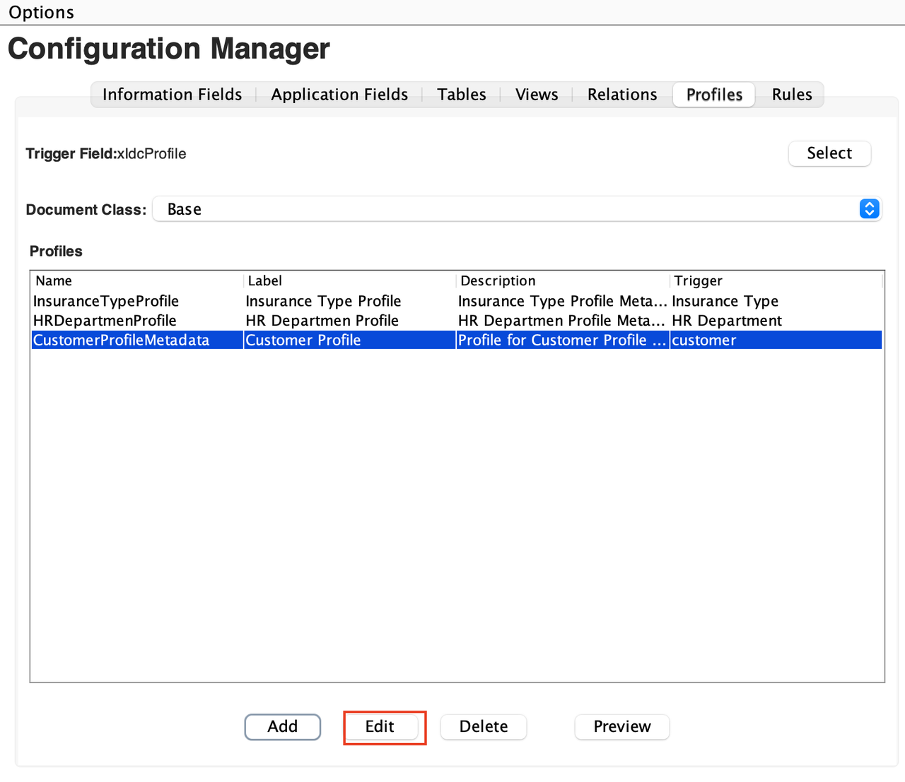
- Click **Restricted personalization links** check box as Enabled .
- Click **Edit** button .
  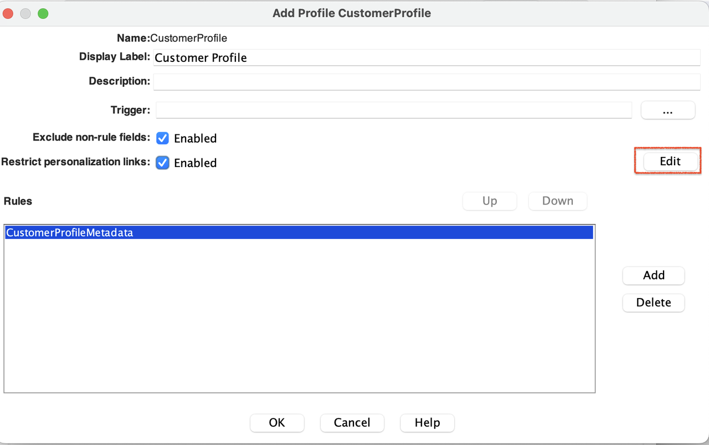
- **Click Has Script for the check-in link** check box .
- Click **Edit** button
  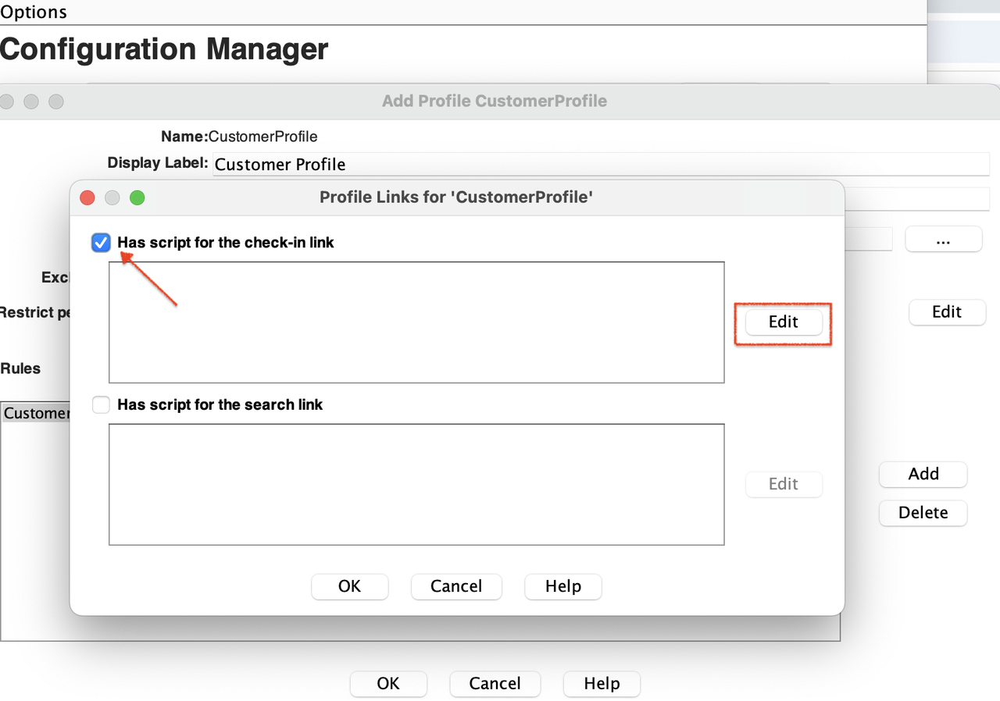
- Click **Add** button in Condition box.
  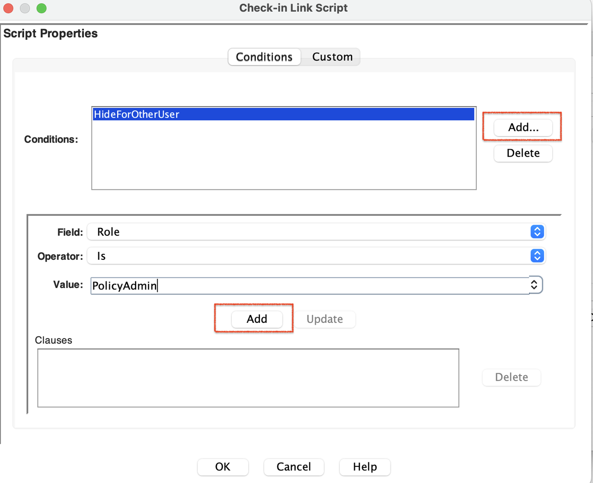
- Enter the **name** for the condition.
            ```
                <copy>HideForOtherUser </copy>
             ```
 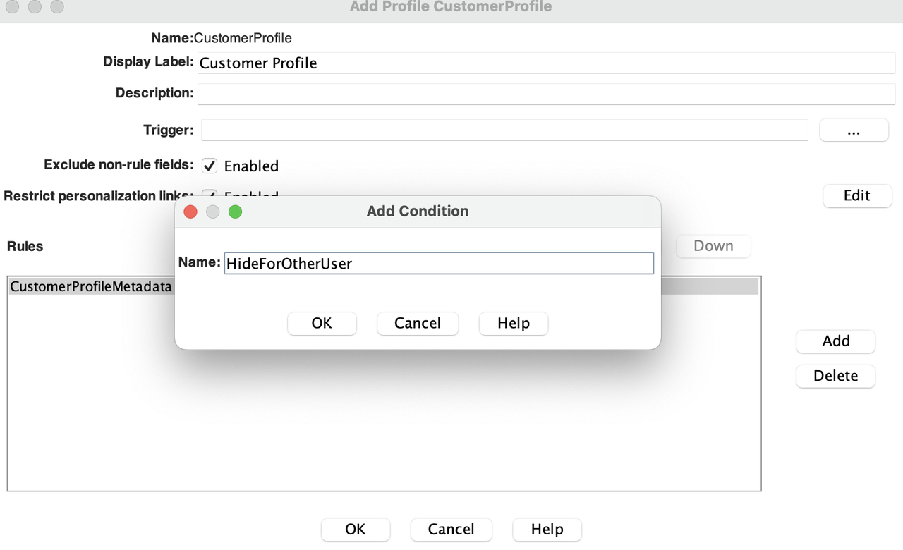
- Choose **Role** value in field drop down
- Choose **Is** value in Operator drop down
- Choose **PolicyAdmin** value in Value drop down
- to hide the link click **add**.
 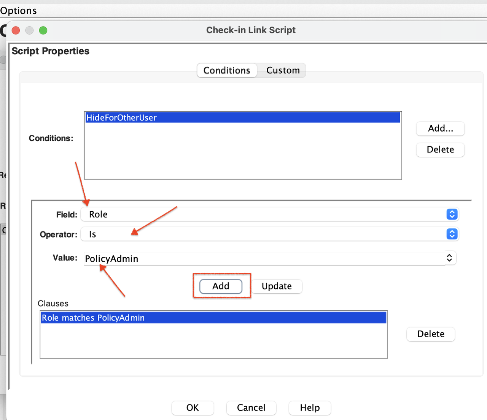

- The selected condition will be added to Clauses. then Click **ok**.

  - Similarly, perform this step if you want to hide profile in  **search link** also
    - Repeat the entire task 6 steps by selecting **Has script for the search link**

- Repeat the entire task 6 steps to if you want to hide this option to other profiles also.

Verifying What We Have Created So Far,

- Login  to **WebCenter**
  - Check the Created Profiles
    - Click **Upload** button in the top-left corner
    
    - You should see the profiles created so far listed here.
    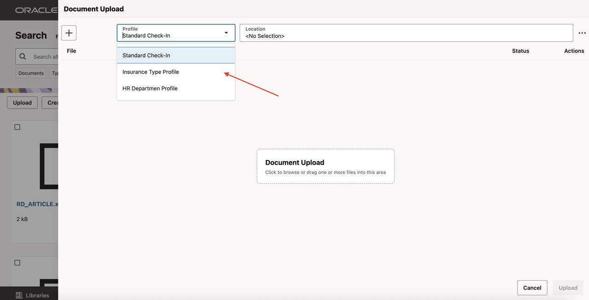
  - Since you are not logged in as the PolicyAdmin user, the Customer Profile option should not be visible

This Completes this Live Lab.

### Learn More

- [Using Oracle WebCenter Content on Marketplace in Oracle Cloud Infrastructure](https://docs.oracle.com/en/cloud/paas/webcenter-content/webcenter-content-marketplace/index.html#provision-webcenter-content-stack)
- [Introduction To WebCenter Content](https://docs.oracle.com/en/middleware/webcenter/content/12.2.1.4/index.html)

## Acknowledgements

- **Authors-** Janardhana M T, Senior Member Technical Staff, Oracle WebCenter Content
- **Contributors-** Sujata Nayak, Senthilkumar Chinnappa, Mandar Tengse , Parikshit Khisty
- **Last Updated By/Date-** Janardhana M T,April 2025
