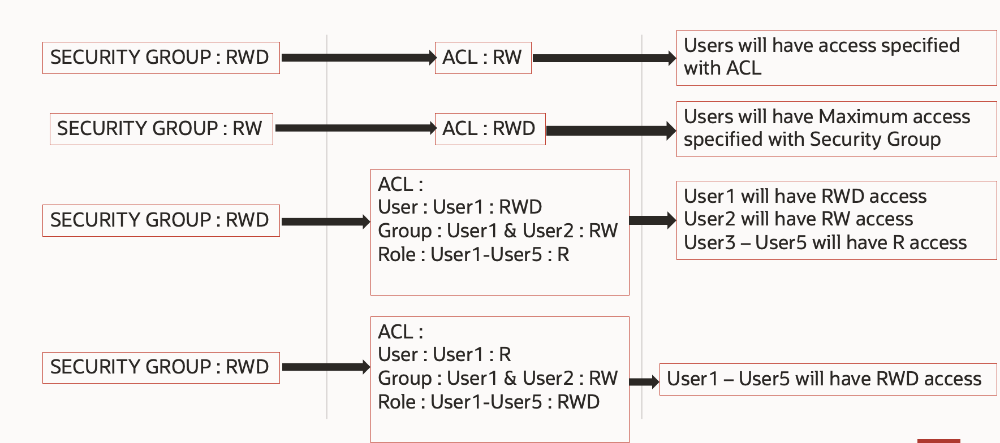

# Introduction

Learn how to setup different security levels for folders and documents with Oracle WebCenter content

## About this Workshop

Organizations have requirements on folder and document access. This lab would help participants to setup different access privileges for folders and documents.

*Estimated Time:* 2 hours 35 minutes

### **About Security levels in Oracle WebCenter Content**

The objective of this lab is to setup access privilege for folders and documents using Oracle WebCenter Content. Document security in Oracle WebCenter Content is implemented at multiple levels. WCC provides several mechanisms for securing repository content. Users are granted specific permission levels (Read, Write, Delete, or Admin) with following features.
* Security Groups (mandatory)

	Each document or folder is associated with a security group
* Accounts (Optional)

	When accounts are enabled, a document or folder can also be linked to an account
* Access Control Lists (Optional)

	Specifies a list of users, groups, or enterprise roles authorized to access or interact with a document
	
#### Level of Security

1. LDAP Group and Role Mapping:
	* Each LDAP group directly maps to a Role with same name in WCC.
2. WCC Role and Security Group Mapping:
	* A WCC role is associated with one or more security groups in WebCenter Content (WCC) to manage folder and document permissions.
3. Admin Permission Precedence:
	* If a security group has Admin permissions, it overrides Access Control Lists (ACL) and accounts, rendering ACL and accounts ineffective.
4. Security Group Permissions:
	* A security group provides a broad permissions framework (Read, Write, Delete).
	* More granular control is achieved using accounts and ACLs, but only with the same or lesser permissions than the security group.
5. LDAP Groups for WCC Accounts:
	* For each account in WCC, up to four LDAP groups can be created, each corresponding to specific permissions: Read (R), Read/Write (RW), Read/Write/Delete (RWD), and Read/Write/Delete/Admin (RWDA).

### **Objectives**

In this lab, you will:

* Initialize WCC Marketplace Environment
* Create Multiple Users and Groups in IDCS
* Create Security Groups, Roles, Accounts and Alias in WCC
* Create Folder and documents with different access levels
* Verify the folder and document privileges based on the security settings

### **Prerequisites**

This lab assumes you have:

* Oracle WebCenter Content Instance

You may now **proceed to the next lab**.

### **Learn More**

* [Introduction To WebCenter Content](https://docs.oracle.com/en/middleware/webcenter/content/12.2.1.4/index.html)

## Acknowledgements

* **Authors-** Sujata Nayak, Consulting Member Technical Staff, Oracle WebCenter Content
* **Contributors-** Sujata Nayak, Senthilkumar Chinnappa, Mandar Tengse , Parikshit Khisty
* **Last Updated By/Date-** Sujata Nayak, December 2024
