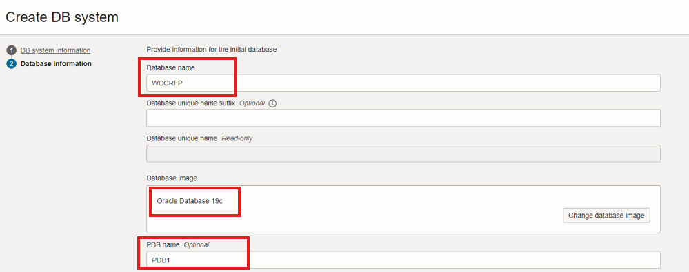

# Prepare Setup

## Introduction

> *Note : You can skip this lab, if you have Webcenter Marketplace Environment already setup.*

This lab will show you how to download the Oracle Resource Manager (ORM) stack zip file needed to setup the resource needed to run this workshop. This workshop requires a compute instance and a Virtual Cloud Network (VCN).

**Estimated Lab Time**: *30 minutes*

### Objectives

- Prepare tenancy for setting up WCC Marketplace instance, including VCN and Database

### Prerequisites

This lab assumes you have:

- An Oracle Paid Cloud account - *to create DB System and WCC Marketplace instance*
- SSH Keys (optional)

## Task 1: Prepare Your OCI Tenancy

  This task helps you to prepare your OCI tenancy for provisioning WebCenter Content Marketplace Stack

  Before you begin, you would need to complete the following tasks and prerequisites.

### **System Requirements**

  You require access to the following services to use Oracle WebCenter Content on OCI:

    * Identity and Access Management (IAM)

    * Compute, Network, Block Storage, Block Volume

    * Vault, Key, Secret

    * Resource Manager

    * Database

    * Load Balancer

    * Tagging

  Make sure you have the following minimum limits for the services in your Oracle Cloud Infrastructure tenancy, and if necessary, request for an increase of a service limit.

  

  See [Service Limits](https://docs.oracle.com/en-us/iaas/Content/General/Concepts/servicelimits.htm) in the Oracle Cloud Infrastructure documentation.

### **1.1 Sign in to Oracle Cloud Infrastructure Console**

Complete the following steps to sign in to the Oracle Cloud Infrastructure console.

  1. Go to <http://cloud.oracle.com>.

  2. Enter your cloud account name and click Next.

  3. Sign in to the Oracle Cloud Infrastructure console:

      - If your cloud account uses identity domains, sign in to the Oracle Cloud Infrastructure console as a user configured in Oracle Cloud Infrastructure Identity and Access Management (IAM).
        - Select the default domain.

      - If your cloud account does not use identity domains, sign in to the Oracle Cloud Infrastructure console as a user federated through Oracle Identity Cloud Service.
        - Under Single Sign-On (SSO) options, note the identity provider selected in the Identity Provider field and click Continue.

  4. Enter the user name and password provided in the welcome email, and click Sign In. The Oracle Cloud Infrastructure console is shown.

### **1.2 Generate SSH key pair**

  See [generate_ssh_key](https://www.oracle.com/webfolder/technetwork/tutorials/obe/cloud/compute-iaas/generating_ssh_key/generate_ssh_key.html) for generating an SSH key pair.

  This SSH key pair will be used for connecting to Bastion and Compute instances after stack execution.

  > Note: This will be used to create DB and WebCenter Content nodes.

### **1.3 Create a Compartment**

  If your tenancy does not already include a compartment for your Oracle WebCenter Content on Marketplace instances, you can create a new one.

  Note: To create a compartment, your administrator must first add the following policy for your group: allow group groupName to manage compartments in tenancy

  To create a compartment in Oracle Cloud Infrastructure:

  1. Sign in to the Oracle Cloud Infrastructure Console [ *Using the previous steps mentioned in Task 2.1 above* ]

  2. Open the navigation menu and click **Identity & Security**. Under **Identity**, click **Compartments**. A list of the existing compartments in your tenancy is displayed.

  3. Click **Create Compartment**.

  4. Enter the following:
    - **Name**: Specify a name. For example,

          ```
          <copy>wcc</copy>
          ```

    *Restrictions for compartment names are: Maximum 100 characters, including letters, numbers, periods, hyphens, and underscores. The name must be unique across all the compartments in your tenancy.*
    - **Description**: A friendly description.

          ```
          <copy>Compartment used for WCC Marketplace stack</copy>
          ```
  5. Click **Create Compartment**.

## Task 2: Create Database

  *You’d need a new DB system only if you want to provision a new database. Otherwise, you can use an existing database too.*

    > Note: Currently, only the Oracle Base Database Service is supported. Support for other versions will be provided in upcoming releases

  Complete the following to create a new DB system:

- **Create VCN**

- **Create a New DB System**

### **2.1 Create VCN**

  1. Log in to **OCI Console**, navigate to **Networking**, then to **Virtual Cloud Networks**.
    

  2. Select the **wcc** compartment in the **List Scope**, **Compartment** list and Click **Create VCN via Wizard** button
    

  3. Click **Start VCN Wizard**.
        

  4. In the **Configuration** page, Provide the below values and click **Next** Button
      - **VCN name**: Provide a name.

                ```
                <copy>wcc-rfpmgmt-demo</copy>
                ```
      - **Compartment**: Specify the compartment in which the VCN needs to be created.
        - Select the **wcc** compartment you have created in the earlier steps
      - **VCN IPv4 CIDR block**: Specify IPv4 CIDR block

                ```
                <copy>10.0.0.0/16</copy>
                ```
      - **Select** the **Use DNS hostnames in this VCN** check box.
    

  5. In the **Configure public subnet and Configure private subnet** sections, verify the values. If required, specify the correct/required CIDR blocks and click **Next**.
      - *If modifying CIDR block values, Make sure to create the necessary gateways such as Internet gateway, NAT gateway, and Service gateway.*
      

  6. In the **Review and Create** Page, verify the details and click **Create**
    

  7. VCN Gets created . Click on **View VCN** to view VCN Info

      

      

### **2.2 Create a New DB System**

  Create a new DB system in the VCN you created earlier.

  Make a note of the SSH keys used for the DB system creation.

   > **Note** : *Ensure to provide a DB System SSH private key without a passphrase as passphrase is not allowed.*

  1. Log in to **OCI Console**, navigate to **Oracle Database**, then to **Oracle Base Database Service**.

      

  2. Select the **wcc** compartment in the **List Scope**, **Compartment** list and Click **Create DB System** button

      

  3. Provide the following parameters:

      - **Select a Compartment Name** : Choose the appropriate compartment name, here **wcc**

      - **Name your DB system** : Specify

                ```
                <copy>wcc-rfpmgmt-DBSystem</copy>
                ```
      - **Select an availability domain**: Choose **AD1**. (*You can choose any AD but make sure that WebCenter Content and DB are in the same AD.*)

      - **Configure shape**: Choose **AMD VM Standard E4 Flex** or **AMD VM Standard E5 Flex**

      

      - **Configure storage**: Keep the default

      - **Configure the DB system**: Update the total node count to **1** and **Oracle Database software edition** is **Enterprise Edition Extreme Performance** or **Enterprise Edition High Performance**.

      

      - **Add SSH keys**: Upload the public SSH key you created in the first step.
        - You can either reuse the keys generated in the first step or you can generate a new pair of keys too for database instances.
          > *Save and rename the keys* as **db-ssh.key** for the private key and **db-ssh.key.pub** for the public key

      

      - **License**: Choose **Bring Your Own License**

      - **Specify the Network information** - Provide/Select the values as below and Click **Next**.

        - **Virtual cloud network** : Choose the VCN you created earlier - **wcc-rfpmgmt-demo**

        - **Client subnet** : Select (either private or public subnet as needed) from the drop- down list.

        - **Hostname prefix** : Choose an appropriate name.

              ```
              <copy>wcc-rfpmgmt-demo</copy>
              ```

          

      - **Database Information** - Provide/Select the values as below:
        - **Database name** : Specify a name for your database.

              ```
              <copy>WCCRFP</copy>
              ```

        - **Database image** : **Oracle Database 19c**

        - **PDB Name** : Specify the PDB name

              ```
              <copy>pdb1</copy>
              ```

          

      - **Create administrator credentials** : Specify ‘sys’ and an appropriate password.

              ```
              <copy>OCI#db#456789123</copy>
              ```

      - **Configure database backups** : Uncheck **Enable automatic backups** checkbox

      For remaining input fields: Select the default values.

      And click on **Create DB system** button

      

You may now **proceed to the next lab**.

## Acknowledgements

- **Authors-** Senthilkumar Chinnappa, Senior Principal Solution Engineer, Oracle WebCenter Content
- **Contributors-** Senthilkumar Chinnappa, Mandar Tengse , Parikshit Khisty
- **Last Updated By/Date-** Senthilkumar Chinnappa, August 2024