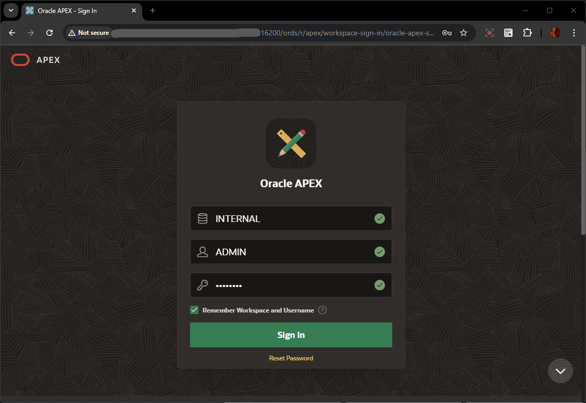
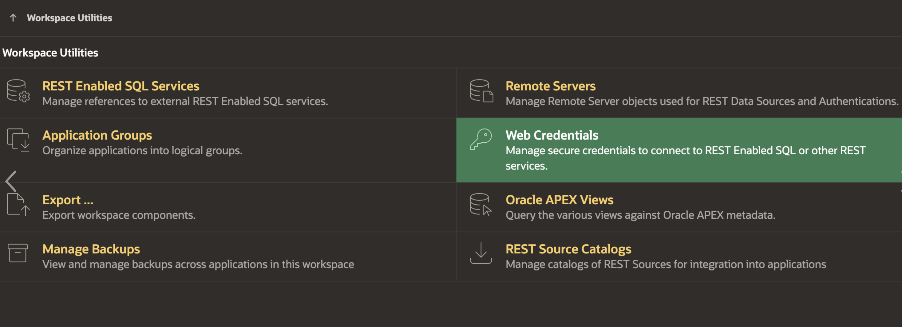

# Setup APEX Workspace

## Introduction

In this lab, you learn to install and run Oracle APEX Application for RFP Management System.

This lab also covers updating the APEX Rest Datasource urls & credentials for connecting to WebCenter Content Instance

**Estimated Lab Time**: *20 minutes*

### Objectives

In this lab, you will:

- Navigate through Oracle APEX
- Create New Workspace
- Login to Workspace

### Prerequisites

This lab assumes you have:

- A  Paid or LiveLabs Oracle Cloud account
- You have completed:
  - Lab: Prepare Setup ( *Paid Tenants* only)
  - Lab: Setup WCC Marketplace Environment
  - Lab: Initialize Environment

## Task 1: Create New APEX Workspace

To create new APEX workspace, you need log in to Oracle APEX's default **INTERNAL** Workspaces as **ADMIN** User (or) the user with Administrator Privilege on the APEX Instance

1. On the new *web browser* window , Login to the APEX/ORDS URL as **ADMIN** User of System's **INTERNAL** Workspace. Details are provided below
    - **URL**
          ```
          <copy>https://localhost:16200/ords/</copy>
          ```

         > Note : Replace `"https://localhost"` with your **hosturl** ( eg: `"http://wcc-rfpmgmt-livelab.livelabs.oraclevcn.com"` or `"https://192.0.0.0""`)
    - **Workspace Name**
          ```
          <copy>INTERNAL</copy>
          ```
    - **Username**
          ```
          <copy>ADMIN</copy>
          ```
    - **Password**
          ```
          <copy>WelCwcm123##</copy>
          ```
    > **For ATP DB** *, ADMIN password is same as the ADMIN DB schema user password*.
    > *If any issues with ADMIN credentials, Refer to **Appendix 5: Reset ADMIN password for APEX/ORDS** of the previous lab **Initialize WCC Environment** to reset ADMIN Password*
  

2. In the *Administration Services* Landing page , Click on **Create Workspace** button on the top right corner
  

3. Provide the value for **Workspace Name**  and click **Next** Button
        ```
        <copy>WCCHEADLESSACCESS</copy>
        ```
            > Note: If the workspace name already exists, please add wcc schema prefix to the workspace name eg: **[schema\_prefix]_WCCHEADLESSACCESS**
  

4. Provide the values for DB Schema details as mentioned below and click **Next** Button
    - **Re-use existing schema?**: Select **No**
    - **Schema Name**: Enter
          ```
          <copy>WCCHEADLESSACCESS_SCHEMA</copy>
          ```
    - **Schema Password**: Enter
          ```
          <copy>WelCwcm123##</copy>
          ```
    - **Space Quota (MB)**: Select **500**
  

5. Provide the values for Workspace **ADMIN** User details as mentioned below and click **Next** Button

    - **Administrator Username**: Enter
          ```
          <copy>ADMIN</copy>
          ```
    - **Administrator Password**: Enter
          ```
          <copy>Welcome1</copy>
          ```
    - **First Name**: Enter
          ```
          <copy>Admin</copy>
          ```
    - **Last Name**: Enter
          ```
          <copy>User</copy>
          ```
    - **Email**: Enter your email id
          ```
          <copy>admin_user@email.com</copy>
          ```
  

6. Review the details and click **Create Workspace** Button
 

7. After the workspace is successfully created, it will display  workspace details.  click **Done** Button

 

## Task 2: Login to Newly Created APEX Workspace

To log in to Oracle APEX, you need a Workspace Name, username, and the password created for that Workspace. In this hands-on lab, you log in to your Oracle APEX Workspace.

1. To login to your Oracle APEX Workspace, perform the following steps:
    - Open your browser and enter the **URL** to sign in to the APEX development environment.
      - **URL**
            ```
            <copy>https://localhost:16200/ords/</copy>
            ```

            > Note : Replace `"https://localhost"` with your **hosturl** ( eg: `"http://wcc-rfpmgmt-livelab.livelabs.oraclevcn.com"` or `"https://192.0.0.0"`)

    - The login page appears. Enter the **Workspace Name, Username, and Password**. Click **Sign In**.
      - **Workspace Name**: Enter
            ```
            <copy>WCCHEADLESSACCESS</copy>
            ```
      - **Username**: Enter
            ```
            <copy>ADMIN</copy>
            ```
      - **Password**: Enter
            ```
            <copy>Welcome1</copy>
            ```
  

2. If its first time Login, Change password for the ADMIN user. You can provide the same Password value and click on **Change Password**.
    > Skip this step if it does not prompt for Change Password

    - **New Password**: Enter
          ```
          <copy>Welcome1</copy>
          ```
    - **Confirm Password**: Enter
          ```
          <copy>Welcome1</copy>
          ```
  

3. The Workspace home page appears.

  

## Task 3: Create New Web Credentials

1. Login to your APEX development environment.

2. Click on **App Builder** from the top navigation to access the Oracle APEX home page.
    

3. Select the **Workspace Utilities** option from the menu as shown below.

    

4. Select the Web Credentials option.

    

5. Fill the necessary details to configure Web Credentials, ensuring all required information is accurately provided. Give a unique Static ID eg. 'credentials-for-wcc-api'.
          ```
          <copy>credentials-for-wcc-api</copy>
          ```

      > Note : Static ID will serve as the basic authentication credentials when making REST API calls

    

    **Summary**

    You have now successfully setup the APEX Workspace for creating new application.

You are now ready to **proceed to the next lab**.

## Acknowledgements

- **Authors-** Senthilkumar Chinnappa, Senior Principal Solution Engineer, Oracle WebCenter Content
- **Contributors-** Senthilkumar Chinnappa, Mandar Tengse , Parikshit Khisty
- **Last Updated By/Date-** Senthilkumar Chinnappa, July 2024
