# Create New Apex Application

## Introduction

In this lab, you will learn about the steps to build headless WebCenter Content(WCC) App using WebCenter Content REST APIs secured by OAuth. This lab covers the most commonly used APIs required for any App.

**Estimated Lab Time**: *30 minutes*

### Description

Organizations are in need of building applications that also need document or unstructured content. This lab would assist developer to know how WebCenter Content can be used along with APEX and the integration secured using OAuth based API access.
This app will step by step guide you to create a dummy app that will show how to use **static credentials** to make a WCC rest API call to get **authentication token**. Later on the app guides you to use **authentication token** in Rest API call to upload a content to WCC with some basic information or metadata.

### Workshop Outline

* Provisioning WebCenter Content
* Provisioning APEX
* Configuring IAM app

### Prerequisites

* Familiarity with APEX is desirable
* Familiarity with OCI is desirable
* Familiarity with WCC is desirable

## Task 1: Create new Sample Apex Application

1. Navigate to the **App Builder** Screen by clicking from top menu.
2. Click on the **Create** Button to create new app.

  
3. Give desired name eg **Headless WCC APIs Demo** and unique ID (auto generated and can be modified) not used by any other app on the same instance.

        <copy>Headless WCC APIs Demo</copy>

  

* Once the application gets created, it will show some default pages available as part of the application as shown below.
   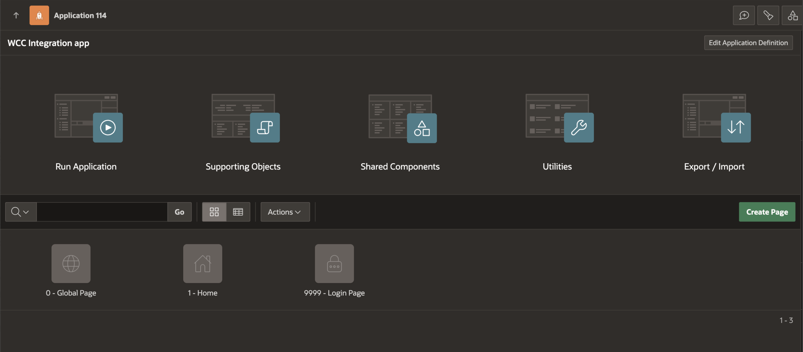

## Task 2: Add new Pages and Components to the created app

1. Navigate to the **App Builder** Screen by clicking from top menu and click on the newly created app. It will Show the default pages.
   

2. Click on **Create Page**, choose blank page as the component and click on next.
   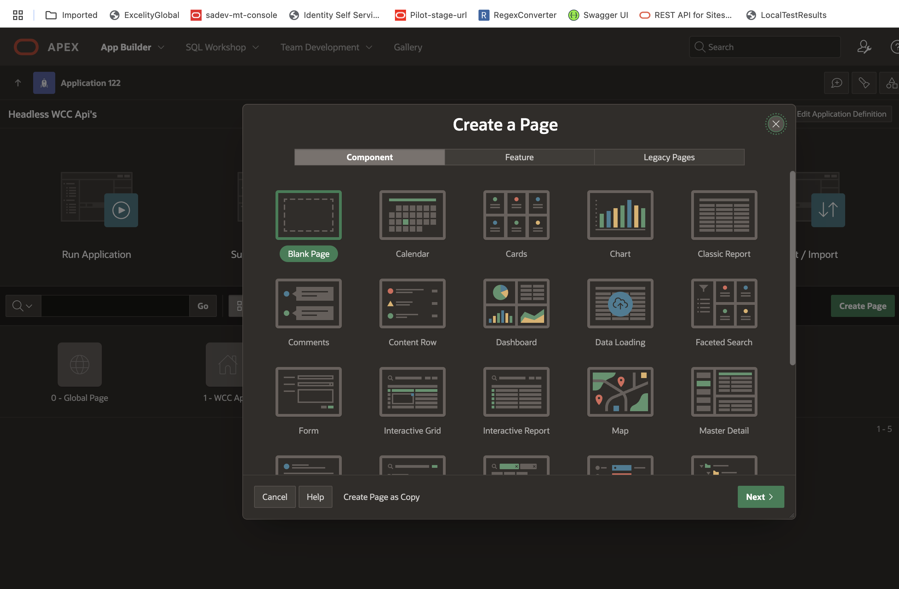

3. Give a desired name to the page eg. **Create Content** and enable Use Breadcrumb option. This will show the page in the breadcrumb menu. Also check "Home(Page1)" is selected in Breadcrum Parent Entry.

          <copy>Create Content</copy>

   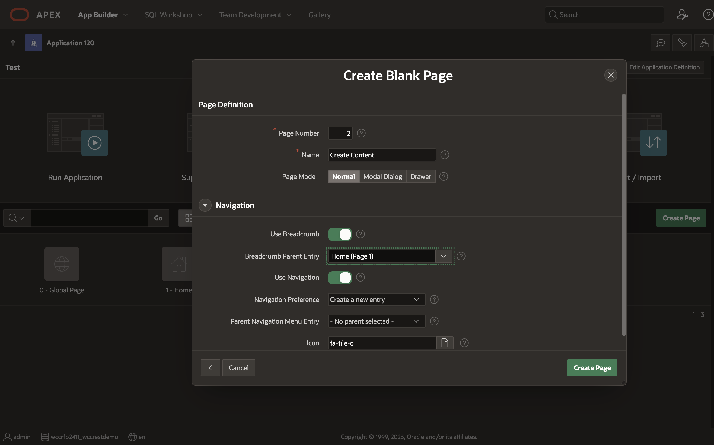
4. After creating the page, drop **Static Content** in the region body under breadcrumb. Drop it either from the **Regions section** below the layout window or add it by right click on region body and select **Create Region**.  Set the title to desired name eg. **Create Content**.

        <copy>Create Content</copy>

   
5. In the same manner as in step 4, drop a **Button** of type **Text with icon** in the Edit Region of page layout and give it desired name eg. **Create**.

        <copy>Create</copy>

   
6. Now add a **File Upload** item to Create Content region body by drag and drop from the items section below page layout or by right click options on the item as shown.

    > Note : Apex by default adds some prefix eg. 'P2_' to the Name of items that we add to page to uniquely mark each item of page. In this 'P' stand for page and '2' is the id of your page. It is recommended to use same way of naming items in page.
  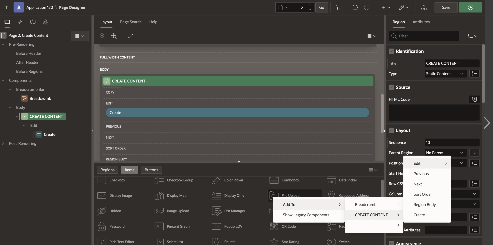
7. Give a name to the file upload component eg. **P2&#95FILE&#95UPLOAD**.

        <copy>P2_FILE_UPLOAD</copy>

   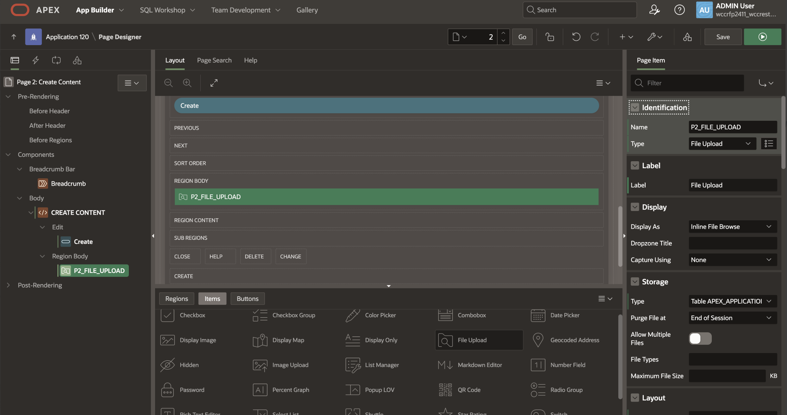
8. Change the properties of **P2&#95FILE&#95UPLOAD** and set Display As **Inline Dropzone** and Dropzone Title as '**Drag and Drop files to upload**'.
   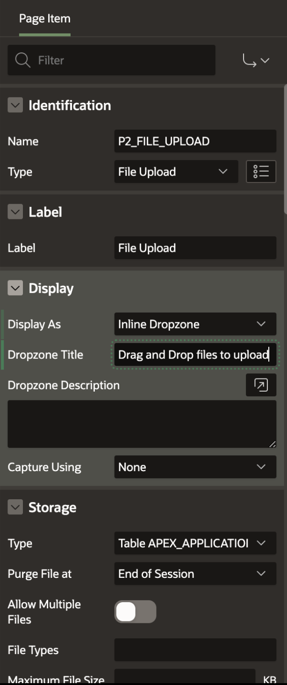
9. Also modify the validation property of **P2&#95FILE&#95UPLOAD** to enable **Value Required**. It will make it mandatory field before submitting the form.
   
10. In the same manner as in step 6, add a **Text field** below the file upload item using drag and drop or right click options as shown.
  
11. Give it a desired name eg. **P2&#95TITLE**

        <copy>P2_TITLE</copy>

   
12. In the same manner, add a **Select List** in the next column to **P2&#95TITLE** using drag and drop or right click options as shown.
   
13. Give it a desired name eg. **P2&#95SEC&#95GROUP**.

        <copy>P2_SEC_GROUP</copy>

   
14. Change the List of values type to **Static values**.
   
15. Define **Public** and **Secure** as two static options for the security group select list as shown below

       **Public** : Enter

            <copy>Public</copy>
       **Secure** : Enter

            <copy>Secure</copy>

   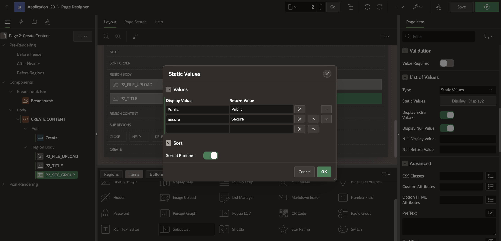
16. Disable **Display Extra Values** and **Display Null Values** option of the **P2&#95SEC&#95GROUP** select list from Right side properties. This will show only our specified values as option the the select list.
   
17. Add a **Display Only** item below **P2&#95SEC&#95GROUP** and give it desired name eg. **P2&#95AUTHOR**.

        <copy>P2_AUTHOR</copy>
  
   
18. Set the default value of **P2&#95AUTHOR** to **Expression** with language as **PL/SQL**.
   
19. Paste '**:APP&#95USER**' in the expression value. This will assign the value of **P2&#95AUTHOR** to the logged in user.

        <copy>:APP_USER</copy>

   
20. In the same manner add one more Display Only item next to **P2&#95AUTHOR** and give it desired name eg. **P2&#95DOC&#95TYPE**. Also set the default value on right side properties to static with value as **Document** as shown below.

      Title : P2\_DOC\_TYPE

            <copy>P2_DOC_TYPE</copy>

      Default
      Type : Static      

       Static Value : Document

            <copy>Document</copy>

  

 **Our Form Structure for Uploading file to Oracle WCC is now ready.**

## Task 3: Adding Logic to Form Components

   Lets add our logic to read values from form, pass credentials, get bearer token and upload the file.

1. Create a Global variable to hold the value of our host name.

     > Note : **Page 0** or **Global Page** in all Apex Application is used as global page and we can add global variables to this page.

    * Go to **Page 0** of the application

        

    * Right click on the body to create **new Page item** and give it desired name eg. **P0&#95HOSTNAME**.

            <copy>P0_HOSTNAME</copy>

      

    * Set type as **hidden** and disable the **value protected** property on the right side menu to enable updating of the variable value using code.

       

2. Go to events tabs of Page 0 which is the second tab on top of left side menu and create a **Dynamic action on Page load** as shown below.

      

3. Give a desired name to the event eg. **Initialize Variables**.

        <copy>Initialize Variables</copy>

      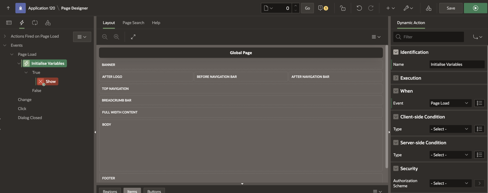

4. Select **Show** and change the **Action** property on right side to **Execute Javascript Code**.

      

5. Paste the below code Snippet to the code block and **Save** the page.

      > Note : Make sure to use correct variable names while pasting the code snippets as you have defined in your page. If there is any error, please resolve it first before saving the changes.

                <copy>
                var hostname = window.location.protocol + "//" + window.location.host;
                apex.item("P0_HOSTNAME").setValue(hostname);
                $x('P0_HOSTNAME').value = hostname;</copy>

      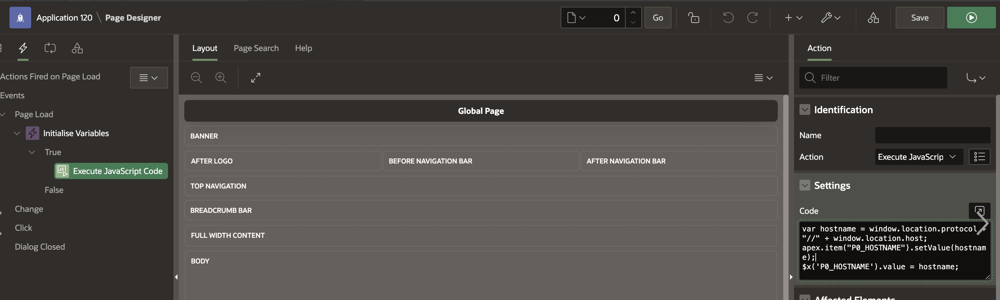

6. Go to Page 2 or the Create Content Page, create a page load event as done in Step 2 above and give any desired name eg. **Initialize-variables-to-null**.

                 <copy>Initialize-variables-to-null</copy>

      

7. Select **Show** and change the Action to **Execute Server-side** Code instead of **Show** and paste the code snippet in PL/SQL Code as shown below.

      > Note : Make sure to use correct variable names while pasting the code snippets as you have defined in your page. If there is any error, please resolve it first before saving the changes.

      

                <copy>:P2_AUTHOR := null;
                :P2_DOC_TYPE := null;
                :P2_FILE_UPLOAD := null;
                :P2_SEC_GROUP := null;
                :P2_TITLE := null;</copy>

8. On the same Page 2 or **Create Content** Page, click on third tab on top in left menu to add a process on page as shown below.

      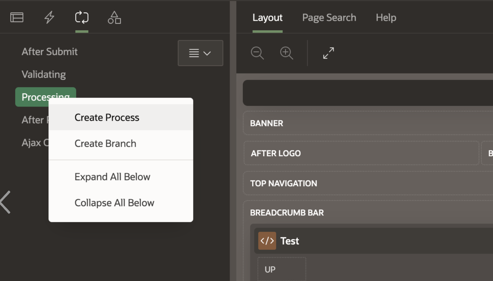

9. Create a Process on Page Processing, give it a desired name eg. **Create&#95content&#95process**.

          <copy>Create_content_process</copy>

      

10. Change its type to **Execution Chain** from right side menu.

      

11. Right click on the process created in step 9 and add a child process with desired name eg. **Fetch&#95User&#95Token**.

        <copy>Fetch_User_Token</copy>

      

12. Copy the below code snippet and paste to the PL/SQL Code block on the right side as shown.

      > Note : Make sure to use correct variable names while pasting the code snippets as you have defined in your page. Code Explanation is done as inline comments in Code Snippet. If there is any error, please resolve it first before saving the changes. For APIs information, refer to **Appendix 1 : Commonly Used WCC REST Endpoints**.

      

        <copy>
        DECLARE
          lc_response clob;
          lm_multipart apex_web_service.t_multipart_parts;
          l_hostname VARCHAR2(4000) := :P0_HOSTNAME;  -- Global variable used to store host name at Page 0
          lv_base_url VARCHAR2(100) := l_hostname || '/documents/wcc/api/v1.1/users/token';  -- API base URL to get Token
          l_status_code NUMBER;
          l_json_response apex_json.t_values;
          l_user_token VARCHAR2(4000);
        BEGIN
          APEX_DEBUG_MESSAGE.LOG_MESSAGE(p_message => 'lv_base_url : ' || lv_base_url, p_level => 1);
          lc_response := apex_web_service.make_rest_request      -- Making Rest call to the above created url with static credentials
          ( p_url => lv_base_url, p_http_method => 'POST',
          p_credential_static_id => 'credentials_for_wcc_api'); -- Static Basic Auth Credentials defined while creating APP
          l_status_code := apex_web_service.g_status_code;
          APEX_DEBUG_MESSAGE.LOG_MESSAGE(p_message => 'l_status_code : ' || l_status_code, p_level => 1);
          IF l_status_code = 200
          THEN
          apex_json.parse(p_values => l_json_response, p_source => lc_response);
            IF apex_json.get_varchar2(p_values => l_json_response, p_path => 'accessToken') IS NOT NULL
            THEN
            l_user_token := apex_json.get_varchar2(p_values => l_json_response, p_path => 'accessToken');
            APEX_DEBUG_MESSAGE.LOG_MESSAGE(p_message => 'l_user_token : ' || l_user_token, p_level => 1);
            APEX_COLLECTION.CREATE_OR_TRUNCATE_COLLECTION(p_collection_name => 'API_KEY_COLLECTION');    -- Creating APEX Collection named API_KEY_COLLECTION
            APEX_COLLECTION.ADD_MEMBER( p_collection_name => 'API_KEY_COLLECTION', p_c002 => l_user_token ); -- Storing Token to API_KEY_COLLECTION collection
            APEX_DEBUG_MESSAGE.LOG_MESSAGE(p_message => 'bearer token stored in apex collection',p_level => 1 );
            END IF;
          ELSE
            apex_error.add_error ( p_message => 'Error in fetching user token', p_display_location => apex_error.c_inline_in_notification );
          END IF;
          EXCEPTION
          WHEN OTHERS THEN
            apex_error.add_error ( p_message => 'Error in fetching user token', p_display_location => apex_error.c_inline_in_notification );
        END;</copy>

 The above process will get the user token by passing **Basic Auth credentials** and making rest call to token API and then store it to **Apex collection**.
13. Create another child process as done in step 11 with desired name eg. **Create-Content-process**.

         <copy>Create-Content-process</copy>

    

14. Copy the below code snippet and paste to the PL/SQL Code block on the right side below the code snippet
    > Note : Make sure to use correct variable names while pasting the code snippets as you have defined in your page. Code Explanation is done as inline comments in Code Snippet. If there is any error, please resolve it first before saving the changes. For APIs information, refer to **Appendix 1 : Commonly Used WCC REST Endpoints**.

       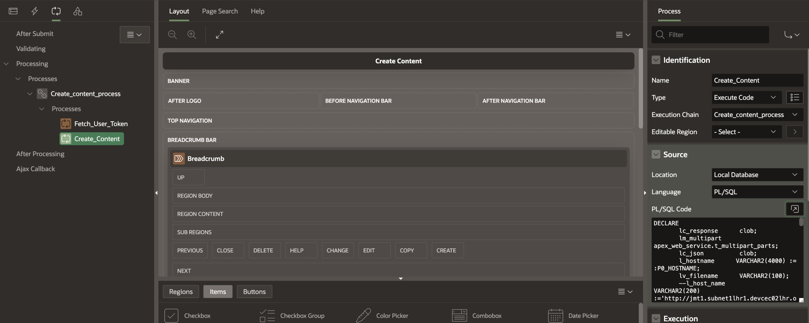

        <copy>DECLARE 
        lc_response clob; 
        lm_multipart apex_web_service.t_multipart_parts; 
        lc_json clob; l_hostname VARCHAR2(4000) := :P0_HOSTNAME; -- Global variable used to store host name at Page 0
        lv_filename VARCHAR2(100); 
        lv_base_url VARCHAR2(100) := l_hostname || '/documents/wcc/api/v1.1/files/data'; -- API base URL to upload file to Oracle WCC;
        lv_api_key VARCHAR2(4000); 
        lb_blob blob; 
        l_title VARCHAR2(4000) := :P2_TITLE; 
        l_doc_type VARCHAR2(4000) := :P2_DOC_TYPE; -- Page Level Variable used for Document Type and defaulted to static value 'Document'
        l_author VARCHAR2(4000) := :P2_AUTHOR; -- Page Level Variable used for Author, Initialized to logged in user ':APP_USER'
        l_sec_group VARCHAR2(4000) := :P2_SEC_GROUP; -- Page Level Select List used for Security Group with values as 'Public' and 'Secure'
        l_doc_id_WCC VARCHAR2(4000); 
        delimiter CHAR := ','; 
        location_delimiter CHAR := '/'; 
        l_status_code NUMBER; 
        BEGIN lc_json :=                      -- Creating Json with values from the Page Level Variables to be passed along with File
         '{
            "dDocTitle": "'|| l_title ||'",
            "dDocAuthor": "'|| l_author ||'",
            "dSecurityGroup": "'|| l_sec_group ||'",
            "dDocType": "'|| l_doc_type ||'"
        }'; 
        SELECT blob_content,filename into lb_blob,lv_filename FROM apex_application_temp_files WHERE name = :P2_FILE_UPLOAD;  -- Getting File Blob selected in File Upload component which gets temporarily stored in temp files   
        apex_web_service.g_request_headers.delete();    -- Clearing any existing headers
        SELECT c002 into lv_api_key from APEX_COLLECTIONS WHERE COLLECTION_NAME = 'API_KEY_COLLECTION' ; -- Getting token from Apex Collection
        apex_web_service.g_request_headers(1).name := 'Authorization';  -- Passing Authorization header in the API call
        apex_web_service.g_request_headers(1).value := 'Bearer ' || lv_api_key;  -- Passing Bearer token in the API call
        IF lc_json is not null 
        THEN 
        apex_web_service.APPEND_TO_MULTIPART ( p_multipart => lm_multipart,    -- Appending above created Json to the API
         p_name => 'metadataValues',     
         p_content_type => 'application/json', p_body => lc_json );
        END IF; 
        apex_web_service.APPEND_TO_MULTIPART ( p_multipart => lm_multipart,     -- Appending File blob to the API
        p_name => 'primaryFile', p_filename => lv_filename, p_content_type => 'application/octet-stream', p_body_blob => lb_blob ); 
        lc_response := apex_web_service.make_rest_request( p_url => lv_base_url,   -- Making the Post API call
        p_http_method => 'POST', p_body_blob => apex_web_service.generate_request_body(lm_multipart) ); 
        l_status_code := apex_web_service.g_status_code;
          IF l_status_code = 201 
          THEN 
          dbms_output.put_line(lc_response); 
              FOR i IN 1.. apex_web_service.g_headers.count LOOP 
                IF apex_web_service.g_headers(i).name = 'Location' 
                THEN 
                BEGIN SELECT regexp_substr(apex_web_service.g_headers(i).value, '[^/]+$', 1, 1) INTO l_doc_id_WCC FROM dual ; apex_application.g_print_success_message := 'Content uploaded successfully with DODCNAME : ' || l_doc_id_WCC;
                EXCEPTION 
                    WHEN no_data_found THEN 
                    l_doc_id_WCC := apex_web_service.g_headers(i).value; 
                    END; 
                    END IF ; 
                    EXIT WHEN apex_web_service.g_headers(i).name = 'Location'; 
              END LOOP; 
          ELSE 
          :P2_AUTHOR := null; 
          :P2_DOC_TYPE := null; 
          :P2_FILE_UPLOAD := null; 
          :P2_SEC_GROUP := null; 
          :P2_TITLE := null; 
          apex_error.add_error ( p_message => 'Error in creating Content', p_display_location => apex_error.c_inline_in_notification ); END IF;EXCEPTION WHEN OTHERS THEN 
         :P2_AUTHOR := null; 
         :P2_DOC_TYPE := null; 
         :P2_FILE_UPLOAD := null; 
         :P2_SEC_GROUP := null; 
         :P2_TITLE := null; 
         apex_error.add_error ( p_message => 'Error in creating Content ', p_display_location => apex_error.c_inline_in_notification );END;</copy>

  The above process will use the token stored by **Fetch-User-Token** in apex collection named **API&#95KEY&#95COLLECTION** and make a Post call to upload selected file to Oracle WCC.

## Task 4: Test the final Application

* Run the application to test the integration. Once the application is running, the user interface (UI) will be displayed. Fill in the required information and click the **Create** button.
        

* This action will trigger the child processes we implemented. **Fetch-User-Token** will get the token and store it in Apex Collection, Create_Content will use that token to upload the document to the WebCenter Content (WCC) Portal.
        
After successful upload, you will get the **DDOCNAME** of the uploaded file in the Notification as shown above. Copy the **DDOCNAME** and search it on WCC.

### Verify Document Check-In

Log in to the **WebCenter Content (WCC)** Portal to confirm that the document has been successfully checked into the system by searching using the same **DDOCNAME** as copied from UI.
        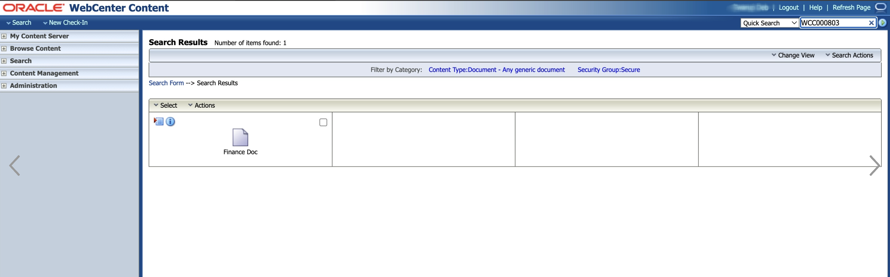

### Conclusion

 By creating and successfully testing the above application, we are now able to understand how we can extend APEX applications integration to Oracle WebCenter Content using Basic Auth or Bearer Token.

 You may now **proceed to the next lab** or refer to **Appendix 1 : Commonly Used WCC REST Endpoints**.

## Appendix 1 : Commonly Used WCC REST Endpoints

  Below is step by step guide to import **WCC Basic APIs** to Postman and understand WCC Basic APIs request/response.

1. Download [**WCC BASIC API LIST.postman_collection.json**](https://objectstorage.ap-melbourne-1.oraclecloud.com/p/CXz1PqdFPMOZkpnuSFeTZ3qvfU2q1n4GNGXA0lJDnDFs2GHzYVo_xybvE6ayh-lO/n/axovrm9ueswa/b/wms_11801_livelab_4116/o/WCC%20BASIC%20API%20LIST.postman_collection.json) Postman Collection File *( right-click on the file name link and click on **Save link as** option )*

2. Open **Postman** App in your system, navigate to Collections and click on Import.
          

3. Click on select files.
          

4. Choose the downloaded **WCC BASIC API LIST.postman_collection.json** file and click open.
          

5. Once the import is complete, click on **variables** to setup the collection variables.

6. Update the variable **Initial Values** and **Current Values** as per your environment details eg. **Environment** as `"https://testinstance.oracle.com/"` , **userName** as "TEST" and **password** as "ABCD".
          

7. Click on any API in the collection list eg. **Quick-Search**.

8. Update the **Authorization** settings. It should be selected as **Inherit auth from parent**.
          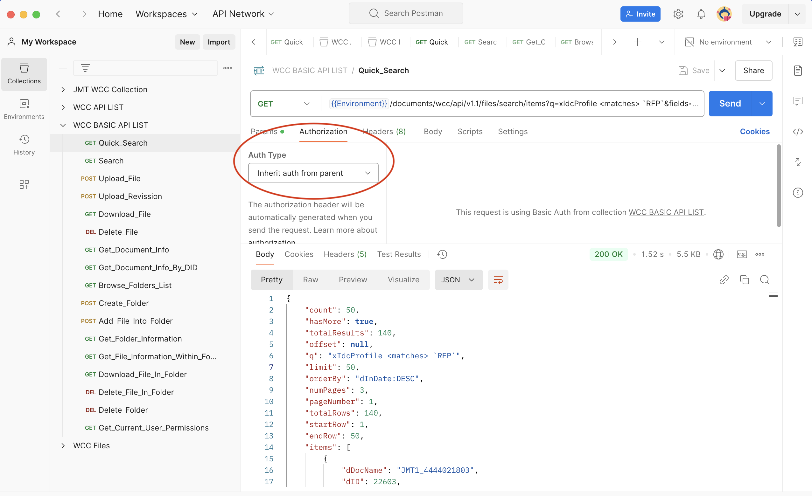

9. Update the **params** as per your search need or just try sending request with the default values to verify the API.
     > Note : Params description is given inline, Params can be updated as per user requirement.

      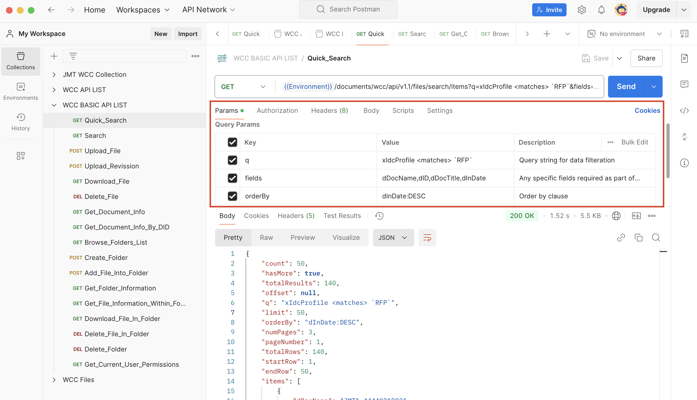

10. Once the API is successful, it will give you **200** status and response as shown in step 9 image.

* Your setup is now complete. You can modify params and try these APIs to understand the request/response structure.

## Acknowledgements

* **Authors-** Kulvender Chauhan, Senior Member of Technical Staff, Oracle WebCenter Content
* **Contributors-** Senthilkumar Chinnappa, Mandar Tengse , Parikshit Khisty
* **Last Updated By/Date-** Senthilkumar Chinnappa, December 2024
