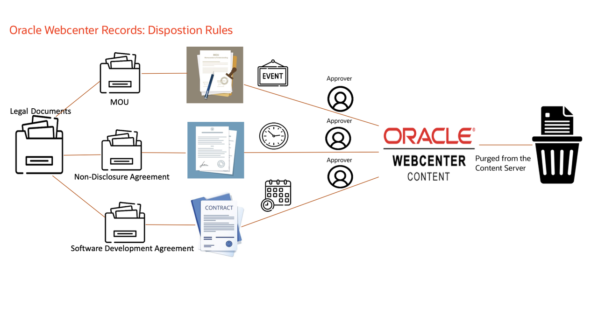
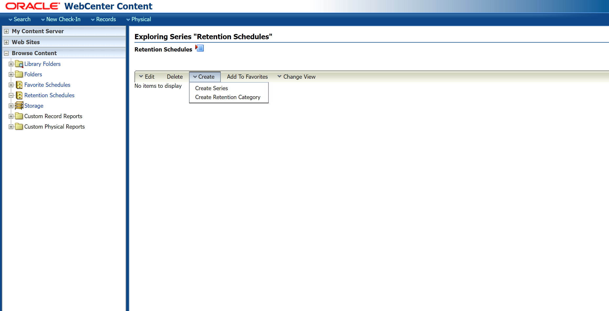
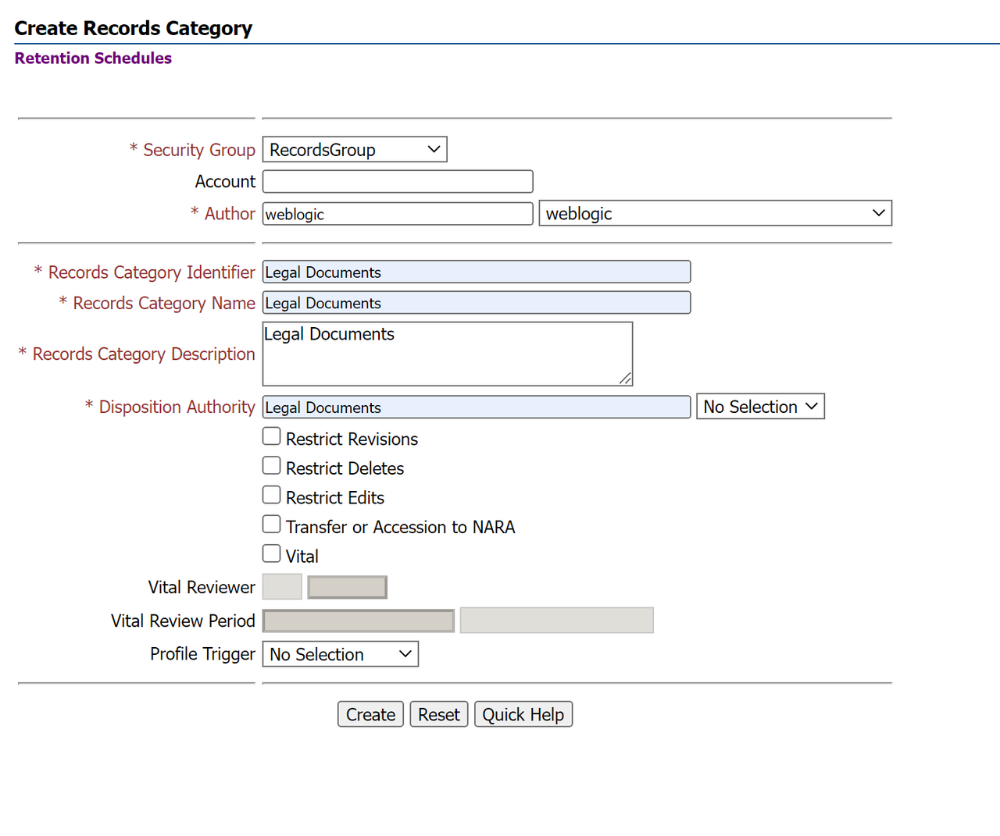
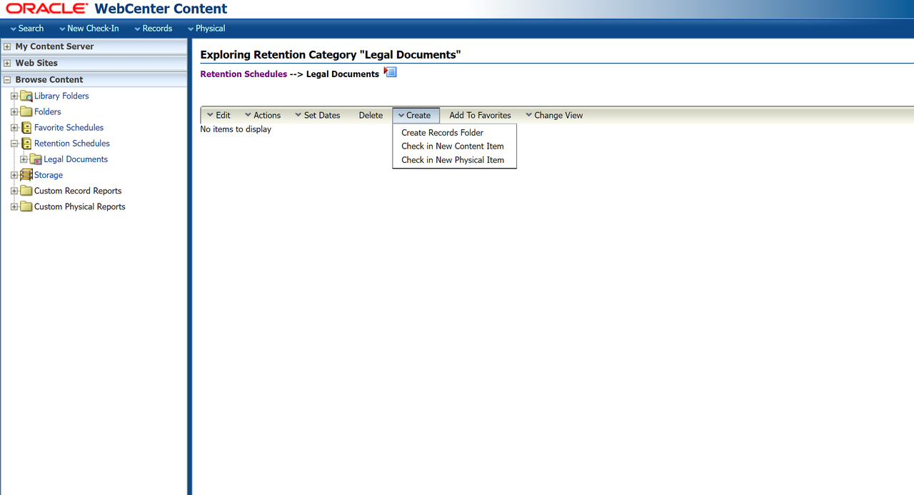
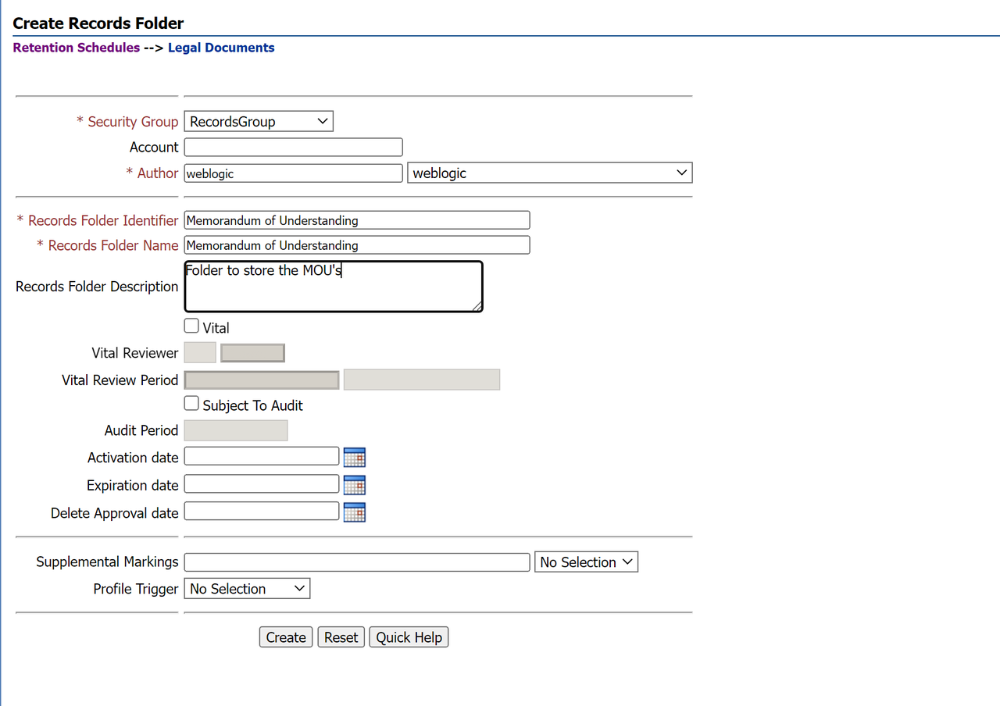
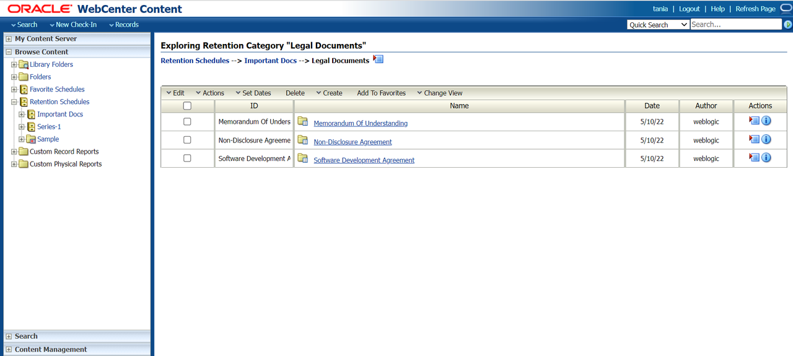
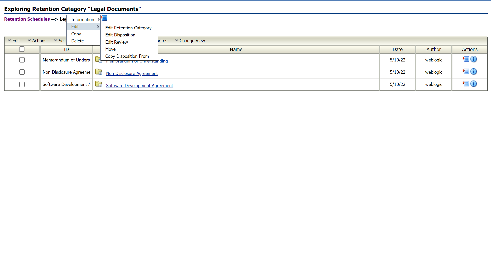
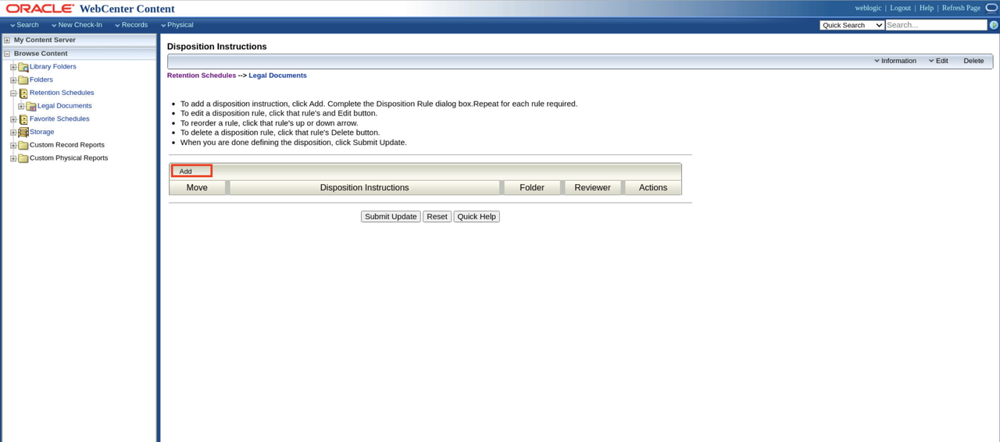
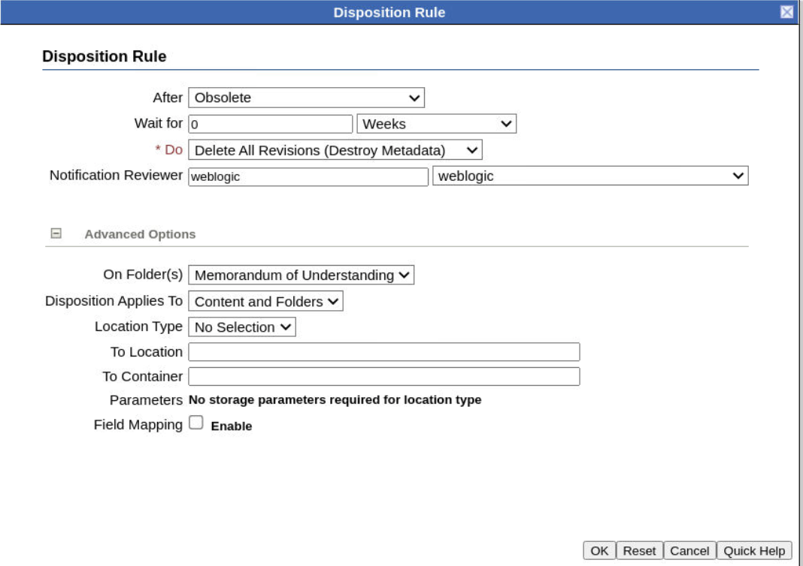

# Event-based Disposition Rule on MOU Records

## Introduction

In this lab, you will learn about the steps needed to configure the series, retention category and respective record folders shown in the architecture diagram below. This lab demonstrates how to set up a disposition rule based on an event. the occurrence of the event triggers the disposition rule to act upon the records. In this lab, let us see how to set the disposition rule on the **Legal Documents** category for the **MOU** record folder.

  

*Estimated Time*: 30 minutes

### Objectives

In this lab, you will:

* Create Retention Category and Records Folders
* Add Disposition Rule on the Category for the MOU Record Folder

### Prerequisites
This lab assumes you have:
- A Free Tier, Paid or LiveLabs Oracle Cloud account
- You have completed:
    - Lab: Prepare Setup (*Free-tier* and *Paid Tenants* only)
    - Lab: Environment Setup
    - Lab: Initialize Environment

## Task 1: Create Retention Category and Records Folders

1. Log in to WebCenter Content Server.

2. Click **Browse Content** then **Retention Schedules**

3. On the Exploring Retention Schedule page, choose **Create** and then **Create Retention Category** on the page menu. On the Create or Edit Retention Category page, enter the details as shown in the image below.

    
    

4. Click **Create**. Click on **Legal Documents** that is created under **Browse Content**.

5. In the Legal Documents Retention Category Page, click on **Create Records Folder** and create the *MOU* records folder as shown below
     

6. Fill in the details as shown in the below image and click on the **Create** button. Similarly, create the other two records folders i.e *Non-disclosure Agreement* records folder to store Non-disclosure agreement records and the *Software Agreement* Records Folder to store Software Agreement Records.
      

7. After creating the 3 record folders, you must see the record folders in the **Legal Documents** category as shown below.
      

## Task 2: Add Disposition Rule on the Category for the MOU Record Folder

1. In the row for the Legal Documents retention category on the Exploring Retention Schedule page, choose **Edit** then **Edit Disposition** from the item's Actions menu.
    

2. In the Disposition Instructions area, click **Add**.

    > **Note:** The Category.Create right is required to perform this action. This right is assigned by default to the Records Administrator role.

   

3. On the Disposition Rule page, choose the disposition rule's triggering event from the Triggering Event (After) list. If the disposition rule has a retention period, enter an integer value for Retention Period (Wait for) and select the corresponding period from the Retention Period list. Select an action for the rule from the Disposition Action (Do) list.

4. Disposition rule for MOU records is 'When the MOUs are obsolete, delete all the revisions from the server'. In the **After** list select *Obsolete* event and choose *0 weeks* for the **Wait for** field. In the **Do** list select the *Delete All Revisions (Destroy Metadata)* action as shown in the image below.

5. In the **Notification Reviewer**, select the user *weblogic* who will be notified. In the **Advanced options** select the Records Folder for the disposition rule to be applied.

    

6. Click on **Submit Update** to apply changes to the MOU Record Folder. Click Ok.
    

 You may now **proceed to the next lab**.

## Learn More

* [Defining and Processing Dispositions](https://docs.oracle.com/en/middleware/webcenter/content/12.2.1.4/webcenter-content-manage/defining-and-processing-dispositions.html#GUID-0827B335-BA5E-4B9C-9270-27BE4520391C)

## Acknowledgements

* **Authors-** Shriraksha S Nataraj, Staff Solution Engineer, Oracle WebCenter Content
* **Contributors-** Shriraksha S Nataraj
* **Last Updated By/Date-** Shriraksha S Nataraj, August 2022
