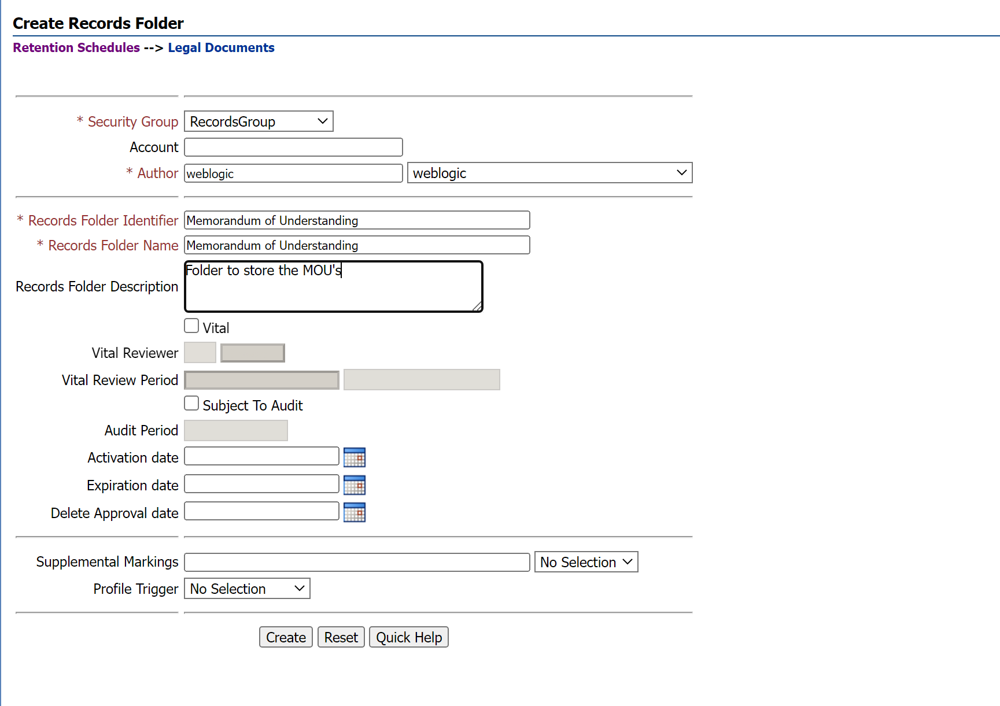
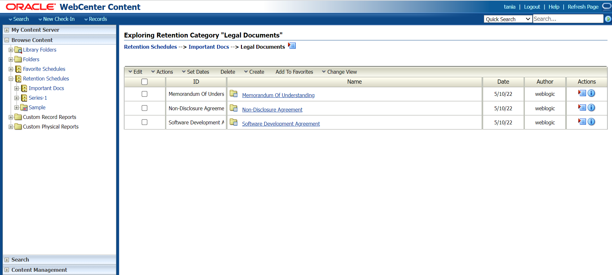

# Event based Disposition Rule on MOU Records

## Introduction

In this lab you will learn about the steps needed to configure the series,retention category and respective record folders shown in the architecture diagram below.This lab also sets the disposition rule on the **Legal Documents** category for the **MOU** record folder.

  

*Estimated Time*: 30 minutes

### Objectives

In this lab, you will:

* Create Retention Category and Records Folders
* Add Disposition Rule on the Category for the MOU Record Folder

### Prerequisites

This lab assumes you have:

* Gone through the Introduction.
* Completed the Initial Record Set up shown in the Introduction

## Task 1: Create Retention Category and Records Folders

1. Login to WebCenter Content Server.

2. Click **Browse Content** then **Retention Schedules**.
.
    > **Note:** This page is only accessible after you install and configure Initial Record Settings shown in the Introduction.

3. (Optional) Click on create **Series** (series is a logical container to hold any number of Retention Categories inside it) and give any logical name).

4. On the Exploring Retention Schedule page, choose Create then Create Retention Category on the page menu.On the Create or Edit Retention Category page, enter the details as shown in the image below.

    
    

5. Click **Create**.

6. In the Legal Documents Retention Category Page, click on create records folder and create MOU records folder as shown below
     

7. Fill in the details as shown in the below image and click on Create button . Similarly create the other two records folders i.e Non-disclosure Agreement records folder to store Non-disclosure agreement records and Software Agreement Records Folder to store Software Agreement Records.
      
      

## Task 2: Add Disposition Rule on the Category for the MOU Record Folder

1. In the row for the Legal Documents retention category on the Exploring Retention Schedule page, choose **Edit** then **Edit Disposition** from the item's Actions menu.
    

2. In the Disposition Instructions area, click Add.

    > **Note:** The Category.Create right is required to perform this action. This right is assigned by default to the Records Administrator role.

3. On the Disposition Rule page, choose the disposition rule's triggering event from the Triggering Event (After) list.If the disposition rule has a retention period, enter an integer value for Retention Period (Wait for) and select the corresponding period from the Retention Period list.Select an action for the rule from the Disposition Action (Do) list.

4. When the MOU's are obsolete , delete all the revisions from the server.In the **After** list select Obsolete event and choose 0 retention period . In the **Action** list select Delete All Revisions (Destroy Metadata) action as shown in the image below.

5. Select the user to be notified.In the Advanced options select the Records Folder for the disposition rule to be applied.

     > **Note:** Creating User and assigning necessary roles and permissions to review records is shown in Lab 2.

    

6. Click on submit update to apply changes on the MOU Record Folder.
    

 You may now **proceed to the next lab**.

## Want to Learn More?

* [Defining and Processing Dispositions](https://docs.oracle.com/en/middleware/webcenter/content/12.2.1.4/webcenter-content-manage/defining-and-processing-dispositions.html#GUID-0827B335-BA5E-4B9C-9270-27BE4520391C)

## Acknowledgements

* **Authors:**
  * Shriraksha S Nataraj , Staff Solution Engineer , Oracle WebCenter Content
* **Contributors:**
  * Shriraksha S Nataraj

* **Last Updated By/Date:** Shriraksha S Nataraj , July 2022
