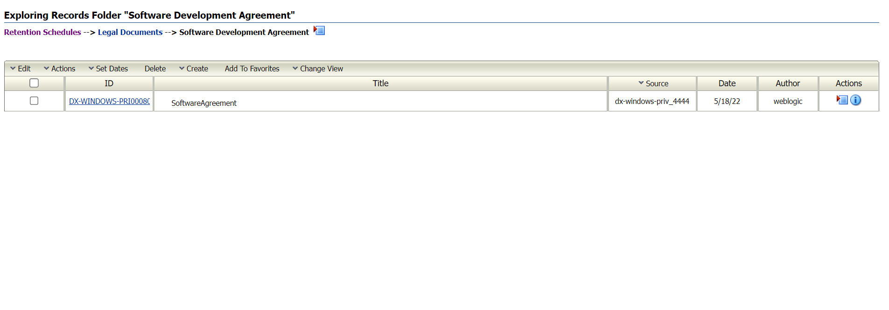
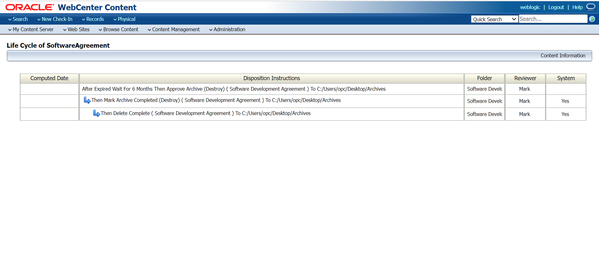
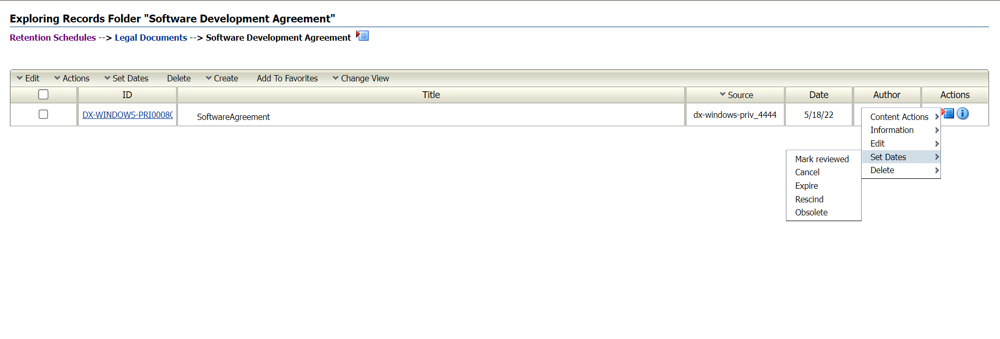
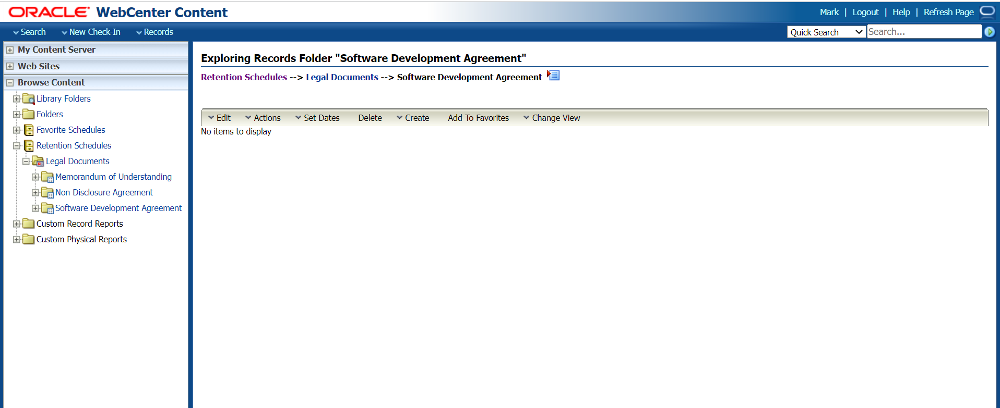
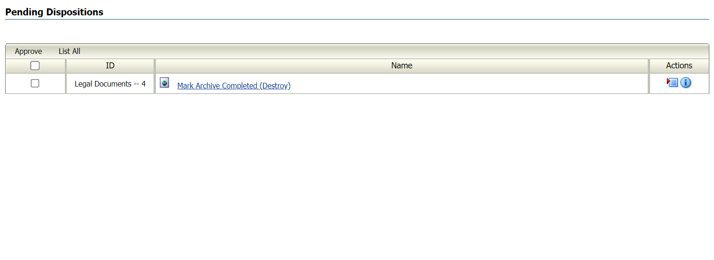

# Event and Time based disposition rule on Software Agreement Record Folder

## Introduction

This lab will show you how to check-in a content item into the Software Agreement Record Folder and how the item is archived to a specific file location once the content has expired.

Estimated Time: 30 minutes

### Objectives

* Add Disposition Rule
* Check-In Content Item
* Pending Disposition Workflow
* Overview of Disposition Rules

### Prerequisites

This lab assumes you have:

* Gone through the Introduction
* Completed the Initial Record Set up shown in the Introduction
* Completed Lab 1 (Creation of retention category and record folders)

## Task 1: Add Disposition Rule

1. Choose **Browse Content** then **Retention Schedules**. Select **Legal Documents** Retention Category and click on **Edit**.

2. Click on **Edit Disposition** and select **Add** to add the disposition rule. On the Disposition Rule page, select the trigger **Expired** in the Triggering Event list. In the Disposition Retention Period enter **6 months**.In the Disposition Action list, select **Archive**.

3. In the advanced section, select the record folder and enter the location where you want to archive the record as shown in the image below.Click **Ok**.
     

## Task 2: Check-In Content Item to Software Agreement Record Folder

1. Click on **Create** and select **Create Content Item** as shown in the image below.
    

2. Fill in the check-in form as shown in the image and below and select **Check In**.
    

    

3. Click on the **i** icon on the Software Agreement Record which is recently checked in to view the content information, metadata information and the life cycle information of the record to see how the disposition rule has been applied to the Software Agreement record.
    

    

4. To test the disposition rule and disposition action on the Software Agreement Record, enter an expiration date which is prior to 7 months old by selecting **Set Dates** and select **Expire** in the **Actions** menu of the content information page as shown below. The content item begins disposition processing based on the expired date. If you check the life cycle for the content item, you can see the dates are already set for the processing.
   

5. Provide a valid reason for expiring the Software Agreement Record and select the expiration date which is 6 or 7 months old from the release date . This step is performed to test the disposition rule.

   

6. After you perform this step, you can see that the disposition processing has taken place and the Software Agreement Record is expired and is depicted by a scratch on the title of the Record in the Record Folder page as shown below.

   

## Task 3: Pending Disposition Workflow

1. Now that the disposition rule is processed, it goes through a workflow process before the disposition action acts on the Record. Follow the Create User Task shown in Lab 2 and assigning roles and alias to the user from the same lab.
Select the user you created in Lab 2 in the **Notify Author** section in the disposition rule page shown above.

> **Note:**Pending events and review cycles are processed by the system every night on a 24-hour cycle. Notifications are sent daily at midnight.Use the **Batch Services** options on the Records menu to process certain actions immediately rather than wait for the scheduled processing time. Options on the Batch menu include as shown in the image below . Select **Run All** or you can run individual options too such as **Process Dispostions** and **Process Reviews** . By performing this step , the user gets notified of the Pending Approvals.
   

2. To check the Pending Approvals for Disposition, Click on **My Content Server** and select **My Records Assignments**
    

    Another way to see the Pending Approvals is by selecting **Records** menu and click on **Approvals** and then select either **Pending Dispositions** or **Pending Reviews**.
     

3. Select the record item from the Pending Approval Page and click on **Approve**. Provide a valid reason and click on **Ok**.
   

4. Since the Disposition Action is **Archive** it goes through 2 steps of Approval one approval is for the archival and another approval is for the completion of the Disposition Action.Click on **Approve** and give a valid reason.
    

    

5. After the approval process is complete, record gets disposed from the content server and gets stored in the file location specified in the disposition rule.
    > **Note:** Run the batch services again and wait for sometime for the disposition processing.
    

    

## Task 4:Overview of Disposition Rules on Legal Document Category

1. The image below shows the disposition rules applied on different record folders which we created in previous labs.It also shows the steps that is completed and the reveiwer's name along with the Record Folder name. Three different types of disposition rules i.e event based, time based and Event-time based disposition rules are applied on 3 different record folders which is MOU's, Non-disclouse Agreement and Software Document Agreement record folders respectively.

You may now **proceed to the next lab**.

## Want to Learn More?

* [Defining and Processing Dispositions](https://docs.oracle.com/en/middleware/webcenter/content/12.2.1.4/webcenter-content-manage/defining-and-processing-dispositions.html#GUID-0827B335-BA5E-4B9C-9270-27BE4520391C)

## Acknowledgements

* **Author:**
  * Shriraksha S Nataraj, Staff Solution Engineer, Oracle WebCenter Content
* **Contributors:**
  * Shriraksha S Nataraj

* **Last Updated By/Date:** Shriraksha S Nataraj ,July 2022
