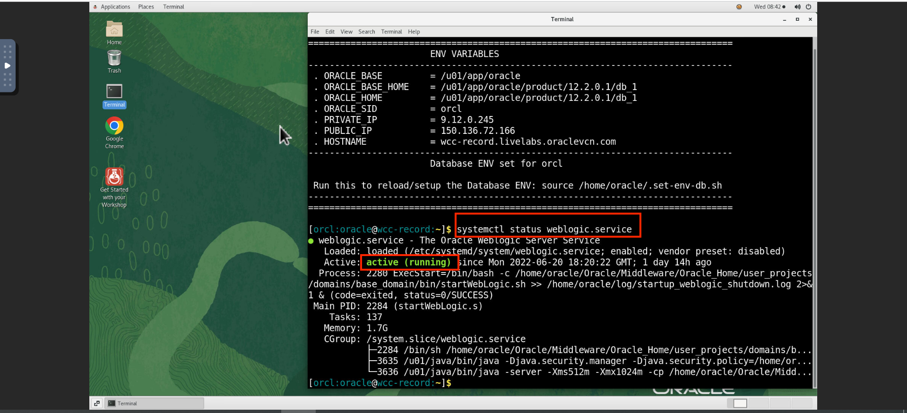
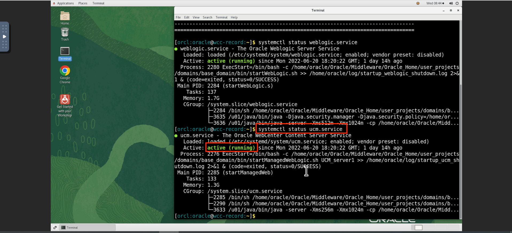
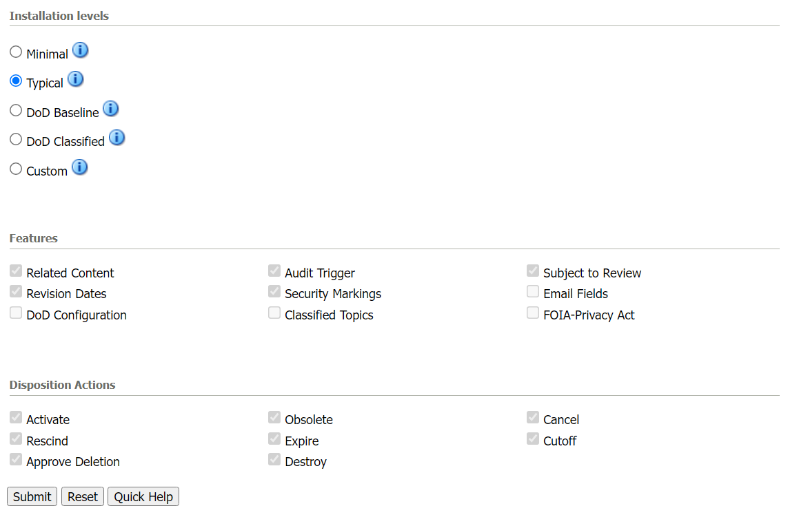

# Initialize Environment

## Introduction

In this lab we will review and startup all components required to successfully run this workshop.

*Estimated Time:* 30 Minutes.

### Objectives

In this lab, you will

- Initialize the workshop environment
- Selecting the Installation option for Records
- Configure Setup Checklist

### Prerequisites

This lab assumes you have:

- A Free Tier, Paid or LiveLabs Oracle Cloud account
- You have completed:
      - Lab: Get Started with noVNC Remote Desktop

## Task 1: Start WebLogic and WebCenter Content Server

Before getting started, you should start the WebLogic server and content server.

1. Login to the demo environment and run the following command to check the status of WebLogic Server and WebCenter Content Server.

       ```
    <copy>systemctl status weblogic.service</copy>
    ```

2. After running the above command in the terminal you must see the status **active(running)** as shown in the image below.

     > **Note:** Make sure to check the status of the servers before starting the lab.



3. Similarly run the following command to check the status of WebCenter Content server.
        ```
    <copy>systemctl status weblogic.service</copy>
    ```



4. Open any browser and type the following URL to access the WebCenter Content Server.
   <http://localhost:16200/cs/>

## Task 2: Install Records on UCM and configure the Setup Checklist

> **Note:** *Records* option in the menu bar indicates that there is already Records installed and configured. In that case you can skip this task and proceed to next lab if Records Initial setup is completed.

1. Login to Content server as an administrator and click on **Configure Records Settings** under Administration tab as shown in the image below.
    

2. Select the software configuration as shown in the image.
      
      

    > **Note:** Restart the servers after selecting the installation settings for the changes to be applied.

3. After the installation is successfully completed ,configure the setup checklist by clicking on **Records** tab,select **Configure** option and then select **Setup Checklist**.
     

4. On the Setup Checklist page install the defaults and configure security settings.
     

You may now **proceed to the next lab**.

## Want to Learn More?

- [Introduction To WebCenter Records](https://docs.oracle.com/en/middleware/webcenter/content/12.2.1.4/index.html)

## Acknowledgements

- **Authors-** Shriraksha S Nataraj, Staff Solution Engineer , Oracle WebCenter Content
- **Contributors-** Shriraksha S Nataraj
- **Last Updated By/Date-** Shriraksha S Nataraj , July 2022
