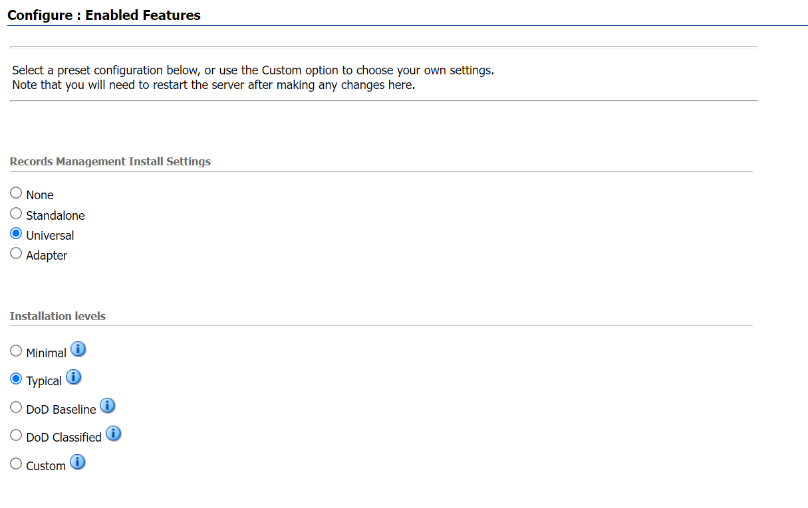
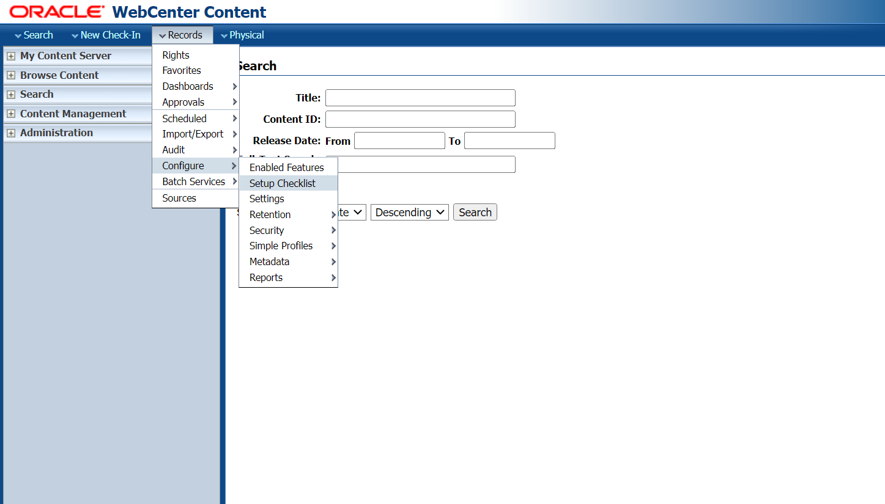

# Initialize Environment

## Introduction

In this lab we will review and startup all components required to successfully run this workshop.This lab walks you through the steps to be followed to login to WebCenter Content Server and install Records Management in WebCenter Content Server.

Estimated Time: 30 Minutes

### Objectives

In this lab, you will

- Initialize the workshop environment
- Selecting the Installation option for Records
- Configure Setup Checklist

### Prerequisites

This lab assumes you have:

- A Free Tier, Paid or LiveLabs Oracle Cloud account
- You have completed:
      - Lab: Get Started with noVNC Remote Desktop

## Task 1: Start WebLogic and WebCenter Content Server

1. Now that you access to your remote desktop session, proceed as indicated below to validate your environment before you start executing the subsequent labs.Make sure that the servers are up and running before starting with the labs.

2. On the *Web Browser* window on the right preloaded with *WebCenter Content* Console, click on the *Username* field and select the saved credentials to log in. These credentials have been saved within the Web Browser and are provided below for reference
     - Username

       ```

    <copy>weblogic</copy>

    ```

     - Password

        ```
    <copy>welcome1</copy>
    ```

      

3. If you are still unable to login or the login page is not functioning after reloading the application URL, open a terminal session and proceed as indicated below to validate the services.

       ```
    <copy>systemctl status weblogic</copy>
    ```

4. After running the above command in the terminal you must see the status **active(running)** as shown in the image below.

    

5. Similarly run the following command to check the status of WebCenter Content server.

       ```
    <copy>systemctl status ucm</copy>
    ```

6. After running the above command in the terminal you must see the status **active(running)** as shown in the image below.

    

## Task 2: Install Records on UCM and configure the Setup Checklist

> **Note:** *Records* option in the menu bar indicates that there is already Records installed and configured. In that case you can skip this task and proceed to next lab if Records Initial setup is completed.

1. Login to Content server as an administrator and click on **Configure Records Settings** under Administration tab as shown in the image below.
    

2. Select the software configuration as shown in the image.
      
      

    > **Note:** Restart the servers after selecting the installation settings for the changes to be applied.

3. After the installation is successfully completed ,configure the setup checklist by clicking on **Records** tab,select **Configure** option and then select **Setup Checklist**.
     

4. On the Setup Checklist page install the defaults and configure security settings.
     

You may now **proceed to the next lab**.

## Learn More

- [Introduction To WebCenter Records](https://docs.oracle.com/en/middleware/webcenter/content/12.2.1.4/index.html)

## Acknowledgements

- **Authors-** Shriraksha S Nataraj, Staff Solution Engineer , Oracle WebCenter Content
- **Contributors-** Shriraksha S Nataraj
- **Last Updated By/Date-** Shriraksha S Nataraj , July 2022
