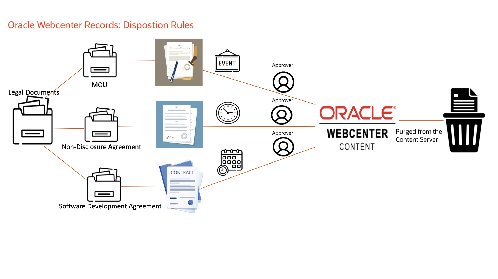
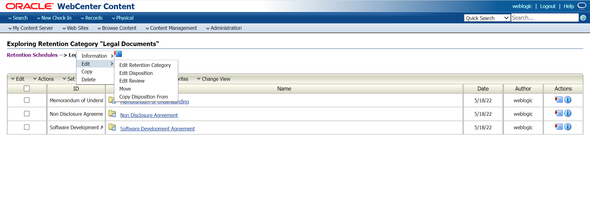

# Time-based disposition Rule on Non-disclosure Agreement Records

## Introduction

This lab will show you how to create a custom trigger for the disposition rule in the **Legal Documents** Category. Additionally, you will learn how to set up a time-based disposition rule on the **Non-disclosure Agreement** Record Folder. This lab also showcases how to set up a user for reviewing the records before getting disposed of.

   

*Estimated Time:* 30 minutes

### Objectives

In this lab, you will:

* Create a Custom Trigger
* Add disposition Rule on Non-Disclosure Agreement Record Folder
* Create User and add record reviewer roles
* Add the User in WebLogic

### Prerequisites

This lab assumes you have:

* A Free Tier, Paid or LiveLabs Oracle Cloud account
* You have completed:
  * Lab: Prepare Setup (*Free-tier* and *Paid Tenants* only)
  * Lab: Environment Setup
  * Lab: Initialize Environment
  * Lab: Event-based Disposition Rule on MOU Records (Task 1 is mandatory)

## Task 1: Create Custom Trigger

A global trigger is a type of custom trigger which happens at a time defined by an administrator. Global triggers have an activation date. The activation date can be a past, present, or future date. A user can create a trigger and delay the activation of a trigger for an indefinite amount of time until the activation is required. In essence, this is a dormant trigger, which does not contain an activation date.

A user can create a trigger that activates immediately, activate a trigger on a certain date and time, or delay the activation of a trigger for an indefinite amount of time until the activation is required.

1. Choose **Records** then **Configure** from the Top menu. Choose **Retention** then **Triggers** from the Page menu. The Configure Triggers Page opens.

   

2. Select the type of trigger to create (Global, Custom Direct, or Indirect).Select **Global Trigger**. Choose **Add**.

3. The Create or Edit Trigger Type Page opens. Enter an Activation Date (If not entered it is considered a dormant trigger, which can be activated later).

   

4. As shown in the image above, enter the **Global Trigger Name** as *Year End* and the **Activation Date**. Once done click on **Create**. Click **Ok**.

## Task 2: Add disposition Rule to Non-Disclosure Agreement Record Folder

  1. Click on **Legal Documents** under **Browse Content**. In the Retention Category Page, Click on **Edit Disposition** for the Legal Documents Category.

     

  2. Click on **Add** to add another disposition rule. From the **After** list, select the custom trigger *Year End* from the list and for the **Wait for** field select **Month** and give the integer value as *1*. In the **Do** list, select *Expire* and for the **Notification Reviewer** field, select *user used for login to wcc* for reviewing the record before disposition to act.
     

  3. In the **Advanced** Section, select the records folder *Non-disclosure Agreement* and click on **Ok**.

  4. Click on **Submit Update** to apply changes to the Non-disclosure Agreement Record folder.Click **Ok**.

## Task 3: Create User and add record reviewer roles

<if type="Weblogic">
If your WebCenter Content is configured with weblogic credential store, follow the steps outlined under this tab and ignore steps under **Oracle Cloud Infrastructure Console** tab.

To update index in WCC follow these steps:

1. Login to WebCenter Content Administration Desktop Client as user with Administrator Privilege.
2. Click on **User Admin** Link

3. Click on **Add** to create the user on the User Admin page. Select **Local** as the authorization type.
     

     

4. Add the details as shown in the image below. Click on **Ok**.
     

5. Select the user from the list and click on **Edit**.

6. Go to the **Roles** tab and select **Add Role**.
     

7. Select **rma**,**rmaadmin** role as shown image below. Press shift and select both at once. Click on **Ok**.
     

8. In the main menu, Click on the **Aliases** tab and select **RmaReviewers** and click on **Edit**.
     

9. Click on **Add**, and select the user *Mark*. Click on **Ok**.
      
</if>

<if type="IDCS">

If your WebCenter Content is configured with IDCS, follow the steps outlined under this tab and ignore steps under **Weblogic Server** tab.

### Create Users

1. Sign in to the Oracle Cloud Infrastructure Console [ **Using the steps mentioned in Appendix 1** ]
2. Open the navigation menu and click **Identity & Security**. Under **Identity**, click **Domains**. A list of the existing Domains in your tenancy is displayed.

3. Select the **Compartment** and then the **domain** which is integrated with your wcc instance

4. Click the **Users** and then **Create User**

5. Enter the **Last name**, **Username** and **Email**. Click **Create**.

* **Last name**: Enter

```Text
<copy>Mark</copy>
```

* **Username**: Select

```Text
<copy>Mark</copy>
```

* Uncheck **Use the email address as the username**

* **Email**: Enter the email which you have access and click **Create**

```Text
<copy>firstname.lastname@email.com</copy>
```


6. You will receive an email to activate your profile account. Click on **Activate Your Account** in the email

7. Enter the Password in **Reset Your Password** screen and click **Reset Password**

* **New Password**: Enter

```Text
<copy>Welcome1</copy>
```

* **Confirm New Password**: Enter

```Text
<copy>Welcome1</copy>
```


### Create Groups

1. Sign in to the Oracle Cloud Infrastructure Console [ **Using the steps mentioned in Appendix 1** ]
2. Open the navigation menu and click **Identity & Security**. Under **Identity**, click **Domains**. A list of the existing Domains in your tenancy is displayed.

3. Select the **Compartment** and then the **domain** which is integrated with your wcc instance

4. Click the **Groups** and then **Create Group**

5. Enter the **Name** and **Description**. Click **Create**.

* **Name**: Enter

```Text
<copy>rma</copy>
```

* **Description**: Enter

```Text
<copy>rma</copy>
```


6. Similarly create another group rmaadmin.

### Assign group membership to the User

To Assign Group membership to users in WCC follow these steps:

1. Sign in to the Oracle Cloud Infrastructure Console [ **Using the steps mentioned in Appendix 1** ]
2. Open the navigation menu and click **Identity & Security**. Under **Identity**, click **Domains**. A list of the existing Domains in your tenancy is displayed.

3. Select the **Compartment** and then the **domain** which is integrated with your wcc instance

4. Click the **Users** and then user **Mark**

5. Click the **Assign user to Groups**

6. search for "rma" and select **rma**, **rmaadmin**  and click **Assign user** or **OK**

7. Since there are multiple groups in IDCS, the guest group may not appear on the same page. To assign the guest group to the user, follow step 5, then search for "guest", select the guest group, and assign it to the user.

>Note there might be slight variation in the IDCS UI based on IDCS version used


8. IDCS users will not appear in WCC unless they have logged into WCC at least once. To address this, login to WCC as Mark

</if>

You may now **proceed to the next lab**.

## Appendix 1: Sign in to Oracle Cloud Infrastructure Console

If your WebCenter Content is configured with IDCS, follow the steps below to sign in to the Oracle Cloud Infrastructure console. Ignore if instance is configured with Weblogic Credential Store.

  1. Go to <http://cloud.oracle.com>.

  2. Enter your cloud account name and click Next.

  3. Sign in to the Oracle Cloud Infrastructure console:

      * If your cloud account uses identity domains, sign in to the Oracle Cloud Infrastructure console as a user configured in Oracle Cloud Infrastructure Identity and Access Management (IAM).
        * Select the default domain.

      * If your cloud account does not use identity domains, sign in to the Oracle Cloud Infrastructure console as a user federated through Oracle Identity Cloud Service.
        * Under Single Sign-On (SSO) options, note the identity provider selected in the Identity Provider field and click Continue.

  4. Enter the user name and password provided in the welcome email, and click Sign In. The Oracle Cloud Infrastructure console is shown.

## Learn More

* [Defining and Processing Dispositions](https://docs.oracle.com/en/middleware/webcenter/content/12.2.1.4/webcenter-content-manage/defining-and-processing-dispositions.html#GUID-0827B335-BA5E-4B9C-9270-27BE4520391C)

## Acknowledgements

* **Authors-** Shriraksha S Nataraj, Staff Solution Engineer, Oracle WebCenter Content
* **Contributors-** Shriraksha S Nataraj, Sujata Nayak, Senthilkumar Chinnappa, Mandar Tengse , Parikshit Khisty
* **Last Updated By/Date-** Sujata Nayak, March 2025
