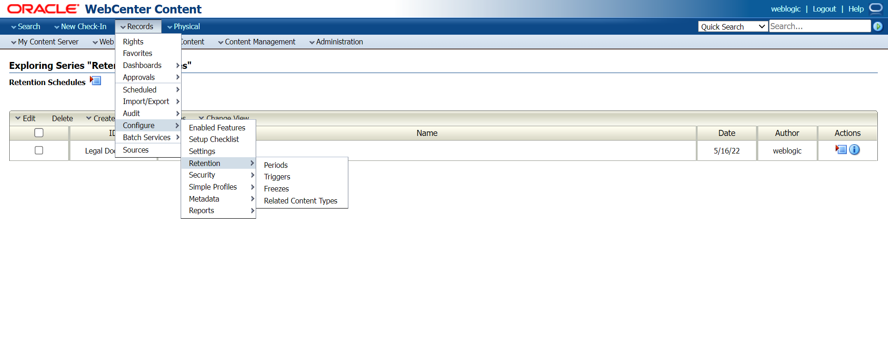
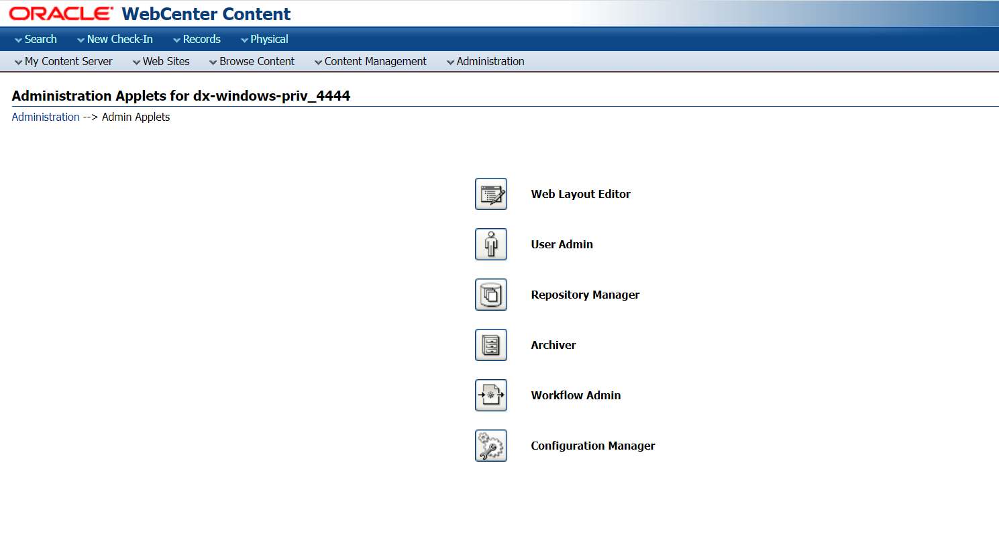

# Time-based disposition Rule on Non-disclosure Agreement Records

## Introduction

This lab will show you how to create a custom trigger for the disposition rule in the **Legal Documents** Category. Additionally, you will learn how to set up a time-based disposition rule on the **Non-disclosure Agreement** Record Folder. This lab also showcases how to set up a user for reviewing the records before getting disposed of.

   

*Estimated Time:* 30 minutes

### Objectives

In this lab, you will:

* Create a Custom Trigger
* Add disposition Rule on Non-Disclosure Agreement Record Folder
* Create User and add record reviewer roles
* Add the User in WebLogic

### Prerequisites
This lab assumes you have:
- A Free Tier, Paid or LiveLabs Oracle Cloud account
- You have completed:
    - Lab: Prepare Setup (*Free-tier* and *Paid Tenants* only)
    - Lab: Environment Setup
    - Lab: Initialize Environment
    - Lab: Event-based Disposition Rule on MOU Records (Task 1 is mandatory)

## Task 1: Create Custom Trigger

A global trigger is a type of custom trigger which happens at a time defined by an administrator. Global triggers have an activation date. The activation date can be a past, present, or future date. A user can create a trigger and delay the activation of a trigger for an indefinite amount of time until the activation is required. In essence, this is a dormant trigger, which does not contain an activation date.

A user can create a trigger that activates immediately, activate a trigger on a certain date and time, or delay the activation of a trigger for an indefinite amount of time until the activation is required.

1. Choose **Records** then **Configure** from the Top menu. Choose **Retention** then **Triggers** from the Page menu. The Configure Triggers Page opens.

   

2. Select the type of trigger to create (Global, Custom Direct, or Indirect).Select **Global Trigger**. Choose **Add**. The Create or Edit Trigger Type Page opens. Enter an Activation Date (If not entered it is considered a dormant trigger, which can be activated later).

   

3. As shown in the image above, enter the **Global Trigger Name** as *Year End* and the **Activation Date**. Once done click on **Create**. Click **Ok**.

## Task 2: Add disposition Rule to Non-Disclosure Agreement Record Folder

  1. Click on **Legal Documents** under **Browse Content**. In the Retention Category Page, Click on **Edit Disposition** for the Legal Documents Category.

     

  2. Click on **Add** to add another disposition rule. From the **After** list, select the custom trigger *Year End* from the list and for the **Wait for** field select **Month** and give the integer value as *1*. In the **Do** list, select *Expire* and for the **Notification Reviewer** field, select the user *weblogic* for reviewing the record before disposition to act.

     

  3. In the **Advanced** Section, select the records folder *Non-disclosure Agreement* and click on **Ok**.

  4. Click on **Submit Update** to apply changes to the Non-disclosure Agreement Record folder.Click **Ok**.

## Task 3: Create User and add record reviewer roles

  1. Users with an admin role can create Users and assign necessary Roles. Go to the **Administration** tab and select **Admin Applets**.
     

  2. Click on the **User Admin** applet. Open the downloaded file. If there are any java update suggestions, click on *later*. If there are any security warning windows, click on *Run*.
     

     

  3. Click on **Add** to create the user on the User Admin page. Select **Local** as the authorization type.
     

     

  4. Add the details as shown in the image below. Click on **Ok**.
     

  5. Select the user from the list and click on **Edit**.

  6. Go to the **Roles** tab and select **Add Role**.
     

  7. Select **rma**,**rmaadmin** role as shown image below. Press shift and select both at once. Click on **Ok**.
     

  8. In the main menu, Click on the **Aliases** tab and select **RmaReviewers** and click on **Edit**.
     

  9. Click on **Add**, and select the user *Mark*. Click on **Ok**.
      

You may now **proceed to the next lab**.

## Learn More

* [Defining and Processing Dispositions](https://docs.oracle.com/en/middleware/webcenter/content/12.2.1.4/webcenter-content-manage/defining-and-processing-dispositions.html#GUID-0827B335-BA5E-4B9C-9270-27BE4520391C)

## Acknowledgements

* **Author-** Shriraksha S Nataraj, Staff Solution Engineer, Oracle WebCenter Content
* **Contributors-** Shriraksha S Nataraj
* **Last Updated By/Date-** Shriraksha S Nataraj, August 2022
