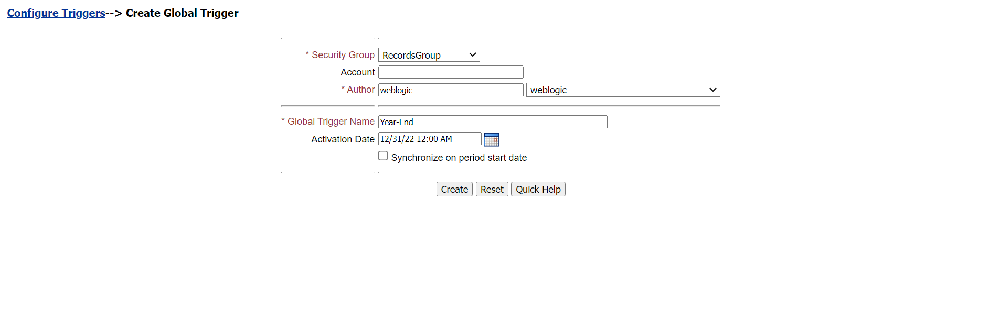

# Time-based disposition Rule on Non-disclosure Agreement Records

## Introduction

This lab will show you how to create a custom trigger for the disposition rule in the Legal Documents Category. Additionally, you will learn how to set up a time-based disposition rule on the Non-disclosure Agreement Record Folder. This lab also showcases how to set up a user for reviewing the records before getting disposed of.

   

*Estimated Time:* 30 minutes

### Objectives

In this lab, you will:

* Create a Custom Trigger
* Add disposition Rule on Non-Disclosure Agreement Record Folder
* Create User and add record reviewer roles

### Prerequisites
This lab assumes you have:
- A Free Tier, Paid or LiveLabs Oracle Cloud account
- You have completed:
    - Lab: Prepare Setup (*Free-tier* and *Paid Tenants* only)
    - Lab: Environment Setup
    - Lab: Initialize Environment
    - Lab: Event-based Disposition Rule on MOU Records (Task 1 is mandatory)

## Task 1: Create Custom Trigger

The global trigger is a type of custom trigger which happens at a time defined by an administrator. Global triggers have an activation date. The activation date can be a past, present, or future date. A user can create a trigger and delay the activation of a trigger for an indefinite amount of time until the activation is required. In essence, this is a dormant trigger, which does not contain an activation date.

A user can create a trigger that activates immediately, activate a trigger on a certain date and time, or delay the activation of a trigger for an indefinite amount of time until the activation is required.

1. Choose Records then Configure from the Top menu. Choose Retention then Triggers from the Page menu. The Configure Triggers Page opens.

   

2. Select the type of trigger to create (Global, Custom Direct, or Indirect). Choose Add. The Create or Edit Trigger Type Page opens. Enter an Activation Date (If not entered it is considered a dormant trigger, which can be activated later).

   

3. As shown in the image above, enter the trigger name as **Year End** and the activation date. Once done click on Create.

## Task 2: Add disposition Rule to Non-Disclosure Agreement Record Folder

  1. In the Retention Category Page, Click on Edit Disposition for Legal Documents Category.

     

  2. Click on **Add** to add another disposition rule. From the After list selects the custom trigger Year end from the list and for the retention period field select Months and give the integer value as 6. In the Do, list select Expire and for the notification, the reviewer field selects the user Mark for reviewing the record before disposition to act.

     

  3. In the Advanced Section, select the records folder Non-disclosure Agreement and click on Ok.

  4. Click on **Submit Update** to apply changes to the Non-disclosure Agreement Record folder.

## Task 3: Create User and add record reviewer roles

  1. Users with an admin role can create Users and assign necessary Roles. Go to the **Administration** tab and select **Admin Applets**

  2. Run the **User Admin** applet and click on **Add** to create the user. Add the details as shown in the image below. And go to **Roles** and add RMA, admin role to the user.
     
     
     
     

  3. In the main menu, Click on Aliases and select RmaReviewers. Add the user Mark by clicking on the **Add** option.
      

You may now **proceed to the next lab**.

## Want to Learn More?

* [Defining and Processing Dispositions](https://docs.oracle.com/en/middleware/webcenter/content/12.2.1.4/webcenter-content-manage/defining-and-processing-dispositions.html#GUID-0827B335-BA5E-4B9C-9270-27BE4520391C)

## Acknowledgements

* **Author-** Shriraksha S Nataraj, Staff Solution Engineer, Oracle WebCenter Content
* **Contributors-** Shriraksha S Nataraj
* **Last Updated By/Date-** Shriraksha S Nataraj,July 2022
