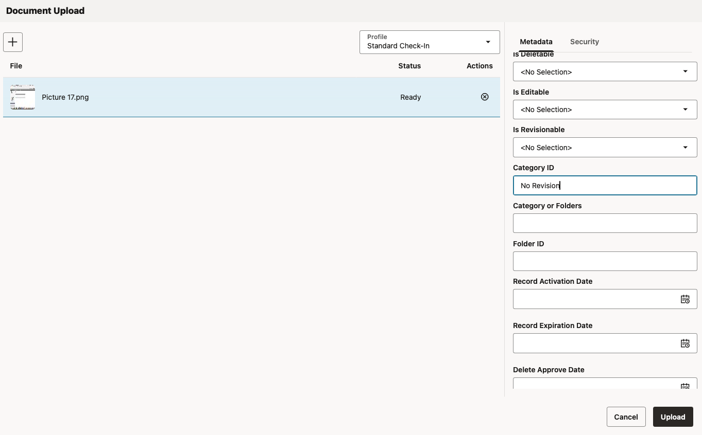

# Legal Hold on Records

## Introduction

This lab guides you through the content customization features of WebCenter Records Management, which limit user's ability to perform certain actions on content. When creating a retention category, the following security restrictions can be applied:

* Restrict Revisions: Users without the RMA Right of Record.Revise cannot revise any content in this category, even if they have WCC write access.
* Restrict Deletes: Users without the RMA Right of Record.Delete cannot delete any content in this category, even if they have WCC delete access and are listed as authors.
* Restrict Edits: Users without the RMA Right of Record.Edit cannot update the metadata of any content in this category, even if they have WCC write access.
* Transfer or Accession to NARA (Permanent): No revisions, deletions, or edits are allowed, even for users with these RMA rights

*Estimated Time:* 20 minutes

### Objectives

In this lab, you will

* Create content category
* Apply the this category on the Record

### Prerequisites

This lab assumes you have:

* A Free Tier, Paid or LiveLabs Oracle Cloud account
* You have completed:
  * Lab: Initialize Environment

## Task 1: Create Retention Category

1. Log in to WebCenter Content Server.

2. Click **Browse Content** then **Retention Schedules**

3. On the Exploring Retention Schedule page, choose **Create** and then **Create Retention Category** on the page menu.


4. On the Create or Edit Retention Category page, enter the details as shown below and  Click **Create**.

```text
Records Category Identifier : No Revision
Records Category Name : No Revision
Records Category Description : No Revision
Disposition Authority : No Revision
Restrict Revisions: Checked
```


## Task 2: Login to WCC RedwoodUI and traverse to folders root folder

To Login to WCC RedwoodUI follow these steps:

1. Open the *web browser* window with **WebCenter Content** redwood url, click on the **Login** and Login using the below credentials

* URL

```text
<copy>https://localhost:16200/cs/idcplg?IdcService=REDWOODUI</copy>
```

> Note : Replace `"https://localhost"` with your **hosturl** ( eg: `"http://wcc-rfpmgmt-livelab.livelabs.oraclevcn.com"` or `"https://192.0.0.0"`)

* Username

```text
<copy>weblogic</copy>
```

* Password

```text
<copy>Welcome1</copy>
```

> *Note: In the scenario, where WebCenter Content is configured with IDCS or any other username (other than **weblogic**), use user credentials accordingly*


2. On successful login, click on **Browse** from bottom navigation bar


3. From folder breadcrumbs select **Folder parent items menu** > **Root**. Wait for folder and files from root folders to be listed in WCC Listing view.


## Task 3: Create Folder

To create folder re RedwoodUI follow these steps:

1. In WCC RedwoodUI navigate to root folder and click on **Create Folder** Icon

2. In **Create Folder** dialog Enter **Name**, **Description** and click **Create Folder**

* Name

 ```text
 <copy>No Revision Folder</copy>
 ```

* Description

 ```text
 <copy>No Revision Folder</copy>
 ```


## Task 4: Upload document and Set Category ID

1. In WCC RedwoodUI navigate to **root** > **No Revision Folder** folder and click on Upload Icon

2. Either Drag and drop the document in **Document Upload** area or click **Document Upload** area and select the document to upload

3. In **Metadata** Tab and set **Category ID** to *No Revision*, category created in Task1.
4. Click Upload


## Task 5: Verify Revision restriction on content

1. In WCC RedwoodUI navigate to **root** > **No Revision Folder** folder and select the document uploaded in Task 3
2. Click on **Check Out** from Menu

3. Verify you get the message

>Failed to checkout document
>Unable to check out 'Content ID'. Cannot checkout content item: Not Revisionable.


## Learn More

* [Defining and Processing Dispositions](https://docs.oracle.com/en/middleware/webcenter/content/12.2.1.4/webcenter-content-manage/defining-and-processing-dispositions.html#GUID-0827B335-BA5E-4B9C-9270-27BE4520391C)

## Acknowledgements

* **Authors-** Sujata Nayak, Consulting Member Technical Staff, Oracle WebCenter Content
* **Contributors-** Sujata Nayak, Senthilkumar Chinnappa, Mandar Tengse , Parikshit Khisty
* **Last Updated By/Date-** Sujata Nayak, March 2025
