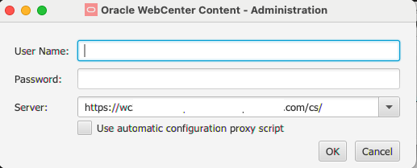
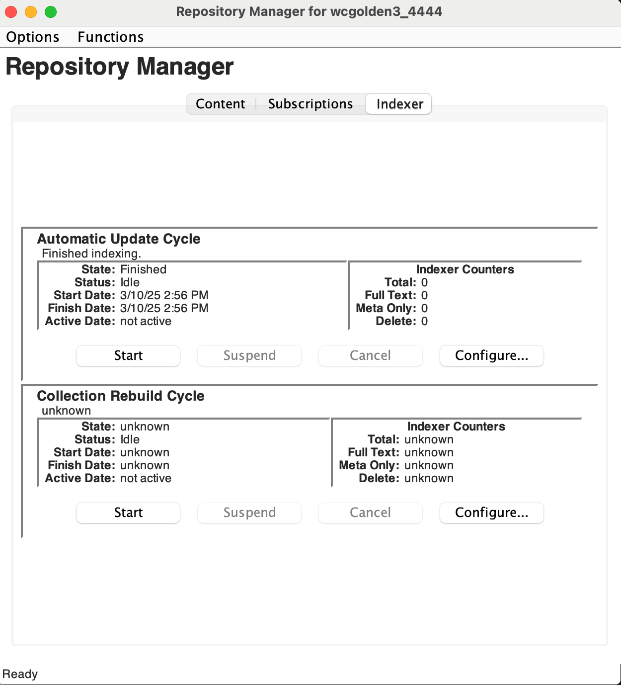

# Initialize Environment

## Introduction

In this lab, we will review and startup all components required to successfully run this workshop.

*Estimated Time:* 25 Minutes.

### Objectives

In this lab, you will

- Initialize the workshop environment
- Selecting the Installation option for Records
- Configure Setup Checklist

### Prerequisites

This lab assumes you have :

- Access to WCC Marketplace Environment

## Task 1: Validate That WCC Instance is Up and Running

Proceed as indicated below to validate your environment before you start executing the subsequent labs.

1. Open the *web browser* window with **WebCenter Content** homepage url. Click on the **Login** and Login using the below credentials

- URL

```text
<copy>http://localhost:16200/cs/</copy>
```

> Note: Replace `"https://localhost"` with your **hosturl** ( eg: `"http://wcc-livelab.livelabs.oraclevcn.com"` or `"https://192.0.0.0"`)

- Username

```text
<copy>weblogic</copy>
```

- Password

```text
<copy>welcome1</copy>
```

 > *Note: In the scenario, where WebCenter Content is configured with IDCS or any other username (other than **weblogic**), use user credentials accordingly*

  
  
2. Confirm successful login.

   

   If successful, the page above is displayed and as a result, your environment is now ready.  
3. If you are still unable to log in or the login page is not functioning after reloading ,  proceed as indicated in the **Appendix 1: Restart UCM Server Instance** to restart the services and try login again
4. After you log in to the WebCenter Content Instance successfully, you can proceed with the next Task.

## Task 2: Install Records on WebCenter Content

To install Records on WebCenter Content, follow the below steps;

1. Log in to the Content server as an administrator and click on **Configure Records Settings** under the **Administration** tab as shown in the image below.

    

2. Select the software configuration as shown in the images and press **Submit**.

    
    

    > **Note:** Restart the servers after selecting the installation settings for the changes to be applied.

3. After the installation is completed, configure the setup checklist by clicking on the **Records** tab, selecting the **Configure** option and then selecting **Setup Checklist**.

    

4. On the Setup Checklist page install the defaults (Click on each link under Define Defaults).

    

5. For "Default Metadata for Checked-in Audit Entries", enter **Title:** as **Record Management** and press **Submit Update**


6. For "Checked-in Screening Reports Default Metadata", enter **Title:** as **Record Management** and press **Submit Update**


7. For "Checked-in Reservation Default Metadata", press **Submit Update**


8. Select the checkbox against all other options in Setup Checklist screen and press Submit
 

You may now **proceed to the next lab**.

## Task 3: Download and install Oracle WebCenter Content Administration Desktop Client

To Install WebCenter Content Administration Desktop Client, follow the below steps;

1. Login to WebCenter Content server as user with Administrator Privilege, Under **Administration** tab, navigate to **Admin Applets**. Click on **Download Client** button. This downloads wccadmin-installer.msi file on windows and wccadmin-installer.dmg file on mac


2. Install the wcc admin client:
<if type="MAC">

- Double click on downloaded wccadmin-installer.dmg
- Move the **Oracle WebCenter Content Administration** to **Applications**
 
</if>

<if type="Windows">
 * Double click on downloaded wccadmin-installer.msi
 
 * Wait for the installation to complete
</if>

## Task 4: Configure Oracle WebCenter Content Administration Desktop Client

To Configure WebCenter Content Administration Desktop Client, follow the below steps;

1. Launch WebCenter Content Administration Desktop Client.
<if type="Windows">

- In Windows Start menu search **Oracle WebCenter Content Administration**
- Click on **Oracle WebCenter Content Administration** app
 
</if>

<if type="MAC">
- In Mac **Spotlight search** search **Oracle WebCenter Content Administration**
- Click on **Oracle WebCenter Content Administration** app
 
</if>
2. Enter the **User Name, Password, Server**. Click **OK**.

- **User Name**: Enter

```text
<copy>weblogic</copy>
```

- **Password**: Enter

```text
<copy>Welcome1</copy>
```

- **Server**: Enter

```text
<copy>https://localhost:16200/cs/</copy>
```

 > Note : Replace `"https://localhost"` with your **hosturl** ( eg: `"http://wcc-document-livelab.livelabs.oraclevcn.com"` or `"https://192.0.0.0"`)


3. If **Warning** dialog is opened due to insecure certificate, press **Yes** to continue.

4. Wait for WebCenter Content Administration Dialog to open


## Task 5: Update index

To update index in WCC follow these steps:

1. Login to WebCenter Content Administration Desktop Client as user with Administrator Privilege.
2. Click on **Repository Manager** Link

3. Click on **Indexer** Tab
4. Click on **Start** Button in **Automatic Update Cycle** and **Collection Rebuild Cycle** one after other and wait for indexing to finish.



## Appendix 1: Restart UCM Server Instance

1. Login to the WebCenter Content Weblogic console as administrator user (eg : weblogic)

2. Navigate to **Environment** > **Servers** > **Control** tab and select the checkbox for **UCM Server**(s)

3. click on **Shutdown** > **Force Shutdown**

4. After the Server changes to **SHUTDOWN** state, select the checkbox for **UCM Server**(s), click on **Start** button

You may now **proceed to the next lab**.

## Learn More

- [Introduction To WebCenter Records](https://docs.oracle.com/en/middleware/webcenter/content/12.2.1.4/index.html)

## Acknowledgements

- **Authors-** Shriraksha S Nataraj, Staff Solution Engineer, Oracle WebCenter Content
- **Contributors-** Shriraksha S Nataraj, Sujata Nayak, Senthilkumar Chinnappa, Mandar Tengse , Parikshit Khisty
- **Last Updated By/Date-** Sujata Nayak, March 2025
