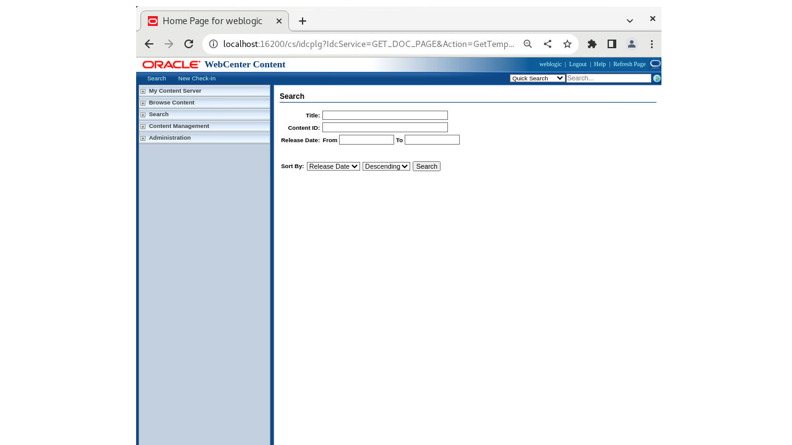
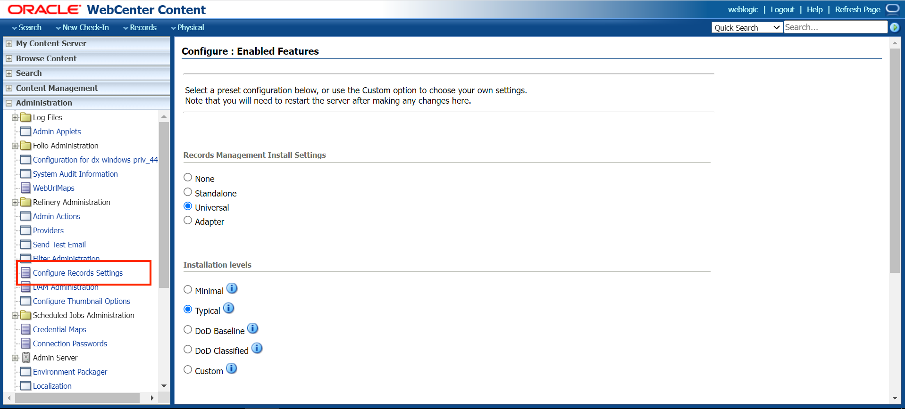
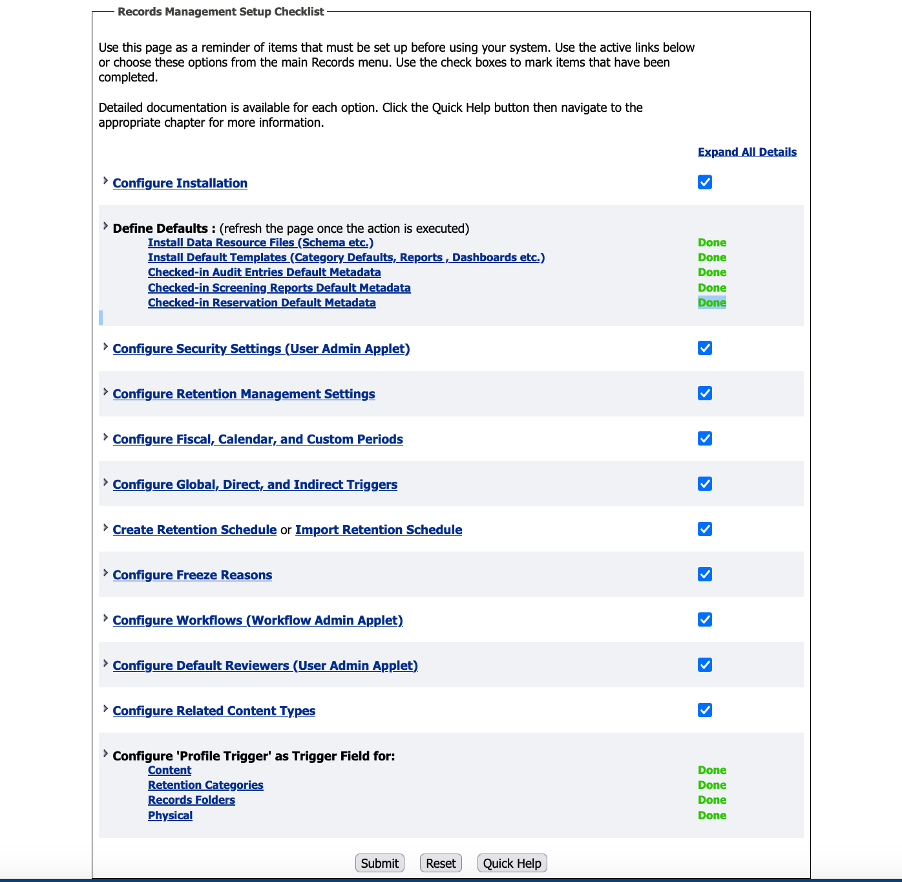

# Initialize Environment

## Introduction

In this lab, we will review and startup all components required to successfully run this workshop.

*Estimated Time:* 30 Minutes.

### Objectives

In this lab, you will

- Initialize the workshop environment
- Selecting the Installation option for Records
- Configure Setup Checklist

### Prerequisites
This lab assumes you have:
- A Free Tier, Paid or LiveLabs Oracle Cloud account
- You have completed:
    - Lab: Prepare Setup (*Free-tier* and *Paid Tenants* only)
    - Lab: Environment Setup

## Task 1: Validate That Required Processes are Up and Running
1. Now with access to your remote desktop session, proceed as indicated below to validate your environment before you start executing the subsequent labs. The following Processes should be up and running:

    - Database Listener
        - LISTENER
    - Database Server instance
        - ORCL
    - WebLogic Server
    - WebCenter Content Server

2. On the *web browser* window on the right preloaded with *WebCenter Content* homepage, click on the *Login* and select the saved credentials to sign in. These credentials have been saved within *web browser* and are provided below, alongside the URL, for reference

    - URL

    ```
    <copy>http://localhost:16200/cs/</copy>
    ```

    - Username

    ```
    <copy>weblogic</copy>
    ```

    - Password

    ```
    <copy>welcome1</copy>
    ```

    
    


3. Confirm successful login.

    

    If successful, the page above is displayed and as a result, your environment is now ready.  

4. If you are still unable to log in or the login page is not functioning after reloading by double-clicking on the desktop icon *Get Started with your Workshop*, open a terminal session and proceed as indicated below to validate the services.

    - Database and Listener

    ```
    <copy>
    sudo systemctl status oracle-database
    </copy>
    ```

    

    - WebLogic Server

    ```
    <copy>
    sudo systemctl status weblogic
    </copy>
    ```

    

    - WebCenter Content Server

    ```
    <copy>
    sudo systemctl status ucm
    </copy>
    ```

    

5. If you see the questionable output(s), failure or down component(s), restart the corresponding service(s) accordingly

    - Database and Listener

    ```
    <copy>
    sudo sudo systemctl restart oracle-database
    </copy>
    ```

    - WebLogic Server

    ```
    <copy>
    sudo sudo systemctl restart weblogic
    </copy>
    ```

    - WebCenter Content Server

    ```
    <copy>
    sudo systemctl restart ucm
    </copy>
    ```

6. After you log in to the WebCenter Content server, you can see that records are already pre-configured. Refer the Appendix 2 to know how to install Records on the WebCenter Content Server.

You may now **proceed to the next lab**.

## Appendix 1: Managing Startup Services

1. Database Service (Database and Listener).

    - Start

    ```
    <copy>sudo systemctl start oracle-database</copy>
    ```

    - Stop

    ```
    <copy>sudo systemctl stop oracle-database</copy>
    ```

    - Status

    ```
    <copy>sudo systemctl status oracle-database</copy>
    ```

    - Restart

    ```
    <copy>sudo systemctl restart oracle-database</copy>
    ```

2. WebLogic Server

    - Start

    ```
    <copy>sudo systemctl start weblogic</copy>
    ```

    - Stop

    ```
    <copy>sudo systemctl stop weblogic</copy>
    ```

    - Status

    ```
    <copy>sudo systemctl status weblogic</copy>
    ```

    - Restart

    ```
    <copy>sudo systemctl restart weblogic</copy>
    ```
3. WebCenter Content Server

    - Start

    ```
    <copy>sudo systemctl start ucm</copy>
    ```

    - Stop

    ```
    <copy>sudo systemctl stop ucm</copy>
    ```

    - Status

    ```
    <copy>sudo systemctl status ucm</copy>
    ```

    - Restart

    ```
    <copy>sudo systemctl restart ucm</copy>
    ```

## Appendix 2: Installation of Records on WebCenter Content

1. Log in to the Content server as an administrator and click on **Configure Records Settings** under the Administration tab as shown in the image below.

    

2. Select the software configuration as shown in the image.

    
    

    > **Note:** Restart the servers after selecting the installation settings for the changes to be applied.

3. After the installation is completed, configure the setup checklist by clicking on the **Records** tab, selecting the **Configure** option and then selecting **Setup Checklist**.

    

4. On the Setup Checklist page install the defaults and configure security settings.

    

## Learn More

- [Introduction To WebCenter Records](https://docs.oracle.com/en/middleware/webcenter/content/12.2.1.4/index.html)

## Acknowledgements

- **Authors-** Shriraksha S Nataraj, Staff Solution Engineer, Oracle WebCenter Content
- **Contributors-** Shriraksha S Nataraj, Rene Fontcha
- **Last Updated By/Date-** Shriraksha S Nataraj, August 2022