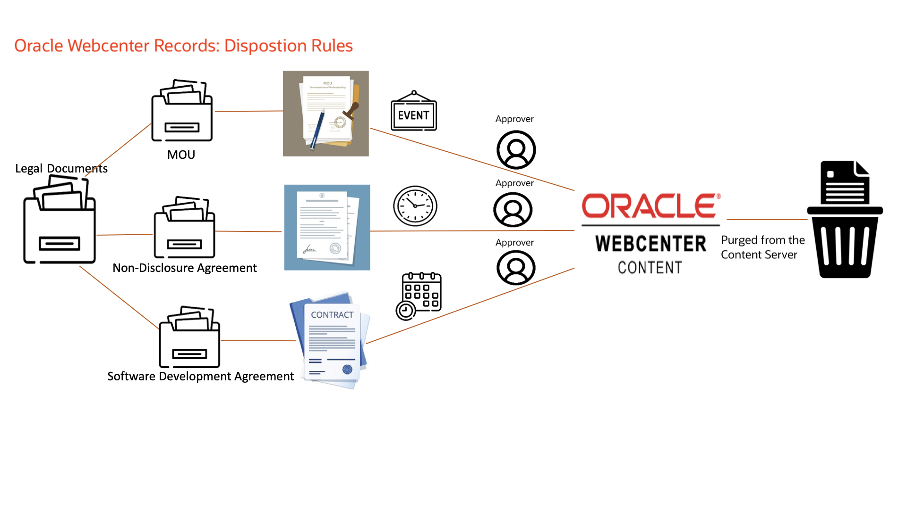
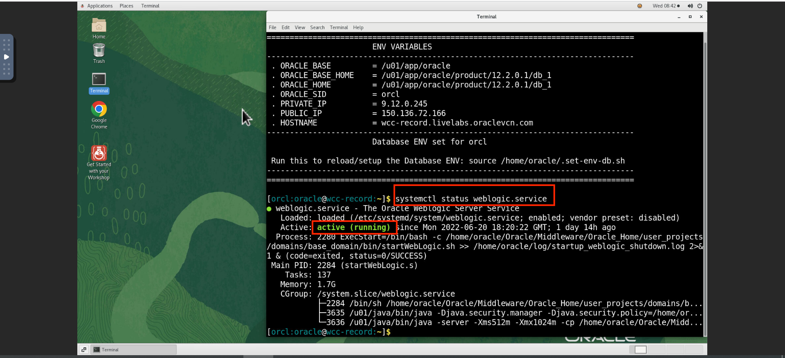
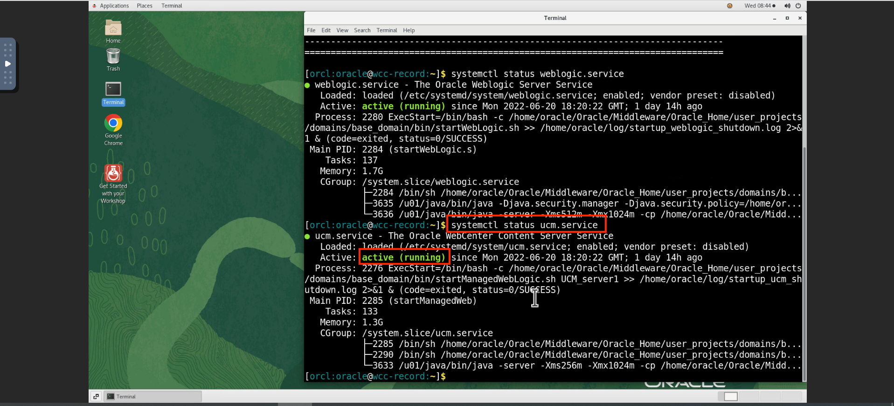
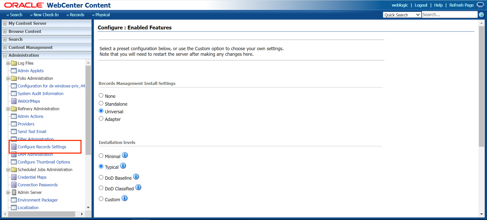
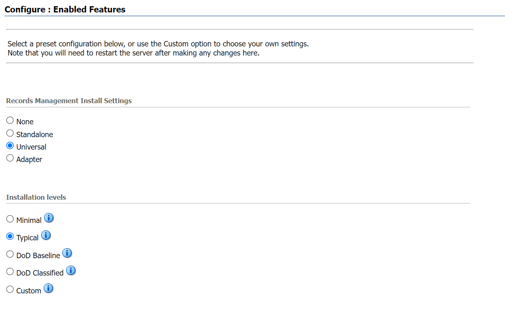

# Introduction

## About WebCenter Content Records Management
Oracle WebCenter Content provides unified records management capability across all the high­value information stored within it, including website content, electronic documents, digital assets, and images. This enables Oracle WebCenter Content to uniquely deliver a complete end-to-end system for document lifecycle management – from creation or capture to revision to archive and disposition. Oracle WebCenter Content Records Management system lets you retain and dispose Organization's content by applying disposition or retention policies on the record. Not only must content be maintained, but it must also be defensibly disposed once its usefulness has expired. Oracle WebCenter Content enables both the retention and disposition of information, allowing organizations to define, manage, and execute records and retention policies for all enterprise content from a single application.
 

## About this Workshop

In this workshop, you will understand the different types of disposition rules that can be applied to the 3 different record folders shown in the diagram below. An organization has legal documents that need to be categorized and stored in separate folders. Depending on its usage, records that are no longer required, need to be purged from the system. WebCenter Content Records Management provides various predefined events, retention periods, and actions that can be used according to the requirements.
    

The Retention Category named **Legal Documents** contains 3 record folders: **MOU's**, **Non-disclosure Agreements**, and **Software Development Agreements**, each containing legal records. An *event-based* disposition rule is applied to the **MOU** Record Folder, where based on the occurrence of the event, the record gets closed or cut off and goes through an approval process before getting purged from the system. For the **Non-disclosure Agreement Record Folder**, the *time-based disposition* rule acts on the agreements. Based on a certain time period defined by the user, the agreement gets archived or removed from the system. Finally, an *event-time-based* disposition rule is applied to the **Software Development Agreement** record folder, which occurs when both an event and a time period defined by the user occur. After the records in each specific record folder have met the condition and been retained for a certain time period, they are then purged from the system after receiving approval from the authorised user based on the configuration.

Estimated Time: 30 minutes

### Objectives

In this workshop, you will:
* Start WebLogic and WebCenter Content Server
* Selecting the Installation option for Records
* Configure Setup Checklist

## Task 1: Start WebLogic and WebCenter Content Server

Before getting started, you should start the WebLogic server and content server.

1.  Login to the demo environment and run the following command to check the status of Weblogic Server and WebCenter Content Server.
       ```
    <copy>systemctl status weblogic.service</copy>
    ```

2.  After running the above command in the terminal you must see the status **active(running)** as shown in the image below.
    > **Note:** Make sure to check the status of the servers before starting the lab.



3. Similarly run the following command to check the status of WebCenter Content server.
        ```
    <copy>systemctl status weblogic.service</copy>
    ```



3. Open any browser and type the following URL to access the WebCenter Content Server.
   http://localhost:16200/cs/


## Task 2: Install Records on UCM and configure the Setup Checklist.

> **Note:** **Records** option in the menu bar indicates that there is already Records installed and configured. In that case you can skip this task and proceed to next lab if Records Initial setup is completed.


1. Login to Content server as an administrator and click on **Configure Records Settings** under Administration tab as shown in the image below.
    

2.  Select the software configuration as shown in the image.
      
      

    > **Note:** Restart the servers after selecting the installation settings for the changes to be applied.


3. After the installation is successfully completed ,configure the setup checklist by clicking on **Records** tab,select **Configure** option and then select **Setup Checklist**.
     

4. On the Setup Checklist page install the defaults and configure security settings.
     


You may now [proceed to the next lab](#next).

## Want to Learn More?

* [Introduction To WebCenter Records](https://docs.oracle.com/en/middleware/webcenter/content/12.2.1.4/index.html)


## Acknowledgements

* **Authors:**
    * Shriraksha S Nataraj, Staff Solution Engineer , Oracle WebCenter Content
* **Contributors:**
    * Shriraksha S Nataraj
    
* **Last Updated By/Date:** Shriraksha S Nataraj , June 2022
