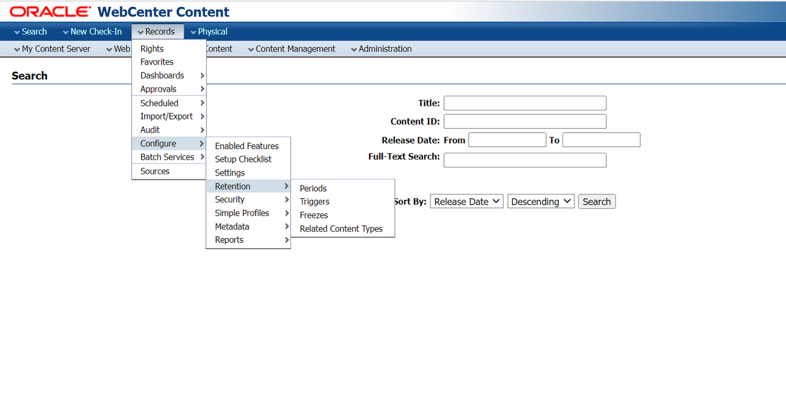
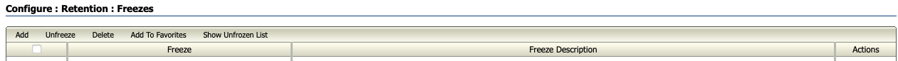
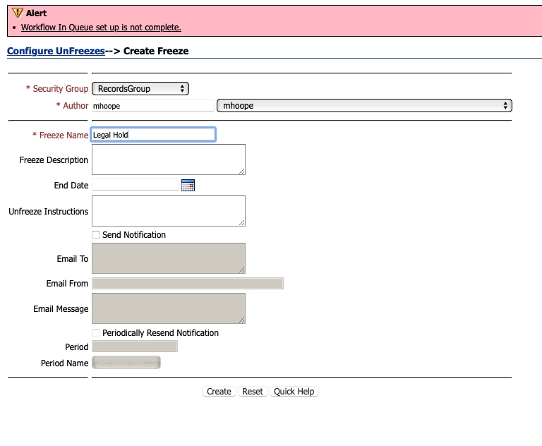
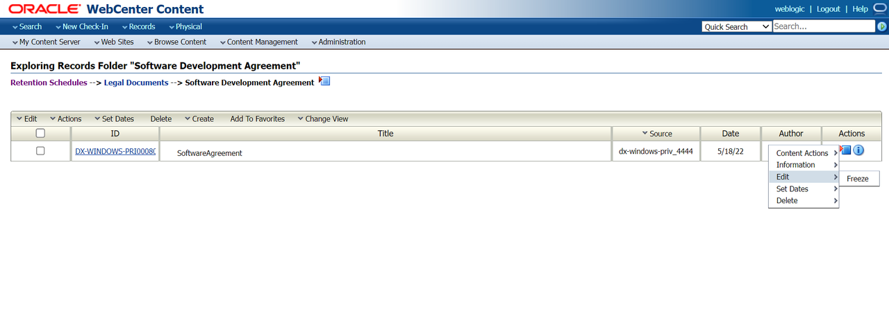
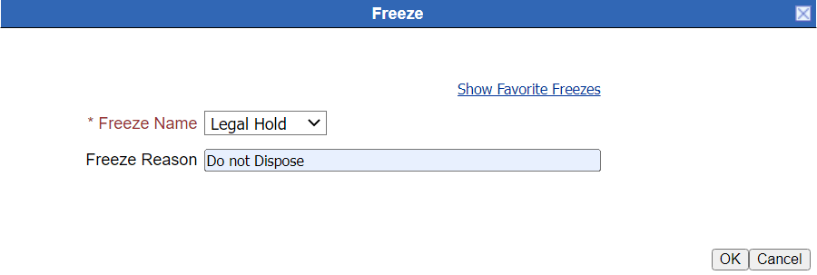
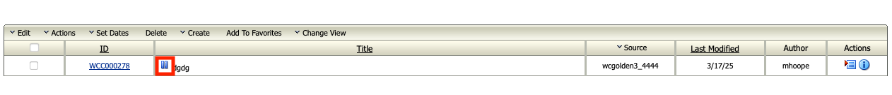
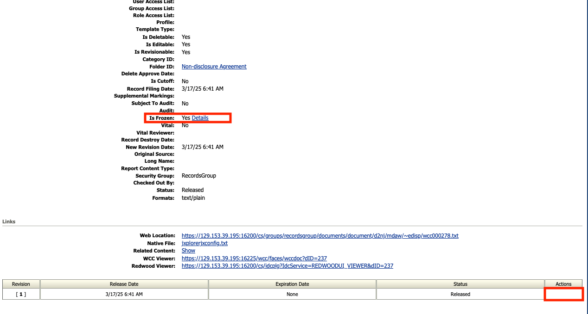

# Legal Hold on Records

## Introduction

This lab walks you through the freeze functionality of WebCenter Records Management that inhibits the record to undergo disposition processing. Freeze functionality is generally used for legal documents that need to be retained and any critical document which should not be accidentally purged from the system.

*Estimated Time:* 15 minutes

### Objectives

In this lab, you will

* Create Freeze
* Apply the Freeze on the Record

### Prerequisites

This lab assumes you have:

* A Free Tier, Paid or LiveLabs Oracle Cloud account
* You have completed:
  * Lab: Prepare Setup (*Free-tier* and *Paid Tenants* only)
  * Lab: Environment Setup
  * Lab: Initialize Environment
  * Lab: Event-based Disposition Rule on MOU Records (Task 1 is mandatory)
  * Lab: Event and Time-based disposition rule on Software Agreement Records

## Task 1: Create Freeze

1. Under the **Records** menu, select **Configure** option. Now select **Retention** and click on **Freeze** option.
    
2. Click on **Add** and give a valid name for the freeze and click on **Create**

3. Navigate to the **Software Development Agreement** folder by clicking on **Browse Content** then **Retention Schedule** and select **Legal Documents** Retention category.

4. Click on the **Actions** menu on the content item shown in the image below and select **Edit** to click on **Freeze**.

5. Selected the freeze created above in **Freeze Name** field. Provide a valid freeze reason and click **OK**.

>Note : if the freeze created is not listed select **Show All Freezes** Link

6.You can now see the pause symbol next to the Title of the Record item that shows that the record is frozen or is on legal hold. This particular record will not go through any disposition processing until the freeze is revoked.

7.On the content information page, the delete option is removed for the content item that is frozen.

You may now **proceed to the next lab**.

## Learn More

* [Defining and Processing Dispositions](https://docs.oracle.com/en/middleware/webcenter/content/12.2.1.4/webcenter-content-manage/defining-and-processing-dispositions.html#GUID-0827B335-BA5E-4B9C-9270-27BE4520391C)

## Acknowledgements

* **Authors-** Shriraksha S Nataraj, Staff Solution Engineer, Oracle WebCenter Content
* **Contributors-** Shriraksha S Nataraj, Sujata Nayak, Senthilkumar Chinnappa, Mandar Tengse , Parikshit Khisty
* **Last Updated By/Date-** Sujata Nayak, March 2025
