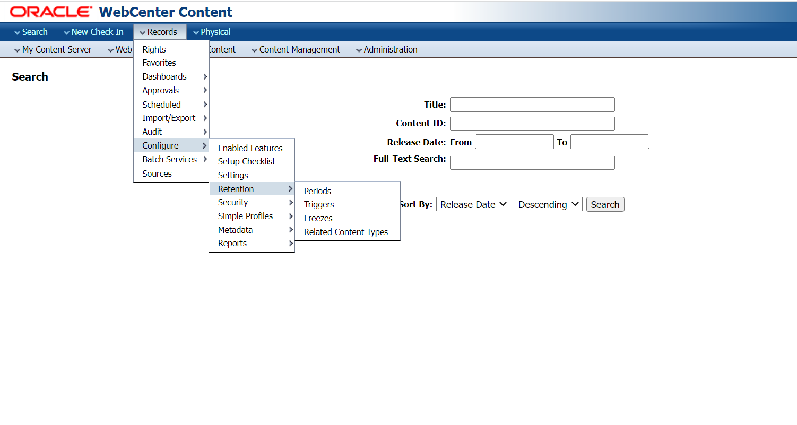
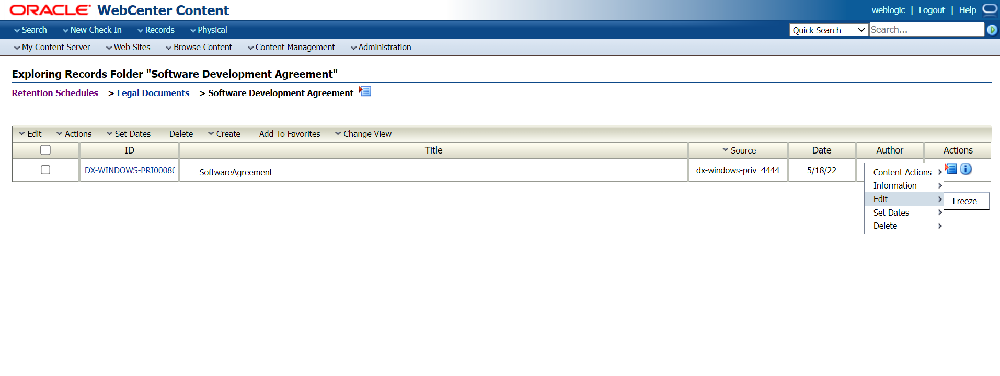
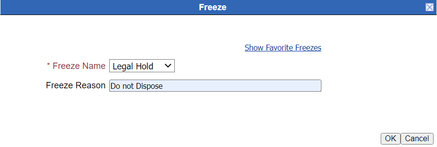
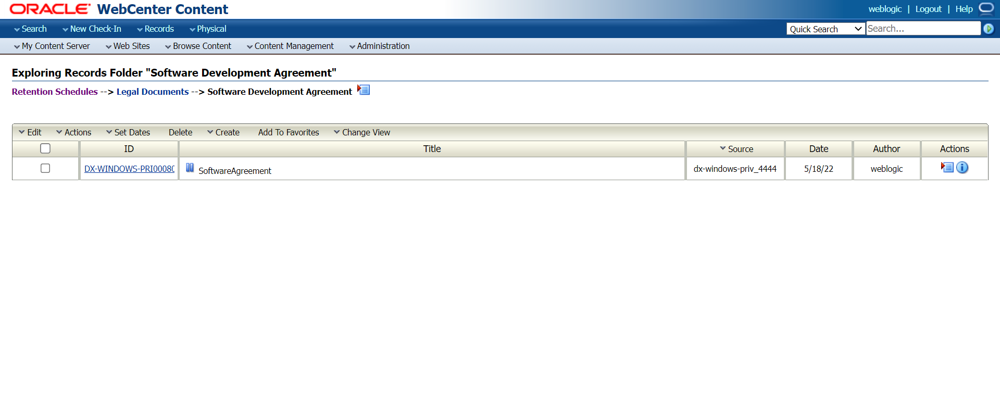

# Legal Hold on Records

## Introduction
This lab walks you through the freeze functionality in WebCenter Records Management that inhibits the record to undergo disposition processing.

Estimated Time: 15 minutes

### Objectives

* Create Freeze
* Apply the Freeze on the Record

### Prerequisites
This lab assumes you have:
- A Free Tier, Paid or LiveLabs Oracle Cloud account
- You have completed:
    - Lab: Prepare Setup (*Free-tier* and *Paid Tenants* only)
    - Lab: Environment Setup
    - Lab: Initialize Environment
    - Lab: Creation of retention category and record folders
    - Lab: Check in Content Item Task (Task2) of Lab 3

## Task 1: Create Freeze
1. Under the **Records** menu, select **Configure** option.Now select **Retention** and click on **Freeze** option.
   

2. Click on **Create** and give a valid name for the freeze and click on **Ok**.

3. Navigate to the **Software Agreement** folder by clicking on **Browse Content** then **Retention Schedule** and select **Legal Documents** Retention category.

4. Click on **Actions** menu on the content item shown in the image below and select **Edit** click on **Freeze**.

   

5. Select the **Show Freeze** and select the freeze you created. Now you can see the freeze you selected in **Freeze Name** field. Provide a valid freeze reason.

   

6. You can now see the pause symbol next to the Title of the Record item that shows that the record is frozen or is on a legal hold . This particular record will not go through any disposition processing until the freeze is revoked.
In the content information page, delete option is removed for the content item that is frozen.

  

  Freeze functionality is generally used for legal documents that needs to be retained and any critical document which should not be accidentally purged from the system.

This concludes this lab.

## Want to Learn More?

* [Defining and Processing Dispositions ](https://docs.oracle.com/en/middleware/webcenter/content/12.2.1.4/webcenter-content-manage/defining-and-processing-dispositions.html#GUID-0827B335-BA5E-4B9C-9270-27BE4520391C)

## Acknowledgements

* **Author:**
    * Shriraksha S Nataraj, Staff Solution Engineer, Oracle WebCenter Content
* **Contributors:**
    * Shriraksha S Nataraj

* **Last Updated By/Date:** Shriraksha S Nataraj ,June 2022
