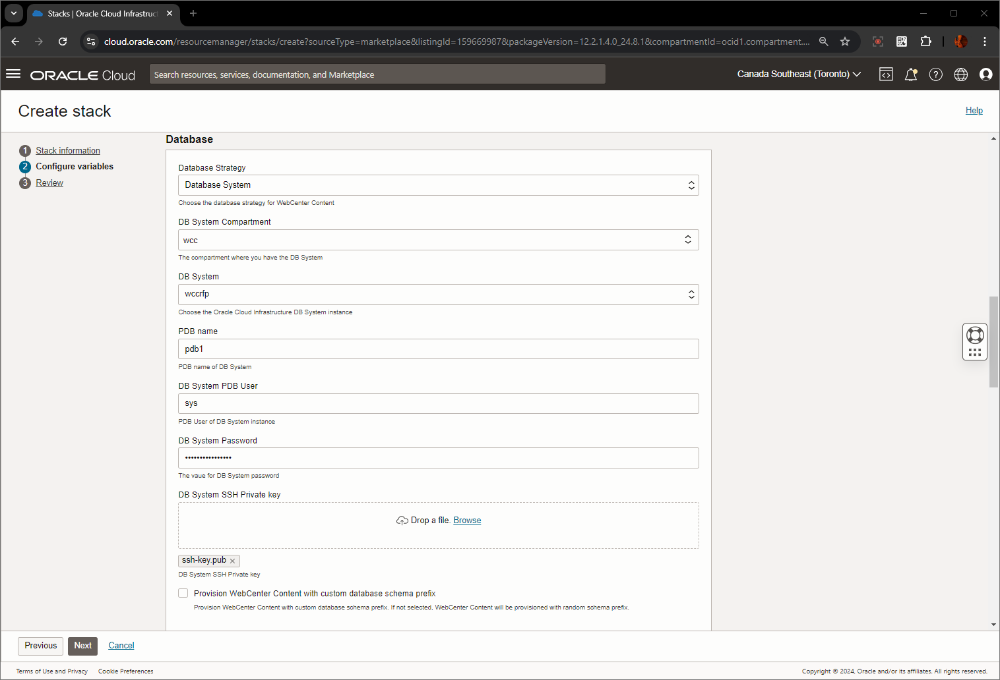
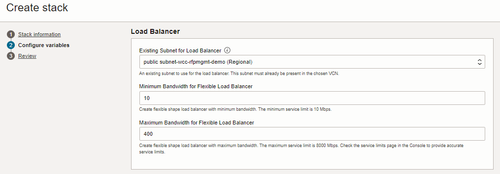
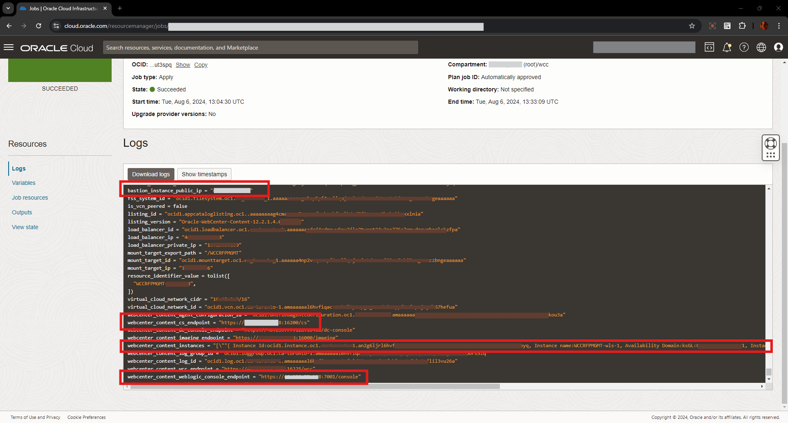

# Setup WebCenter Content Marketplace Instance

## Introduction
This lab will show you how to download the Oracle Resource Manager (ORM) stack zip file needed to setup the resource needed to run this workshop. This workshop requires a compute instance and a Virtual Cloud Network (VCN).

*Estimated Lab Time:* 75 minutes

### Objectives
-   Download ORM stack
-   Configure an existing Virtual Cloud Network (VCN)

### Prerequisites
This lab assumes you have:
- An Oracle Paid Cloud account
- SSH Keys (optional)

## Task 1: Provision WebCenter Content Stack

You can provision Oracle WebCenter Content on a Marketplace instance in a selected compartment in Oracle Cloud Infrastructure.

To provision Oracle WebCenter Content on a Marketplace instance:

1. Navigate to the WebCenter Content listing on Marketplace by direct URL or by browsing in Oracle Cloud Infrastructure.

  * **Using direct URL** :

    * In your browser, click on [Cloud Marketplace WebCenter Content](https://cloudmarketplace.oracle.com/marketplace/en_US/homePage.jspx?tag=WebCenter+Content)

    * The Marketplace listings for **WebCenter Content** are displayed.

    * Click the title of the listing you want to use. The landing page of that listing is displayed.

    * Click **Get App**.

    * Select your Oracle Cloud Infrastructure region and click **Sign In**.

    * *Sign in to the Oracle Cloud Infrastructure Console.*

  * **By browsing** :

    * *Sign in to the Oracle Cloud Infrastructure Console.*

    * Open the navigation menu and click **Marketplace**. Under **Marketplace**, click **All Applications**.

    * In the Marketplace search field, enter WebCenter Content.

      - The Marketplace listings for WebCenter Content are displayed.

    * Click the title of the listing you want to use and review the information on the **Overview** page.

2. Accept the terms and restrictions, and then click **Launch Stack**. The Create Stack wizard is displayed.

3. Provide information about the stack for the instance.

  * Stack information:

    * Enter name and description.
      * **Name**: Specify as
        ```
        <copy>WCC RFP Management - WebCenter Content, Imaging & Enterprise Capture 12c (BYOL)</copy>
        ```
      * **Description**: Specify as
        ```
        <copy>Oracle WebCenter Content in Oracle Cloud Infrastructure for WCC RFP Management System Live Labs Workshop</copy>
        ```
    * Create in Compartment: **wcc** compartment is already selected

    * Terraform version: Use the default ( eg: **1.2.x**)

    * Click **Next** button

    


  * Configure variables:

    * Stack Configuration

      * **Resource Name Prefix** : Specify as
        ```
        <copy>WCCRFPMGMT</copy>
        ```
      * **SSH Public key** : Provide the SSH public key (created in Generate SSH key pair or used during Database Creation in **Lab 1 - Prepare Setup**).

      * **OCI Policies** : Selected

      * **Enable Authentication Using Identity Cloud Service** : _Un-Select_

      * **Enable Object Storage as default storage** : _Un-Select_

      * **Enable Private Service** : _Un-Select_

      * **Enable Key Management with OCI Vault** : Un-Select

    

  * Virtual Cloud Network

    For using an existing VCN, complete the following:

    * **Network Compartment**: Select the compartment you created earlier, as **wcc*

    * **Existing WebCenter Content Virtual Cloud Network**: Select the VCN provisioned for WebCenter Content, as **wcc-rfpmgmt-demo**

    

  * **Database** Configuration:

    * **Database Strategy** : Select **Database System**

    * **DB System Compartment** : Select **wcc**

    * **DB System** : Select **wccrfp**, which was created in **Lab 1 - Prepare Setup**

    * **PDB name**: Provide the PDB name of the DB system.
          ```
          <copy>pdb1</copy>
          ```
    * **DB System Network Compartment** : Select **wcc**

    * **DB System VCN** : Select the VCN created before ie **wcc-rfpmgmt-demo**

    * **DB System PDB User** : Leave the value **sys** as is. Do not change this user name.

    * **DB System Password** : Provide the value of DB System password.
          ```
          <copy>WelCome#123#</copy>
          ```
    * **DB System SSH Private key** : Upload the DB System SSH Private key which is created without passphrase.

    * **Provision WebCenter Content with custom database schema prefix**: Un-Select

    

  * **Bastion Instance** :

    * **Existing Subnet for Bastion Host** : Select an existing public subnet to use for a Bastion compute instance. eg: **public subnet-wcc-rfpmgmt-demo (Regional)**

    * **Bastion Host Shape**: Select the appropriate Bastion host shape (keep the default value). eg:  **VM.Standard.E5.Flex**

    


  * **WebCenter Content Compute Instance** :

    * **Compute Shape** : Select the appropriate compute shape. eg:  **VM.Standard.E5.Flex**

    * **OCPU count** : Select the OCPU count. The default value is **2**.

    * **Existing Subnet for WebCenter Content Compute Instances** : Select an existing subnet to use for WebCenter Content compute instances. eg: **private subnet-wcc-rfpmgmt-demo (Regional)**

    * **Node Count**: Specify the node count as **1**.

    

  * File System:

    * **Use Existing File System**: Un-Select.

    * **File System Compartment** : Choose the compartment where the WebCenter Content stack will be created. eg: **wcc**

    * **File System Availability Domain** : Select the Availability Domain. eg: **AD1**

    * **Existing Subnet for Mount Target** : Select the Private Subnet . eg: **private subnet-wcc-rfpmgmt-demo (Regional)**

    


  * Load Balancer:

    * **Existing Subnet for Load Balancer** : Select an existing subnet to use for the load balancer. eg: **public subnet-wcc-rfpmgmt-demo (Regional)**

    * **Minimum Bandwidth for Flexible Load Balancer** : Provide a value. eg: **10**

    * **Maximum Bandwidth for Flexible Load Balancer** : Provide a value. eg: **400**

    


  * **WebCenter Content WebLogic Domain** Configuration:

    * **WebCenter Content Admin User Name** : Leave the value **weblogic** as is.

    * **WebCenter Content Admin Password**: Provide the value for WebCenter Content Admin password.
          ```
          <copy>Welcome1</copy>
          ```
    * **WebCenter Content Schema Password** : Provide the value for WebCenter Content Schema password.
          ```
          <copy>WelCome#123#</copy>
          ```
  * Click **Next**
    

3. Review all the configuration variables, then select the **Run apply** check box under **Run apply on the created stack** section and Click **Create**.
    

4. After successful provision of the WebCenter Content Stack, note the WebCenter Content CS Endpoint URL displayed at the end and the hostname/ipaddress

    

## Learn More

* [Using Oracle WebCenter Content on Marketplace in Oracle Cloud Infrastructure](https://docs.oracle.com/en/cloud/paas/webcenter-content/webcenter-content-marketplace/index.html#provision-webcenter-content-stack)
* [Introduction To WebCenter Content](https://docs.oracle.com/en/middleware/webcenter/content/12.2.1.4/index.html)


## Acknowledgements

* **Authors-** Senthilkumar Chinnappa, Senior Principal Solution Engineer, Oracle WebCenter Content
* **Contributors-** Senthilkumar Chinnappa, Mandar Tengse , Parikshit Khisty
* **Last Updated By/Date-** Senthilkumar Chinnappa, August 2024
