# Initialize WCC Environment

## Introduction

In this lab, we will review and startup all components required to successfully run this workshop.

**Estimated Lab Time**: *30 minutes*

### Objectives

In this lab, you will

- Initialize the workshop environment
- Validate WCC and APEX Instances
- Configure WCC Environment for the Workshop

### Prerequisites

This lab assumes you have:

- A Paid or LiveLabs Oracle Cloud account
- You have completed:
  - Lab: Prepare Setup ( *Paid Tenants* only)
  - Lab: Setup WCC Marketplace Environment

## Task 1: Validate That WebCenter Content CS URL

1. Open the *web browser* window with *WebCenter Content* homepage url ( ie the **WebCenter Content CS Endpoint URL** noted on the previous **Lab 2 - Setup WCC Marketplace Environment** ), click on the *Login* and Login using the below credentials
    - URL
            ```
            <copy>https://localhost:16200/cs/</copy>
            ```

        > Note : Replace `"https://localhost"` with your **hosturl** ( eg: `"http://wcc-rfpmgmt-livelab.livelabs.oraclevcn.com"` or `"https://192.0.0.0"`)
    - Username
            ```
            <copy>weblogic</copy>
            ```
    - Password
            ```
            <copy>Welcome1</copy>
            ```
    > *Note: In the scenario, where WebCenter Content is configured with IDCS or any other username (other than **weblogic**), use user credentials accordingly*
    

2. Confirm successful login.

    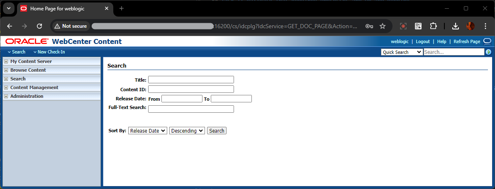

    If successful, the page above is displayed and as a result, your WebCenter Content instance is accessible.

3. If you are still unable to log in or the login page is not functioning after reloading ,  proceed as indicated in the **Appendix 1: Restart UCM Server Instance** to restart the services and try login again

4. After you log in to the WebCenter Content Instance successfully, you can proceed with the next Task.

## Task 2: Validate WebCenter Content Search/Index Engine

1. On the new *web browser* window , Login to the *WebCenter Content* homepage URL as Administator User (eg: weblogic). Details are provided below:
    - **URL**
            ```
            <copy>https://localhost:16200/cs/</copy>
            ```

           > Note : Replace `"https://localhost"` with your **hosturl** ( eg: `"http://wcc-rfpmgmt-livelab.livelabs.oraclevcn.com"` or `"https://192.0.0.0"`)
    - **Username**
            ```
            <copy>weblogic</copy>
            ```
    - **Password**
            ```
            <copy>Welcome1</copy>
            ```
    > *Note: In the scenario, where WebCenter Content is configured with IDCS or any other username (other than **weblogic**), use user credentials (which as Administrator Privileges) accordingly*
    

2. Under **Administration** tab, click on **Configuration for \<your\_instance\_name\>** and check for the **Search Engine** & **Index Engine Name**, for the value as **ORACLETEXTSEARCH**

    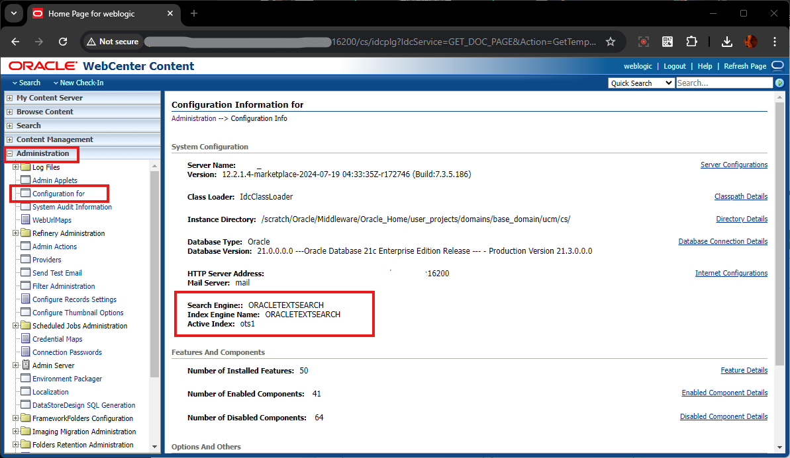

3. If the value is showing as **DATABASE.METADATA**, follow the steps in **Appendix 2: Configure Search and Index Engine to use OracleTextSearch**

 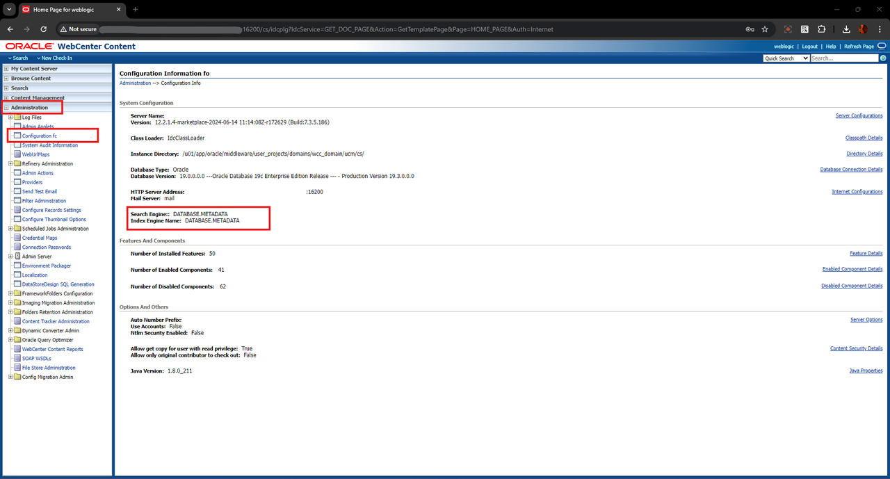

## Task 3: Enable Content Folios Component & Add Additional Instance Configurations

To enable Content Folios Component & Add additional instance configurations, follow the below steps;

1. Login to WebCenter Content server as user with Administrator Privilege, Under **Administration** tab, navigate to **Admin Server** > **Component Manager**. In the **Components** section list , click on **Document Management**, Select/Check **ContentFolios** Component and click **Update** button
    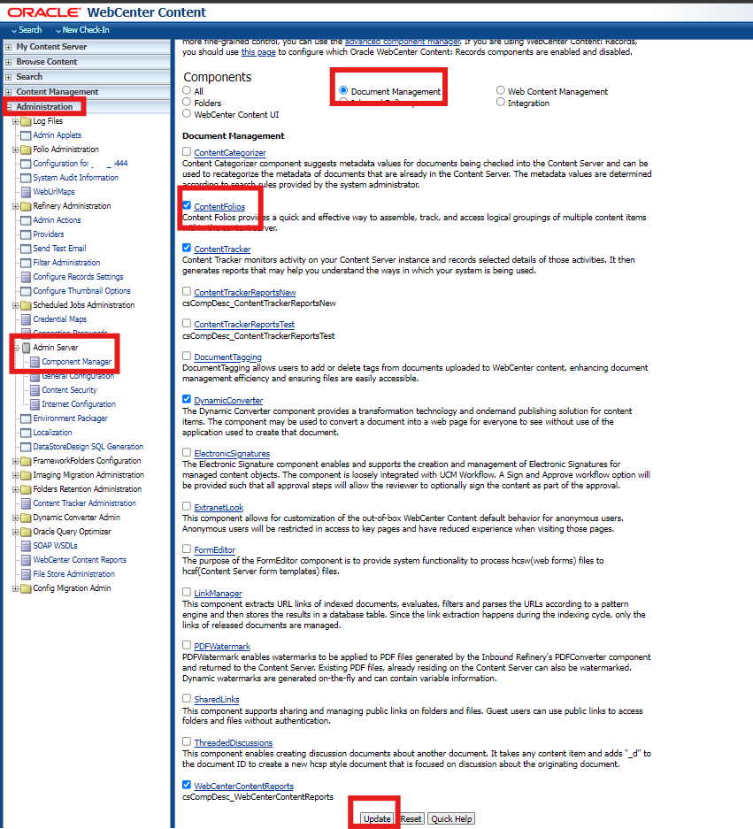

2. Login to WebCenter Content server, Under **Administration** tab, navigate to **Admin Server** > **General Configuration**. In the **Additional Configuration Variables** section list of variables, add the below line and click **Save** button
            ```
            <copy>AllowModifyProfileDocMetaField=true
DisableAuthorizationTokenCheck=1</copy>
            ```
    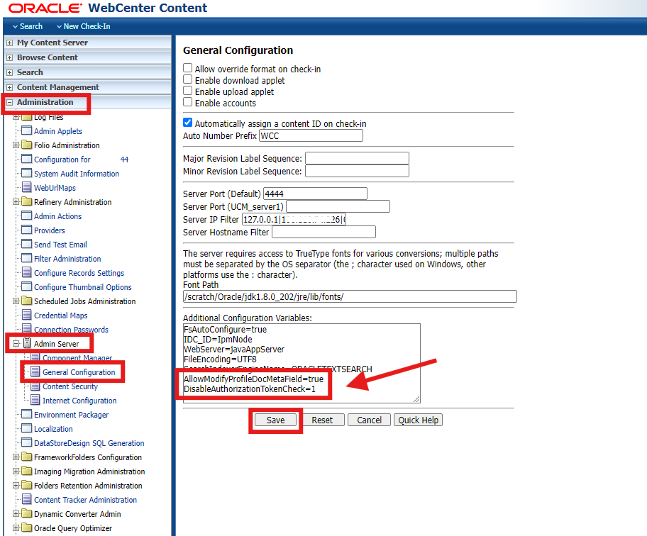

3. Restart the Content Server instance , using the steps mentioned in **Appendix 1: Restart UCM Server Instance**

## Task 4: Import WebCenter Content Configuration bundle

1. On the new *web browser* window , Login to the *WebCenter Content* homepage URL as Administator User (eg: weblogic). Details are provided below:
    - **URL**
            ```
            <copy>https://localhost:16200/cs/</copy>
            ```

          > Note : Replace `"https://localhost"` with your **hosturl** ( eg: `"http://wcc-rfpmgmt-livelab.livelabs.oraclevcn.com"` or `"https://192.0.0.0"`)
    - **Username**
            ```
            <copy>weblogic</copy>
            ```
    - **Password**
            ```
            <copy>Welcome1</copy>
            ```
    > *Note: In the scenario, where WebCenter Content is configured with IDCS or any other username (other than **weblogic**), use user credentials (which as Administrator Privileges) accordingly*
    

2. In the left navigation pane, expand **Administration** section, then expand **Config Migration Admin** and click on **Upload Bundle** link

    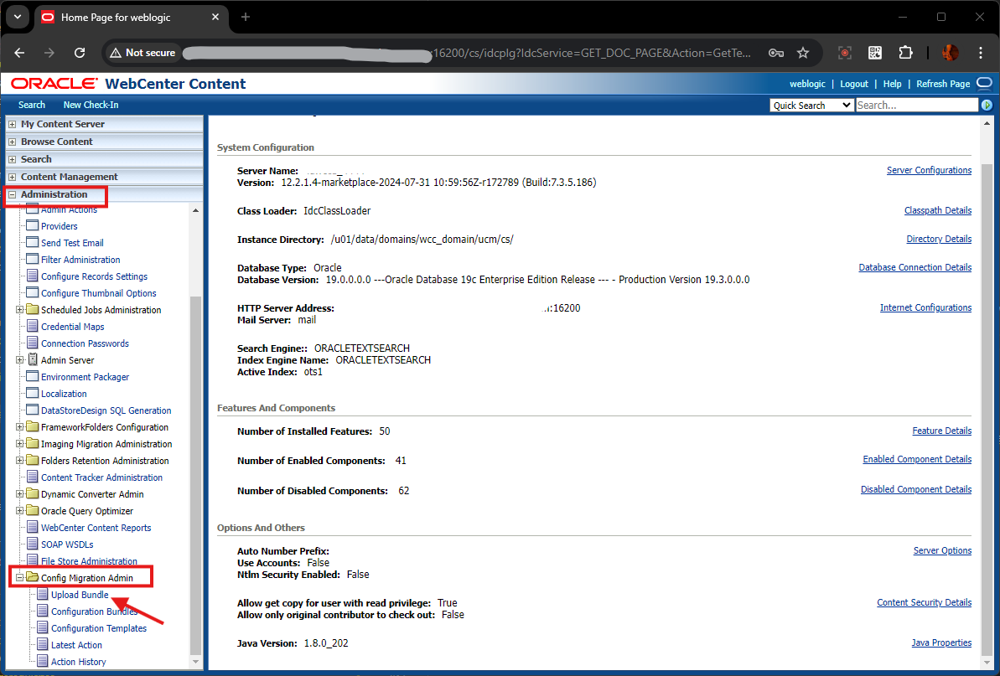

3. In the **Upload configuration Bundle** Page, Select the Bundle ( **wccrfpmgmt\_wcc\_profile\_setup_bundle.zip** )  from the downloaded **wcc\_rfp\_resources.zip** file ( in **Lab 1 - Prepare Setup**) , check the **Force Overwrite** checkbox and click on **Upload** Button

    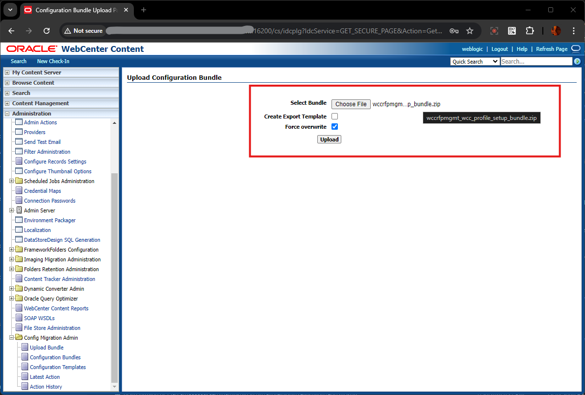

4. Click on **Actions** icon and click on **Edit** option

    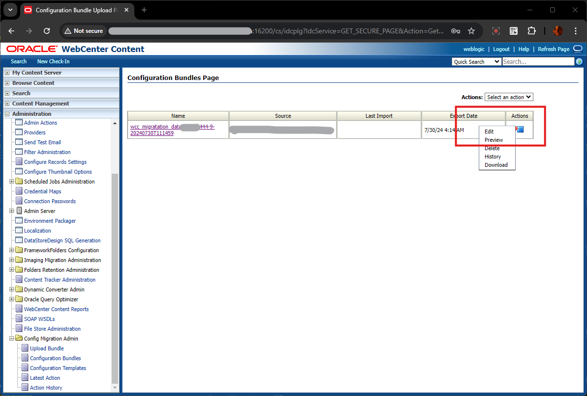

5. In the **Action Options**, check the checkboxes for the below Options:

    - **Continue on Error** : *checked*
    - **Add Dependencies** : *checked*
    - **Overwrite Duplicates** : *checked*

    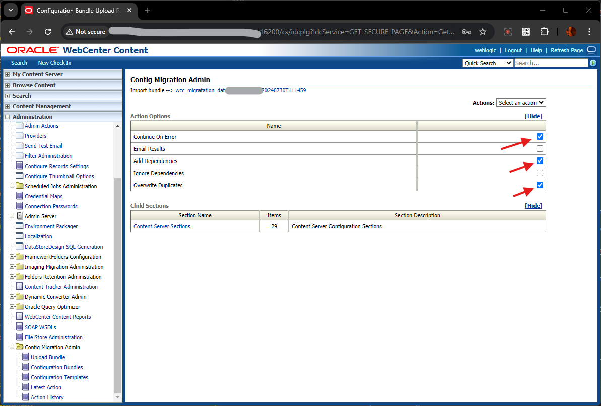

6. Under the **Actions** dropdown list, select **Import**

    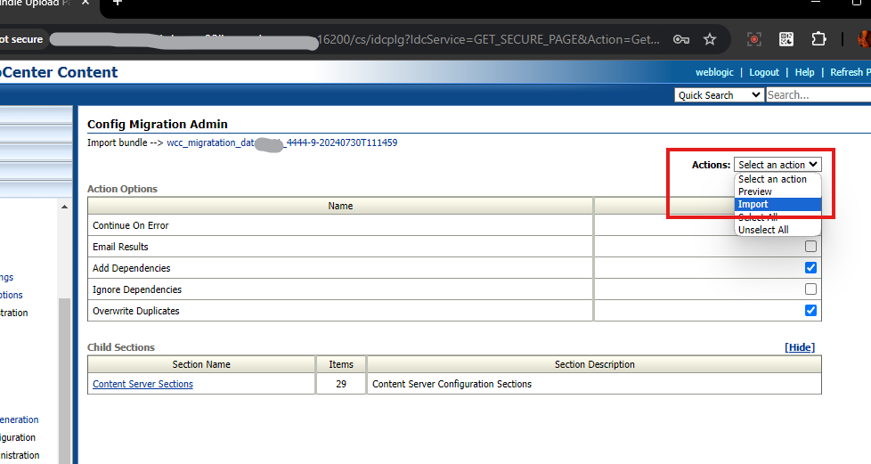

    > *If you get **Create import without preview?** dialog box, click **OK** button*

7. Wait for the import to get finished

    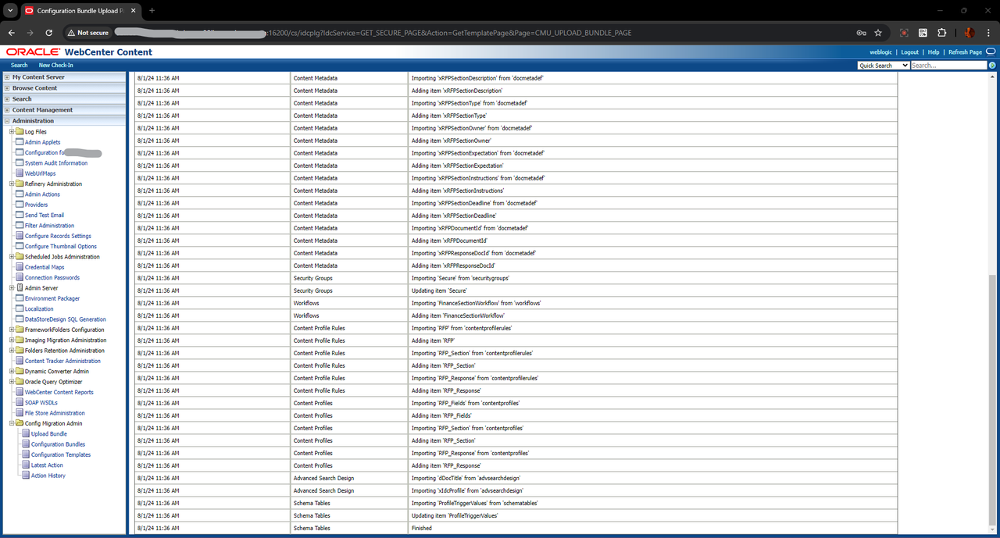

    > Ignore any error like *Error importing 'xIdcProfile' The 'xIdcProfile' field is protected and may not be modified.*

8. If you see an ***Alert*** message for ***Index Collection needs to be Synchronized***, perform the steps mentioned in the **Appendix 3: Re-index collections and document**

    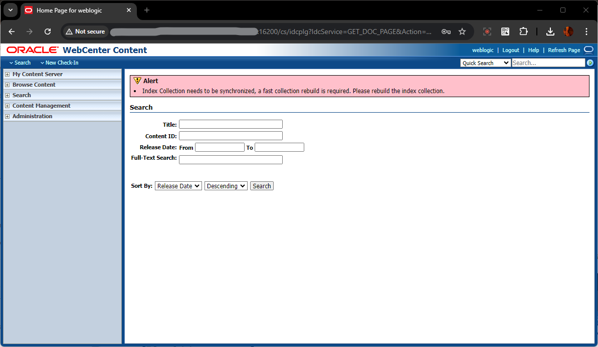

## Task 5: Add RFP Profile Values in WCC

This task helps in adding RFP related ProfileTriggerValues to xIdcProfile

1. On the new *web browser* window , Login to the *WebCenter Content* homepage URL as Administrator User (eg: weblogic). Details are provided below:
    - **URL**
            ```
            <copy>https://localhost:16200/cs/</copy>
            ```

           > Note : Replace `"https://localhost"` with your **hosturl** ( eg: `"http://wcc-rfpmgmt-livelab.livelabs.oraclevcn.com"` or `"https://192.0.0.0"`)
    - **Username**
            ```
            <copy>weblogic</copy>
            ```
    - **Password**
            ```
            <copy>Welcome1</copy>
            ```
    > *Note: In the scenario, where WebCenter Content is configured with IDCS or any other username (other than **weblogic**), use user credentials (which as Administrator Privileges) accordingly*
    

2. In the left navigation pane, expand **Administration** section, click on **Admin Applets** and click on **Configuration Manager**

    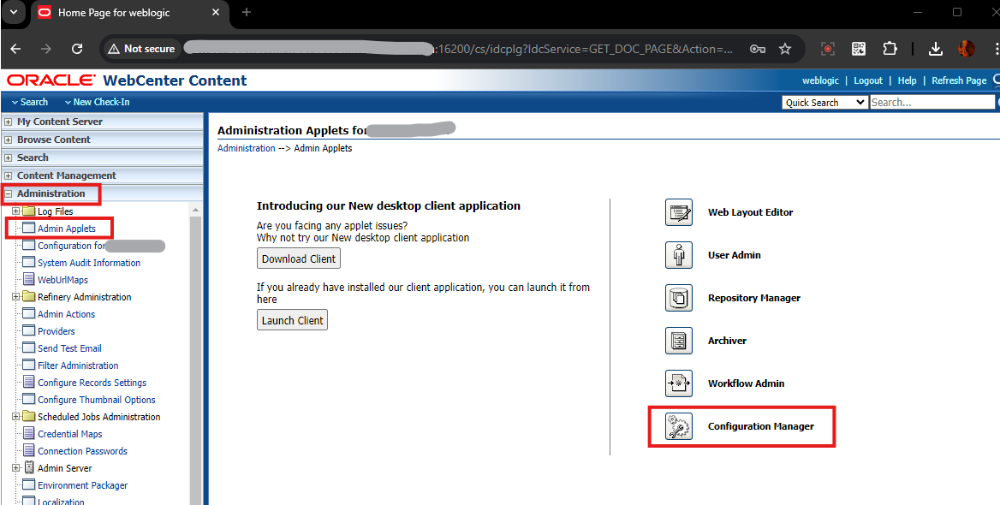

3. Execute the Java Applet, and in the **Configuration Manager** Applet window, under **Information Fields**, select **IdcProfile** row and click on **Edit Values** Button

    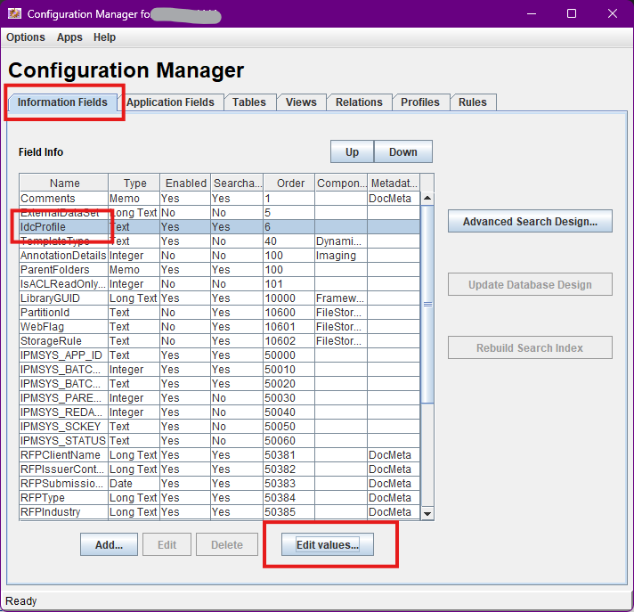

4. Add the below values, by clicking on **Add** Button , Enter the below values and click **OK** button

    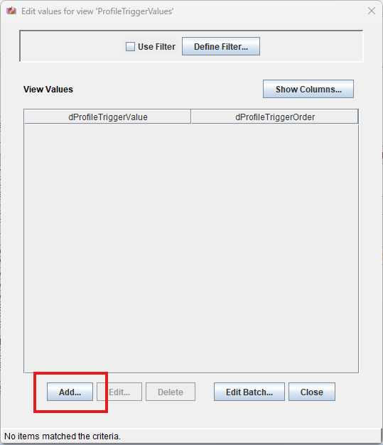

    - For **RFP**,
        - *dProfileTriggerValue* - Enter
                    ```
                    <copy>RFP</copy>
                    ```
        - *dProfileTriggerOrder* - Enter
                    ```
                    <copy>2</copy>
                    ```
    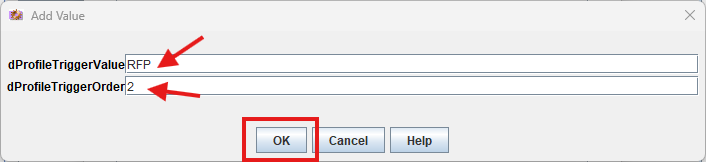

    - For **RFP_Section**,
        - *dProfileTriggerValue* - Enter
                    ```
                    <copy>RFP_Section</copy>
                    ```
        - *dProfileTriggerOrder* - Enter
                    ```
                    <copy>3</copy>
                    ```
    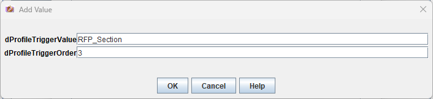

    - For **RFP_Response**,
        - *dProfileTriggerValue* - Enter
                    ```
                    <copy>RFP_Response</copy>
                    ```
        - *dProfileTriggerOrder* - Enter
                    ```
                    <copy>4</copy>
                    ```
    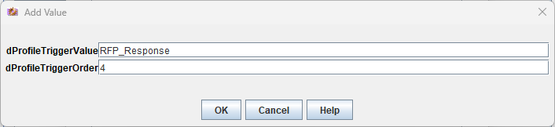

5. Ensure all the three values are added in the list and click **Close** Button in the Edit Values Applet window

    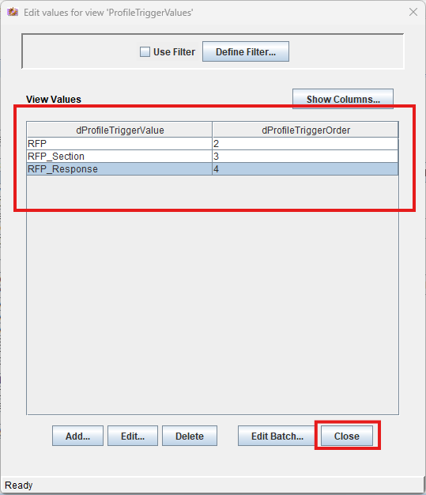

## Task 6: Enable WCC Workflows

This task helps in enabling WCC Workflows for Section Documents

1. On the new *web browser* window , Login to the *WebCenter Content* homepage URL as Administrator User (eg: weblogic). Details are provided below:

    - **URL**
            ```
            <copy>https://localhost:16200/cs/</copy>
            ```

           > Note : Replace `"https://localhost"` with your **hosturl** ( eg: `"http://wcc-rfpmgmt-livelab.livelabs.oraclevcn.com"` or `"https://192.0.0.0"`)
    - **Username**
            ```
            <copy>weblogic</copy>
            ```
    - **Password**
            ```
            <copy>Welcome1</copy>
            ```
    > *Note: In the scenario, where WebCenter Content is configured with IDCS or any other username (other than **weblogic**), use user credentials (which as Administrator Privileges) accordingly*
    

2. In the left navigation pane, expand **Administration** section, click on **Admin Applets** and click on **Workflow Admin**

    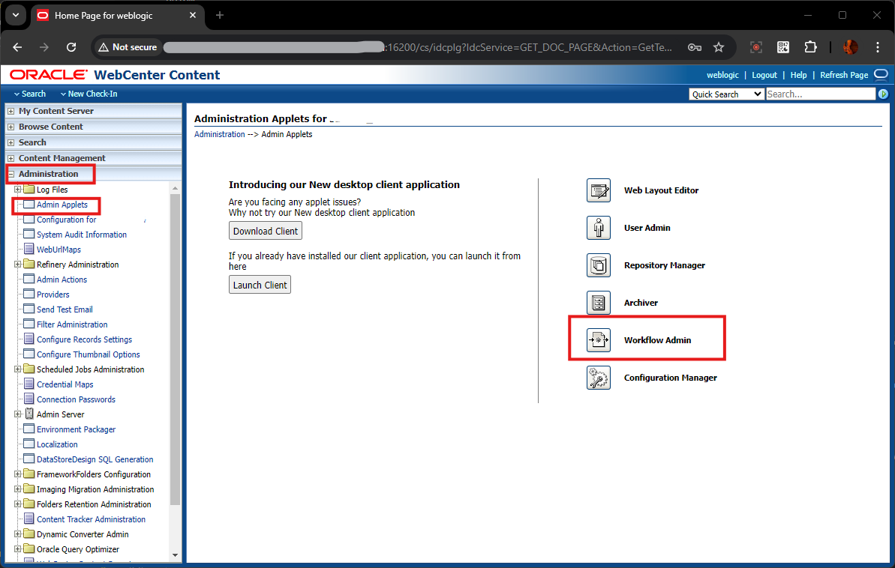

3. Run the Java Applet Application, in the **Workflow Admin Applet**, click on **Criteria** tab, select **FinanceSectionWorkFlow** and click on **Enable** Button

    > When prompted, Click *Yes* in the enable workflow confirmation dialog box

    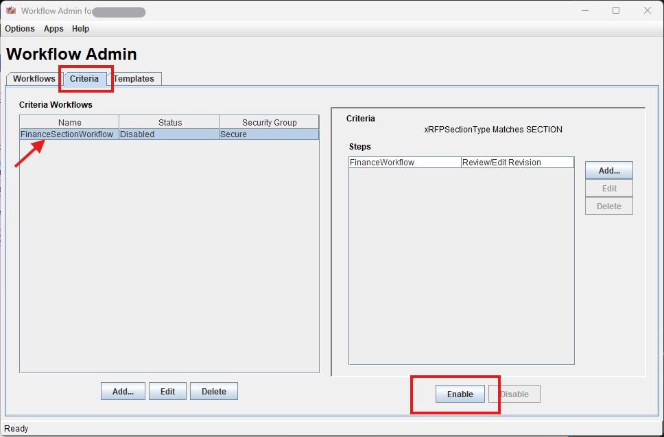

## Task 7: Validate APEX is Up and Running

This task helps to validate if APEX has been installed properly and its up & accessible.

1. On the new *web browser* window , Login to the APEX/ORDS URL . Details are provided below

    - **URL**
            ```
            <copy>https://localhost:16200/ords/</copy>
            ```

           > Note : Replace `"https://localhost"` with your **hosturl** ( eg: `"http://wcc-rfpmgmt-livelab.livelabs.oraclevcn.com"` or `"https://192.0.0.0"`)
    - **Workspace Name**
            ```
            <copy>INTERNAL</copy>
            ```
    - **Username**
            ```
            <copy>ADMIN</copy>
            ```
    - **Password**
            ```
            <copy>WelCwcm123##</copy>
            ```

    > **For ATP DB** *, ADMIN password is same as the ADMIN DB schema user password*
    > *If any issues with ADMIN credentials, Refer to **Appendix 5: Reset ADMIN password for APEX/ORDS**
    

2. Confirm successful login.

    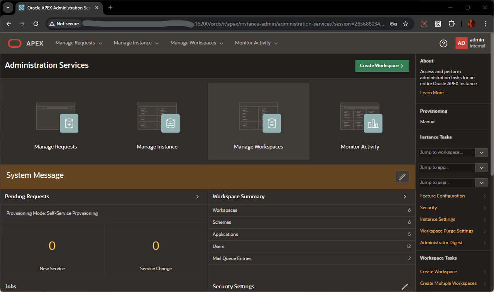

    If successful, the page above is displayed and as a result, your WCC instance is now ready.

## Task 8 : Grant connect for ACL

Login to the Database as **sys** or user with **sysdba** privileges and perform the below steps:
      - Use the steps mentioned under **Appendix 4: Connect to DB System via SSH and login to database as sys** to connect to DB

1. Find the latest version schema name
            ```
            SQL> SELECT  schema  FROM dba_registry WHERE comp_id = 'APEX' ORDER BY schema DESC FETCH FIRST 1 ROW ONLY;
            ```

2. Add the ACL entry for granting connect & resolve privilege for the required WCC CS urls

            ```
            <copy>
            BEGIN
            DBMS_NETWORK_ACL_ADMIN.APPEND_HOST_ACE(
                  host => '*',
                  ace => xs$ace_type(privilege_list => xs$name_list('connect', 'resolve'),
                        principal_name => 'APEX_230200',
                        principal_type => xs_acl.ptype_db
                  )
            );
            END;
            /
            </copy>
            ```

      > Note : Replace `"APEX_230200"` with your **schema** retrieved from the above select query

You may now **proceed to the next lab**.

## Appendix 1: Restart UCM Server Instance

1. Login to the WebCenter Content Weblogic console as administrator user (eg : weblogic)

2. Navigate to **Environment** > **Servers** > **Control** tab and select the checkbox for **UCM Server**(s)

3. click on **Shutdown** > **Force Shutdown**

4. After the Server changes to **SHUTDOWN** state, select the checkbox for **UCM Server**(s), click on **Start** button

## Appendix 2: Configure Search and Index Engine to use OracleTextSearch

To set up and use full-text searching and indexing with OracleTextSearch, follow the below steps;

1. Login to WebCenter Content server as user with Administrator Privilege, Under **Administration** tab, navigate to **Admin Server** > **General Configuration**. In the **Additional Configuration Variables** section list of variables, add the below line and click **Save** button
            ```
            <copy>SearchIndexerEngineName=ORACLETEXTSEARCH</copy>
            ```
    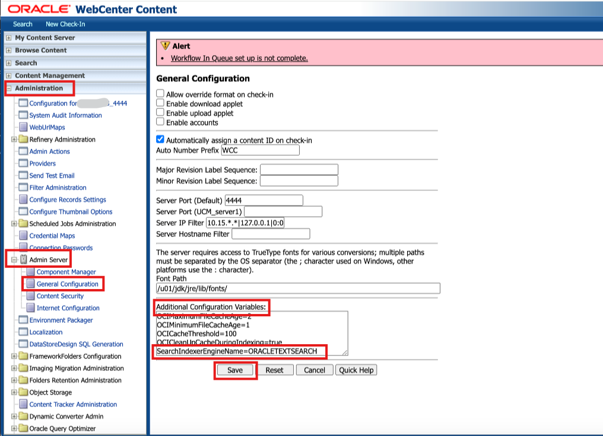

2. Restart the Content Server instance , using the steps mentioned in **Appendix 1: Restart UCM Server Instance**

3. Login to WebCenter Content server as user with Administrator Privilege, Under **Administration** tab, click on **Configuration for <your_instance_name>** and check for the **Search Engine** & **Index Engine Name**, for the value as **ORACLETEXTSEARCH**

    

4. If you see an ***Alert*** message for ***Index Collection needs to be Synchronized***, perform the steps mentioned in the **Appendix 3: Re-index collections and document** below

    

## Appendix 3: Re-index collections and documents

1. Log in to the Content server as an administrator and click on **Admin Applets** under the Administration tab as shown in the image below.

    

2. Click on **Repository Manager** Applet

    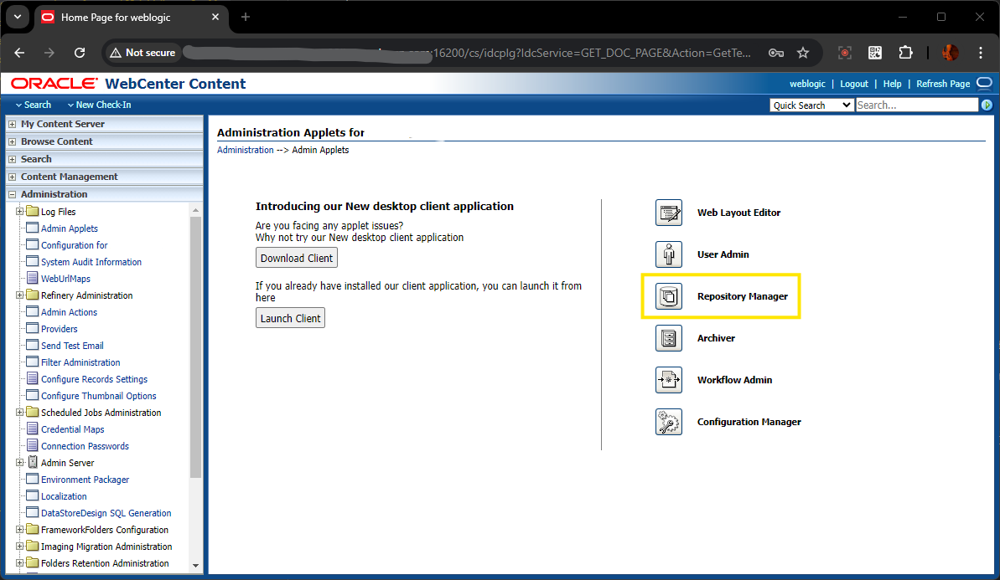

3. Download and Run the **Repository Manager** Java Applet

    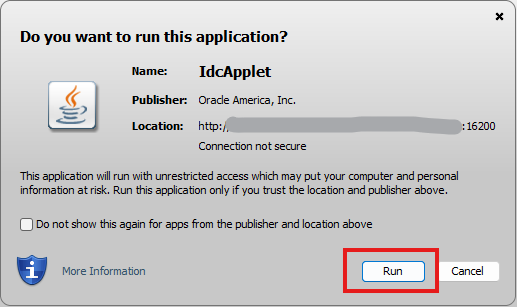

    

4. On the **Repository Manager** Applet , Click on **Indexer** tab

    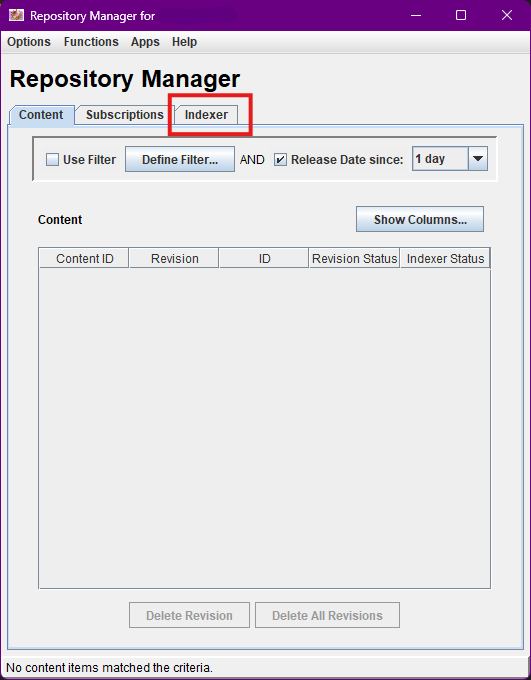

5. Under **Collection Rebuild Cycle** section, Click on **Start** Button, *Uncheck* **Use Fast Rebuild** option , Click **OK** button and wait for the indexing to finish

    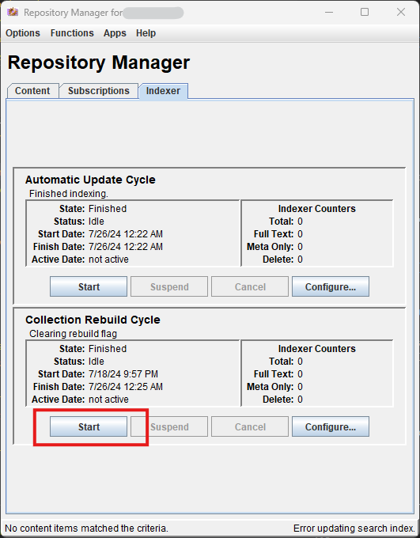  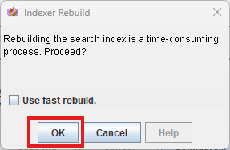

    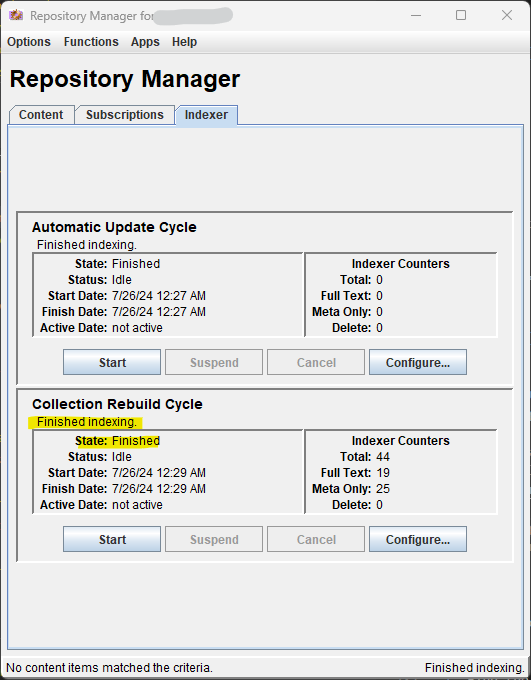

## Appendix 4: Connect to DB System via SSH and login to database as sys**

   1. Log in to **OCI Console**, navigate to **Oracle Database**, then to **Oracle Base Database Service** and Click on the DB System **wcc-rfpmgmt-DBSystem** ( *which was created as part of the Lab **Prepare Setup*** )
      

   2. Scroll down to the **Resources** Section and click on **Nodes**. Note the *IP Address* of all the Nodes listed
      
            > *Note: You can use the Private IP Address also, in which case, connect to the private IP Address from/through Bastion Server*

   3. Open a terminal or a bash window , and invoke the below ssh command to login to the Node as **opc** user and then switch to **oracle** user
      - **ssh command**
            ```
            <copy>ssh -i db-ssh.key opc@xxx.xxx.xxx.xxx
            sudo su - oracle </copy>
            ```

      - **Note** :
        - **db-ssh.key** - is the key used/created while creating the DB System ( in Lab **Prepare Setup** , **Task 3: Create Database**, **3.2 Create a New DB System**). *FYI, Also, if **vault** was used for storing keys and secrets, this key can be obtained from there as well*
        - **xxx.xxx.xxx.xxx** - replace this value with the ip address of the node

      

   4. In the terminal window, invoke the below commands command and connect to the required PDB
      - invoke **sqlplus** command
            ```
            <copy>sqlplus '/as sysdba'</copy>
            ```
      - execute **sql** statement to connect to required PDB
            ```
            <copy>alter session set container=PDB1;</copy>
            ```
   5. Now execute any required sql statements in this sqlplus session.

## Appendix 5: Reset ADMIN password for APEX/ORDS

Use the below steps to reset the ADMIN User Password , if facing any issue like Forgot ADMIN password (or) ADMIN account is locked
      - Use the steps mentioned under **Appendix 4: Connect to DB System via SSH and login to database as sys** above, to connect to DB

1. Find the latest version schema name:
            ```
            SQL> SELECT  schema  FROM dba_registry WHERE comp_id = 'APEX' ORDER BY schema DESC FETCH FIRST 1 ROW ONLY;
            ```

2. Set the current schema to the schema name retrieved in the above step
    eg:
        ```
        SQL> alter session set current_schema=apex_230200;

        (OR)

        SQL> alter session set current_schema=apex_240100;
        ```
3. Update the password and unlock the ADMIN User

            ```
            <copy>
                BEGIN
                    UPDATE wwv_flow_fnd_user
                    SET    web_password = 'WelCwcm123##'
                    WHERE  user_name = 'ADMIN'
                    AND    user_id = (SELECT user_id
                    FROM   wwv_flow_fnd_user
                    WHERE  user_name = 'ADMIN' and SECURITY_GROUP_ID=10);
                    WWV_FLOW_SECURITY.g_security_group_id := 10;
                    WWV_FLOW_FND_USER_API.unlock_account('ADMIN');
                    COMMIT;
                END;
                /
            </copy>
            ```

### Learn More

- [Introduction To WebCenter Content](https://docs.oracle.com/en/middleware/webcenter/content/12.2.1.4/index.html)
- [Learn More about Apex](https://apex.oracle.com/en/)
- [WebCenter Content - Configuring the Search Index](https://docs.oracle.com/en/middleware/webcenter/content/12.2.1.4/webcenter-content-admin/configuring-search-index.html#GUID-D8372225-70C9-4A3E-987A-279995879606)

## Acknowledgements

- **Authors-** Senthilkumar Chinnappa, Senior Principal Solution Engineer, Oracle WebCenter Content
- **Contributors-** Senthilkumar Chinnappa, Mandar Tengse , Parikshit Khisty
- **Last Updated By/Date-** Senthilkumar Chinnappa, July 2024
