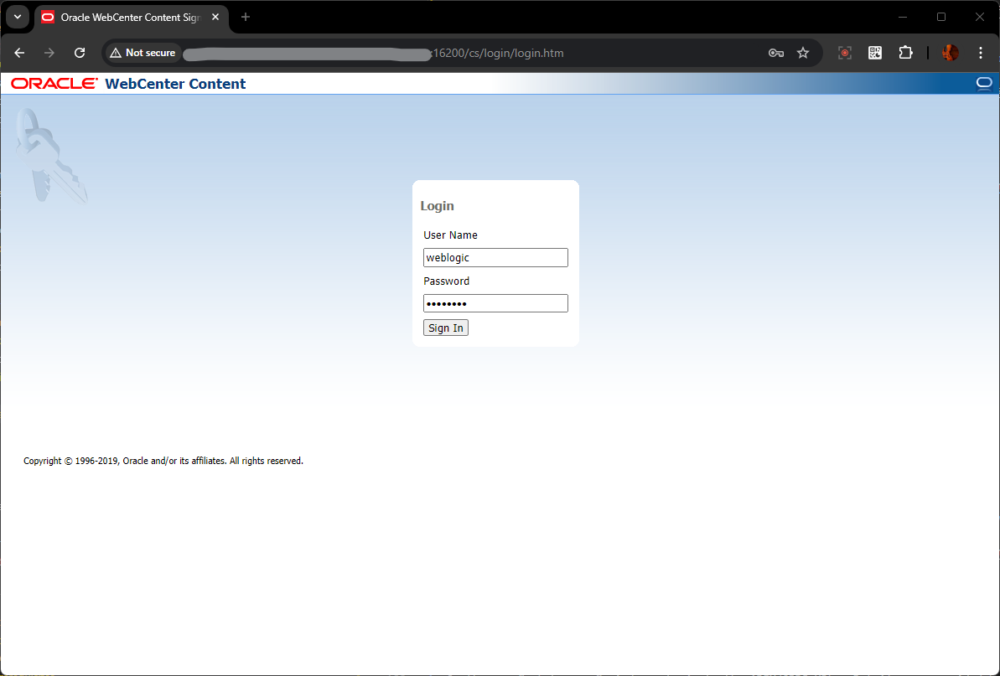
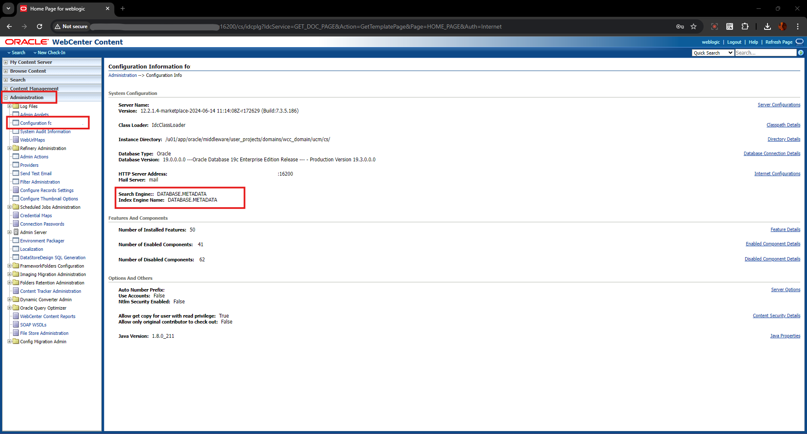
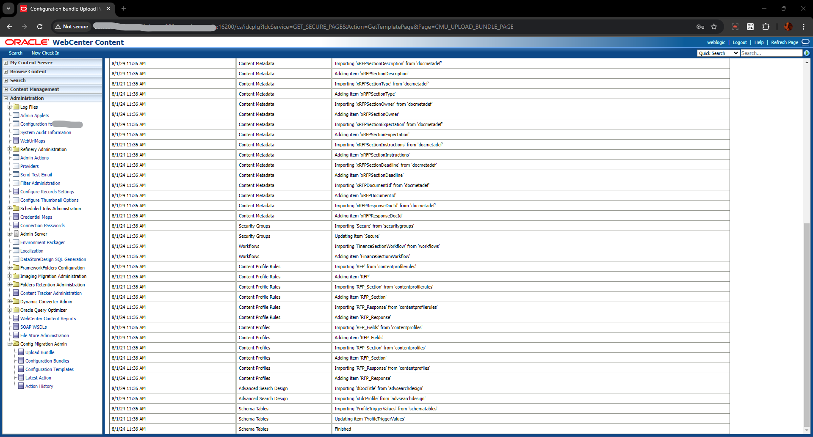
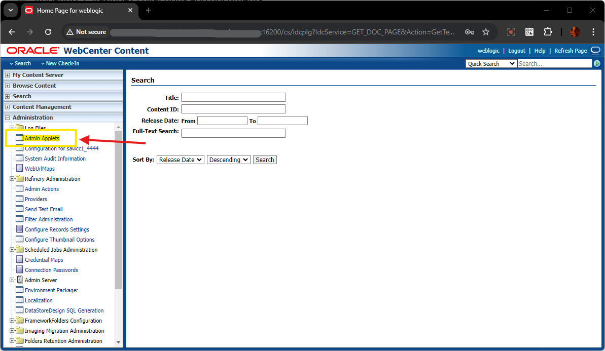

# Initialize WCC Environment

## Introduction

In this lab, we will review and startup all components required to successfully run this workshop.

*Estimated Time:* 30 Minutes.

### Objectives

In this lab, you will

- Initialize the workshop environment
- Selecting the Installation option for Records
- Configure Setup Checklist

### Prerequisites
This lab assumes you have:
- A Paid or LiveLabs Oracle Cloud account
- You have completed:
    - Lab: Prepare Setup ( *Paid Tenants* only)
    - Lab: Environment Setup

## Task 1: Validate That Required Processes are Up and Running

1. Open the *web browser* window with *WebCenter Content* homepage url ( ie the **WebCenter Content CS Endpoint URL** noted on the previous **Lab 2 - WCC Environment Setup** ), click on the *Login* and Login using the below credentials

    - URL

    ```
    <copy>http://localhost:16200/cs/</copy>
    ```

    - Username

    ```
    <copy>weblogic</copy>
    ```

    - Password

    ```
    <copy>Welcome1</copy>
    ```
 

2. Confirm successful login.

    

    If successful, the page above is displayed and as a result, your environment is now ready.

3. If you are still unable to log in or the login page is not functioning after reloading ,  proceed as indicated in the **Appendix 1: Restart UCM Server Instance** to restart the services and try login again

4. After you log in to the WebCenter Content server, you can proceed with the next Task.

## Task 2: Validate WebCenter Content Search/Index Engine

1. On the new *web browser* window , Login to the *WebCenter Content* homepage URL as Administator User (eg: weblogic). Details are provided below:

   - URL
    ```
    <copy>http://localhost:16200/cs/</copy>
    ```

    - Username
    ```
    <copy>weblogic</copy>
    ```

    - Password
    ```
    <copy>Welcome1</copy>
    ```
 

2. Under **Administration** tab, click on **Configuration for <your_instance_name>** and check for the **Search Engine** & **Index Engine Name**, for the value as **ORACLETEXTSEARCH**


    


3. If the value is showing as **DATABASE.METADATA**, follow the steps in **Appendix 2: Configure Search and Index Engine to use OracleTextSearch**

 


## Task 3: Import WebCenter Content Configuration bundle

1. On the new *web browser* window , Login to the *WebCenter Content* homepage URL as Administator User (eg: weblogic). Details are provided below:

   - URL

    ```
    <copy>http://localhost:16200/cs/</copy>
    ```

    - Username

    ```
    <copy>weblogic</copy>
    ```

    - Password

    ```
    <copy>Welcome1</copy>
    ```

 

2. In the left navigation pane, expand **Administration** section, then expand **Config Migration Admin** and click on **Upload Bundle** link

    

3. In the **Upload configuration Bundle** Page, Select the Bundle ( **wccrfpmgmt\_wcc\_profile\_setup_bundle.zip** ) which was downloaded in the **Lab 1 - Prepare Setup** , check the **Force Overwrite** checkbox and click on **Upload** Button

    

4. Click on **Actions** icon and click on **Edit** option

    

5. In the **Action Options**, check the checkboxes for the below Options:

    * **Continue on Error** : checked
    * **Add Dependencies** : checked
    * **Overwrite Duplicates** : checked

      

6. Under the **Actions** dropdown list, select **Import**

    
> If you get **Create import without preview?** dialog box, click **OK** button

7. Wait for the import to get finished

    
 > Ignore any error like *Error importing 'xIdcProfile' The 'xIdcProfile' field is protected and may not be modified.*

8. If you see an *Alert* message for *Index Collection needs to be Synchronized*, perform the steps mentioned in the **Appendix 3: Re-index collections and document** 

    

## Task 4: Add RFP Profile Values in WCC

This task helps in adding RFP related ProfileTriggerValues to xIdcProfile


1. On the new *web browser* window , Login to the *WebCenter Content* homepage URL as Administrator User (eg: weblogic). Details are provided below:

   - URL

    ```
    <copy>http://localhost:16200/cs/</copy>
    ```

    - Username

    ```
    <copy>weblogic</copy>
    ```

    - Password

    ```
    <copy>Welcome1</copy>
    ```

 

2.  In the left navigation pane, expand **Administration** section, click on **Admin Applets** and click on **Configuration Manager**

    


3. Execute the Java Applet, and in the **Configuration Manager** Applet window, under **Information Fields**, select **IdcProfile** row and click on **Edit Values** Button

    

4. Add the below values, by clicking on **Add** Button , Enter the below values and click **OK** button

  

    * For **RFP**,
        - *dProfileTriggerValue* - Enter
            ```
            <copy>RFP</copy>
            ```
        - *dProfileTriggerOrder* - Enter
            ```
            <copy>2</copy>
            ```
  

    * For **RFP_Section**,
        - *dProfileTriggerValue* - Enter
            ```
            <copy>RFP_Section</copy>
            ```
        - *dProfileTriggerOrder* - Enter
            ```
            <copy>3</copy>
            ```


    * For **RFP_Response**,
        - *dProfileTriggerValue* - Enter
            ```
            <copy>RFP</copy>
            ```
        - *dProfileTriggerOrder* - Enter
            ```
            <copy>4</copy>
            ```


5. Ensure all the three values are added in the list and click **Close** Button in the Edit Values Applet window

    


## Task 5: Enable WCC Workflows

This task helps in enabling WCC Workflows for Section Documents


1. On the new *web browser* window , Login to the *WebCenter Content* homepage URL as Administrator User (eg: weblogic). Details are provided below:

   - URL

    ```
    <copy>http://localhost:16200/cs/</copy>
    ```

    - Username

    ```
    <copy>weblogic</copy>
    ```

    - Password

    ```
    <copy>Welcome1</copy>
    ```

 

2.  In the left navigation pane, expand **Administration** section, click on **Admin Applets** and click on **Workflow Admin**

    

3. Run the Java Applet Application, in the **Workflow Admin Applet**, click on **Criteria** tab, select **FinanceSectionWorkFlow** and click on **Enable** Button

    > When prompted, Click *Yes* in the enable workflow confirmation dialog box

    


## Task 6: Validate APEX is Up and Running

This task helps to validate if APEX has been installed properly and its up & accessible.

1. On the new *web browser* window , Login to the APEX/ORDS URL . Details are provided below

    - URL

    ```
    <copy>http://localhost:16200/ords/</copy>
    ```

- Workspace Name

    ```
    <copy>INTERNAL</copy>
    ```

    - Username

    ```
    <copy>ADMIN</copy>
    ```

    - Password

    ```
    <copy>WelCwcm123##</copy>
    ```

    **For ATP DB** *, ADMIN password is same as the ADMIN DB schema user password*
    


2. Confirm successful login.

    

    If successful, the page above is displayed and as a result, your WCC instance is now ready.


You may now **proceed to the next lab**.


## Appendix 1: Restart UCM Server Instance

1. Login to the WebCenter Content Weblogic console as administrator user (eg : weblogic)

2. Navigate to **Environment** > **Servers** > **Control** tab and select the checkbox for **UCM Server**(s)

3. click on **Shutdown** > **Force Shutdown**

4. After the Server changes to **SHUTDOWN** state, select the checkbox for **UCM Server**(s), click on **Start** button


## Appendix 2: Configure Search and Index Engine to use OracleTextSearch

To set up and use full-text searching and indexing with OracleTextSearch, follow the below steps;


1.  Open a terminal session and add the following entry to the *DomainHomeName/ucm/cs/config/config.cfg* file and save the file:


    ```
    <copy>SearchIndexerEngineName=ORACLETEXTSEARCH</copy>
    ```

2. Restart the Content Server instance , using the steps mentioned in **Appendix 1: Restart UCM Server Instance**


3. Login to WebCenter Content server, Under **Administration** tab, click on **Configuration for <your_instance_name>** and check for the **Search Engine** & **Index Engine Name**, for the value as **ORACLETEXTSEARCH**


    

4. If you see an *Alert* message for *Index Collection needs to be Synchronized*, perform the steps mentioned in the **Appendix 3: Re-index collections and document** below

    


## Appendix 3: Re-index collections and documents

1. Log in to the Content server as an administrator and click on **Admin Applets** under the Administration tab as shown in the image below.

    

2. Click on **Repository Manager** Applet

    


3. Download and Run the **Repository Manager** Java Applet

    

    


4. On the **Repository Manager** Applet , Click on **Indexer** tab

    


5. Under **Collection Rebuild Cycle** section, Click on **Start** Button, Uncheck **Use Fast Rebuild** option , Click **OK** button and wait for the indexing to finish

   

 

## Appendix 3: Reset ADMIN password for APEX/ORDS

    _Use the below steps to reset the ADMIN User Password , if facing any issue like Forgot ADMIN password (or) ADMIN account is locked_


1. Find the latest version schema name:

    ```
    SQL> SELECT  schema  FROM dba_registry WHERE comp_id = 'APEX' ORDER BY schema DESC FETCH FIRST 1 ROW ONLY;
    ```


2. Set the current schema to the schema name retrieved in the above step

    eg:
        ```
        SQL> alter session set current_schema=apex_230200;

        (OR)

        SQL> alter session set current_schema=apex_240100;
        ```


3. Find the user id:

    ```
    <copy>
    set lines 1000
    col USER_NAME for a20
    col DEFAULT_SCHEMA for a30

    SELECT to_char(user_id), user_name,
        default_schema, to_char(SECURITY_GROUP_ID), ACCOUNT_LOCKED
    FROM   wwv_flow_fnd_user
    WHERE  user_name = 'ADMIN'
    ORDER BY last_update_date DESC;
    </copy>
    ```
    > *Note the **required user id and security group id** from the above query ( fyi, **Security Group ID 10 is for "INTERNAL" workspace**)*


4. Update the Password

    > *FYI, for ATP DB, please reset the ADMIN password to the ADMIN DB schema user password ONLY*

    ```
    <copy>
        UPDATE wwv_flow_fnd_user
        SET    web_password = 'WelCwcm123##'
        WHERE  user_name = 'ADMIN'
        AND    user_id = 1816480255305450;

      commit;
    </copy>
    ```


5. Unlock the ADMIN User

    ```
    <copy>
    BEGIN
        WWV_FLOW_SECURITY.g_security_group_id := 10;
        WWV_FLOW_FND_USER_API.unlock_account('ADMIN');
        COMMIT;
    END;
    /
    </copy>
    ```


## Learn More


* [Introduction To WebCenter Content](https://docs.oracle.com/en/middleware/webcenter/content/12.2.1.4/index.html)
* [Learn More about Apex ](https://apex.oracle.com/en/)
* [WebCenter Content - Configuring the Search Index ](https://docs.oracle.com/en/middleware/webcenter/content/12.2.1.4/webcenter-content-admin/configuring-search-index.html#GUID-D8372225-70C9-4A3E-987A-279995879606)

## Acknowledgements

* **Authors-** Senthilkumar Chinnappa, Senior Principal Solution Engineer, Oracle WebCenter Content
* **Contributors-** Senthilkumar Chinnappa, Mandar Tengse , Parikshit Khisty
* **Last Updated By/Date-** Senthilkumar Chinnappa, July 2024