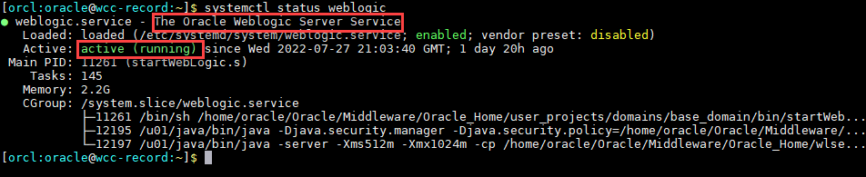

# Initialize WCC Environment

## Introduction

In this lab, we will review and startup all components required to successfully run this workshop.

*Estimated Time:* 30 Minutes.

### Objectives

In this lab, you will

- Initialize the workshop environment
- Selecting the Installation option for Records
- Configure Setup Checklist

### Prerequisites
This lab assumes you have:
- A Paid or LiveLabs Oracle Cloud account
- You have completed:
    - Lab: Prepare Setup ( *Paid Tenants* only)
    - Lab: Environment Setup

## Task 1: Validate That Required Processes are Up and Running
1. Now with access to your remote desktop session, proceed as indicated below to validate your environment before you start executing the subsequent labs. The following Processes should be up and running:

    - Database Listener
        - LISTENER
    - Database Server instance
        - ORCL
    - WebLogic Server
    - WebCenter Content Server

2. On the *web browser* window on the right preloaded with *WebCenter Content* homepage, click on the *Login* and select the saved credentials to sign in. These credentials have been saved within *web browser* and are provided below, alongside the URL, for reference

    - URL

    ```
    <copy>http://localhost:16200/cs/</copy>
    ```

    - Username

    ```
    <copy>weblogic</copy>
    ```

    - Password

    ```
    <copy>welcome1</copy>
    ```

    
    


3. Confirm successful login.

    

    If successful, the page above is displayed and as a result, your environment is now ready.  

4. If you are still unable to log in or the login page is not functioning after reloading by double-clicking on the desktop icon *Get Started with your Workshop*, open a terminal session and proceed as indicated below to validate the services.

    - Database and Listener

    ```
    <copy>
    sudo systemctl status oracle-database
    </copy>
    ```

    

    - WebLogic Server

    ```
    <copy>
    sudo systemctl status weblogic
    </copy>
    ```

    

    - WebCenter Content Server

    ```
    <copy>
    sudo systemctl status ucm
    </copy>
    ```

    

5. If you see the questionable output(s), failure or down component(s), restart the corresponding service(s) accordingly

    - Database and Listener

    ```
    <copy>
    sudo sudo systemctl restart oracle-database
    </copy>
    ```

    - WebLogic Server

    ```
    <copy>
    sudo sudo systemctl restart weblogic
    </copy>
    ```

    - WebCenter Content Server

    ```
    <copy>
    sudo systemctl restart ucm
    </copy>
    ```

6. After you log in to the WebCenter Content server, you can see Re-. Refer the Appendix 2 to know how to install Records on the WebCenter Content Server.


## Task 2: Validate APEX is Up and Running
1. On the new *web browser* window , Login to the APEX/ORDS URL . Details are provided below

    - URL

    ```
    <copy>http://localhost:16200/ords/</copy>
    ```

- Workspace Name

    ```
    <copy>INTERNAL</copy>
    ```

    - Username

    ```
    <copy>ADMIN</copy>
    ```

    - Password

    ```
    <copy>welcome1</copy>
    ```

    **For ATP DB** *, ADMIN password is same as the ADMIN DB schema user password*
    


2. Confirm successful login.

    

    If successful, the page above is displayed and as a result, your environment is now ready.  


You may now **proceed to the next lab**.

## Appendix 1: Managing Startup Services

1. Database Service (Database and Listener).

    - Start

    ```
    <copy>sudo systemctl start oracle-database</copy>
    ```

    - Stop

    ```
    <copy>sudo systemctl stop oracle-database</copy>
    ```

    - Status

    ```
    <copy>sudo systemctl status oracle-database</copy>
    ```

    - Restart

    ```
    <copy>sudo systemctl restart oracle-database</copy>
    ```

2. WebLogic Server

    - Start

    ```
    <copy>sudo systemctl start weblogic</copy>
    ```

    - Stop

    ```
    <copy>sudo systemctl stop weblogic</copy>
    ```

    - Status

    ```
    <copy>sudo systemctl status weblogic</copy>
    ```

    - Restart

    ```
    <copy>sudo systemctl restart weblogic</copy>
    ```
3. WebCenter Content Server

    - Start

    ```
    <copy>sudo systemctl start ucm</copy>
    ```

    - Stop

    ```
    <copy>sudo systemctl stop ucm</copy>
    ```

    - Status

    ```
    <copy>sudo systemctl status ucm</copy>
    ```

    - Restart

    ```
    <copy>sudo systemctl restart ucm</copy>
    ```


## Appendix 2: Re-index collections and documents

1. Log in to the Content server as an administrator and click on **Admin Applets** under the Administration tab as shown in the image below.

    

2. Click on **Repository Manager** Applet

    
    
    > **Note:** Restart the servers after selecting the installation settings for the changes to be applied.

3. Download and Run the **Repository Manager** Java Applet

    

4. On the **Repository Manager** Applet , Click on **Indexer** tab 

    

5. Under **Collection Rebuild Cycle** section, Click on **Start** Button and wait for the indexing to finish


## Appendix 3: Reset ADMIN password for APEX/ORDS


1. Find the latest version schema name:

 SQL> SELECT  schema  FROM dba_registry WHERE comp_id = 'APEX' ORDER BY schema DESC FETCH FIRST 1 ROW ONLY;


2. Set the current schema to the schema name retrieved in the above step

eg:
    ```
    SQL> alter session set current_schema=apex_230200;
    
    (OR)

    SQL> alter session set current_schema=apex_240100;
    ```


3. Find the user id:

    ```
    <copy>
    set lines 1000
    col USER_NAME for a20
    col DEFAULT_SCHEMA for a30

    SELECT to_char(user_id), user_name,
        default_schema, to_char(SECURITY_GROUP_ID), ACCOUNT_LOCKED
    FROM   wwv_flow_fnd_user
    WHERE  user_name = 'ADMIN'
    ORDER BY last_update_date DESC;
    </copy>
    ```
    *Note the **required user id and security group id** from the above query ( fyi, **Security Group ID 10 is for "INTERNAL" workspace**)*


4. Update the Password

    *FYI, for ATP DB, please reset the ADMIN password to the ADMIN DB schema user password ONLY*

    ```
    <copy>
        UPDATE wwv_flow_fnd_user
        SET    web_password = 'Welcome1'
        WHERE  user_name = 'ADMIN'
        AND    user_id = 1816480255305450;

      commit;
    </copy>
    ```


5. Unlock the ADMIN User

    ```
    <copy>
    BEGIN
        WWV_FLOW_SECURITY.g_security_group_id := 1815829765305396;
        WWV_FLOW_FND_USER_API.unlock_account('ADMIN');
        COMMIT;
    END;
    /
    </copy>
    ```


## Learn More

- [Introduction To WebCenter Records](https://docs.oracle.com/en/middleware/webcenter/content/12.2.1.4/index.html)

## Acknowledgements

* **Authors-** Senthilkumar Chinnappa, Senior Principal Solution Engineer, Oracle WebCenter Content
* **Contributors-** Senthilkumar Chinnappa, Mandar Tengse , Parikshit Khisty
* **Last Updated By/Date-** Senthilkumar Chinnappa, July 2024