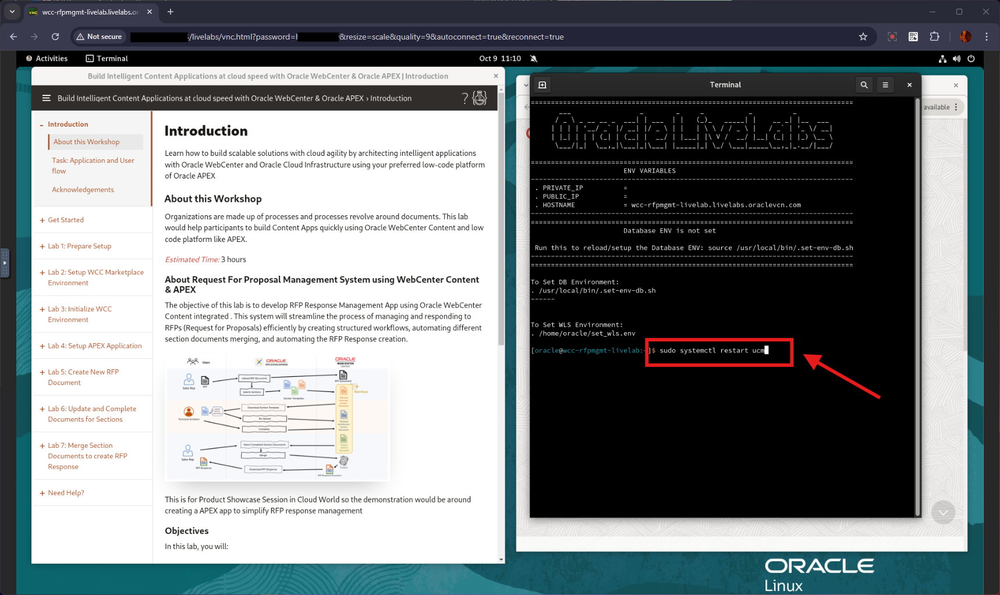

# Initialize WCC Environment

## Introduction

In this lab, we will review and startup all components required to successfully run this workshop.

**Estimated Lab Time**: *30 minutes*

### Objectives

In this lab, you will

- Initialize the workshop environment
- Validate WCC and APEX Instances
- Configure WCC Environment for the Workshop

### Prerequisites

This lab assumes you have:

- A Paid or LiveLabs Oracle Cloud account
- You have completed:
  - Lab: Prepare Setup
  - Lab: Environment Setup

## Task 1: Validate That WebCenter Content CS URL

1. Open the *web browser* window with *WebCenter Content* homepage url ( ie the **WebCenter Content CS Endpoint URL** ), click on the *Login* and Login using the below credentials
    - URL
            ```
            <copy>https://localhost:16200/cs/</copy>
            ```
        > Note : If you want to access the WCC CS Endpoint URL from your desktop, replace `"http://localhost"` with your **hosturl** ( eg: `"http://129.0.0.0"` )
        - The hosturl ipaddress can be obtained from the **Remote Desktop URL**
    - Username
            ```
            <copy>weblogic</copy>
            ```
    - Password
            ```
            <copy>Welcome1</copy>
            ```
    > *Note: In the scenario, where WebCenter Content is configured with IDCS or any other username (other than **weblogic**), use user credentials accordingly*
    

2. Confirm successful login.

    

    If successful, the page above is displayed and as a result, your WebCenter Content instance is accessible.

3. If you are still unable to log in or the login page is not functioning after reloading ,  proceed as indicated in the **Appendix 1: Restart UCM Server Instance** to restart the services and try login again

4. After you log in to the WebCenter Content Instance successfully, you can proceed with the next Task.

## Task 2: Enable Content Folios Component

To enable Content Folios Component & Add additional instance configurations, follow the below steps;

1. Login to WebCenter Content server as **weblogic** user

2. Under **Administration** tab, navigate to **Admin Server** > **Component Manager**. In the **Components** section list , click on **Document Management**, Select/Check **ContentFolios** Component and click **Update** button
    

3. Restart the Content Server instance , using the steps mentioned in **Appendix 1: Restart UCM Server Instance**

## Task 3: Validate APEX is Up and Running

This task helps to validate if APEX has been installed properly and its up & accessible.

1. On the new *web browser* window , Login to the APEX/ORDS URL . Details are provided below

    - **URL**
            ```
            <copy>
            http://localhost:16200/ords/
            </copy>
            ```
           > Note : If you want to access the WCC CS Endpoint URL from your desktop, replace `"http://localhost"` with your **hosturl** ( eg: `"http://129.0.0.0"` )
        - The hosturl ipaddress can be obtained from the **Remote Desktop URL**

    - **Workspace Name**
            ```
            <copy>
            WCCRFPMGMT
            </copy>
            ```
    - **Username**
            ```
            <copy>
            ADMIN
            </copy>
            ```
    - **Password**
            ```
            <copy>
            Welcome1
            </copy>
            ```

    > *If any issues with ADMIN credentials, Refer to **Appendix 5: Reset ADMIN password for APEX/ORDS**
    - *If it asks for change password, You can provide the new password also same as "Welcome1"
    

2. Confirm successful login.

    

    If successful, the page above is displayed and as a result, your WCC instance is now ready.

You may now **proceed to the next lab**.

## Appendix 1: Restart UCM Server Instance

1. Access the Graphical Remote Desktop using the steps mentioned in **Lab 2: Environment Setup** , **Task 1: Access the Graphical Remote Desktop**

2. Open a terminal session in the Remote Desktop and proceed as indicated below to restart the UCM service.
        ```
            <copy>
            sudo systemctl restart ucm
            </copy>
        ```
    

3. Wait for 3 minutes & check for status, so that UCM server starts completely and then log in to the WebCenter Content server
        ```
            <copy>
            sudo systemctl status ucm
            </copy>
        ```
    > Note: *To exit the status in the terminal , Press Esc button*
    

## Appendix 2: Reset ADMIN password for APEX/ORDS

Use the below steps to reset the ADMIN User Password , if facing any issue like Forgot ADMIN password (or) ADMIN account is locked

1. In the terminal window, invoke the below commands command and connect to the database
    - invoke **sqlplus** command
            ```
            <copy>sqlplus '/as sysdba'</copy>
            ```

2. Now execute any required sql statements in this sqlplus session.

3. Find the latest version schema name:
            ```
            <copy> SELECT  schema  FROM dba_registry WHERE comp_id = 'APEX' ORDER BY schema DESC FETCH FIRST 1 ROW ONLY; </copy>
            ```

4. Set the current schema to the schema name retrieved in the above step
    eg:
        ```
        <copy> alter session set current_schema=apex_230200; </copy>
        ```
5. Update the password and unlock the ADMIN User
            ```
            <copy>
                BEGIN
                    UPDATE wwv_flow_fnd_user
                    SET    web_password = 'Welcome1'
                    WHERE  user_name = 'ADMIN'
                    AND    user_id = (SELECT user_id
                    FROM   wwv_flow_fnd_user
                    WHERE  user_name = 'ADMIN' and SECURITY_GROUP_ID=10);
                    WWV_FLOW_SECURITY.g_security_group_id := 10;
                    WWV_FLOW_FND_USER_API.unlock_account('ADMIN');
                    COMMIT;
                END;
                /
            </copy>
            ```

## Appendix 3: Re-index collections and documents

1. Launch the **Repository Manager** Applet
    1. **Option 1** : Using the **Remote Desktop**
        1. Access the Graphical Remote Desktop using the steps mentioned in **Lab 2: Environment Setup** , **Task 1: Access the Graphical Remote Desktop**

        2. Invoke the below command to launch the **Oracle WebCenter Content - Administration** application
                ```
                <copy>
                cd /home/oracle/Downloads/wccadmin-installer/wccadmin
                ./wccadmin
                </copy>
                ```
            > Note: You can use the **Clipboard** option in **noVNC** to copy/paste commands
            
        3. Provide below credentials to login (*Please leave the Server value as-is*) and click **OK**
            - **User Name**
                    ```
                    <copy>
                    weblogic
                    </copy>
                    ```
            - **Password**
                    ```
                    <copy>
                    Welcome1
                    </copy>
                    ```
            
        4. Click on the **Repository Manager** in the **WebCenter Administration** list
            

    2. **Option 2** : Using the **WebCenter Content Server URL** from **Desktop**
        1. Log in to the Content server as **weblogic** user in your desktop and click on **Admin Applets** under the Administration tab as shown in the image below.

            

        2. Click on **Repository Manager** Applet

            

        3. Download and Run the **Repository Manager** Java Applet

            

            

2. On the **Repository Manager** Applet , Click on **Indexer** tab

    

3. Under **Collection Rebuild Cycle** section, Click on **Start** Button, *Uncheck* the **Use Fast Rebuild** option , Click **OK** button and wait for the indexing to finish

      

    

### Learn More

- [Introduction To WebCenter Content](https://docs.oracle.com/en/middleware/webcenter/content/12.2.1.4/index.html)
- [Learn More about Apex](https://apex.oracle.com/en/)
- [WebCenter Content - Configuring the Search Index](https://docs.oracle.com/en/middleware/webcenter/content/12.2.1.4/webcenter-content-admin/configuring-search-index.html#GUID-D8372225-70C9-4A3E-987A-279995879606)

## Acknowledgements

- **Authors-** Senthilkumar Chinnappa, Senior Principal Solution Engineer, Oracle WebCenter Content
- **Contributors-** Senthilkumar Chinnappa, Mandar Tengse , Parikshit Khisty
- **Last Updated By/Date-** Senthilkumar Chinnappa, October 2024
