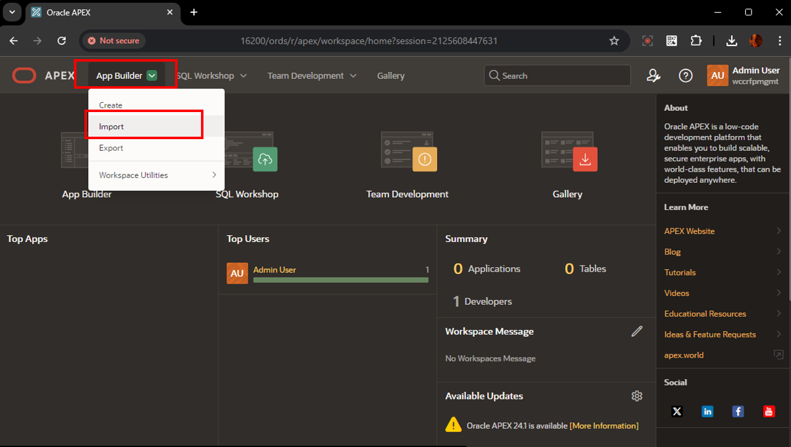
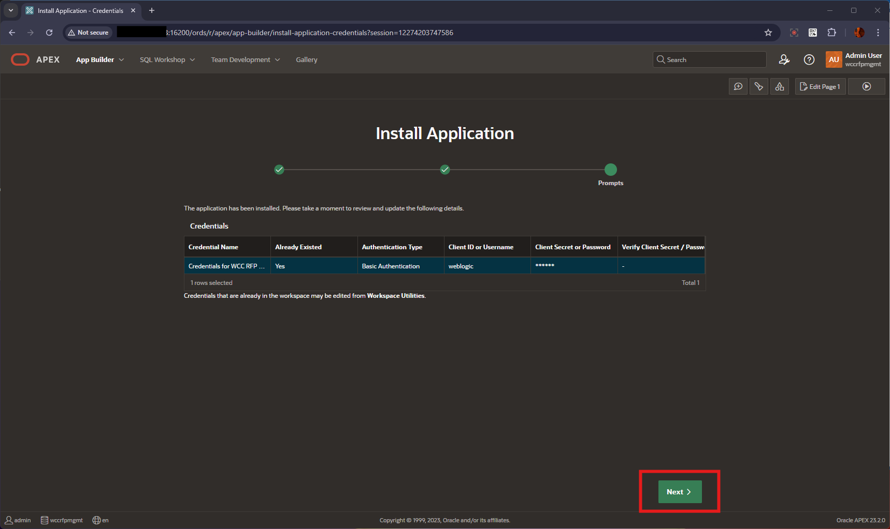
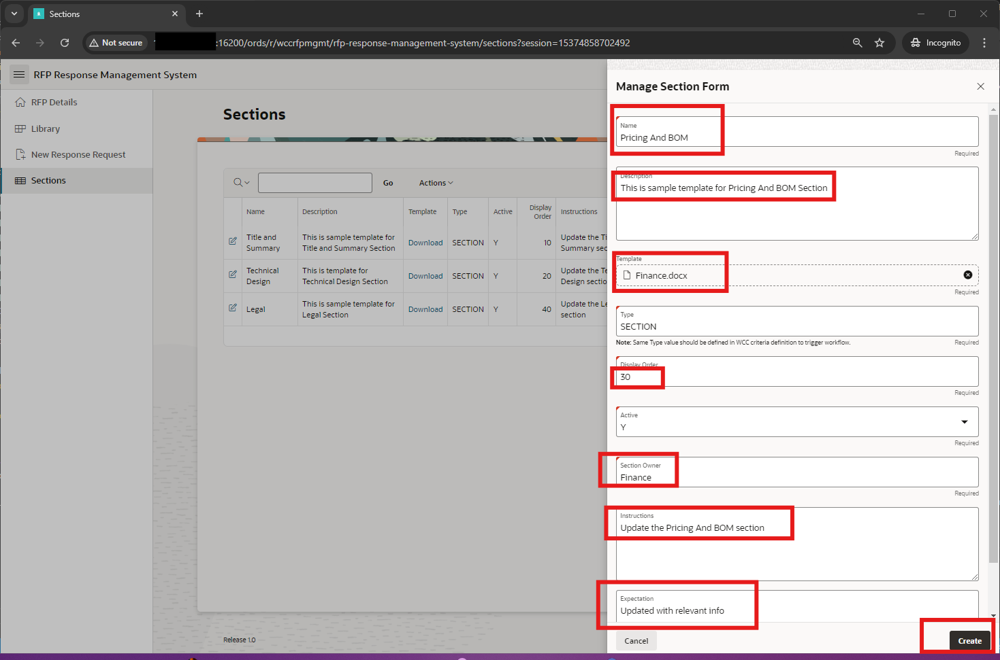
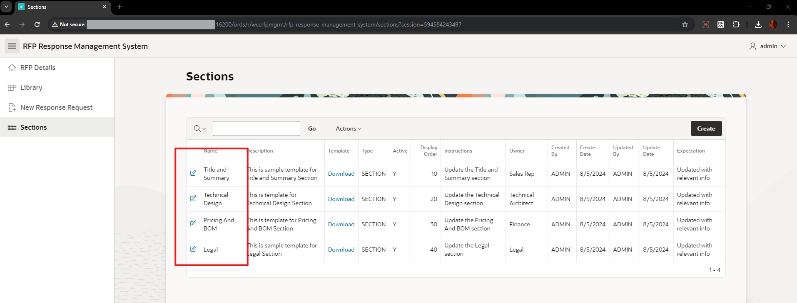

# Setup RFP Management APEX Application

## Introduction

In this lab, you learn to install and run Oracle APEX Application for RFP Management System.

This lab also covers updating the APEX Rest Datasource urls & credentials for connecting to WebCenter Content Instance

**Estimated Lab Time**: *15 minutes*

### Objectives

In this lab, you will:

- Navigate through Oracle APEX
- Login to Workspace and Install Packaged Application.
- Update Rest Data sources URL and credentials

### Prerequisites

This lab assumes you have:

- A  Paid or LiveLabs Oracle Cloud account
- You have completed:
  - Lab: Prepare Setup
  - Lab: Environment Setup
  - Lab: Initialize Environment

## Task 1: Login to APEX Workspace

To log in to Oracle APEX, you need a Workspace Name, username, and the password created for that Workspace. In this hands-on lab, you log in to your Oracle APEX Workspace.

1. To login to your Oracle APEX Workspace, perform the following steps:
    - Open your browser and enter the **URL** to sign in to the APEX development environment.
      - **URL**
            ```
            <copy>
            http://localhost:16200/ords/
            </copy>
            ```

            > Note : If you want to access the WCC CS Endpoint URL from your desktop, replace `"http://localhost"` with your **hosturl** ( eg: `"http://129.0.0.0"` )
            - The hosturl ipaddress can be obtained from the **Remote Desktop URL**

    - The login page appears. Enter the **Workspace Name, Username, and Password**. Click **Sign In**.
      - **Workspace Name**

                  ```
                  <copy>
                  INTERNAL
                  </copy>
                  ```

      - **Username**

                  ```
                  <copy>
                  ADMIN
                  </copy>
                  ```
      - **Password**

                  ```
                  <copy>
                  Welcome1
                  </copy>
                  ```

      

2. If its first time Login, Change password for the ADMIN user. You can provide the same Password value and click on **Change Password**.
    > Skip this step if it does not prompt for Change Password

    - **New Password**: Enter

                  ```
                  <copy>
                  Welcome1
                  </copy>
                  ```
    - **Confirm Password**: Enter

                  ```
                  <copy>
                  Welcome1
                  </copy>
                  ```

      

3. The Workspace home page appears.

  

## Task 3: Install RFP Management Application

This task covers installing and running a WCC RFP Management System APEX application.

1. After Login to the WORKSPACE **WCCRFPMGMT** as ADMIN user, in the Home Page, Under  **App Builder** , click on **Import**
  

2. From the Downloaded wcc rf resources zip file ( in **Lab2 : Prepare Setup** ), Select the APEX Application sql file **sandbox-wcc-rfp-mgmt-system-apex-app.sql**  , ensure that the **File Type** is selected as **Application, Page or Component** and click **Next** Button
  

3. In the **Install Application** Page, Verify the below values and click **Install Application** Button

    - *Current Workspace* : **WCCRFPMGMT**
    - *Parsing Schema* : **WCCRFPMGMT_SCHEMA**
    - *Build Status* : **Run and Build Application**
    - *Install as Application* : **Reuse Application ID 999 From Imported Application**
  

4. In the **Install Application** - **Credentials** Page, for **Credentials for WCC RFP Mgmt**, Update the values for the below *( if the username value is empty )* and click **Next** Button
    - **Client ID or Username** : Enter
          ```
          <copy>weblogic</copy>
          ```
    - **Client Secret or Password** : Enter
          ```
          <copy>Welcome1</copy>
          ```
    - **Verify Client Secret / Password** : Enter
          ```
          <copy>Welcome1</copy>
          ```
  

5. After the Credentials is updated, in the **Application Installed** Page, click on **Install Supporting Objects** button
  

6. After the Supporting Objects installed, click on **Install Summary** button , to view the status of the Supporting objects installation
  

## Task 4 : Refresh REST Datasource Catalog

1. To login to your Oracle APEX Workspace, perform the following steps:
    - Open your browser and enter the **URL** to sign in to the APEX development environment.
      - **URL**
            ```
            <copy>
            http://localhost:16200/ords/
            </copy>
            ```

            > Note : If you want to access the WCC CS Endpoint URL from your desktop, replace `"http://localhost"` with your **hosturl** ( eg: `"http://129.0.0.0"` )
            - The hosturl ipaddress can be obtained from the **Remote Desktop URL**

    - The login page appears. Enter the **Workspace Name, Username, and Password**. Click **Sign In**.
      - **Workspace Name**

                  ```
                  <copy>
                  INTERNAL
                  </copy>
                  ```

      - **Username**

                  ```
                  <copy>
                  ADMIN
                  </copy>
                  ```
      - **Password**

                  ```
                  <copy>
                  Welcome1
                  </copy>
                  ```

  
2. Click on **App Builder** , then click on **RFP Response Management System** Application
  
3. Navigate to **Shared Components** > Under **Data Sources**, click on **REST Data Sources**
  
4. Click on **quick_search_library** under the **REST Source Name** list
  
5. Click on the **REST Source Catalog** tab and then click on **Refresh from Catalog** button
  
6. Click on the **Refresh from Service Catalog** button
  

## Task 5: Add Section Templates in RFP Response Management Application

As default, the below three sections are already configured:

- Title and Summary
- Technical Design
- Legal
These below steps is sample to add another Section **Pricing And BOM**, which will be used as part of the Lab exercise.

1. To login to the WCC RFP Response Management System Application, perform the following steps:

    - Open your browser and enter the **URL** to sign in to the APEX development environment.
      - URL
            ```
            <copy>https://localhost:16200/ords/r/wccrfpmgmt/rfp-response-management-system/</copy>
            ```

           > Note : If you want to access the WCC CS Endpoint URL from your desktop, replace `"http://localhost"` with your **hosturl** ( eg: `"http://129.0.0.0"` )
            - The hosturl ipaddress can be obtained from the **Remote Desktop URL**

      - The login page appears. Enter the **Username, and Password**. Click **Sign In**.
        - **Username**: Enter
              ```
              <copy>ADMIN</copy>
              ```
        - **Password**: Enter
              ```
              <copy>Welcome1</copy>
              ```
  

2. On the left navigation menu, click on **Sections** and click on **Create** button
  

3. In the **Manage Section Form** window, enter the below values and click on **Create** Button

    - **Name**: Specify

          ```
          <copy>Pricing And BOM</copy>
          ```

    - **Description**: Specify

          ```
          <copy>This is sample template for Pricing And BOM Section</copy>
          ```

    - **Template**: Browse and select the file **Finance.docx** from the downloaded **wcc\_rfp\_resources.zip** file ( in **Lab 1 - Prepare Setup**)
    - **Type**: Leave the default as **SECTION**
    - **Display Order**: Specify

          ```
          <copy>30</copy>
          ```
    - **Active**: Leave the default as **Y**
    - **Section Owner**: Specify
          ```
          <copy>Finance</copy>
          ```
    - **Instructions**: Specify
          ```
          <copy>Update the Pricing And BOM section</copy>
          ```
    - **Expectation**: Specify
          ```
          <copy>Updated with relevant info</copy>
          ```
      

4. This shows the summary of all the sections created.

  

    **Summary**

    You have now successfully setup the RFP Response Management Application for the RFP Application and User Flow.

You are now ready to **proceed to the next lab**.

## Acknowledgements

- **Authors-** Senthilkumar Chinnappa, Senior Principal Solution Engineer, Oracle WebCenter Content
- **Contributors-** Senthilkumar Chinnappa, Mandar Tengse , Parikshit Khisty
- **Last Updated By/Date-** Senthilkumar Chinnappa, Oct 2024
