# Setup RFP Management APEX Application


## Introduction

In this lab, you learn to install and run Oracle APEX Application for RFP Management System. 

This lab also covers updating the APEX Rest Datasource urls & credentials for connecting to WebCenter Content Instance

Estimated Time: 20 minutes

### Objectives
In this lab, you will:
- Navigate through Oracle APEX
- Create New Workspace
- Login to Workspace and Install Packaged Application.
- Update Rest Datasources URL and credentials

## Task 1: Create New APEX Workspace for RFP Management Application

To create new APEX workspace, you need log in to Oracle APEX's default **INTERNAL** Workspaces as **ADMIN** User (or) the user with Administrator Privilege on the APEX Instance

1. On the new *web browser* window , Login to the APEX/ORDS URL as **ADMIN** User of System's **INTERNAL** Workspace. Details are provided below

    - URL

    ```
    <copy>http://localhost:16200/ords/</copy>
    ```

- Workspace Name

    ```
    <copy>INTERNAL</copy>
    ```

    - Username

    ```
    <copy>ADMIN</copy>
    ```

    - Password

    ```
    <copy>WelCwcm123##</copy>
    ```

    > **For ATP DB** *, ADMIN password is same as the ADMIN DB schema user password*

    > _If any issues with ADMIN credentials, Refer to **Appendix 3: Reset ADMIN password for APEX/ORDS** of the previous lab **Initialize WCC Environment** to reset ADMIN Password_

    


2. In the *Administration Services* Landing page , Click on **Create Workspace** button on the top right corner

    

3. Provide the value for **Workspace Name**  and click **Next** Button

    ```
    <copy>WCCRFPMGMT</copy>
    ```

 

4. Provide the values for DB Schema details as mentioned below and click **Next** Button

    * **Re-use existing schema?**: Select **No**

    * **Schema Name**: Enter
    ```
    <copy>WCCRFPMGMT_SCHEMA</copy>
    ```
    * **Schema Password**: Enter
    ```
    <copy>WelCwcm123##</copy>
    ```
    * **Space Quota (MB)**: Select **500**

 

5. Provide the values for Workspace **ADMIN** User details as mentioned below and click **Next** Button

    * **Administrator Username**: Enter
    ```
    <copy>ADMIN</copy>
    ```
    * **Administrator Password**: Enter
    ```
    <copy>Welcome1</copy>
    ```
    * **First Name**: Enter
    ```
    <copy>Admin</copy>
    ```
    * **Last Name**: Enter
    ```
    <copy>User</copy>
    ```
    * **Email**: Enter your email id
    ```
    <copy>admin_user@email.com</copy>
    ```
 

6. Review the details and click **Create Workspace** Button

 

7. After the workspace is successfully created, it will display  workspace details.  click **Done** Button

 


## Task 2: Login to Newly Created APEX Workspace


To log in to Oracle APEX, you need a Workspace Name, username, and the password created for that Workspace. In this hands-on lab, you log in to your Oracle APEX Workspace.

1. To login to your Oracle APEX Workspace, perform the following steps:
    -	Open your browser and enter the **URL** to sign in to the APEX development environment.

    - The login page appears. Enter the **Workspace Name, Username, and Password**. Click **Sign In**.  

    * **Workspace Name**: Enter
    ```
    <copy>WCCRFPMGMT</copy>
    ```
    * **Username**: Enter
    ```
    <copy>ADMIN</copy>
    ```
    * **Password**: Enter
    ```
    <copy>Welcome1</copy>
    ```
  


2. If its first time Login, Change password for the ADMIN user. You can provide the same Password value and click on **Change Password**.
    > Skip this step if it does not prompt for Change Password

    * **New Password**: Enter
    ```
    <copy>Welcome1</copy>
    ```
    * **Confirm Password**: Enter
    ```
    <copy>Welcome1</copy>
    ```

  

3. The Workspace home page appears.

  


## Task 3: Install RFP Management Application

This task covers installing and running a WCC RFP Management System APEX application.


1. In the Home Page, Under  **Apex Builder** , click on **Import**

  


2. Select the downloaded file **wcc-rfp-mgmt-system-apex-app.sql** , ensure that the **File Type** is selected as **Application, Page or Component** and click **Next** Button

  

3. In the **Install Application** Page, Verify the below values and click **Install Application** Button

 * *Current Workspace* : **WCCRFPMGMT**
 * *Parsing Schema* : **WCCRFPMGMT_SCHEMA**
 * *Build Status* : **Run and Build Application**
 * *Install as Application* : **Auto Assign New Application ID**

  

4. In the **Install Application** - **Credentials** Page, for **Credentials for WCC RFP Mgmt**, Update the values for the below and click **Next** Button

    * **Client ID or Username**: Enter
    ```
    <copy>weblogic</copy>
    ```
    * **Client Secret or Password**: Enter
    ```
    <copy>Welcome1</copy>
    ```
    * **Verify Client Secret / Password**: Enter
    ```
    <copy>Welcome1</copy>
    ```

  

5. After the Credentials is updated, in the **Application Installed** Page, click on **Install Supporting Objects** button

  

6. After the Supporting Objects installed, click on **Install Summary** button , to view the status of the Supporting objects installation

  


## Task 4: Update REST DataSource URLs

This task covers importing and configuring Rest Datasoure Catalog.


1. In the Home Page, Under  **Apex Builder** , click on **Import**

  


2. Select the downloaded file **WCC RFP Rest Catalog.sql** , ensure that the **File Type** is selected as **REST Source Catalog** and click **Next** Button

  

3. Click **Next** in the **Import** Page

  

4. In the **Rest Catalog Import** Page, Enter the value for **Catalog Group** and click on **Import REST Catalog** Button

 * **Catalog Group**: Enter
    ```
    <copy>WCC_RFP_REST_CATALOG_GROUP</copy>
    ```
  

5. After the REST Catalog is imported, click on **1Services** under the **Contents** tab for the imported **WCC RFP Rest Catalog**

  

6. In the **Catalog Services** list, click on the *Name* **quick_search_library**

  

7. In the **Service Details** Section, Update the **Base URL** with the URL for the WCC Instance Provisioned in the **Lab 3 - Initialize Environment** and click **Apply Changes** Button

  

## Task 5: Update Web Credentials

 This task covers updating Web Credentials.


1. In the Home Page, Under  **Apex Builder** , Navigate to **Workspace Utilities** and click on **All Workspace Utilities**

  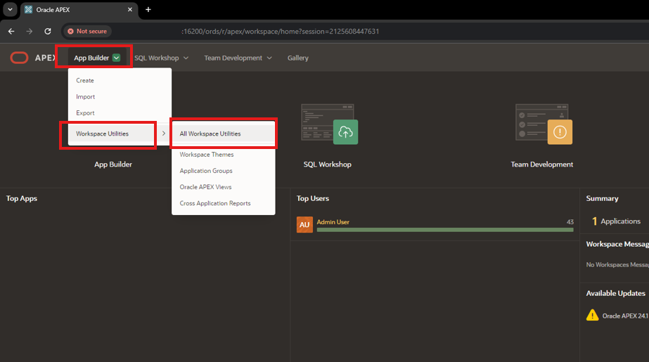

2. In the **Workspace Utilities** Page, click on **Web Credentials**

  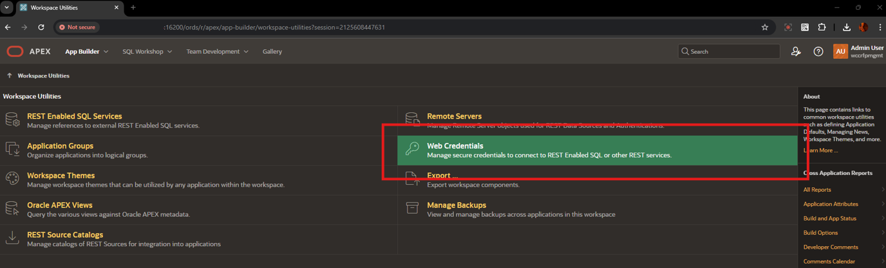

3. Under the *Web Credentials* list, click on **Credentials for RFP Mgmt** link

  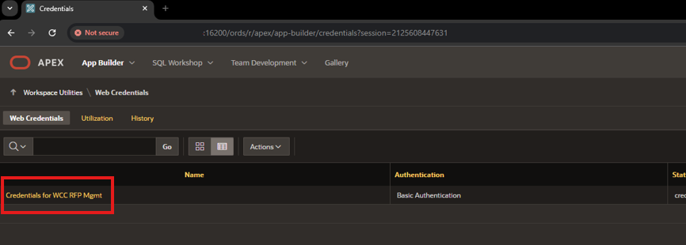

4. In the **Attributes** list, update the values as below and click **Apply Changes** Button

* **Client ID or Username**: Enter
    ```
    <copy>weblogic</copy>
    ```
* **Client Secret or Password**: Enter
    ```
    <copy>Welcome1</copy>
    ```
* **Verify Client Secret or Password**: Enter
    ```
    <copy>Welcome1</copy>
    ```
* **Valid for URLs**: Replace the hostname with the hostname of the WCC Instance Provisioned in the **Lab 3 - Initialize Environment**

  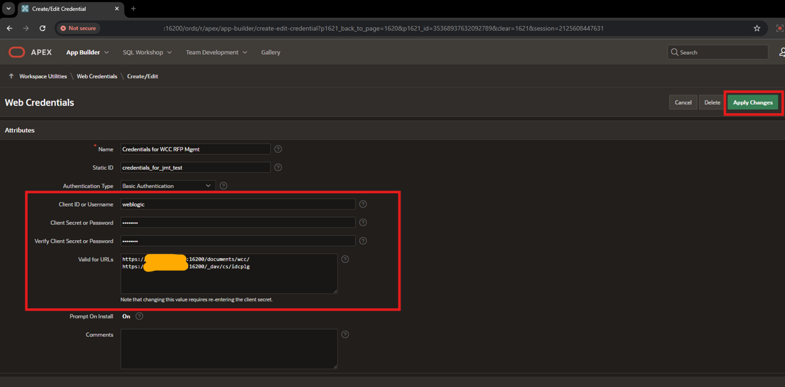

## Task 6: Refresh Datasource from REST Catalog

 This task covers Refreshing the REST Datasource from the REST Catalog.

1. In the Home Page, Click on  **Apex Builder**

  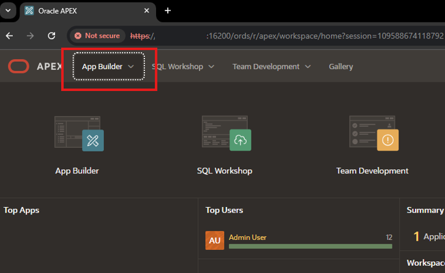

2. Hover over the **RFP Response Management System** , and click on the **Edit** *Pencil Icon*

  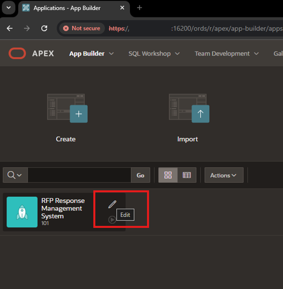

3. In the Application Edit Page, click on **Shared Components**

  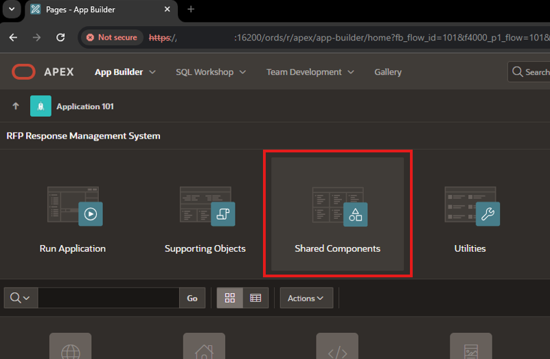

4. Under **Data Sources** Section, click on **Rest Data Sources** link

  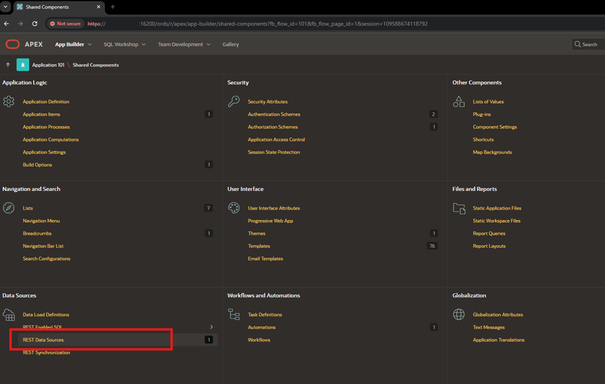

5. In the **Rest Source Name** list, click on **quick_search_library** Name

  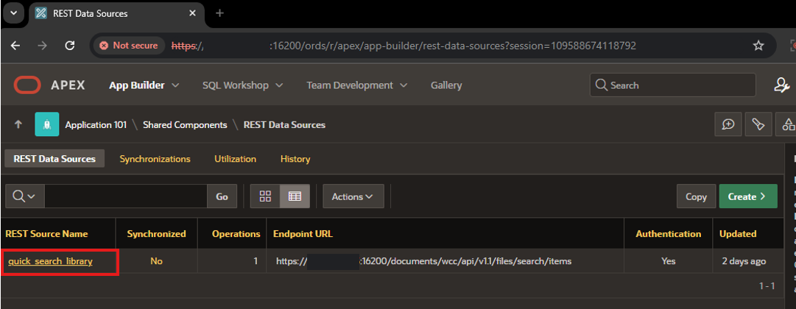

6. In the **REST Data Source** Page, click on **REST Source Catalog** tab and click on **Refresh from Catalog** Button

  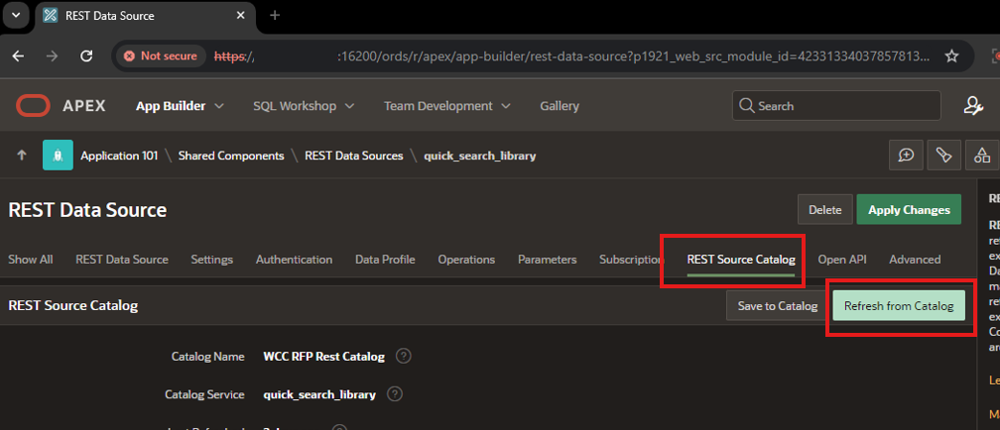

7. In the dialog window, Click on **Refresh from Service Catalog** Button

  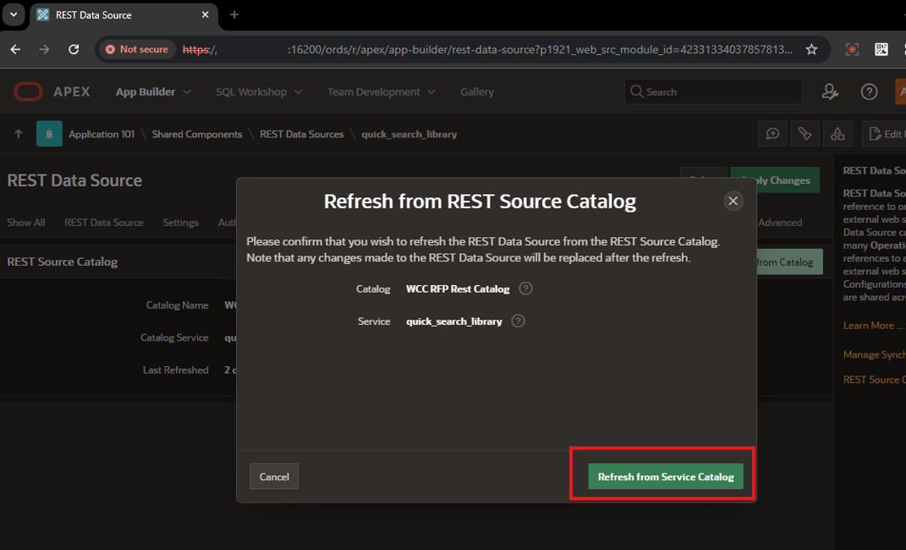

8. After the *Rest Data Source has been refreshed*, click on **Apply Changes** button

  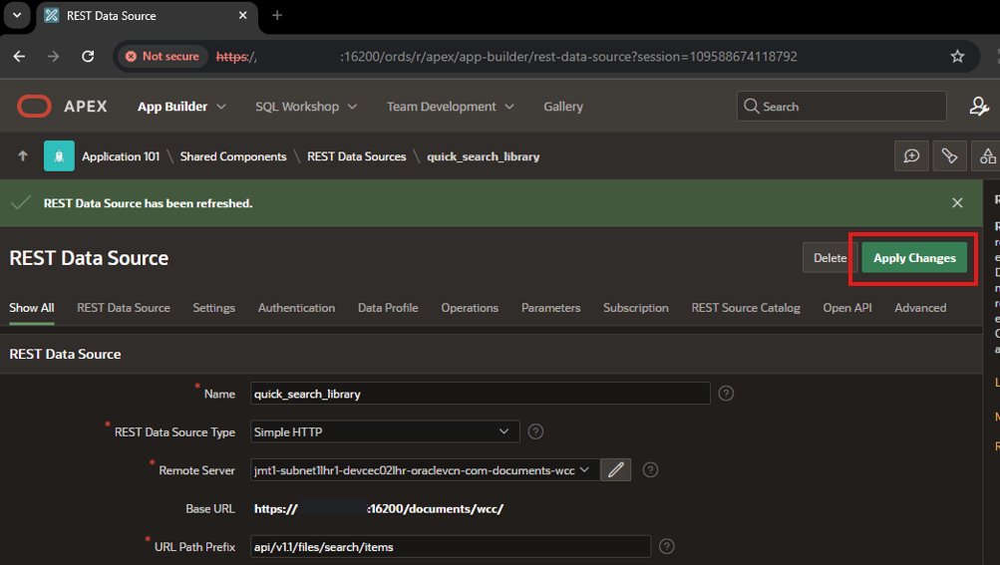

## Summary
You have now learned how to navigate the significant components of Oracle APEX and install and run a packaged application. You are now ready to **proceed to the next lab**.


## Acknowledgements

* **Authors-** Senthilkumar Chinnappa, Senior Principal Solution Engineer, Oracle WebCenter Content
* **Contributors-** Senthilkumar Chinnappa, Mandar Tengse , Parikshit Khisty
* **Last Updated By/Date-** Senthilkumar Chinnappa, July 2024
