# Setup RFP Management APEX Application

## Introduction

In this lab, you learn to install and run Oracle APEX Application for RFP Management System.

This lab also covers updating the APEX Rest Datasource urls & credentials for connecting to WebCenter Content Instance

**Estimated Lab Time**: *20 minutes*

### Objectives

In this lab, you will:

- Navigate through Oracle APEX
- Create New Workspace
- Login to Workspace and Install Packaged Application.
- Update Rest Data sources URL and credentials

### Prerequisites

This lab assumes you have:

- A  Paid or LiveLabs Oracle Cloud account
- You have completed:
  - Lab: Prepare Setup ( *Paid Tenants* only)
  - Lab: Setup WCC Marketplace Environment
  - Lab: Initialize Environment

## Task 1: Create New APEX Workspace for RFP Management Application

To create new APEX workspace, you need log in to Oracle APEX's default **INTERNAL** Workspaces as **ADMIN** User (or) the user with Administrator Privilege on the APEX Instance

1. On the new *web browser* window , Login to the APEX/ORDS URL as **ADMIN** User of System's **INTERNAL** Workspace. Details are provided below
    - **URL**
          ```
          <copy>https://localhost:16200/ords/</copy>
          ```

         > Note : Replace `"https://localhost"` with your **hosturl** ( eg: `"http://wcc-rfpmgmt-livelab.livelabs.oraclevcn.com"` or `"https://192.0.0.0""`)
    - **Workspace Name**
          ```
          <copy>INTERNAL</copy>
          ```
    - **Username**
          ```
          <copy>ADMIN</copy>
          ```
    - **Password**
          ```
          <copy>WelCwcm123##</copy>
          ```
    > **For ATP DB** *, ADMIN password is same as the ADMIN DB schema user password*.
    > *If any issues with ADMIN credentials, Refer to **Appendix 5: Reset ADMIN password for APEX/ORDS** of the previous lab **Initialize WCC Environment** to reset ADMIN Password*
  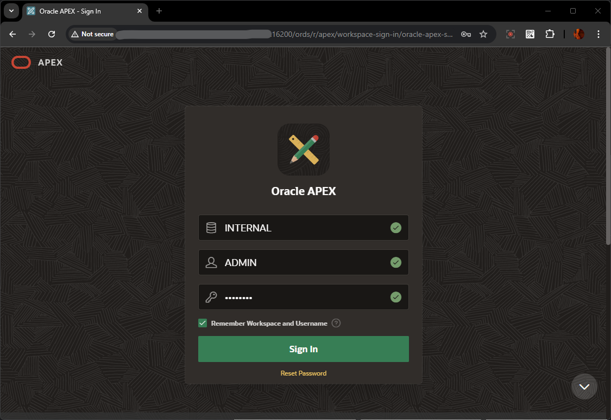

2. In the *Administration Services* Landing page , Click on **Create Workspace** button on the top right corner
  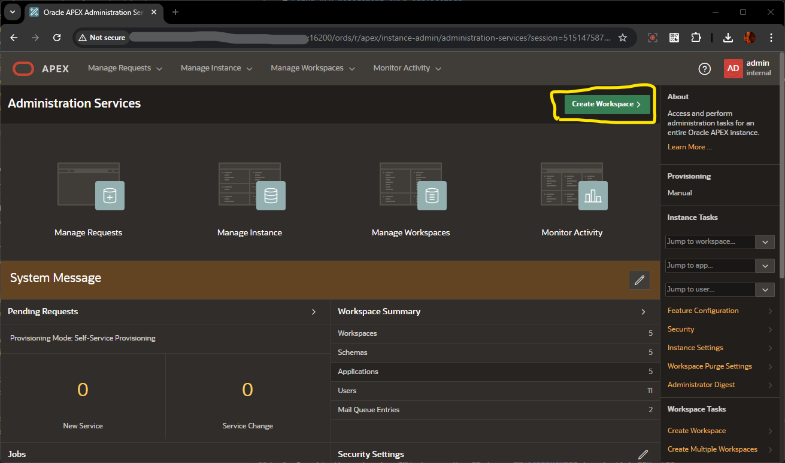

3. Provide the value for **Workspace Name**  and click **Next** Button
        ```
        <copy>WCCRFPMGMT</copy>
        ```
  

4. Provide the values for DB Schema details as mentioned below and click **Next** Button
    - **Re-use existing schema?**: Select **No**
    - **Schema Name**: Enter
          ```
          <copy>WCCRFPMGMT_SCHEMA</copy>
          ```
    - **Schema Password**: Enter
          ```
          <copy>WelCwcm123##</copy>
          ```
    - **Space Quota (MB)**: Select **500**
  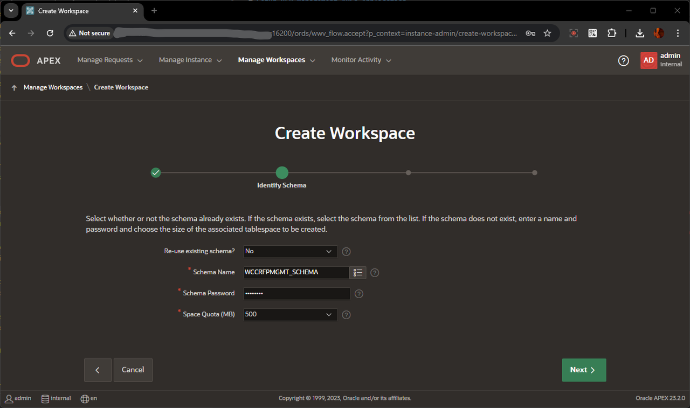

5. Provide the values for Workspace **ADMIN** User details as mentioned below and click **Next** Button

    - **Administrator Username**: Enter
          ```
          <copy>ADMIN</copy>
          ```
    - **Administrator Password**: Enter
          ```
          <copy>Welcome1</copy>
          ```
    - **First Name**: Enter
          ```
          <copy>Admin</copy>
          ```
    - **Last Name**: Enter
          ```
          <copy>User</copy>
          ```
    - **Email**: Enter your email id
          ```
          <copy>admin_user@email.com</copy>
          ```
  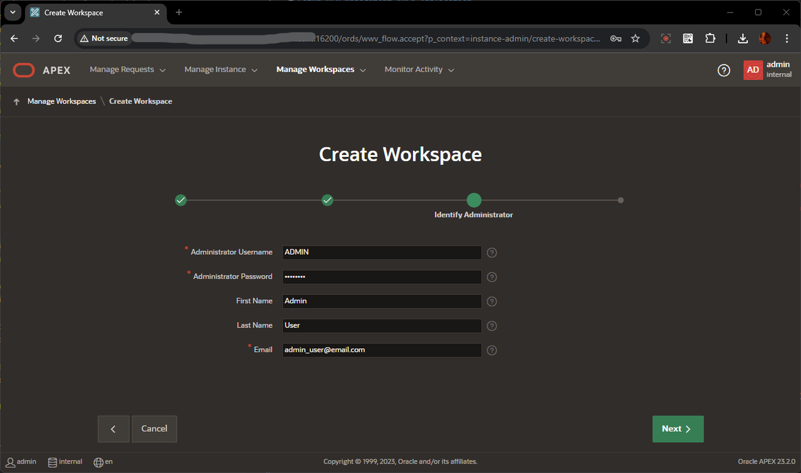

6. Review the details and click **Create Workspace** Button
 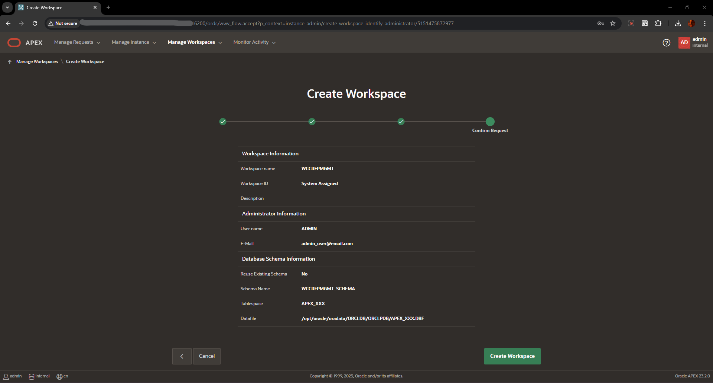

7. After the workspace is successfully created, it will display  workspace details.  click **Done** Button

 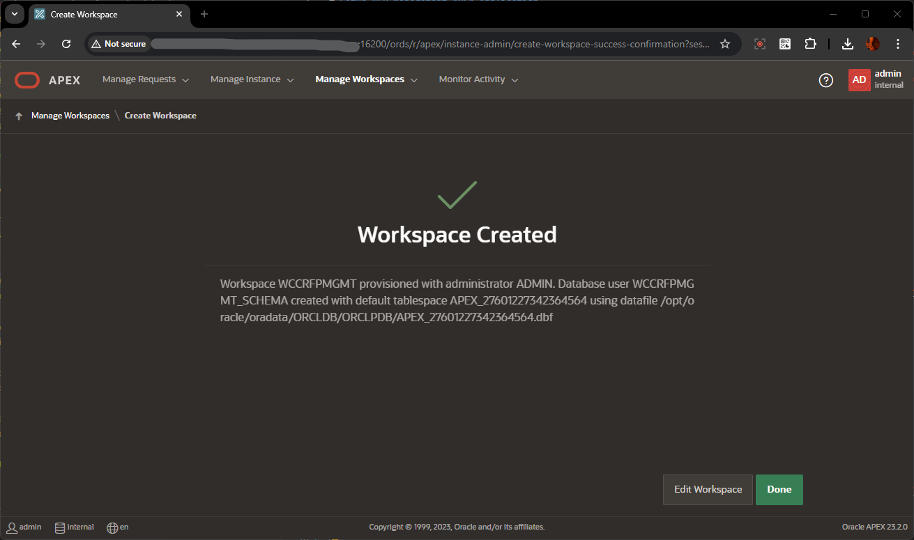

## Task 2: Login to Newly Created APEX Workspace

To log in to Oracle APEX, you need a Workspace Name, username, and the password created for that Workspace. In this hands-on lab, you log in to your Oracle APEX Workspace.

1. To login to your Oracle APEX Workspace, perform the following steps:
    - Open your browser and enter the **URL** to sign in to the APEX development environment.
      - **URL**
            ```
            <copy>https://localhost:16200/ords/</copy>
            ```

            > Note : Replace `"https://localhost"` with your **hosturl** ( eg: `"http://wcc-rfpmgmt-livelab.livelabs.oraclevcn.com"` or `"https://192.0.0.0"`)

    - The login page appears. Enter the **Workspace Name, Username, and Password**. Click **Sign In**.
      - **Workspace Name**: Enter
            ```
            <copy>WCCRFPMGMT</copy>
            ```
      - **Username**: Enter
            ```
            <copy>ADMIN</copy>
            ```
      - **Password**: Enter
            ```
            <copy>Welcome1</copy>
            ```
  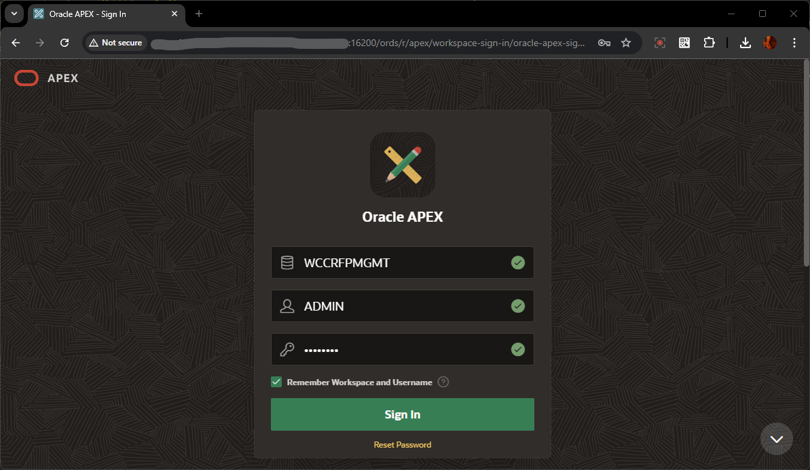

2. If its first time Login, Change password for the ADMIN user. You can provide the same Password value and click on **Change Password**.
    > Skip this step if it does not prompt for Change Password

    - **New Password**: Enter
          ```
          <copy>Welcome1</copy>
          ```
    - **Confirm Password**: Enter
          ```
          <copy>Welcome1</copy>
          ```
  

3. The Workspace home page appears.

  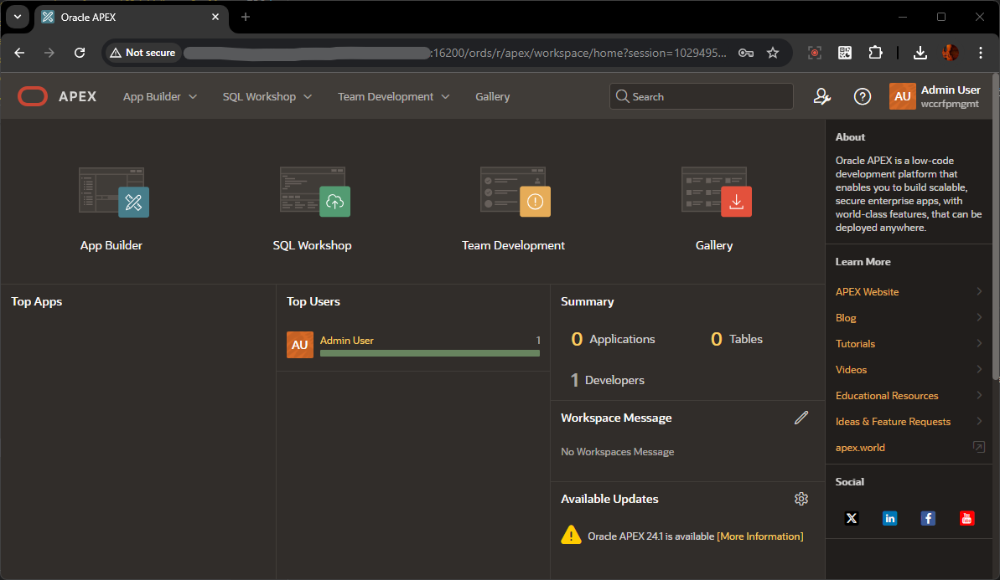

## Task 3: Install RFP Management Application

This task covers installing and running a WCC RFP Management System APEX application.

1. Edit the downloaded APEX Application sql file **wcc-rfp-mgmt-system-apex-app.sql** in a text editor (eg: Notepad) , replace `"localhost"` with the WLS Node 1 Private IP Address **WLS\_NODE1\_IPADDR** ( eg: `"10.15.xx.xxx"`) and save the file.
      - The **WLS\_NODE1\_IPADDR** is noted at the end of **Lab 2: Setup WCC Marketplace Environment** > **Task 1: Provision WebCenter Content Stack**

      > Note: *In the scenario, where WebCenter Content is configured with IDCS or any other username ( other than **weblogic** )*, replace these two values as well:
      - Replace **"weblogic"** with *WebCenter Content Username* which has *Administrator Privileges* on WebCenter Content **&**
      - Replace **"Welcome1"** with the *Password for the above user*

      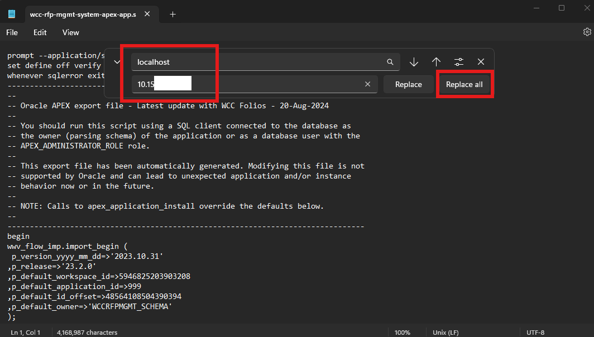

2. After Login to the WORKSPACE **WCCRFPMGMT** as ADMIN user, in the Home Page, Under  **App Builder** , click on **Import**
  

3. Select the updated file **wcc-rfp-mgmt-system-apex-app.sql**  , ensure that the **File Type** is selected as **Application, Page or Component** and click **Next** Button
  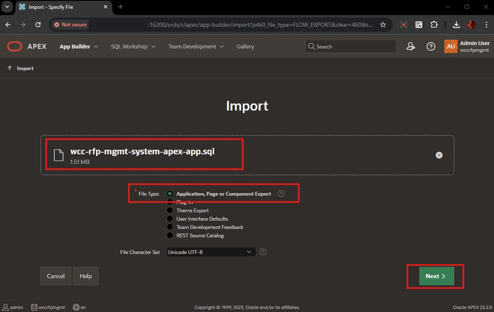

4. In the **Install Application** Page, Verify the below values and click **Install Application** Button

    - *Current Workspace* : **WCCRFPMGMT**
    - *Parsing Schema* : **WCCRFPMGMT_SCHEMA**
    - *Build Status* : **Run and Build Application**
    - *Install as Application* : **Reuse Application ID 999 From Imported Application**
  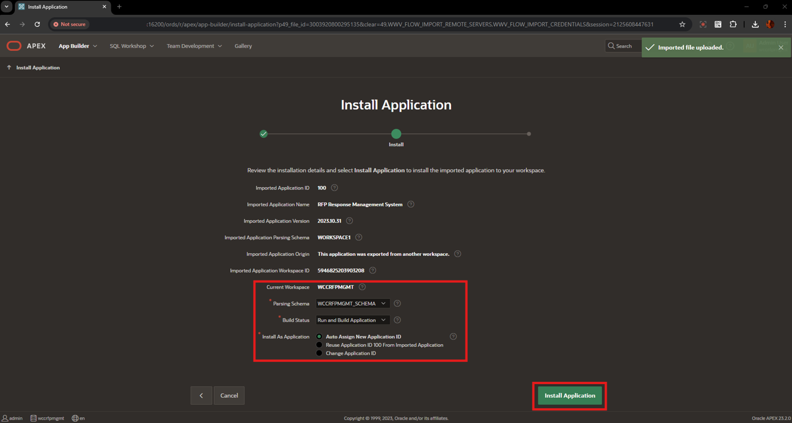

5. In the **Install Application** - **Credentials** Page, for **Credentials for WCC RFP Mgmt**, Update the values for the below *( Update it with the WebCenter Content User Credentials which has Administrator Privileges on WebCenter Content )* and click **Next** Button
    - **Client ID or Username** : Enter
          ```
          <copy>weblogic</copy>
          ```
    - **Client Secret or Password** : Enter
          ```
          <copy>Welcome1</copy>
          ```
    - **Verify Client Secret / Password** : Enter
          ```
          <copy>Welcome1</copy>
          ```
      > Note: In the scenario, where WebCenter Content is configured with IDCS or any other username (other than **weblogic**), update these values accordingly
  

6. After the Credentials is updated, in the **Application Installed** Page, click on **Install Supporting Objects** button
  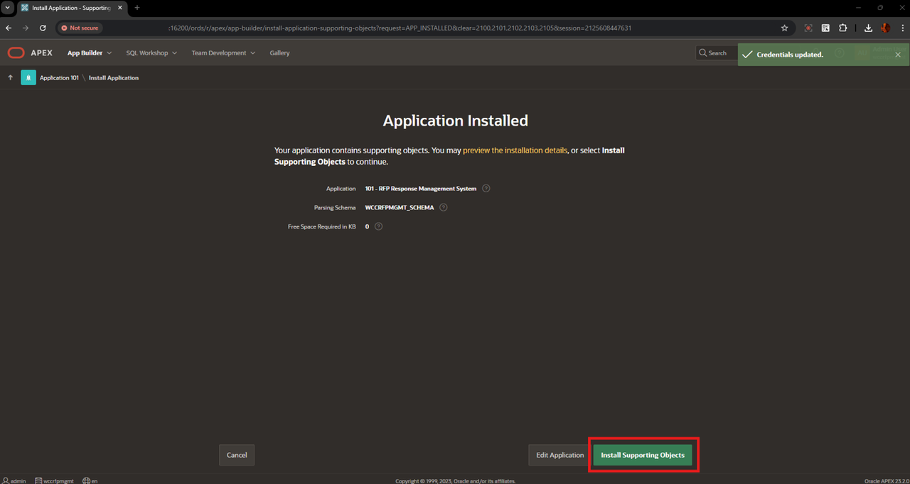

7. After the Supporting Objects installed, click on **Install Summary** button , to view the status of the Supporting objects installation
  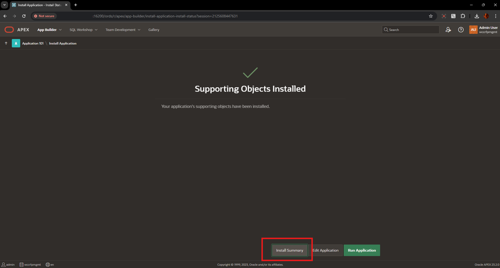

## Task 4: Import REST DataSource Catalog

This task covers importing and configuring Rest Datasource Catalog.

1. Edit the downloaded APEX Application sql file **WCC\_RFP\_Rest\_Catalog.sql** in a text editor (eg: Notepad) ,  replace `"localhost"` with the WLS Node 1 Private IP Address **WLS\_NODE1\_IPADDR** ( eg: `"10.15.xx.xxx"`) and save the file.
       - The **WLS\_NODE1\_IPADDR** is noted at the end of **Lab 2: Setup WCC Marketplace Environment** > **Task 1: Provision WebCenter Content Stack**
  

2. In the Home Page, Under  **Apex Builder** , click on **Import**
  

3. Select the updated file **WCC_RFP_Rest_Catalog.sql** , ensure that the **File Type** is selected as **REST Source Catalog** and click **Next** Button
  

4. Click **Next** in the **Import** Page
  

5. In the **Rest Catalog Import** Page, Enter the value for **Catalog Group** and click on **Import REST Catalog** Button
    - **Catalog Group** : Enter
            ```
            <copy>WCC_RFP_REST_CATALOG_GROUP</copy>
            ```
  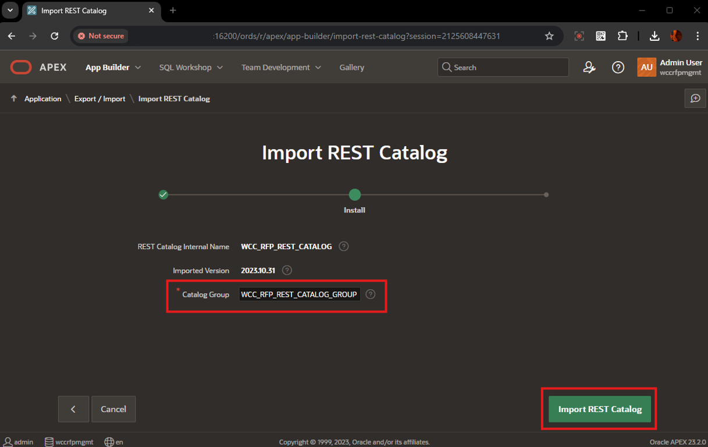

6. After the REST Catalog is imported, click on **1Services** under the **Contents** tab for the imported **WCC RFP Rest Catalog**
  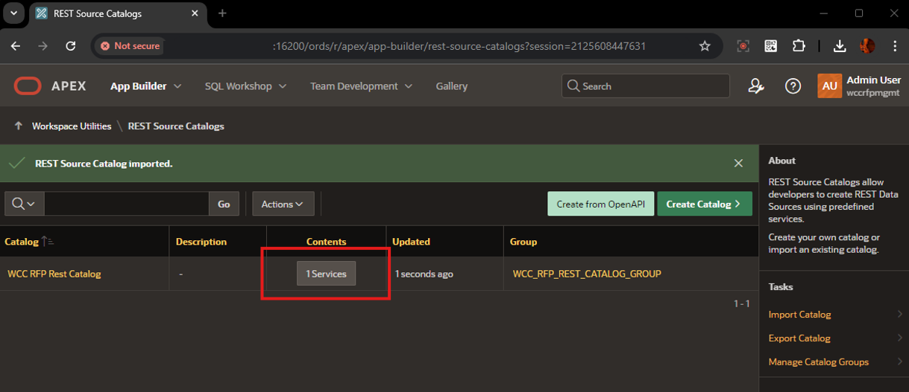

7. In the **Catalog Services** list, click on the *Name* **quick\_search\_library**
  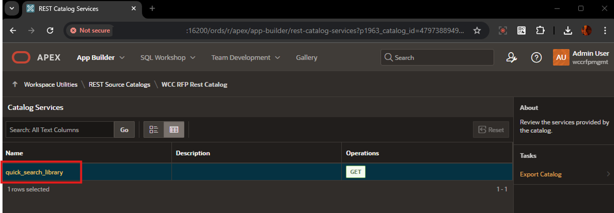

8. In the **Service Details** Section, Verify the **Base URL** with the WLS Node 1 Private IP Address **WLS\_NODE1\_IPADDR** ( eg: `"10.15.xx.xxx"`)  and click **Apply Changes** Button
  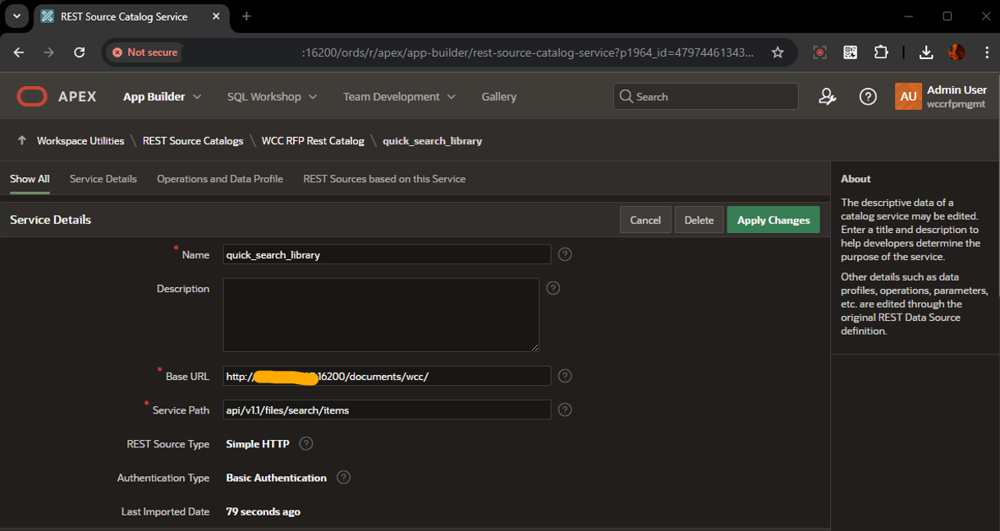

## Task 5 : Refresh REST Datasource Catalog

1. To login to your Oracle APEX Workspace, perform the following steps:
    - Open your browser and enter the **URL** to sign in to the APEX development environment.
      - **URL**
            ```
            <copy>https://localhost:16200/ords/</copy>
            ```

            > Note : Replace `"https://localhost"` with your **hosturl** ( eg: `"http://wcc-rfpmgmt-livelab.livelabs.oraclevcn.com"` or `"https://192.0.0.0"`)

    - The login page appears. Enter the **Workspace Name, Username, and Password**. Click **Sign In**.
      - **Workspace Name**: Enter
            ```
            <copy>WCCRFPMGMT</copy>
            ```
      - **Username**: Enter
            ```
            <copy>ADMIN</copy>
            ```
      - **Password**: Enter
            ```
            <copy>Welcome1</copy>
            ```
  

2. Click on **App Builder** , then click on **RFP Response Management System** Application
  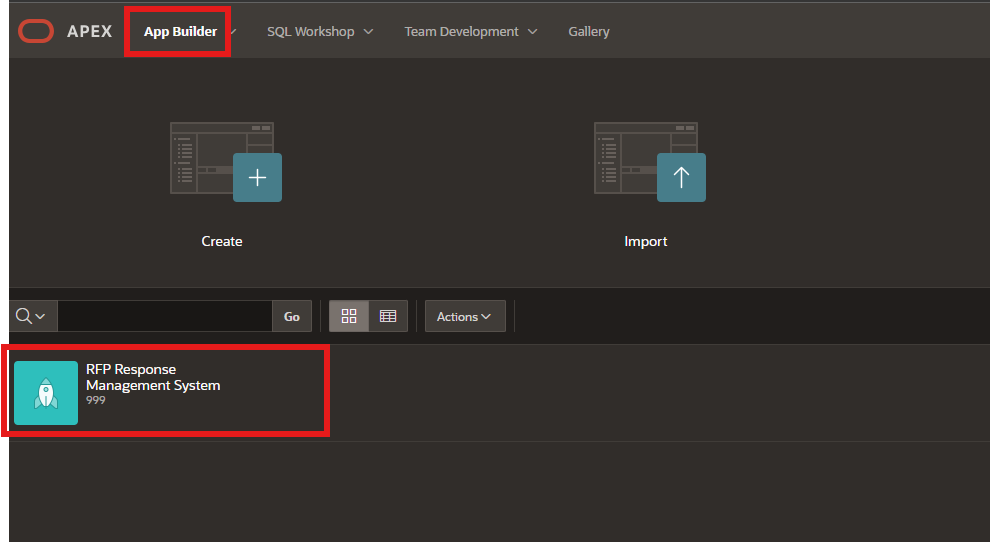

3. Navigate to **Shared Components** > Under **Data Sources**, click on **REST Data Sources**
  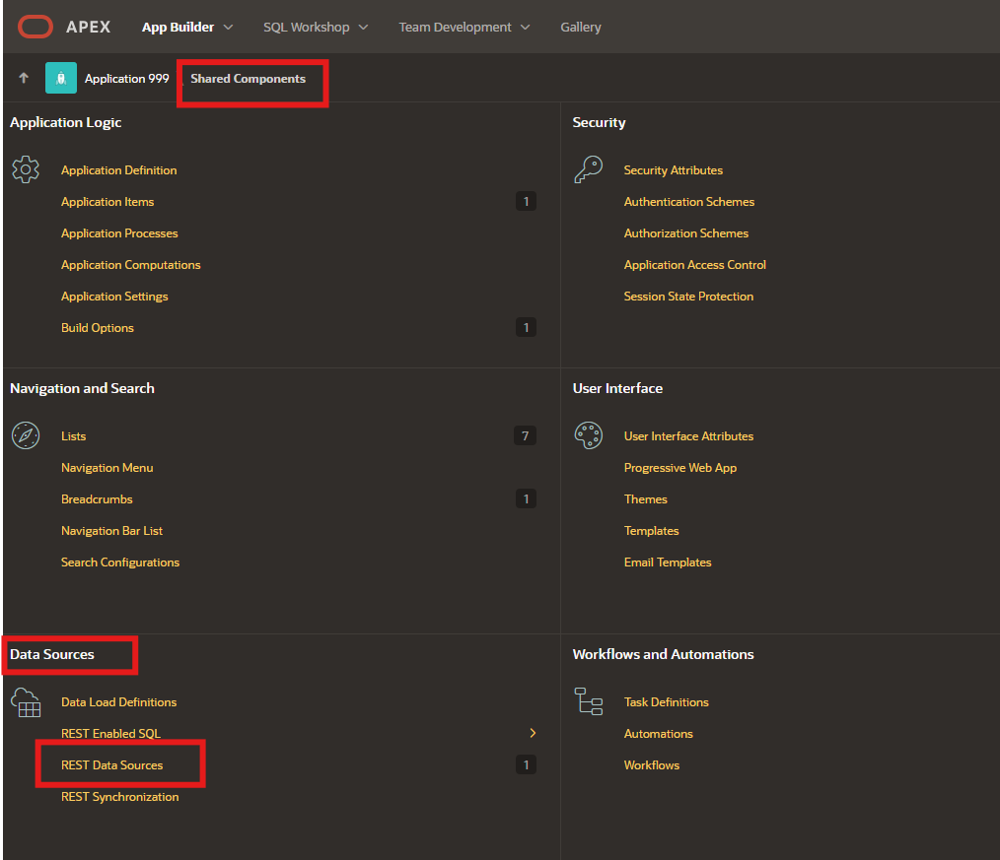

4. Click on **quick_search_library** under the **REST Source Name** list
  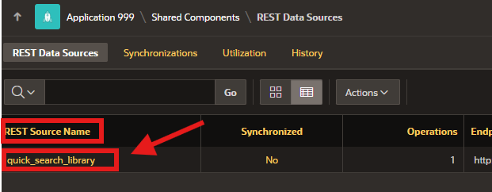

5. Click on the **REST Source Catalog** tab and then click on **Refresh from Catalog** button
  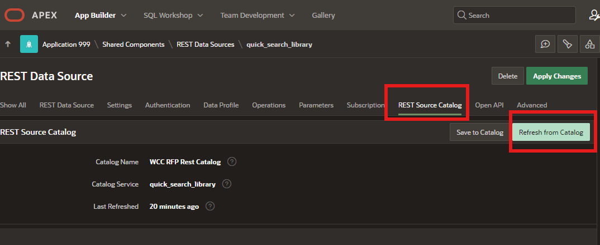

6. Click on the **Refresh from Service Catalog** button
  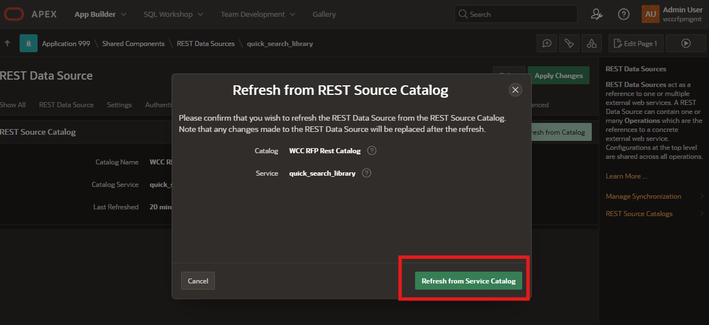

## Task 6 : Add Users in APEX

1. Login to your Oracle APEX Workspace, using the following steps:

    - Open your browser and enter the **URL** to sign in to the APEX development environment.
      - URL
            ```
            <copy>https://localhost:16200/ords/</copy>
            ```

           > Note : Replace `"https://localhost"` with your **hosturl** ( eg: `"http://wcc-rfpmgmt-livelab.livelabs.oraclevcn.com"` or `"https://192.0.0.0""`)

    - The login page appears. Enter the **Workspace Name, Username, and Password**. Click **Sign In**.
      - **Workspace Name**: Enter
            ```
            <copy>WCCRFPMGMT</copy>
            ```
      - **Username**: Enter
            ```
            <copy>ADMIN</copy>
            ```
      - **Password**: Enter
            ```
            <copy>Welcome1</copy>
            ```
  

2. Click on the *User Setting* icon next to the User name and click on **Manage Users and Groups**
  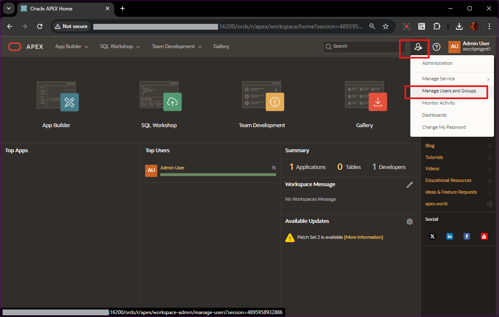

3. Check if the Users are already present. If not, create the users by clicking on **Create User** button
  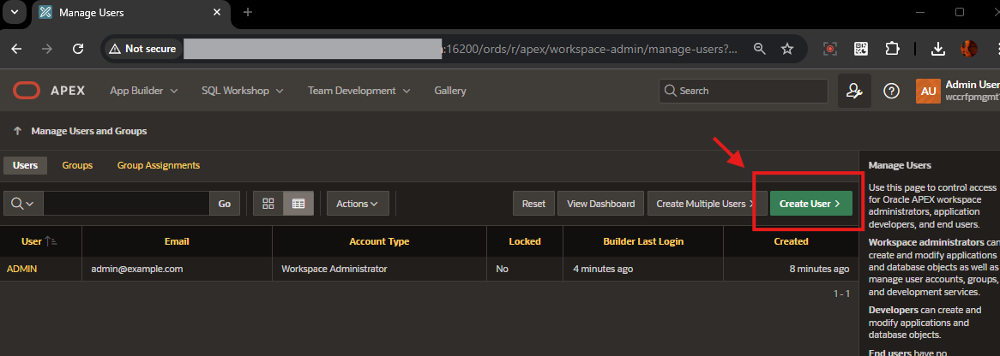

4. In the **Create User** Page, provide the below values for creating the user **SALES_REP** and click **Create User** button

    - **Username**: Specify
          ```
          <copy>SALES_REP</copy>
          ```
    - **Email Address**: Specify your email address. eg:
          ```
          <copy>sales_rep@email.com</copy>
          ```
    - **First Name**: Specify
          ```
          <copy>Sales</copy>
          ```
    - **Last Name**: Specify
          ```
          <copy>Representative</copy>
          ```
    - **Password**: Specify
          ```
          <copy>Welcome1</copy>
          ```
    - **Confirm Password**: Specify
          ```
          <copy>Welcome1</copy>
          ```
    - **Require Change of Password on First Use** : *Disable/Un-Check*
  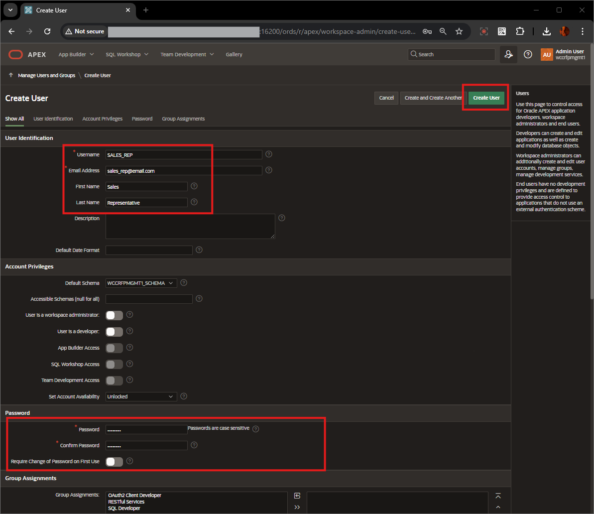

5. Similarly, create the other users as below:

      - **TECHNICAL_ARCHITECT** User
           - **Username**: Specify
                  ```
                  <copy>TECHNICAL_ARCHITECT</copy>
                  ```
           - **Email Address**: Specify your email address. eg:
                  ```
                  <copy>technical_architect@email.com</copy>
                  ```
           - **First Name**: Specify
                  ```
                  <copy>Technical</copy>
                  ```
           - **Last Name**: Specify
                  ```
                  <copy>Architect</copy>
                  ```
           - **Password**: Specify
                  ```
                  <copy>Welcome1</copy>
                  ```
           - **Confirm Password**: Specify
                  ```
                  <copy>Welcome1</copy>
                  ```
           - **Require Change of Password on First Use** : *Disable/Un-Check*

      - **FINANCE** User
           - **Username**: Specify
                  ```
                  <copy>FINANCE</copy>
                  ```
           - **Email Address**: Specify your email address. eg:
                  ```
                  <copy>finance@email.com</copy>
                  ```
           - **First Name**: Specify
                  ```
                  <copy>Finance</copy>
                  ```
           - **Last Name**: Specify
                  ```
                  <copy>Analyst</copy>
                  ```
           - **Password**: Specify
                  ```
                  <copy>Welcome1</copy>
                  ```
           - **Confirm Password**: Specify
                  ```
                  <copy>Welcome1</copy>
                  ```
           - **Require Change of Password on First Use** : *Disable/Un-Check*

      - **LEGAL** User
           - **Username**: Specify
                  ```
                  <copy>LEGAL</copy>
                  ```
           - **Email Address**: Specify your email address. eg:
                  ```
                  <copy>legal@email.com</copy>
                  ```
           - **First Name**: Specify
                  ```
                  <copy>Legal</copy>
                  ```
           - **Last Name**: Specify
                  ```
                  <copy>Advisor</copy>
                  ```
           - **Password**: Specify
                  ```
                  <copy>Welcome1</copy>
                  ```
           - **Confirm Password**: Specify
                  ```
                  <copy>Welcome1</copy>
                  ```
           - **Require Change of Password on First Use** : *Disable/Un-Check*

  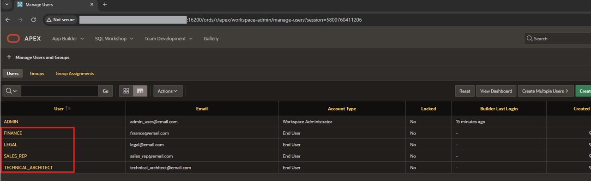

## Task 7: Add Section Templates in RFP Response Management Application

1. To login to the WCC RFP Response Management System Application, perform the following steps:

    - Open your browser and enter the **URL** to sign in to the APEX development environment.
      - URL
            ```
            <copy>https://localhost:16200/ords/r/wccrfpmgmt/rfp-response-management-system/</copy>
            ```

           > Note : Replace `"https://localhost"` with your **hosturl** ( eg: `"http://wcc-rfpmgmt-livelab.livelabs.oraclevcn.com"` or `"https://192.0.0.0""`)

      - The login page appears. Enter the **Username, and Password**. Click **Sign In**.
        - **Username**: Enter
              ```
              <copy>ADMIN</copy>
              ```
        - **Password**: Enter
              ```
              <copy>Welcome1</copy>
              ```
  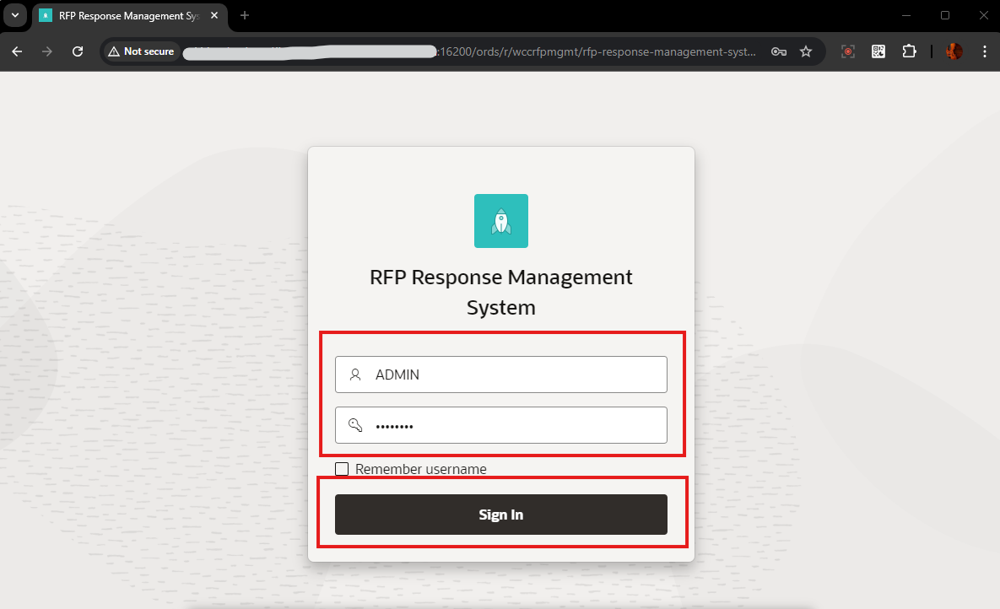

2. On the left navigation menu, click on **Sections** and click on **Create** button
  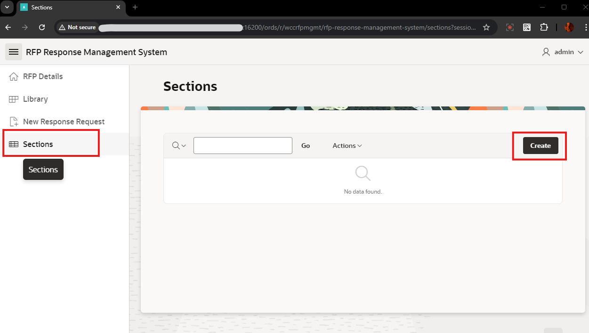

3. In the **Manage Section Form** window, enter the below values and click on **Create** Button

    - **Name**: Specify
          ```
          <copy>Title and Summary</copy>
          ```
    - **Description**: Specify
          ```
          <copy>This is sample template for Title and Summary Section</copy>
          ```
    - **Template**: Browse and select the file **Title & summary.docx** from the downloaded **wcc\_rfp\_resources.zip** file ( in **Lab 1 - Prepare Setup**)
    - **Type**: Leave the default as **SECTION**
    - **Display Order**: Specify
          ```
          <copy>10</copy>
          ```
    - **Active**: Leave the default as **Y**
    - **Section Owner**: Specify
          ```
          <copy>Sales Rep</copy>
          ```
    - **Instructions**: Specify
          ```
          <copy>Update the Title and Summary section</copy>
          ```
    - **Expectation**: Specify
          ```
          <copy>Updated with relevant info</copy>
          ```
  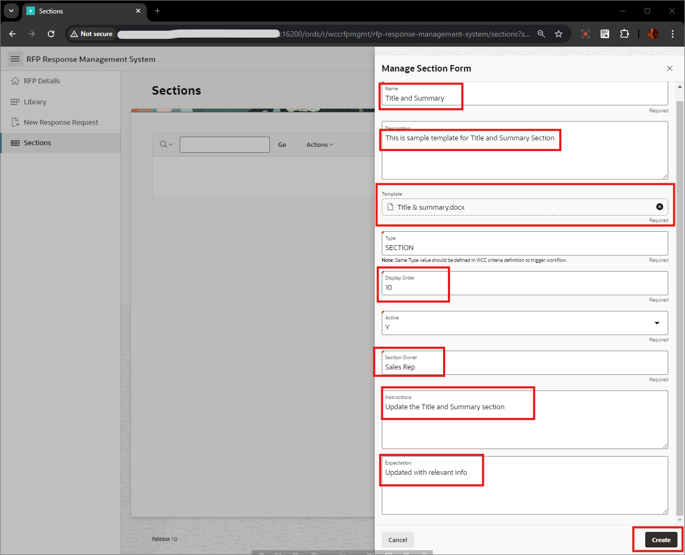

4. Similarly, create the below sections as well :

    - **Technical Design** Section
           - **Name**: Specify
                  ```
                  <copy>Technical Design</copy>
                  ```
           - **Description**: Specify
                  ```
                  <copy>This is template for Technical Design Section</copy>
                  ```
           - **Template**: Browse and select the file **Technical Design.docx** from the downloaded **wcc\_rfp\_resources.zip** file ( in **Lab 1 - Prepare Setup**)
           - **Type**: Leave the default as **SECTION**
           - **Display Order**: Specify
                  ```
                  <copy>20</copy>
                  ```
           - **Active**: Leave the default as **Y**
           - **Section Owner**: Specify
                  ```
                  <copy>Technical Architect</copy>
                  ```
           - **Instructions**: Specify
                  ```
                  <copy>Update the Technical Design section</copy>
                  ```
           - **Expectation**: Specify
                  ```
                  <copy>Updated with relevant info</copy>
                  ```
      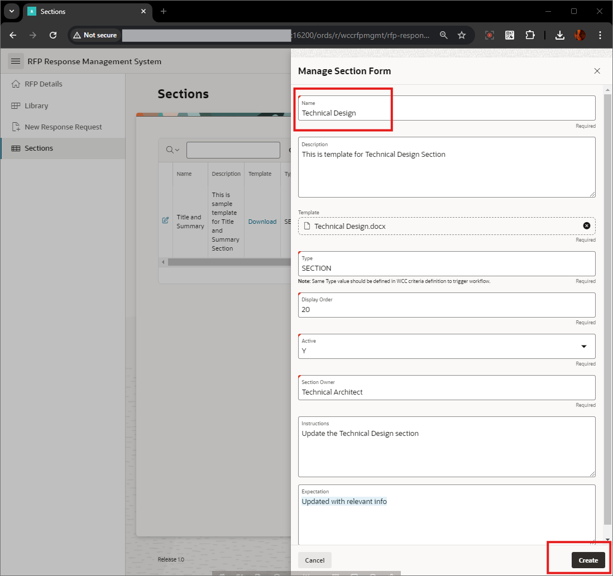
    - **Pricing And BOM** Section
           - **Name**: Specify
                  ```
                  <copy>Pricing And BOM</copy>
                  ```
           - **Description**: Specify
                  ```
                  <copy>This is template for Pricing And BOM Section</copy>
                  ```
           - **Template**: Browse and select the file **Finance.docx** from the downloaded **wcc\_rfp\_resources.zip** file ( in **Lab 1 - Prepare Setup**)
           - **Type**: Leave the default as **SECTION**
           - **Display Order**: Specify
                  ```
                  <copy>30</copy>
                  ```
           - **Active**: Leave the default as **Y**
           - **Section Owner**: Specify
                  ```
                  <copy>Finance</copy>
                  ```
           - **Instructions**: Specify
                  ```
                  <copy>Update the Pricing And BOM section</copy>
                  ```
           - **Expectation**: Specify
                  ```
                  <copy>Updated with relevant info</copy>
                  ```
      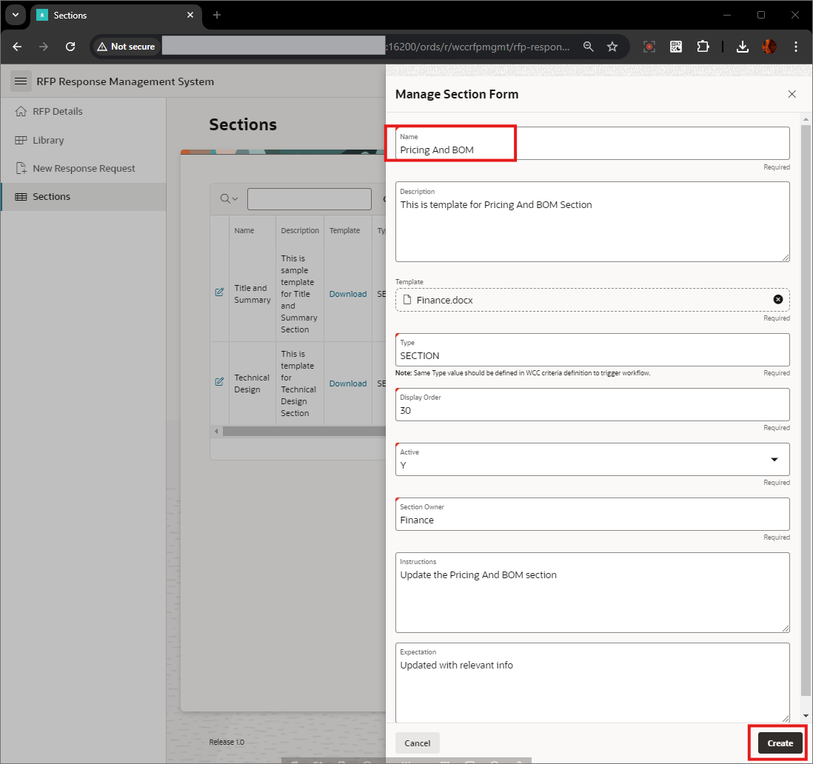
    - **Legal** Section
           - **Name**: Specify
                  ```
                  <copy>Legal</copy>
                  ```
           - **Description**: Specify
                  ```
                  <copy>This is sample template for Legal Section</copy>
                  ```
           - **Template**: Browse and select the file **Legal_Template.docx** from the downloaded **wcc\_rfp\_resources.zip** file ( in **Lab 1 - Prepare Setup**)
           - **Type**: Leave the default as **SECTION**
           - **Display Order**: Specify
                  ```
                  <copy>40</copy>
                  ```
           - **Active**: Leave the default as **Y**
           - **Section Owner**: Specify
                  ```
                  <copy>Legal</copy>
                  ```
           - **Instructions**: Specify
                  ```
                  <copy>Update the Legal section</copy>
                  ```
           - **Expectation**: Specify
                  ```
                  <copy>Updated with relevant info</copy>
                  ```
      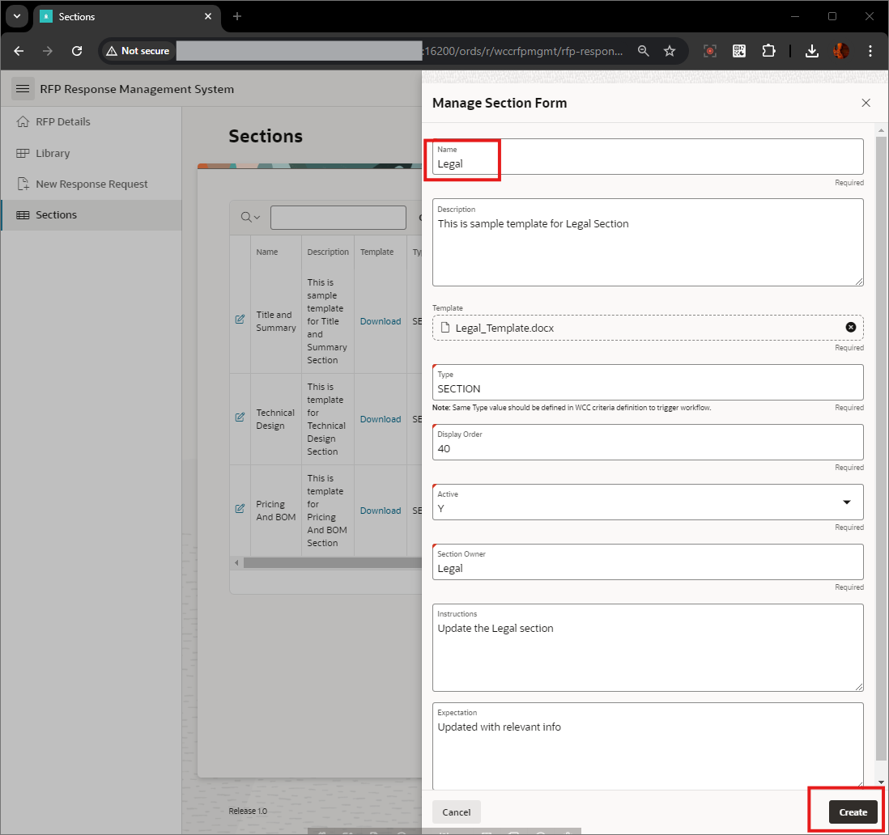

5. This shows the summary of all the sections created.

  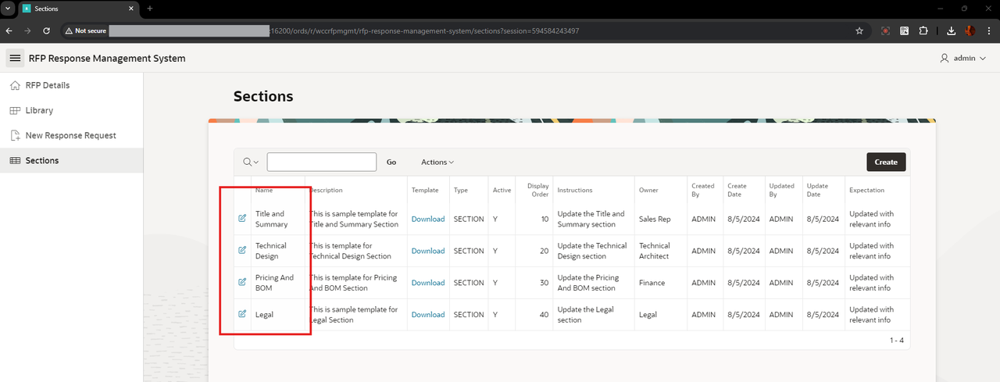

    **Summary**

    You have now successfully setup the RFP Response Management Application for the RFP Application and User Flow.

You are now ready to **proceed to the next lab**.

## Acknowledgements

- **Authors-** Senthilkumar Chinnappa, Senior Principal Solution Engineer, Oracle WebCenter Content
- **Contributors-** Senthilkumar Chinnappa, Mandar Tengse , Parikshit Khisty
- **Last Updated By/Date-** Senthilkumar Chinnappa, July 2024
