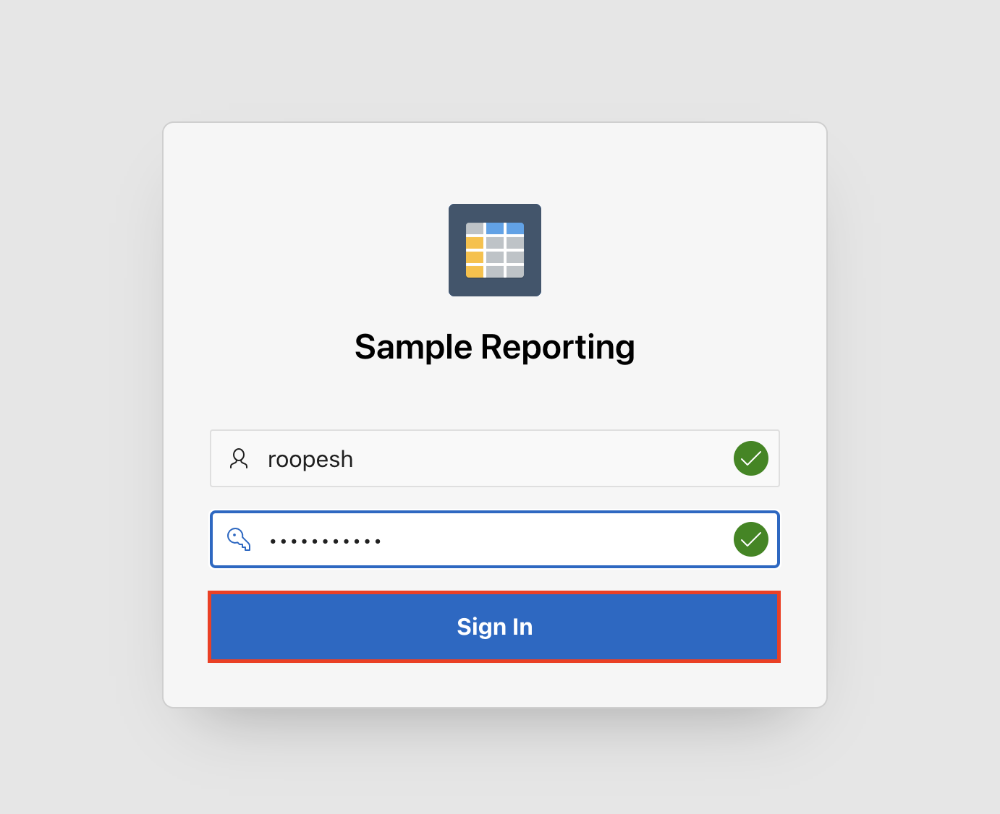

# Setup RFP Management APEX Application


## Introduction

In this lab, you learn to install and run Oracle APEX Application for RFP Management System. 

This lab also covers updating the APEX Rest Datasource urls & credentials for connecting to WebCenter Content Instance

Estimated Time: 10 minutes

### Objectives
In this lab, you will:
- Navigate through Oracle APEX
- Create New Workspace
- Login to Workspace and Install Packaged Application.
- Update Rest Datasources URL and credentials

## Task 1: Create New APEX Workspace for RFP Management Application

1. On the new *web browser* window , Login to the APEX/ORDS URL as **ADMIN** User of System's **INTERNAL** Workspace. Details are provided below

    - URL

    ```
    <copy>http://localhost:16200/ords/</copy>
    ```

- Workspace Name

    ```
    <copy>INTERNAL</copy>
    ```

    - Username

    ```
    <copy>ADMIN</copy>
    ```

    - Password

    ```
    <copy>welcome1</copy>
    ```

    **For ATP DB** *, ADMIN password is same as the ADMIN DB schema user password*
    


2. In the *Administration Services* Landing page , Click on **Create Workspace** button on the top right corner

    

3. Provide the value for **Workspace Name** ( eg: **WCCRFPMGMT** ) and click **Next** Button

 

4. Provide the values for DB Schema details as mentioned below and click **Next** Button

    * **Re-use existing schema?**: Select **No**

    * **Schema Name**: Enter **WCCRFPMGMT_SCHEMA**

    * **Schema Password**: Enter **Welcome1**

    * **Space Quota (MB)**: Select **500**

 

5. Provide the values for Workspace **ADMIN** User details as mentioned below and click **Next** Button

    * **Administrator Username**: Enter **ADMIN**

    * **Administrator Password**: Enter **Welcome1**

    * **First Name**: Enter **Admin**

    * **Last Name**: Enter **User**

    * **Email**: Enter your email id ( eg: **admin_user@email.com** )

 

6. Review the details and click **Create Workspace** Button

 

7. After the workspace is successfully created, it will display  workspace details.  click **Done** Button

 


## Task 2: Login to Newly Created APEX Workspace


To log in to Oracle APEX, you need a Workspace Name, username, and the password created for that Workspace. In this hands-on lab, you log in to your Oracle APEX Workspace.

1. To login to your Oracle APEX Workspace, perform the following steps:
    -	Open your browser and enter the **URL** to sign in to the APEX development environment.

    - The login page appears. Enter the **Workspace Name, Username, and Password**. Click **Sign In**.  

  

2. The Workspace home page appears. Click **App Builder**.

  

3. You do not have any applications listed right now. You can 'Create a New App' or 'Install a Sample or Starter App'.

  

4. Click **SQL Workshop**.  

    The SQL Workshop home page appears. Review each of the **SQL Workshop** components.

      

    

5. Click **Gallery**.

    

6. The Gallery Page displays a collection of Starter Applications, Sample Applications and Custom Applications that you can install in your Workspace.

   

## Task 2: Install RFP Management Application

This lab covers installing and running a sample application.

1. Navigate to **Gallery**, select **Sample Apps**.

   

2. Now that you are in **Sample Apps**, navigate to **Sample Reporting**, and click the **Install** Button. You can also search for apps by typing "**Reporting**" in the 'Search Apps' box.

  

3. On the Install Application page, observe that your app is currently being installed.

   

4. You can now see that the application is installed. Click **Run Application**.
   

5. Log in to the **Sample Reporting** application as an End User. Enter your **Username** and **Password** (Same as your Workspace credentials) and click **Sign In**.

   

6. You now see the Sample Reporting application home page. In your Runtime environment, a **Developer Toolbar** appears at the bottom.
   Click **Home** to return to the home page of the APEX application development environment.

   

7. Click **App Builder**.

   

8. Toggle between the **View Icons** and the **View Reports** buttons. You see that applications are correspondingly displayed along with their icons and in the report format.
   

   

## Summary
You have now learned how to navigate the significant components of Oracle APEX and install and run a packaged application. You are now ready to **proceed to the next lab**.


## Acknowledgements

* **Author** - Rene Fontcha, Oracle LiveLabs Platform Lead, NA Technology
* **Contributors** - Kay Malcolm, Senior Director, Database Product Management
* **Last Updated By/Date** - Rene Fontcha, Oracle LiveLabs Platform Lead, NA Technology, July 2022
