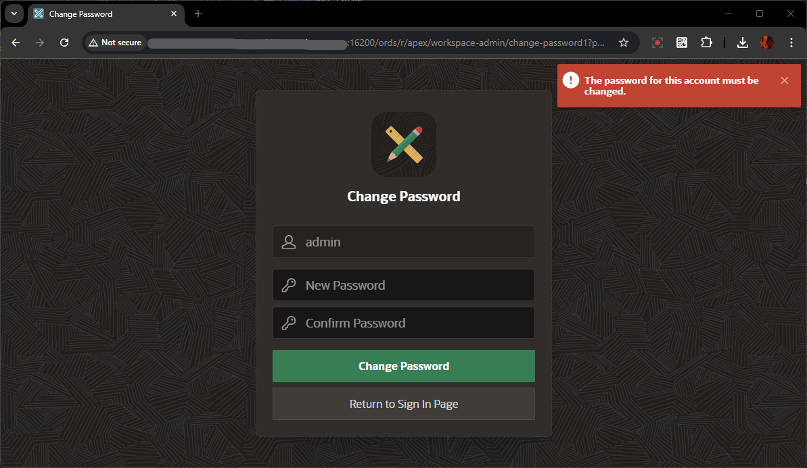

# Setup RFP Management APEX Application


## Introduction

In this lab, you learn to install and run Oracle APEX Application for RFP Management System. 

This lab also covers updating the APEX Rest Datasource urls & credentials for connecting to WebCenter Content Instance

Estimated Time: 20 minutes

### Objectives
In this lab, you will:
- Navigate through Oracle APEX
- Create New Workspace
- Login to Workspace and Install Packaged Application.
- Update Rest Datasources URL and credentials

## Task 1: Create New APEX Workspace for RFP Management Application

To create new APEX workspace, you need log in to Oracle APEX's default **INTERNAL** Workspaces as **ADMIN** User (or) the user with Administrator Privilege on the APEX Instance

1. On the new *web browser* window , Login to the APEX/ORDS URL as **ADMIN** User of System's **INTERNAL** Workspace. Details are provided below

    - URL

    ```
    <copy>http://localhost:16200/ords/</copy>
    ```

- Workspace Name

    ```
    <copy>INTERNAL</copy>
    ```

    - Username

    ```
    <copy>ADMIN</copy>
    ```

    - Password

    ```
    <copy>WelCwcm123##</copy>
    ```

    > **For ATP DB** *, ADMIN password is same as the ADMIN DB schema user password*

    > _If any issues with ADMIN credentials, Refer to **Appendix 3: Reset ADMIN password for APEX/ORDS** of the previous lab **Initialize WCC Environment** to reset ADMIN Password_

    


2. In the *Administration Services* Landing page , Click on **Create Workspace** button on the top right corner

    

3. Provide the value for **Workspace Name**  and click **Next** Button

    ```
    <copy>WCCRFPMGMT</copy>
    ```

 

4. Provide the values for DB Schema details as mentioned below and click **Next** Button

    * **Re-use existing schema?**: Select **No**

    * **Schema Name**: Enter
    ```
    <copy>WCCRFPMGMT_SCHEMA</copy>
    ```
    * **Schema Password**: Enter
    ```
    <copy>WelCwcm123##</copy>
    ```
    * **Space Quota (MB)**: Select **500**

 

5. Provide the values for Workspace **ADMIN** User details as mentioned below and click **Next** Button

    * **Administrator Username**: Enter
    ```
    <copy>ADMIN</copy>
    ```
    * **Administrator Password**: Enter
    ```
    <copy>Welcome1</copy>
    ```
    * **First Name**: Enter
    ```
    <copy>Admin</copy>
    ```
    * **Last Name**: Enter
    ```
    <copy>User</copy>
    ```
    * **Email**: Enter your email id
    ```
    <copy>admin_user@email.com</copy>
    ```
 

6. Review the details and click **Create Workspace** Button

 

7. After the workspace is successfully created, it will display  workspace details.  click **Done** Button

 


## Task 2: Login to Newly Created APEX Workspace


To log in to Oracle APEX, you need a Workspace Name, username, and the password created for that Workspace. In this hands-on lab, you log in to your Oracle APEX Workspace.

1. To login to your Oracle APEX Workspace, perform the following steps:
    -	Open your browser and enter the **URL** to sign in to the APEX development environment.

    - The login page appears. Enter the **Workspace Name, Username, and Password**. Click **Sign In**.  

    * **Workspace Name**: Enter
    ```
    <copy>WCCRFPMGMT</copy>
    ```
    * **Username**: Enter
    ```
    <copy>ADMIN</copy>
    ```
    * **Password**: Enter
    ```
    <copy>Welcome1</copy>
    ```
  


2. If its first time Login, Change password for the ADMIN user. You can provide the same Password value and click on **Change Password**.
    > Skip this step if it does not prompt for Change Password

    * **New Password**: Enter
    ```
    <copy>Welcome1</copy>
    ```
    * **Confirm Password**: Enter
    ```
    <copy>Welcome1</copy>
    ```

  

3. The Workspace home page appears.

  


## Task 3: Install RFP Management Application

This lab covers installing and running a sample application.


1. You do not have any applications listed right now. You can 'Create a New App' or 'Install a Sample or Starter App'.

  


## Task 4: Update REST DataSource URLs and Web Credentials

This lab covers installing and running a sample application.


1. You do not have any applications listed right now. You can 'Create a New App' or 'Install a Sample or Starter App'.

  


## Summary
You have now learned how to navigate the significant components of Oracle APEX and install and run a packaged application. You are now ready to **proceed to the next lab**.


## Acknowledgements

* **Authors-** Senthilkumar Chinnappa, Senior Principal Solution Engineer, Oracle WebCenter Content
* **Contributors-** Senthilkumar Chinnappa, Mandar Tengse , Parikshit Khisty
* **Last Updated By/Date-** Senthilkumar Chinnappa, July 2024
