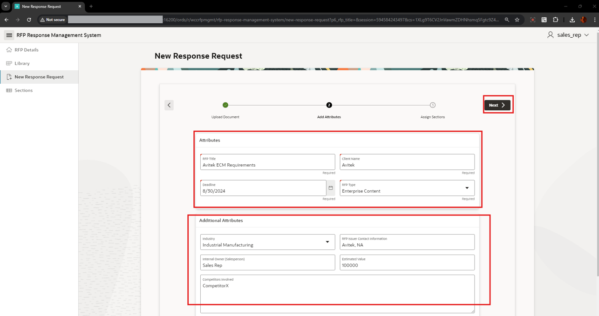
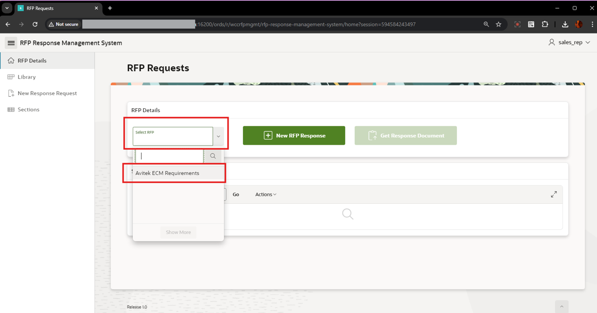
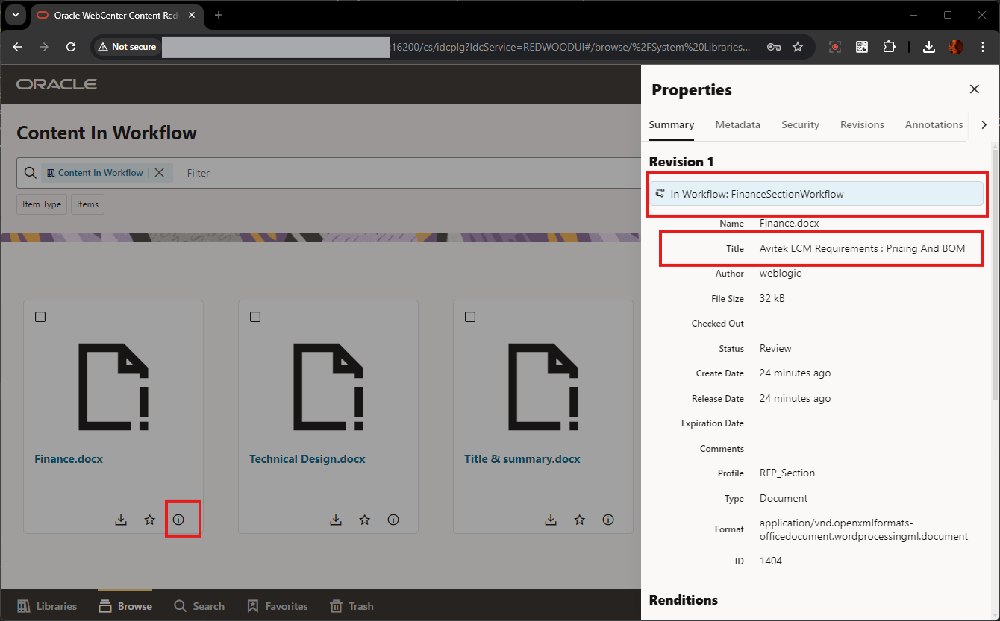

# Create New RFP Document

## Introduction

In this lab, you will learn about the steps needed to Upload New RFP Document in the RFP Management System and also, select the relevant sections for the RFP Response. The System will automatically select the relevant section document template, and assigns/uploads against this newly uploaded RFP Document. For each of these Section Document, gets into the workflow, for further processing.

  

**Estimated Lab Time**: *10 minutes*

### Objectives

In this lab, you will:

* Navigate through the RFP Management Application
* Upload New RFP document
* Provide property information values for the RFP Document
* Select Sections
* Verify the Section documents is present in the Workflow in WCC

### Prerequisites

This lab assumes you have:

* You have completed:
  * Lab: Prepare Setup ( *Paid Tenants* only)
  * Lab: Setup WCC Marketplace Environment
  * Lab: Initialize Environment
  * Lab: Setup Apex Application

## Task 1: Login to the RFP Response Management Application

1. To login to the WCC RFP Response Management System Application, perform the following steps:
    * Open your browser and enter the **URL** to sign in to the APEX development environment.
        * **URL**:
                    ```
                    <copy>https://localhost:16200/ords/r/wccrfpmgmt/rfp-response-management-system</copy>
                    ```

              > Note : Replace `"https://localhost"` with your **hosturl** ( eg: `"http://wcc-rfpmgmt-livelab.livelabs.oraclevcn.com"` or `"https://192.0.0.0"`)

        * The login page appears. Enter the **Username, and Password**. Click **Sign In**.
            * **Username**: Enter
                        ```
                        <copy>SALES_REP</copy>
                        ```
            * **Password**: Enter
                        ```
                        <copy>Welcome1</copy>
                        ```
  

## Task 2: Upload New RFP Document with properties and sections

1. Navigate to the **New Response Request** Page by one of the below options
    * On the left navigation menu, click on **New Response Request**
        (OR)
    * Click on the **New RFP Response** Button
  

2. Sample file for New RFP Request document has been included in the WCC RFP Resources file. Browse and select the file **Avitek_Requirements.pdf** from the downloaded **wcc\_rfp\_resources.zip** file ( in **Lab 1 - Prepare Setup**) and click **Next** button
  

3. In the **Attributes** Page, provide the values as below and click **Next** button
    * **Attributes**
        * **RFP Title**: Specify
                ```
                <copy>Avitek ECM Requirements</copy>
                ```
        * **Client Name**: Specify
                ```
                <copy>Avitek</copy>
                ```
        * **Deadline**: In the date picker, select a date two weeks from the current date ( eg : **8/30/2024** )
        * **RFP Type**: In the drop down list, select **Enterprise Content** (*Any value can be selected in this list*)
    * **Additional Attributes**
        * **Industry**: Select any of the value from the drop-down list (eg: **Industrial Manufacturing**)
        * **RFP Issuer Contact Information**: Specify
                ```
                <copy>Avitek, NA</copy>
                ```
        * **Internal Owner (Salesperson)**: Specify
                ```
                <copy>Sales Rep</copy>
                ```
        * **Estimated Value**: Specify
                ```
                <copy>100000</copy>
                ```
        * **Competitors Involved**: Specify
                ```
                <copy>CompetitorX</copy>
                ```
  

4. From the list of cards, select the sections required for creating the RFP Response for this New RFP Request Document and click **Submit RFP** button.
    Example: select **Title and Summary**, **Technical Design** and **Pricing and BOM**
  

5. Once successfully uploaded, you'll get the message **RFP & Section Documents Successfully Uploaded**. This in-turn uploads the sample template for all the sections selected, and that goes into the WCC Workflow, so that the Section Owner can do the necessary actions on it.

  

## Task 3: Verify the RFP documents and Section status in Application

1. Login to the RFP Management Application and Navigate to the **RFP Details** Page from the left navigation menu
  

2. In the **RFP Details** section, click on the **Select RFP** drop-down list and select **Avitek ECM Requirements**
  

3. Now the **RFP Requests** Page displays the information for the selected RFP. This shows
    * The attribute values entered while uploading the New RFP Document
    * The individual Section documents, which were uploaded for each of selected Sections. This is now in **REVIEW** State, which the Section owner can view and take the necessary actions (like **Download** the template, update it and **Upload Revision** for the same)

  

## Task 4: Verify the Section documents in WCC Workflow

1. Login to the New Redwood UI for the WebCenter Content using the below details:
    * Open your browser and enter the **URL** to sign in to the APEX development environment.

    * **URL**:
                ```
                <copy>https://localhost:16200/cs/idcplg?IdcService=REDWOODUI</copy>
                ```

        > Note : Replace `"https://localhost"` with your **hosturl** ( eg: `"http://wcc-rfpmgmt-livelab.livelabs.oraclevcn.com"` or `"https://192.0.0.0"`)

        * The login page appears. Enter the **Username, and Password**. Click **Sign In**.

    * **Username**: Enter
                ```
                <copy>weblogic</copy>
                ```
    * **Password**: Enter
                ```
                <copy>Welcome1</copy>
                ```
  

2. In the **Libraries** Page, click on the **Content In Workflow** card and click **Open** button
  

3. You can see the list of the Section documents uploaded based on the Selected Section during the New RFP Document Upload Step. Click on the *information icon* ***i*** to view the details of the document.


 Here you can see the section document is in the Workflow and its uploaded for the **Avitek ECM Requirements** RFP Document.

### Summary

 This concludes the flow of New RFP Document creation and verification of the Section documents in the WCC Workflow.

 You may now **proceed to the next lab**.

## Acknowledgements

* **Authors-** Senthilkumar Chinnappa, Senior Principal Solution Engineer, Oracle WebCenter Content
* **Contributors-** Senthilkumar Chinnappa, Mandar Tengse , Parikshit Khisty
* **Last Updated By/Date-** Senthilkumar Chinnappa, August 2024
