# Update Documents for Section Types

## Introduction

This lab will show you how to update the Section Documents for a particular RFP, based on the User logged in. Each Section has a Section owner defined during the Section creation. You will login as those individual Section Owner users, update the relevant Section document, and mark it as Completed, so that , the Section document is available for merge for the Response Document creation.

This showcases the interaction from the APEX Application and the WebCenter Content Documents and its Workflows.

Here is the flow for this lab:

  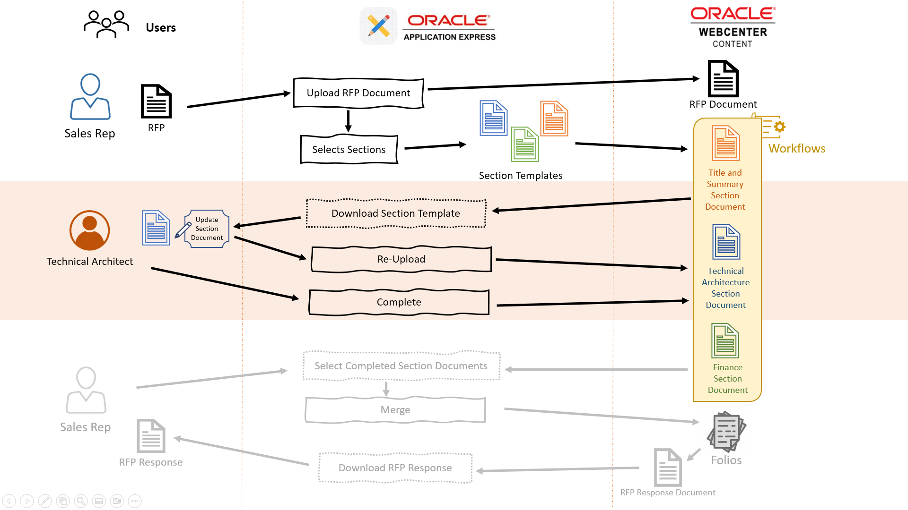

**Estimated Lab Time**: *10 minutes*

### Objectives

In this lab, you will:

* Login as different Users/Personas
* Preview and Download Section Template Document
* Edit/Update the Section Document
* Complete the Section Document , so that it's available for Merge for the RFP Response

### Prerequisites

This lab assumes you have:

* You have completed:
  * Lab: Prepare Setup ( *Paid Tenants* only)
  * Lab: Setup WCC Marketplace Environment
  * Lab: Initialize Environment
  * Lab: Setup Apex Application
  * Lab: Create New RFP Document

## Task 1: Update and complete Title and Summary Section

1. To login to the WCC RFP Response Management System Application, perform the following steps:
    * Open your browser and enter the **URL** to sign in to the APEX development environment.
         * **URL**:
                     ```
                     <copy>https://localhost:16200/ords/r/wccrfpmgmt/rfp-response-management-system</copy>
                     ```

               > Note : Replace `"https://localhost"` with your **hosturl** ( eg: `"http://wcc-rfpmgmt-livelab.livelabs.oraclevcn.com"` or `"https://192.0.0.0"`)

         * The login page appears. Enter the **Username, and Password**. Click **Sign In**.
            * **Username**: Enter
                     ```
                     <copy>SALES_REP</copy>
                     ```
            * **Password**: Enter
                     ```
                     <copy>Welcome1</copy>
                     ```
  

2. In the **RFP Details** page, click on **Select RFP** drop-down list, select the RFP Document uploaded in the previous lab ( eg: **Avitek ECM Requirements**) and click on **Preview and Download** link for the **Title and Summary** Section Document (here , for the **Avitek ECM Requirements : Title and Summary** Document )
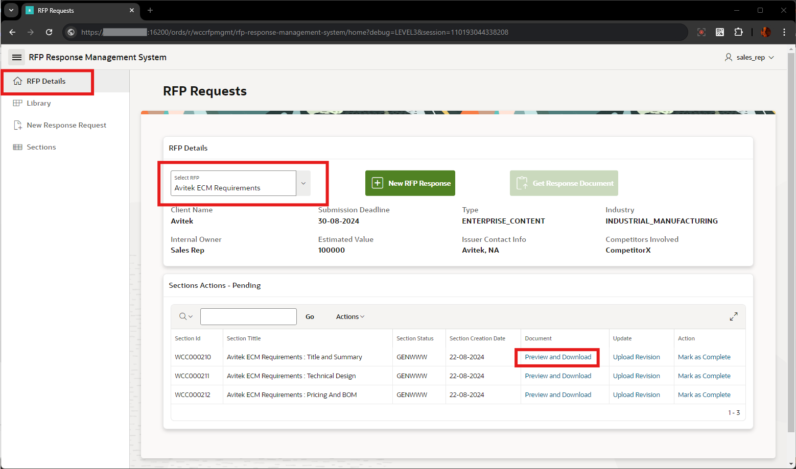

3. Here you can see the **Preview** of the Section Template document (in **.docx** format ) that was uploaded during the initial Setup of Sections. You can also download the file, by clicking on the *download icon*. This also shows that this Section Document is still part of the WCC Workflow.
   > *Note:* If Login page shows-up for the WCC, Login as **weblogic** with password as **Welcome1**


4. For this demo flow, the updated **Title and Summary** Document is already included in the WCC RFP Resources file. In the **RFP Details** Page, click on the  **Upload Revision** link for the  **Title and Summary** Section Document (here , for the **Avitek ECM Requirements : Title and Summary** Document )
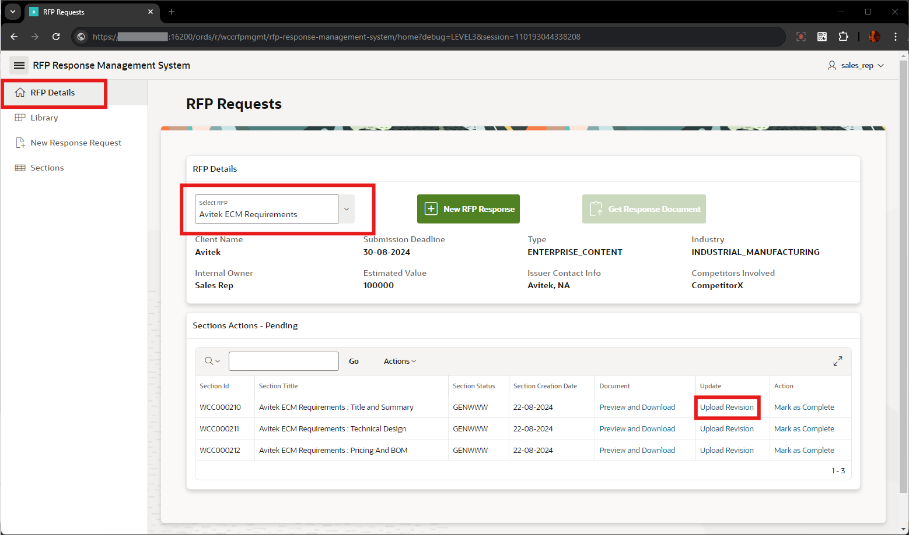

5. In the **Review Details** window, browse and select the file **Title & summary_v1.0.pdf** from the downloaded **wcc\_rfp\_resources.zip** file ( in **Lab 1 - Prepare Setup**) and click **Submit Details** button.

   

   Once successfully uploaded, you'll get message as **Revision File Uploaded!**

   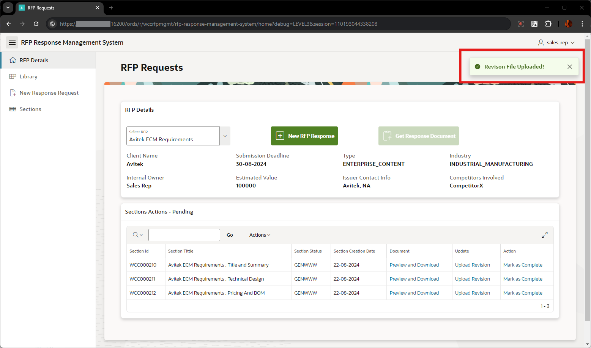

   Now, if we preview the document using **Preview and Download** link, you can see the file has got updated from **Title & summary.docx** to **Title & summary_v1.0.pdf** and the document is still in WCC Workflow.

   

6. In the **RFP Details** Page, click on the  **Mark as Complete** link for the  **Title and Summary** Section Document (here , for the **Avitek ECM Requirements : Title and Summary** Document )

   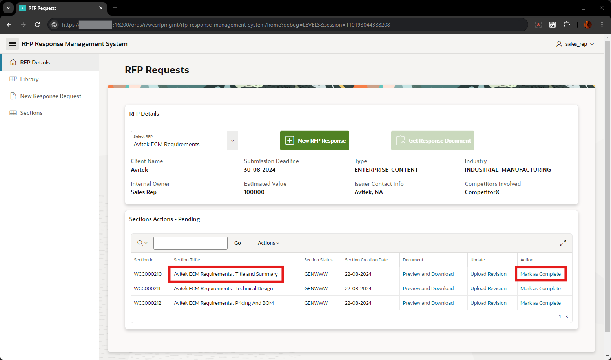

   Once successfully, you can see the message **Success! The document for Section has been successfully approved**.

   

   Now, this Section Document is moved from **Section Actions - Pending** list, to **Sections - Completed** list

   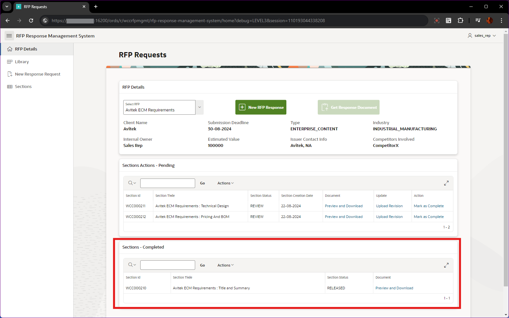

   This ensures that the Section Document is now completed from the WCC Workflow as well. You can check it from WCC **Contents In Workflow** Page

      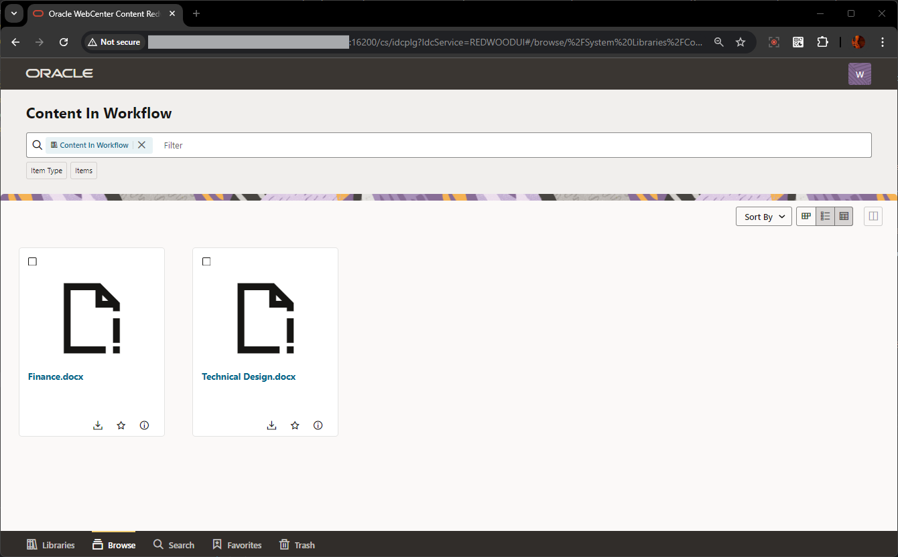

## Task 2: Update and complete Technical Architecture Section

1. To login to the WCC RFP Response Management System Application, perform the following steps:
    * Open your browser and enter the **URL** to sign in to the APEX development environment.
      * **URL**:
                  ```
                  <copy>https://localhost:16200/ords/r/wccrfpmgmt/rfp-response-management-system</copy>
                  ```

               > Note : Replace `"https://localhost"` with your **hosturl** ( eg: `"http://wcc-rfpmgmt-livelab.livelabs.oraclevcn.com"` or `"https://192.0.0.0"`)

      * The login page appears. Enter the **Username, and Password**. Click **Sign In**.
         * **Username**: Enter
                  ```
                  <copy>TECHNICAL_ARCHITECT</copy>
                  ```
         * **Password**: Enter
                  ```
                  <copy>Welcome1</copy>
                  ```
  

2. Follow the same steps as mentioned in the **Task 1**, for updating and completing the **Avitek ECM Requirements : Technical Design** Section Document as well.

   > Note: In the **Review Details** window, browse and select the file **TechnicalDesign_v1.0.pdf** from the downloaded **wcc\_rfp\_resources.zip** file ( in **Lab 1 - Prepare Setup**) and click **Submit Details** button.

  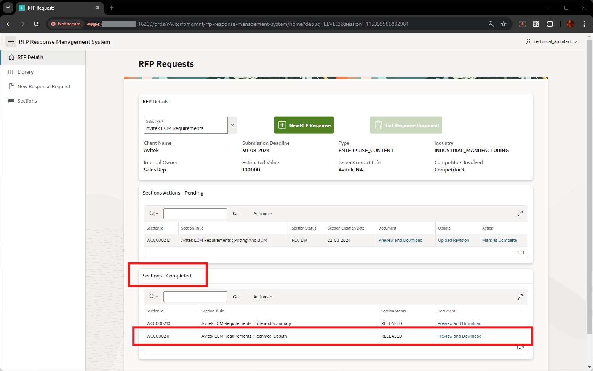

## Task 3: Update and complete Finance Section

1. To login to the WCC RFP Response Management System Application, perform the following steps:
    * Open your browser and enter the **URL** to sign in to the APEX development environment.
      * **URL**:
               ```
               <copy>https://localhost:16200/ords/r/wccrfpmgmt/rfp-response-management-system</copy>
               ```

              > Note : Replace `"https://localhost"` with your **hosturl** ( eg: `"http://wcc-rfpmgmt-livelab.livelabs.oraclevcn.com"` or `"https://192.0.0.0"`)

      * The login page appears. Enter the **Username, and Password**. Click **Sign In**.
         * **Username**: Enter
                  ```
                  <copy>FINANCE</copy>
                  ```
         * **Password**: Enter
                  ```
                  <copy>Welcome1</copy>
                  ```
  

2. Follow the same steps as mentioned in the **Task 1**, for updating and completing the **Avitek ECM Requirements : Pricing And BOM** Section Document as well.

   > Note: In the **Review Details** window, browse and select the file **Finance_Part_v1.0.pdf** from the downloaded **wcc\_rfp\_resources.zip** file ( in **Lab 1 - Prepare Setup**) and click **Submit Details** button.

  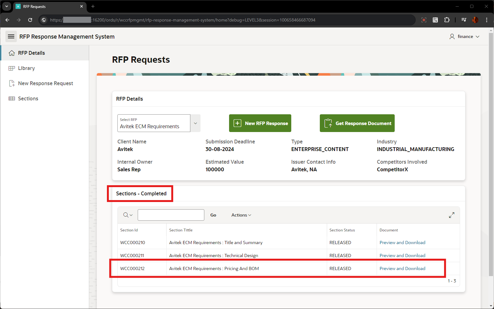

## Task 4: Verify the status of the Section Documents

1. In the **RFP Details** page, you can see all the Section documents are now under **Sections - Approved** list. Also, the status of each of the document is now in **RELEASED** status

   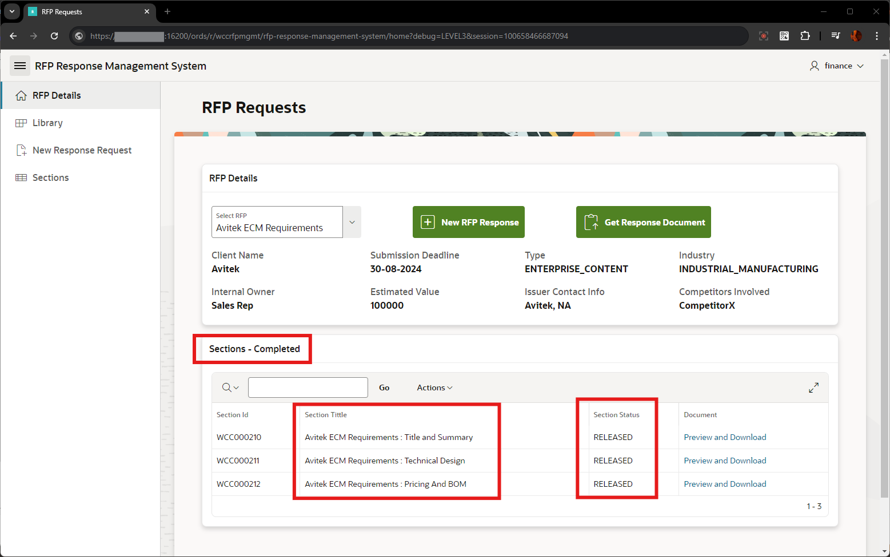

   Also, when Previewed, you can see now the documents is not part of the Workflow.

      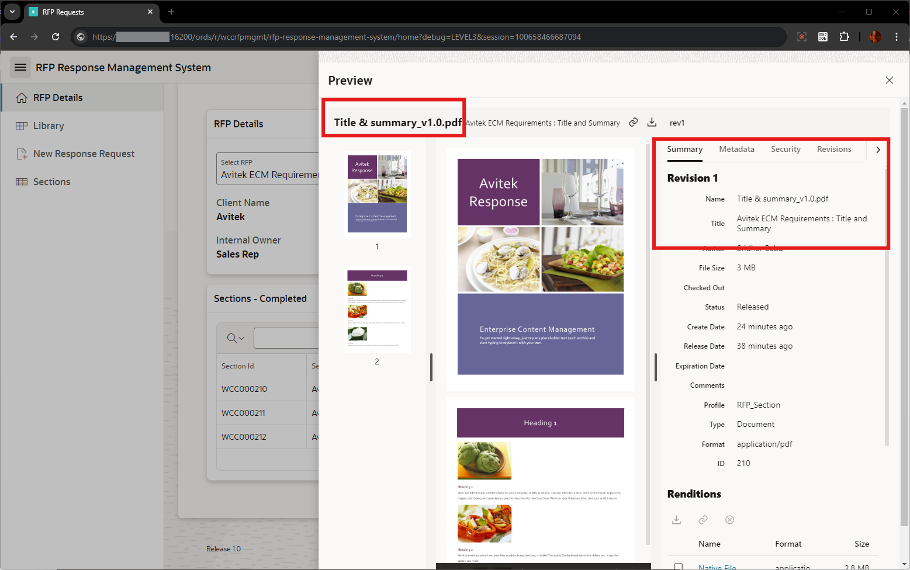

2. You can check it from WCC **Contents In Workflow** Page. Now there will not be any Documents in the list.

      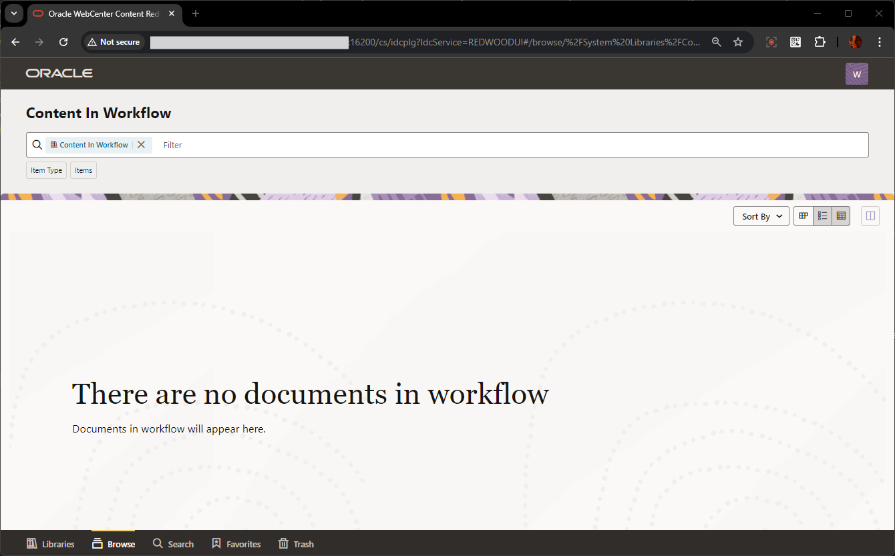

You may now **proceed to the next lab**.

## Acknowledgements

* **Authors-** Senthilkumar Chinnappa, Senior Principal Solution Engineer, Oracle WebCenter Content
* **Contributors-** Senthilkumar Chinnappa, Mandar Tengse , Parikshit Khisty
* **Last Updated By/Date-** Senthilkumar Chinnappa, August 2024
