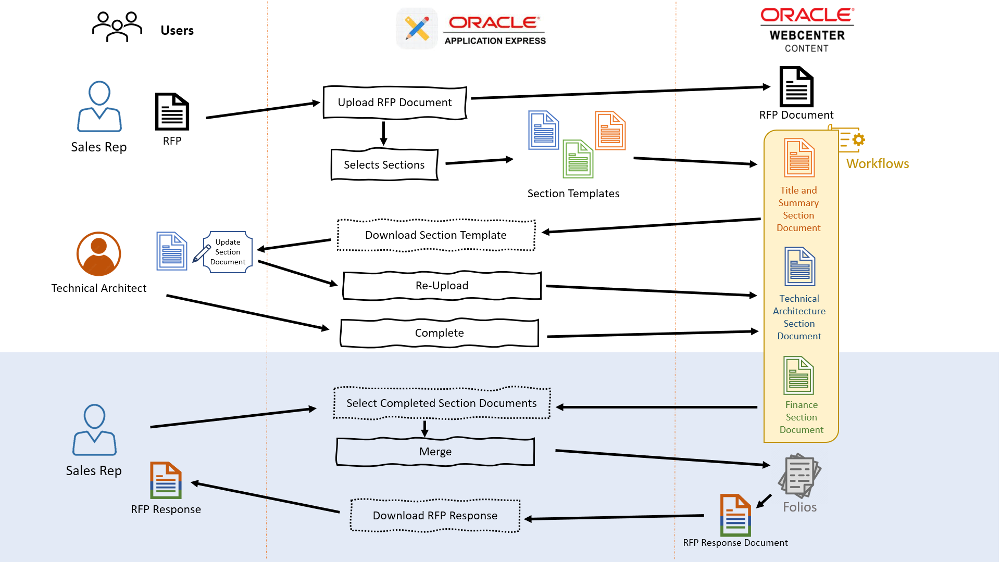
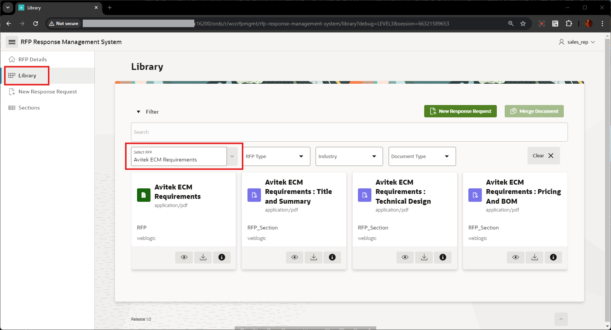
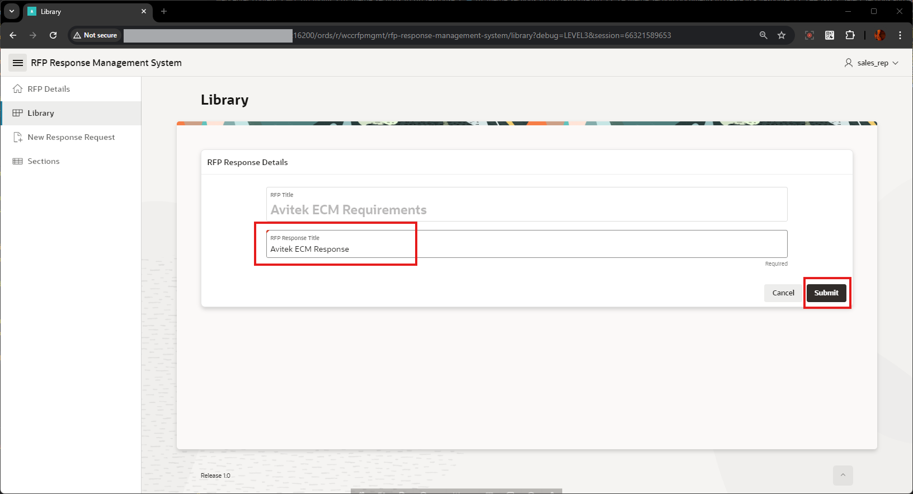

# Merge Section Documents to create RFP Response

## Introduction

This lab walks you through the steps for Selecting the Completed Section Documents and creating the Response Document, by merging all the selected Section documents, in the same order it was selected. This takes you through the Library Page, where you can find all the Completed Section Documents, Uploaded RFP Documents and also Merged Response documents.

This Page also lists all these documents in card layout and also provides various filter options to narrow-down the search and selection.

Here is the flow of this Lab:

  

**Estimated Lab Time**: *15 minutes*

### Objectives

In this lab, you will:

* Login as Sales Rep
* Select the Completed Sections for RFP
* Merge to create RFP Response
* Download and view RFP Response

### Prerequisites

This lab assumes you have:

* You have completed:
  * Lab: Prepare Setup ( *Paid Tenants* only)
  * Lab: Setup WCC Marketplace Environment
  * Lab: Initialize Environment
  * Lab: Setup Apex Application
  * Lab: Create New RFP Document
  * Lab: Update and Complete Sections

## Task 1: Select Sections and Merge

1. To login to the WCC RFP Response Management System Application, perform the following steps:
   * Open your browser and enter the **URL** to sign in to the APEX development environment.

      * **URL**:

      ```text
      <copy>https://localhost:16200/ords/r/wccrfpmgmt/rfp-response-management-system</copy>
      ```

      > Note : Replace `"https://localhost"` with your **hosturl** ( eg: `"http://wcc-rfpmgmt-livelab.livelabs.oraclevcn.com"` or `"https://192.0.0.0"`)

   * The login page appears. Enter the **Username, and Password**. Click **Sign In**.

   * **Username**: Enter

    ```text
    <copy>SALES_REP</copy>
    ```

   * **Password**: Enter

    ```text
    <copy>Welcome1</copy>
    ```

   

2. In the left navigation pane, click on **Library** , then click on **Select RFP** drop-down list and select the RFP Document uploaded in the previous lab ( eg: **Avitek ECM Requirements**)

   

   This lists all the Documents related to the selected RFP Document, which includes the RFP Document and Section documents related to that.

   > Note: Only **Completed** Documents (which are not in Workflow and in **RELEASED** status), will be showing up in this **Library** Page

3. Select the Section Documents, in the order in which it has to be present in the RFP Response and click on **Merge Document**

   

4. In the **RFP Response Details** Page, provide the value as below and click **Submit** button
   > *Note: if the Submit button is not Active, after entering the value in the text box, press tab button*

   * **RFP Response Title**: Specify

    ```text
    <copy>Avitek ECM Response</copy>
    ```

   

5. After the merge is successful, you'll see a message *Document merge is complete : Avitek ECM Response* , and in the **Library** Page, you can see the Response Document ( here, **Avitek ECM Response** ). Click on the *Preview* icon to preview and download the Response Document.

  

   Here you can see the Response Document created in the same order, as selected for the Merge. Also, you can use the *download icon* to download the Response Document and View.

   

### Conclusion

This concludes all the labs of the Workshop on RFP Response Management.

## Acknowledgements

* **Authors-** Senthilkumar Chinnappa, Senior Principal Solution Engineer, Oracle WebCenter Content
* **Contributors-** Senthilkumar Chinnappa, Mandar Tengse , Parikshit Khisty
* **Last Updated By/Date-** Senthilkumar Chinnappa, August 2024
