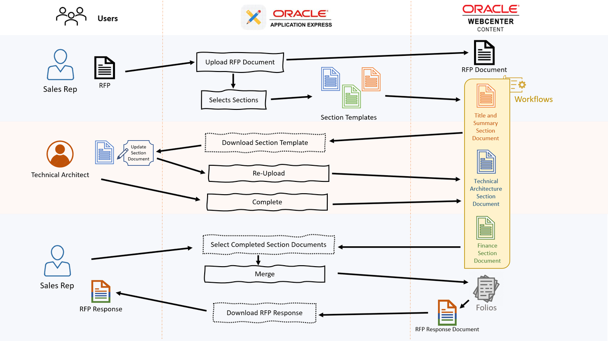

# Introduction

Learn how to build scalable solutions with cloud agility by architecting intelligent applications with Oracle WebCenter and Oracle Cloud Infrastructure using your preferred low-code platform of Oracle APEX

## About this Workshop

Organizations are made up of processes and processes revolve around documents. This lab would help participants to build Content Apps quickly using Oracle WebCenter Content and low code platform like APEX.

*Estimated Time:* 3 hours

### **About Request For Proposal Management System using WebCenter Content & APEX**

The objective of this lab is to develop RFP Response Management App using Oracle WebCenter Content integrated . This system will streamline the process of managing and responding to RFPs (Request for Proposals) efficiently by  creating structured workflows, automating different section documents merging, and automating the RFP Response creation.

This is for Product Showcase Session in Cloud World so the demonstration would be around creating a APEX app to simplify RFP response management

### **Objectives**

In this lab, you will:

* Setup WCC Marketplace Environment
* Setup Request-For-Proposal (RFP) Management APEX Application
* Upload RFP Document to initiate the Process by selecting required Sections for the Response
* Update the Section documents for the RFP Response
* Review and Approve the updated Section documents
* Browse through and Merge several Section documents to create single RFP Response

### **Prerequisites**

This lab assumes you have:

* Paid or LiveLabs Oracle Cloud account, to provision WCC Marketplace instance
* Familiarity with Oracle Cloud Infrastructure (OCI) is desirable , but not mandatory
* Familiarity with APEX is desirable, but not mandatory

## Task: Application and User flow

* **Trigger**: Salesperson receives an RFP document.

* **Action**: Salesperson uploads the RFP document to the RFP Management App and initiates the process.

  * *Metadata Input*: Salesperson inputs related metadata for the document.

  * *Process*: Salesperson selects the sections required for the RFP response from a predefined list. (eg Technical Architecture, Project costing, Compliance etc)

* **Process**: Each selected section triggers the creation of a workflow

  * **Workflow Details**:

    * Assign responsible team members for each section.

    * Set deadlines for document creation.

    * Allow for collaboration and review within the system.

* **Result**: Once all workflows are completed Salesperson using WCC capability combines all the document into single PDF and shares the public link to customer.

You may now **proceed to the next lab**.

### **Learn More**

* [Introduction To WebCenter Content](https://docs.oracle.com/en/middleware/webcenter/content/12.2.1.4/index.html)
* [Learn More about Apex](https://apex.oracle.com/en/)

## Acknowledgements

* **Authors-** Senthilkumar Chinnappa, Senior Principal Solution Engineer, Oracle WebCenter Content
* **Contributors-** Senthilkumar Chinnappa, Mandar Tengse , Parikshit Khisty
* **Last Updated By/Date-** Senthilkumar Chinnappa, August 2024
