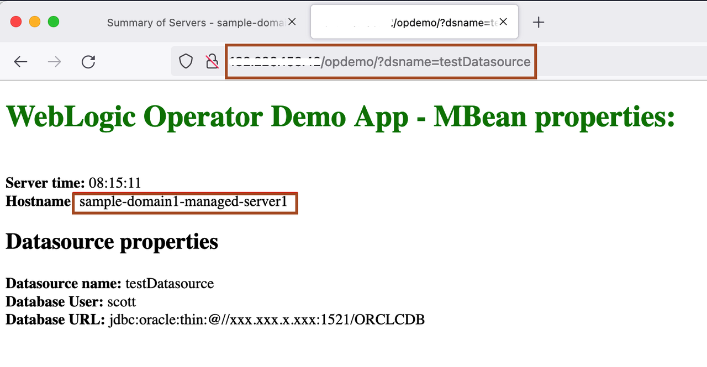

# Application lifecycle management using WebLogic Kubernetes Operator

## Introduction

This tutorial creates a Docker image with a WebLogic domain inside the image deployment. This means that all the artefacts, including the deployed applications and domain-related files, are stored within the image. This results in a new WebLogic Docker image every time the application is modified. In this, widely adopted approach, the image is the packaging unit instead of the Web/Enterprise Application Archive (*war*, *ear*).

For the purpose of this lab, we created another image that contains a domain and an updated version of the application (green title on the main page). This image is available at `iad.ocir.io/weblogick8s/weblogic-operator-tutorial-store:2.0`.

Estimated Lab Time: 15 minutes

## **STEP 1**: Upgrade WebLogic container packaged application using domain resource definition

1. Edit  your domain resource definition (*domain.yaml*) and modify the image location. The modified line with image should appear as follows:
    ```yaml
      <copy>image: "iad.ocir.io/weblogick8s/weblogic-operator-tutorial-store:2.0"</copy>
    ```

    >Don't forget the leading spaces to keep the proper indentation.

2. Apply the domain resource changes:
    ```bash
    <copy>kubectl apply -f ~/domain.yaml -n sample-domain1-ns</copy>
    ```

3. You can immediately check the status of your servers/pods. (You should observe the restart of the WLS domain):
    ```bash
    <copy>kubectl get po -n sample-domain1-ns</copy>
    ```
    The output should be similar to the following:
    ```bash
    NAME                             READY   STATUS        RESTARTS   AGE
    sample-domain1-admin-server      1/1     Terminating   0          23m
    sample-domain1-managed-server1   1/1     Running       0          22m
    sample-domain1-managed-server2   1/1     Running       0          22m
    sample-domain1-managed-server3   1/1     Running       0          5m57s
    ```
    > The operator now performs a rolling server restart, one server at a time. The first one is the *Admin* server, then the *Managed* servers.

4. During the rolling restart, check your web application periodically. If the responding server is already restarted, then you should see the change (green fonts) you made to the application. If the server is not yet restarted, then it is still serving the older version of the application.
    
    http://EXTERNAL-IP/opdemo/?dsname=testDatasource
    

You may now **proceed to the next lab**.

## Acknowledgements
* **Author** -  Ankit Pandey
* **Contributors** - Maciej Gruszka, Sid Joshi
* **Last Updated By/Date** - Ankit Pandey, November 2022
