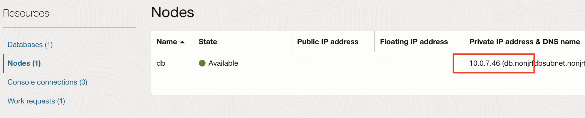
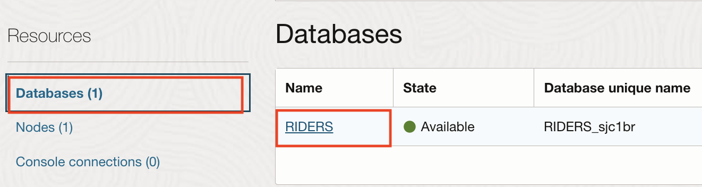

# Gather database information

## Introduction

We will guide you through getting useful information regarding a database provisioned on Oracle Cloud Infrastructure (OCI).

Estimated Completion Time: 5 minutes.

### Objectives

- Gather the database node IP.
- Gather the database connection string.

## Task 1: Gather the OCI Database Information

1. Once the database system is provisioned, on the **Database System** menu, click **details**.

2. Go to the **Nodes** left-side menu and note the **private IP address** of the node provisioned for later use:

   

3. Click **Database** on the left and then the **RIDERS** database.

   

3. Click **DB Connection**.

   

4. Copy the **DB connection string** for later use.

   

## Acknowledgements

 - **Author** - Emmanuel Leroy, May 2020
 - **Last Updated By/Date** - Emmanuel Leroy, March 2023
