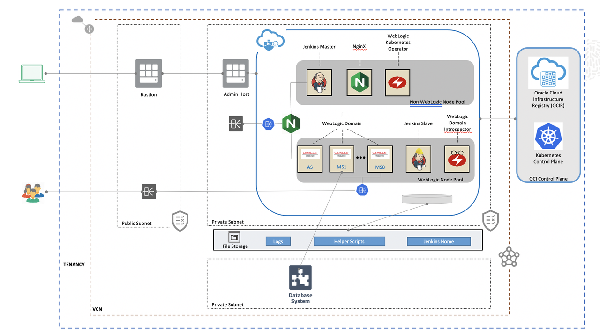

# Introduction

## About this workshop

We will walk you through the process of migrating an existing on-premises WebLogic domain to Oracle WebLogic for Oracle Kubernetes Engine (OKE). The WebLogic domain we'll migrate contains Java applications and a datasource connecting to a database that will be migrated along with the WebLogic domain.

Attached below is a sample architecture of the final solution:


Estimated Completion Time: 80 to 120 minutes depending on the path chosen.

### Objectives

*Perform the end-to-end migration of a local WebLogic domain to Oracle Kubernetes Engine (OKE), provisioning WebLogic on OKE with the marketplace.*

- Provision a demo environment to use as the on-premises environment to be migrated.
- Prepare the OCI tenancy to provision WebLogic Server from the marketplace.
- Provision a new empty WebLogic domain on OKE with the marketplace.
- Provision the application database on OCI.
- Migrate the application database from the on-premises environment to the OCI Database as a Service (DBaaS).
- Migrate the WebLogic domain using Weblogic Deploy Tooling (WDT).
- Optionally learn to scale the provisioned domain.
- Tear down the workshop.

### Prerequisites

In order to run this workshop you need:

* A Mac OS X, Windows or Linux machine.
* A private and public SSH key-pair.
* Firefox browser.
* A OCI account with a Compartment set up.

If you are not an administrator on your tenancy, you must insure that the following policies have been set for you:

```
<copy>
Allow group MyGroup to manage instance-family in compartment MyCompartment
Allow group MyGroup to manage orm-family in compartment MyCompartment
Allow group MyGroup to manage mount-targets in compartment MyCompartment
Allow group MyGroup to manage file-systems in compartment MyCompartment
Allow group MyGroup to manage export-sets in compartment MyCompartment
Allow group MyGroup to manage cluster-family in compartment MyCompartment
Allow group MyGroup to use subnets in compartment MyCompartment
Allow group MyGroup to use vnics in compartment MyCompartment
Allow group MyGroup to inspect compartments in compartment MyCompartment
Allow group MyGroup to read metrics in compartment MyCompartment
Allow group MyGroup to read virtual-network-family in compartment MyCompartment
Allow group MyGroup to manage virtual-network-family in compartment MyCompartment
</copy>
```

If you don't have the following policy for your group:

```
<copy>
Allow group MyGroup to manage dynamic-groups in tenancy
Allow group MyGroup to manage policies in tenancy
</copy>
```

You will need to create a Dynamic Group 

> **Important:** This workshop uses the WebLogic version 12.2.1.4 stack with a non-JRF domain. It is similar with version 12.2.1.3; however, WebLogic version 10.3.6 requires a JRF domain by default, which requires a database as a backend. The *only* database versions compatible with WebLogic 10.3.6 on OCI are database version 11.2.0.4 and 12.1.0.2. Note that database 11.2.0.4 requires the Oracle Grid Infrastructure when provisioning, or it will not be visible as an option when selecting the database image version.


## Acknowledgements

 - **Author** - Emmanuel Leroy, May 2020
 - **Last Updated By/Date** - Emmanuel Leroy, October 2021
