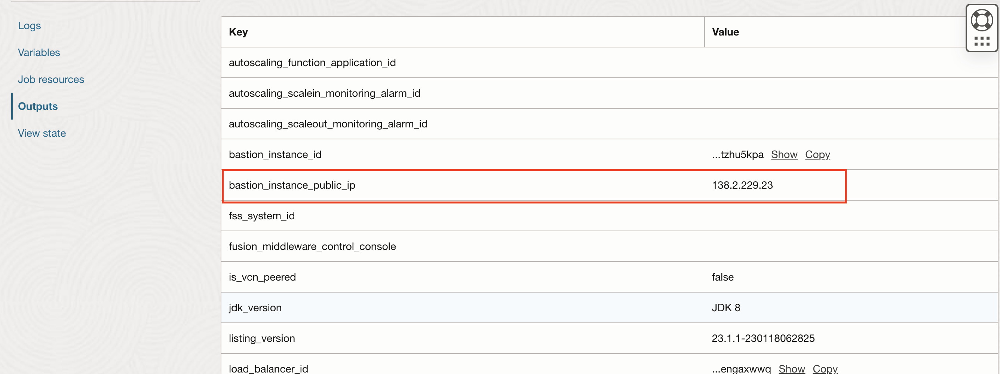
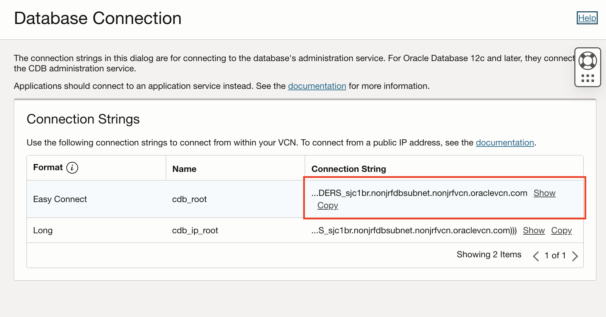

# Migrating the Application Database

## Introduction

We will walk you through the steps to migrate the on-premises application database to the database provisioned on OCI using Oracle DataPump.

Estimated Completion Time: 10 minutes.

### About Product/Technology

- DataPump is a tool that is part of the Oracle database set of utilities.
- DataPump export function creates a DDL + data dump of the user schema.
- DataPump import function imports the data into the database.

In this workshop we will be using wrapper scripts to export, move the data to the destination and import to complete a full migration.

### Objectives

- Get shell access to the on-premises database.
- Use a DataPump script to export the database schema to migrate.
- Edit the DataPump import script with the information collected in Provision the Application Database on Oracle Cloud Infrastructure with Database as a Service.
- Run a DataPump import script to migrate the database schema to OCI.

### Prerequisites

- To have provisioned the on-premises demo environment that includes the source database to migrate.
- To have provisioned the target database on OCI.
- To have gathered information about the passthrough-server to the database, and the database node IP and domain name which is part of the connection string.

## Task 1: Get a Shell Inside the On-Premises Database Instance

### If you used the Docker environment

1. You should already be inside the database container from the SSH key creation step. If not, use:

      ```
      <copy>
      docker exec -it weblogic-to-oci_oracledb_1 /bin/bash
      </copy>
      ```

2. Get into the `/datapump` folder:

      ```
      <copy>
      cd ~/datapump
      </copy>
      ```

### If you used the workshop image

1. You should already be logged into the instance and switched to the `oracle` user. If not use:

      ```bash
      ssh opc@<public-ip>
      ```

      Then:

      ```bash
      sudo su - oracle
      ```

2. Get into the `/datapump` folder:

      ```
      <copy>
      cd ~/datapump
      </copy>
      ```

      The script itself is commented to explain what it does.

      The script sets up the directory to backup to, and uses DataPump `expdp` export command to dump the `RIDERS` schema, which is the schema the application depends on.

      The `datapump_export.sh` script should appears as follows.

      ```bash
      EXPORT_DB_DIRNAME=export

      # all other variables are from the local environment

      # clear the folder and recreate
      rm -rf ~/datapump/export && mkdir -p ~/datapump/export

      # drop directory if it exists
      echo "DROP DIRECTORY ${EXPORT_DB_DIRNAME};" | sqlplus system/${DB_PWD}@${DB_HOST}:${DB_PORT}/${DB_PDB}.${DB_DOMAIN}

      # create a directory object in the DB for export with DataPump, pointing to the folder created above
      echo "CREATE DIRECTORY ${EXPORT_DB_DIRNAME} AS '/home/oracle/datapump/export/';" | sqlplus system/${DB_PWD}@${DB_HOST}:${DB_PORT}/${DB_PDB}.${DB_DOMAIN}

      # export the schema 'RIDERS' with DataPump, which is our user schema with the Tour de France Riders data
      expdp system/${DB_PWD}@${DB_HOST}:${DB_PORT}/${DB_PDB}.${DB_DOMAIN} schemas=RIDERS DIRECTORY=${EXPORT_DB_DIRNAME}
      ```

## Task 2: Export the Source Database

Run the `datapump_export.sh` script:

```
<copy>
./datapump_export.sh
</copy>
```

The output will look like:


## Task 3: Edit the `datapump_import.sh` Script

Once the schema and data are exported, we'll import it into the OCI DBaaS database.

First, we'll need to edit the `datapump_import.sh` script to target the OCI database found in the datapump folder.

1. Open the script in an editor. We'll use the popular `nano` editor:

      ```
      <copy>
      nano datapump_import.sh
      </copy>
      ```

2. Enter the `BASTION_IP`.

     The `BASTION_IP` is the **public IP** of the Bastion instance.

     Find it in **Resource Manager -> Stack -> stack details -> job details -> Outputs**.

       

3. Enter the `TARGET_DB_HOST` **private IP address**.

     This IP address was gathered from the Database System details, under **Database System -> details -> Nodes**.

       

4. Enter the `TARGET_DB_DOMAIN` name, from the database connection string.

      If you followed the name convention defaults, it should be `nonjrfdbsubnet.nonjrfvcn.oraclevcn.com`.

      

5. Enter your DB SYS password for `TARGET_DB_PWD`.

## Task 4: Import the Data into the Target Database

1. Run the `datapump_import.sh` script you edited at the previous step:

      ```bash
      <copy>
      ./datapump_import.sh
      </copy>
      ```

2. You will be prompted to continue connection twice. Type `yes` each time to proceed.

The import script runs in four phases:

1. It copies the files over to the OCI database node.
2. It runs the `impdp` import command once.
You may notice this first try imports the schema but fails at importing the data, because the user `RIDERS` does not have a quota on the local `USERS` tablespace.
3. The script edits the `RIDERS` user tablespace quota.
4. Re-runs the `impdb` command that now succeeds at importing the data, but will show an error related to the user `RIDERS` already existing. This is normal.

The database is now migrated to OCI.

## Acknowledgements

 - **Author** - Emmanuel Leroy, May 2020
 - **Last Updated By/Date** - Emmanuel Leroy, August 2020
